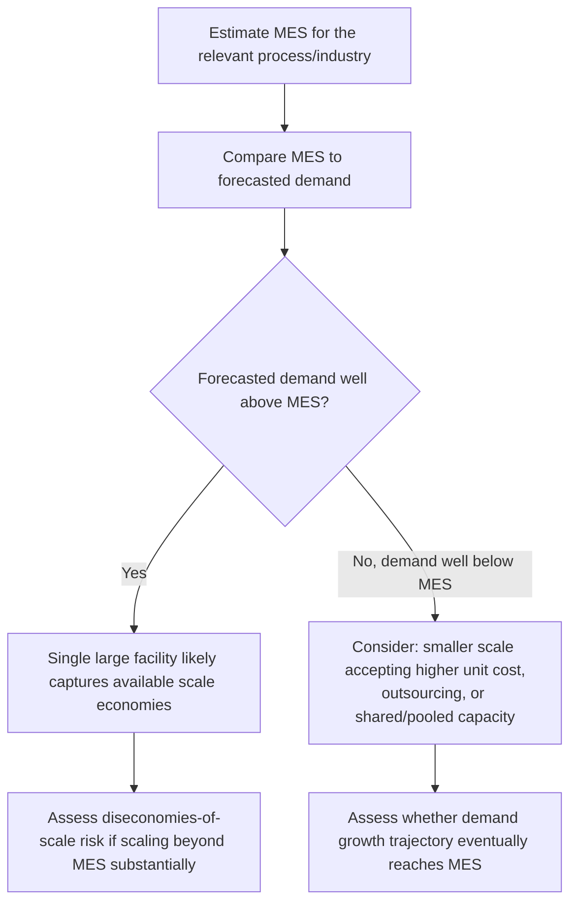

## Economies of Scale and Minimum Efficient Scale


### Overview

Economies of scale describe the phenomenon whereby average (per-unit) cost declines as production volume or facility size increases, up to a point. Minimum efficient scale (MES) is the specific output level at which those cost reductions are largely exhausted — the smallest scale at which a firm can achieve the lowest attainable long-run average cost. Together, these concepts directly inform how large a capacity investment should be, since they determine whether bigger really is cheaper, and if so, up to what point.

### Sources of Economies of Scale

**Key Points**

- **Spreading fixed costs** — the same fixed cost (equipment, facility, licensing) is divided across more units as volume increases, directly lowering average fixed cost per unit; this is the most fundamental and universally applicable source, following directly from the $ATC(Q) = F/Q + v$ relationship covered in fixed/variable cost structures.
- **Specialization and division of labor** — larger operations can afford to have workers specialize in narrower tasks, increasing proficiency and reducing per-unit labor time compared to generalist workers handling many tasks in a smaller operation.
- **Purchasing/bargaining power** — larger volume purchasers of inputs (raw materials, components, cloud compute commitments) can typically negotiate lower per-unit prices, directly reducing variable cost per unit at scale.
- **Technical/engineering economies** — some processes exhibit favorable engineering scaling relationships, such as the classic "cube-square rule" in process industries: the cost of a vessel or container scales roughly with its surface area (cost driver), while its capacity scales with volume, so capacity grows faster than cost as size increases.
- **Learning curve effects** — although conceptually distinct from pure scale economies, learning-by-doing (where cumulative production experience reduces per-unit cost, covered in detail elsewhere in this curriculum) often compounds with scale economies since larger operations frequently also accumulate cumulative production experience faster.
- **Managerial/overhead economies** — administrative, IT, and management overhead often grows sub-proportionally to output, so per-unit overhead cost falls as volume rises.

### The Long-Run Average Cost Curve

Economies of scale are conventionally illustrated using the **long-run average cost (LRAC) curve**, which traces the lowest achievable average cost at each possible scale of operation, assuming the firm can freely choose plant size or capacity configuration at each point.

```mermaid
flowchart LR
    A[Small Scale:<br/>High Average Cost<br/>economies of scale region (svg_diagram)] --> B[Minimum Efficient Scale MES:<br/>Lowest Average Cost begins]
    B --> C[Constant Returns Region:<br/>Average Cost flat]
    C --> D[Large Scale:<br/>Rising Average Cost<br/>diseconomies of scale region]
```

$$LRAC(Q) = \min_{\text{plant configurations}} \left[ \frac{F(\text{plant size})}{Q} + v(\text{plant size}) \right]$$

**Key Points**

- The LRAC curve is typically U-shaped (or L-shaped in some industries): average cost falls through the economies-of-scale region, flattens near minimum efficient scale, and may eventually rise again if diseconomies of scale set in at very large sizes.
- Each point on the LRAC curve corresponds to a different **short-run average cost (SRAC) curve** representing a specific plant/capacity configuration — the LRAC curve is the "envelope" of the lowest-cost SRAC curve achievable at each output level, directly connecting this concept to the fixed-cost step-function behavior covered in fixed/variable cost structures (each SRAC curve corresponds to operating within one step-fixed-cost tier).

### Minimum Efficient Scale (MES)

Minimum efficient scale is formally the smallest output level at which the LRAC curve reaches (or first approaches within a small tolerance of) its minimum point — beyond this scale, further growth yields little or no additional average cost reduction, and the firm can compete effectively on cost without needing to grow larger.

$$MES = \min \{ Q : LRAC(Q) \le LRAC(Q') \text{ for all } Q' \}$$

**Key Points**

- MES is industry- and technology-specific: capital-intensive industries with large fixed-cost requirements (semiconductor fabrication, utility generation, large-scale cloud data centers) typically have a high MES relative to total market demand, while labor-intensive or highly customizable service businesses often have a low MES.
- The relationship between MES and total market size determines industry structure: if MES is a large fraction of total market demand, the market can support only a few efficient-scale competitors (a natural oligopoly tendency); if MES is small relative to market size, many firms can each operate at or above efficient scale, supporting a more fragmented, competitive market structure. [Inference — this is a standard result in industrial organization economics, though real market structures are also shaped by many other factors such as regulation, product differentiation, and entry barriers]

### Quantifying Economies of Scale: The Scale Economy Index

A common quantitative approach models cost as a power function of capacity, based on the empirically observed **six-tenths rule** (or more generally, a cost-capacity exponent) common in process industries:

$$\text{Cost}_2 = \text{Cost}_1 \times \left(\frac{\text{Capacity}_2}{\text{Capacity}_1}\right)^x$$

where $x$ is the scale exponent — commonly cited around 0.6 for many process-industry facilities (hence "six-tenths rule"), though the actual exponent varies by industry and technology. [Unverified — the 0.6 exponent is a widely cited industrial engineering heuristic, not a universal constant; empirical values vary by process type and should be validated against actual data]

**Example**: If a facility with 10,000 units/year capacity costs $5,000,000, and the scale exponent for this process is 0.6, then a facility with double the capacity (20,000 units/year) would be estimated to cost:

$$\text{Cost}_2 = 5{,}000{,}000 \times \left(\frac{20{,}000}{10{,}000}\right)^{0.6} = 5{,}000{,}000 \times 2^{0.6} \approx 5{,}000{,}000 \times 1.516 \approx \$7{,}579{,}000$$

Capacity doubled, but cost rose only about 51.6% — meaning average cost per unit fell substantially, illustrating the mathematical basis of scale economies directly in capacity-cost terms.

```python
def scaled_cost(cost1, capacity1, capacity2, exponent=0.6):
    return cost1 * (capacity2 / capacity1) ** exponent

cost2 = scaled_cost(5_000_000, 10_000, 20_000, exponent=0.6)
avg_cost1 = 5_000_000 / 10_000
avg_cost2 = cost2 / 20_000
print(f"New facility cost: ${cost2:,.0f}")
print(f"Average cost/unit: original=${avg_cost1:.2f}, new=${avg_cost2:.2f}")
```

### Diseconomies of Scale

Beyond a certain size, average cost can begin rising again — **diseconomies of scale** — due to factors that become more pronounced as an organization or facility grows very large:

- **Coordination and communication complexity** — larger organizations require more layers of management and more complex coordination mechanisms, increasing per-unit administrative overhead.
- **Bureaucracy and reduced agility** — decision-making can slow as organizations grow, imposing indirect costs through slower response to problems or opportunities.
- **Input cost inflation at very large scale** — extremely large purchases can, beyond a point, exhaust available supplier capacity or favorable pricing tiers, potentially raising marginal input costs.
- **Increased logistics/transportation costs** — a single very large facility serving a geographically dispersed market may incur higher aggregate transportation costs than several smaller, more distributed facilities would.
- **Motivation and morale effects** — in some contexts, very large facilities or teams can experience reduced worker engagement or accountability compared to smaller units, though this effect is organization-specific and not universal. [Unverified — the magnitude and even presence of this effect is contested and highly dependent on management practices]

### Capacity Planning Implications

**Key Points**

- **Sizing a single facility/investment**: understanding where MES sits relative to forecasted demand informs whether a single large facility (capturing full scale economies) or multiple smaller facilities (sacrificing some scale economy for flexibility, proximity to markets, or risk diversification) is the better strategy.
- **Timing capacity additions**: if MES is large relative to near-term demand, building to MES immediately front-loads scale benefits but risks significant excess capacity in the near term (connecting to the capacity investment timing trade-offs and lead-time considerations in demand forecasting) — while building smaller and expanding later avoids near-term excess capacity but forgoes early scale benefits and may face step-fixed-cost inefficiencies at each expansion.
- **The scale-flexibility trade-off**: pursuing maximum economies of scale (very large, specialized capacity) typically reduces flexibility to respond to demand volatility or product mix shifts — directly connecting economies of scale to the high fixed-cost/high-operating-leverage strategic choice discussed in fixed versus variable cost structures.



### Economies of Scale in IT and Cloud Infrastructure

Economies of scale are a central driver of the modern cloud computing business model: large cloud providers achieve substantial per-unit cost advantages in data center construction, hardware procurement, and operational efficiency due to their massive scale, advantages an individual organization typically cannot replicate by building its own smaller-scale infrastructure.

**Key Points**

- This scale advantage is a core economic rationale behind the broader shift from owned/on-premises infrastructure toward cloud-based capacity: an individual organization renting capacity from a hyperscale provider can access unit costs reflecting the provider's much larger scale, rather than bearing the higher average cost of a sub-MES-sized private facility.
- **Economies of scope** — a related but distinct concept where cost advantages arise from producing multiple different outputs jointly rather than from producing more of a single output — also plays a role in cloud economics, since shared infrastructure serving many different customers and workload types can achieve utilization efficiencies (smoothing aggregate demand variability, as covered in the pooling discussion under demand variability) that a single customer's dedicated infrastructure cannot.

### Estimating MES and Scale Economies in Practice

**Output**

| Approach | Method |
| --- | --- |
| Engineering cost estimation | Apply cost-capacity scaling relationships (e.g., six-tenths rule) using known equipment/facility cost data at different capacity levels |
| Survivor technique | Observe which plant/facility sizes persist and grow over time in an industry as an empirical (if imperfect) indicator of efficient scale |
| Statistical cost function estimation | Regress observed average cost against output/capacity across facilities or firms to estimate the empirical LRAC curve shape |
| Benchmarking | Compare unit costs across facilities of different sizes within the same organization or industry |

### Limitations and Caveats

**Key Points**

- Economies of scale estimates (such as the six-tenths rule) are empirical heuristics derived from historical data in specific industries and should not be applied uncritically outside the context in which they were estimated — the actual scale exponent for a specific process or technology should be validated with real data where possible.
- MES is not static: technological change can shift MES substantially over time (e.g., modular, smaller-scale manufacturing technologies or distributed cloud architectures can lower MES in industries that previously required very large scale to be cost-competitive).
- Pursuing economies of scale should be weighed against the flexibility, risk-pooling, and demand-matching considerations covered elsewhere in this curriculum (chase vs. level aggregate planning, fixed vs. variable cost structure choice, real options value of staged investment) — the lowest average unit cost at maximum scale is not automatically the right capacity decision if it comes at the cost of unacceptable inflexibility given genuine demand uncertainty.

**Conclusion**

Economies of scale and minimum efficient scale together describe how and to what extent bigger capacity investments become cheaper per unit, providing essential input to decisions about how large a facility or system to build, whether to consolidate into fewer larger units or maintain several smaller ones, and how a firm's cost position compares to competitors and industry benchmarks. Because scale economies eventually give way to diseconomies, and because pursuing maximum scale can trade away valuable flexibility, MES should be treated as one important input — alongside demand forecasts, cost structure choices, and the value of staged or flexible capacity — into a fully reasoned capacity sizing decision rather than as a standalone rule that bigger is always better.

**Related Topics**

- Fixed versus variable cost structures
- Break-even analysis for capacity investment
- The learning curve and cumulative production experience
- Net present value and capital budgeting for capacity
- Real options analysis and staged capacity investment
- Economies of scope in shared/multi-purpose capacity
- Cloud computing economics and CapEx-to-OpEx capacity shifts