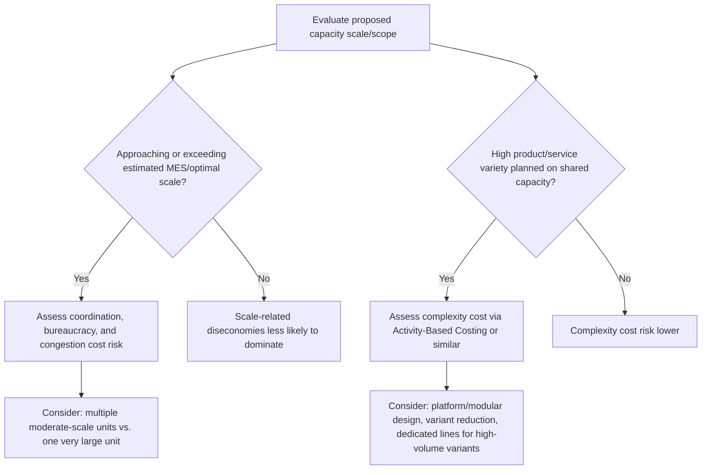

## Diseconomies of Scale and Complexity Costs


### Overview

Diseconomies of scale occur when average (per-unit) cost begins *rising* as production volume or organizational size increases beyond a certain point — the mirror image of economies of scale, and the mechanism that eventually curves the long-run average cost curve back upward. Complexity costs are a closely related and often underlying driver: as an organization or system grows large or heterogeneous, the sheer complexity of coordinating it imposes costs that don't show up as cleanly in per-unit input pricing but manifest as inefficiency, delay, and error. Together, these concepts set the practical ceiling on how large a capacity investment should grow, complementing the lower-bound logic of minimum efficient scale.

### Where Diseconomies Fit on the Long-Run Average Cost Curve

```mermaid
flowchart LR
    A[Small Scale:<br/>Economies of Scale region (svg_diagram)] --> B[Minimum Efficient Scale]
    B --> C[Constant Returns Region]
    C --> D[Diseconomies of Scale region:<br/>Average Cost rises with further growth]
```

**Key Points**

- Diseconomies of scale represent the upward-sloping portion of the long-run average cost (LRAC) curve introduced in the discussion of economies of scale and minimum efficient scale — the same curve, examined at its other end.
- Unlike economies of scale, which are often traceable to concrete, quantifiable engineering and purchasing relationships, diseconomies of scale frequently arise from harder-to-quantify organizational and coordination effects, making them more difficult to forecast precisely but no less real in their cost impact.

### Core Sources of Diseconomies of Scale

#### 1. Coordination and Communication Overhead

As an organization or facility grows, the number of communication pathways needed to coordinate activity grows faster than the number of people or units involved. For $n$ participants who each potentially need to coordinate with every other participant, the number of pairwise communication links is:

$$\text{Communication Links} = \binom{n}{2} = \frac{n(n-1)}{2}$$

**Example**: A team of 10 people has 45 potential pairwise communication links; doubling the team to 20 people increases potential links to 190 — more than four times as many, despite only doubling headcount. [Inference — this formula illustrates the *potential* combinatorial growth in coordination complexity; actual organizations mitigate this through hierarchy, defined interfaces, and communication structures, so realized coordination cost grows more slowly than the raw pairwise formula suggests]

This is a specific, quantifiable instance of why large organizations typically require disproportionately more management layers, meetings, and formal coordination processes relative to their headcount — a cost not captured in simple per-unit labor or material pricing.

#### 2. Bureaucracy and Decision-Making Latency

Larger organizations tend to develop more approval layers, formal processes, and review cycles, which can slow decision-making and responsiveness. This imposes a real economic cost through delayed responses to problems, slower time-to-market, and reduced ability to capitalize on fleeting opportunities — costs that are genuine but often absent from standard unit-cost accounting.

#### 3. Agency Costs and Reduced Accountability

As organizations grow, the distance between individual contributors and ultimate outcomes/ownership can increase, potentially reducing individual accountability and motivation (sometimes discussed under the broader economic concept of **agency costs**, where the interests of individual employees or managers diverge from the interests of the organization as a whole, and monitoring/aligning those interests becomes costlier at scale). [Unverified — the magnitude and universality of this effect is debated in management literature and depends heavily on organizational design and culture, not simply on size]

#### 4. Input Market Saturation

At very large procurement volumes, an organization may exhaust the supply available at favorable pricing tiers, needing to source from higher-cost suppliers or pay premiums to secure additional volume — reversing the purchasing-power economies of scale that operate at more moderate volumes.

#### 5. Logistics and Distribution Cost Growth

A single very large, centralized facility serving a geographically dispersed market can incur higher aggregate transportation and distribution costs than several smaller, more geographically distributed facilities would — a cost that grows with the scale and geographic reach of a centralized operation, potentially offsetting production-side scale economies.

#### 6. Congestion and Queuing Effects

In operational/capacity terms specifically, very high utilization of a shared resource increases queuing delays disproportionately as utilization approaches 100% — a direct consequence of queuing theory (the same $SCV$-driven wait-time relationships covered under demand variability), meaning that pushing a single large facility or system toward its absolute maximum throughput can generate rapidly rising congestion costs even without any change in unit production cost.

$$\text{Average Wait Time} \propto \frac{\rho}{1-\rho} \quad \text{(where } \rho \text{ is utilization, approaching 1)}$$

This relationship is a specific, quantifiable form of diseconomy that becomes especially relevant when comparing "one very large, highly-utilized facility" against "several moderately-utilized facilities" as capacity strategies.

### Complexity Costs: A Broader Framing

**Complexity costs** extend the diseconomies-of-scale concept beyond pure size to encompass costs driven by *heterogeneity* and *variety* — the number of distinct products, service types, configurations, or process variants an operation must support — which can impose costs even without growth in raw output volume.

**Key Points**

- **Variety-driven complexity** — supporting many product variants, customization options, or service tiers within a single capacity system increases setup/changeover frequency, inventory of components/parts, quality control complexity, and training requirements, even if total unit volume stays constant.
- **Complexity costs are often hidden in standard cost accounting** — traditional cost systems frequently allocate overhead based on volume (e.g., machine-hours or labor-hours), which can systematically *under-costs* low-volume, high-variety products/services and *over-costs* high-volume, simple ones, since the actual complexity-driven overhead (setups, scheduling complexity, quality inspections) doesn't scale with volume the way traditional overhead allocation assumes.
- **Activity-Based Costing (ABC)** was developed specifically to address this blind spot, allocating overhead based on the actual cost drivers (number of setups, number of purchase orders, number of product variants) rather than simple volume measures, providing a more accurate picture of where complexity costs actually originate.

**Example**: A manufacturing line that could produce 50,000 units/year of a single product at low average cost might see average cost per unit rise substantially if the same line is instead used to produce 10 different product variants totaling the same 50,000 units, due to increased setup time, smaller batch sizes, more complex scheduling, and higher quality-control overhead — even though total volume is unchanged. Traditional volume-based costing would likely fail to reflect this increase accurately, understating the true cost of supporting the added variety.

### Quantifying the Cost of Complexity: A Simplified Model

A simplified way to represent complexity cost is to add a term that scales with the number of distinct variants $k$ supported, in addition to the standard fixed and variable cost terms:

$$TC(Q, k) = F + vQ + c \cdot k \cdot s$$

where $c$ is a per-setup cost, $s$ is the number of setups/changeovers required per variant per period, and $k$ is the number of distinct product/service variants.

**Example**: A facility with $F = \$300{,}000$, $v = \$25$/unit, producing 40,000 units/year across a single product ($k=1$) versus splitting the same volume across 8 variants ($k=8$), each requiring 12 setups/year at $2,000/setup:

$$TC(\text{single product}) = 300{,}000 + (25 \times 40{,}000) + (2{,}000 \times 1 \times 12) = 300{,}000 + 1{,}000{,}000 + 24{,}000 = \$1{,}324{,}000$$


$$TC(\text{8 variants}) = 300{,}000 + (25 \times 40{,}000) + (2{,}000 \times 8 \times 12) = 300{,}000 + 1{,}000{,}000 + 192{,}000 = \$1{,}492{,}000$$

The added variety increases total cost by $168,000 despite identical total volume — a complexity cost that a simple $TC(Q) = F + vQ$ model, ignoring $k$, would miss entirely.

```python
def total_cost_with_complexity(fixed_cost, variable_cost, quantity, cost_per_setup, setups_per_variant, num_variants):
    return fixed_cost + variable_cost * quantity + cost_per_setup * setups_per_variant * num_variants

single = total_cost_with_complexity(300_000, 25, 40_000, 2_000, 12, 1)
multi = total_cost_with_complexity(300_000, 25, 40_000, 2_000, 12, 8)
print(f"Single product: ${single:,.0f}")
print(f"8 variants: ${multi:,.0f}")
print(f"Complexity cost: ${multi - single:,.0f}")
```

### Diseconomies of Scale vs. Complexity Costs: A Comparison

| Aspect | Diseconomies of Scale | Complexity Costs |
| --- | --- | --- |
| Primary driver | Sheer size/volume of a single output | Variety/heterogeneity of outputs or processes |
| Can occur without volume growth? | No — inherently tied to scale | Yes — can occur at constant volume with increasing variety |
| Typical manifestations | Coordination overhead, bureaucracy, congestion | Setup/changeover time, inventory proliferation, scheduling complexity, quality control burden |
| Visibility in standard cost accounting | Partially visible (some overhead categories scale) | Often hidden under volume-based overhead allocation |
| Mitigation approaches | Decentralization, modular organizational design, distributed facilities | Product/service line simplification, platform/modular design, Activity-Based Costing for visibility |

### Capacity Planning Implications



**Key Points**

- Recognizing diseconomies of scale can justify a deliberate choice of **multiple moderate-sized facilities or systems** over one maximally large one, even when pure production-side economies of scale would favor the single large option — the decision should weigh the two effects against each other rather than optimizing for scale economies alone, as covered in the economies of scale discussion.
- Recognizing complexity costs can justify **product/service line rationalization** (reducing the number of variants) or **platform-based design** (sharing common components/processes across variants to reduce the effective complexity penalty) as capacity-cost-reduction strategies distinct from simply changing scale.
- In IT/service capacity contexts, complexity costs manifest as the operational overhead of supporting many different configurations, service tiers, or custom integrations on shared infrastructure — directly relevant to decisions about standardizing offerings versus supporting extensive customization.

### Service and IT Analogue

**Example**: A cloud platform team supporting a single standardized compute instance type can achieve simple, highly automated capacity management. Supporting dozens of custom instance configurations, each with different resource profiles, scaling rules, and monitoring requirements, introduces genuine complexity costs — more configuration management overhead, more edge cases in automation, higher operational risk — even if total compute consumption (the "volume") is identical across both scenarios, directly mirroring the manufacturing variant-complexity example above.

Similarly, **microservices architectures**, while offering many benefits, are frequently cited as introducing coordination and operational complexity costs (more services to monitor, more inter-service communication paths, more deployment coordination) that grow non-linearly with the number of services — a direct software-engineering analogue of the pairwise-communication-link diseconomy described earlier. [Unverified — the specific extent of this complexity cost is widely discussed in software architecture literature but varies considerably based on organizational maturity, tooling, and architectural discipline]

### Identifying Diseconomies and Complexity Costs in Practice

**Output**

| Warning Sign | Likely Underlying Issue |
| --- | --- |
| Average unit cost rising as facility/organization has grown larger | Possible diseconomies of scale from coordination/bureaucracy |
| Decision cycle times lengthening disproportionately to growth | Bureaucracy/coordination diseconomy |
| Utilization approaching maximum with disproportionate service-level degradation | Congestion/queuing diseconomy |
| Overhead cost growing faster than volume despite stable product line | Possible coordination diseconomy, worth investigating |
| Overhead cost growing despite flat volume, but variant count increasing | Complexity cost, likely hidden by volume-based cost allocation |
| Frequent small-batch production runs / setups | Complexity cost from variety, warranting Activity-Based Costing analysis |

### Limitations and Caveats

**Key Points**

- Diseconomies of scale and complexity costs are real but frequently **harder to quantify precisely** than the more mechanical, engineering-based economies of scale relationships (like the six-tenths rule) — organizations should expect to rely more on qualitative judgment, benchmarking, and approaches like Activity-Based Costing than on a single clean formula.
- Not all large or complex organizations experience significant diseconomies — effective organizational design, modular architecture, strong communication practices, and mature automation can substantially mitigate coordination and complexity costs that might otherwise accompany scale or variety growth, meaning the presence of diseconomies is not an automatic function of size alone but depends significantly on how well that scale or complexity is managed.

**Conclusion**

Diseconomies of scale and complexity costs represent the upper-bound counterpart to the economies of scale and minimum efficient scale concepts covered earlier — the forces that eventually make "bigger" or "more varied" capacity more expensive per unit rather than less. Diseconomies of scale arise primarily from coordination, bureaucracy, and congestion effects tied to sheer size, while complexity costs arise from variety and heterogeneity even absent volume growth, and both are frequently underrepresented in traditional volume-based cost accounting. Recognizing these effects — and using tools like Activity-Based Costing to make them visible — allows capacity planners to make more balanced sizing and scope decisions, weighing the benefits of scale and variety against their real, if less mechanically quantifiable, costs.

**Related Topics**

- Economies of scale and minimum efficient scale
- Fixed versus variable cost structures
- Activity-Based Costing and cost driver analysis
- Queuing theory and congestion effects at high utilization
- Product/service line rationalization and platform design
- Organizational design and span-of-control considerations
- Microservices architecture and distributed systems complexity