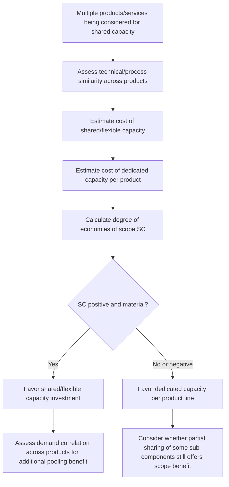

## Economies of Scope Across Product Lines


### Overview

Economies of scope occur when the cost of producing two or more different products or services jointly, using shared capacity, is lower than the cost of producing them separately using dedicated, independent capacity. Where economies of scale are about the benefits of producing *more of the same thing*, economies of scope are about the benefits of producing *multiple different things together* — a distinct but complementary concept that directly informs decisions about whether to build shared, flexible capacity or dedicated, product-specific capacity.

### Formal Definition

Economies of scope exist when:

$$C(Q_A, Q_B) < C(Q_A, 0) + C(0, Q_B)$$

where $C(Q_A, Q_B)$ is the total cost of jointly producing quantity $Q_A$ of product A and $Q_B$ of product B on shared capacity, and $C(Q_A, 0) + C(0, Q_B)$ is the sum of costs if each product were produced independently on separate, dedicated capacity.

A commonly used normalized measure is the **degree of economies of scope (SC)**:

$$SC = \frac{C(Q_A, 0) + C(0, Q_B) - C(Q_A, Q_B)}{C(Q_A, Q_B)}$$

A positive $SC$ indicates economies of scope (joint production is cheaper); a negative $SC$ indicates **diseconomies of scope** (joint production is actually more expensive than separate production, which can occur when combining product lines introduces significant complexity costs, as covered in the previous topic).

**Example**: If dedicated capacity for Product A alone would cost $4,000,000 annually, dedicated capacity for Product B alone would cost $3,500,000 annually, but a single shared facility producing both costs $6,200,000 annually:

$$SC = \frac{4{,}000{,}000 + 3{,}500{,}000 - 6{,}200{,}000}{6{,}200{,}000} = \frac{1{,}300{,}000}{6{,}200{,}000} \approx 0.21$$

This indicates roughly a 21% cost saving from sharing capacity compared to producing each product on entirely dedicated facilities.

### Sources of Economies of Scope

**Key Points**

- **Shared fixed assets and infrastructure** — a single facility, equipment set, or platform serving multiple products avoids duplicating fixed investment across separate dedicated facilities; this is the most direct and common source, and connects directly to the fixed-cost-spreading logic underlying economies of scale, applied here across products rather than across volume of one product.
- **Shared inputs and by-product utilization** — some production processes naturally generate multiple outputs from common inputs (e.g., petroleum refining yielding gasoline, diesel, and other products from the same crude oil input), making joint production intrinsically more efficient than attempting to produce each output independently.
- **Shared knowledge, capabilities, and R&D** — expertise, technology, or research developed for one product line can often be applied to related product lines at low incremental cost, spreading the fixed cost of knowledge creation across a broader output base.
- **Shared distribution, marketing, and customer relationships** — a single sales channel, brand, or customer relationship serving multiple products avoids the cost of building separate go-to-market infrastructure for each product line.
- **Risk pooling through demand diversification** — as covered under demand variability, shared capacity serving multiple products with imperfectly correlated demand patterns can achieve better aggregate utilization than dedicated capacity for each product, since a downturn in one product's demand can be partly offset by steady or rising demand in another.

### Economies of Scope vs. Economies of Scale: A Direct Comparison

| Aspect | Economies of Scale | Economies of Scope |
| --- | --- | --- |
| Core driver | Producing more volume of the *same* output | Producing *multiple different* outputs jointly |
| Cost relationship | Average cost falls as $Q$ rises for one product | Joint cost is lower than sum of separate production costs |
| Typical mechanism | Spreading fixed cost over more units, purchasing power, specialization | Shared assets, shared inputs, shared knowledge/capabilities, demand pooling |
| Capacity implication | Favors larger single-product facilities | Favors flexible, multi-product shared facilities |
| Can coexist? | Yes — both can apply simultaneously to the same capacity decision |  |

**Key Points**

- Economies of scale and scope are not mutually exclusive and frequently reinforce each other in practice: a large, flexible shared facility can simultaneously benefit from scale (high total volume across all products spreading fixed costs) and scope (efficient joint production of multiple product variants) — this combination is common in modern flexible manufacturing and cloud computing contexts.

### Flexible Manufacturing and Shared Capacity as an Economies-of-Scope Strategy

**Flexible manufacturing systems (FMS)** — production systems designed with reconfigurable equipment and processes capable of producing multiple product variants with relatively low changeover cost — represent a direct capacity-planning application of pursuing economies of scope: rather than building dedicated, single-purpose capacity for each product, the organization invests in more versatile (often more expensive per unit of dedicated capacity) equipment that can serve many products, betting that the scope benefits outweigh the loss of specialization efficiency a dedicated line would offer.

```mermaid
flowchart TD
    A[Dedicated Capacity Strategy] --> B[Separate facility/line per product<br/>Higher total fixed investment (svg_diagram)]
    C[Shared/Flexible Capacity Strategy] --> D[Single flexible facility/line serving multiple products<br/>Lower total fixed investment, added changeover complexity]
    B --> E[Compare total cost: dedicated sum vs shared]
    D --> E
    E --> F{Shared cost lower?}
    F -->|Yes| G[Economies of scope present: favor shared capacity]
    F -->|No| H[Diseconomies of scope: favor dedicated capacity]
```

**Key Points**

- The trade-off is not free: flexible/shared capacity typically sacrifices some of the specialization efficiency that a single-purpose dedicated line could achieve (analogous to the setup/changeover complexity costs covered in the diseconomies of scale discussion), so the economies-of-scope benefit must be weighed against this specialization cost, not assumed automatically.
- The degree of economies of scope tends to be higher when products share significant technical similarity (common components, similar processes) and lower when products are technically dissimilar despite being commercially related — technical/process similarity, not just business/brand relatedness, is the key determinant of true scope economies.

### Economies of Scope in Service and IT Capacity

Economies of scope are especially central to modern IT infrastructure and platform strategy, where shared, multi-tenant capacity is a dominant architectural pattern precisely because it captures scope benefits.

**Example**: A shared cloud computing platform serving many different customer workloads (web applications, data processing jobs, machine learning training) on common underlying infrastructure achieves economies of scope because:

- The same physical servers, networking, and data center infrastructure serve fundamentally different workload types.
- Aggregate demand across many customers and workload types is smoother and more predictable than any single customer's or workload's demand pattern (the risk-pooling mechanism discussed under demand variability), improving overall utilization.
- Shared platform engineering, security, and operational tooling investment is spread across all served workloads rather than duplicated per customer or per workload type.

This is precisely why multi-tenant cloud infrastructure can offer lower unit costs than an individual organization building and operating dedicated infrastructure for a single, narrower workload — the cloud provider is capturing economies of scope (across diverse customers and workload types) in addition to economies of scale (across sheer volume).

| Capacity Model | Scope Characteristic |
| --- | --- |
| Dedicated on-premises infrastructure for one application | No scope benefit; capacity sized and costed for a single narrow use case |
| Shared internal platform serving multiple internal applications | Moderate scope benefit; shared infrastructure and tooling across known internal workload types |
| Multi-tenant public cloud platform | High scope benefit; shared infrastructure across a very broad and diverse set of external customers and workload types |

### Measuring Economies of Scope in Practice

**Output**

| Approach | Method |
| --- | --- |
| Direct cost comparison | Compare actual/estimated cost of shared production against the sum of estimated costs for dedicated, separate production of each product line |
| Cost function estimation | Statistically estimate a multi-product cost function from historical data across products/facilities and test whether it exhibits sub-additivity (the formal condition for economies of scope) |
| Utilization analysis | Compare capacity utilization achieved under a shared/pooled model versus what dedicated capacity for each product would likely achieve individually, using the demand-pooling logic from the demand variability topic |
| Activity-Based Costing | Identify which specific shared cost drivers (equipment, personnel, overhead) are genuinely joint versus which are effectively dedicated despite being nominally shared, avoiding overstated scope-benefit claims |

### Capacity Planning Decision Framework



### Risks and Limitations

**Key Points**

- **Diseconomies of scope** can occur when combining product lines introduces coordination, scheduling, or quality-control complexity that outweighs the shared-asset savings — directly connecting to the complexity-cost concepts covered in the diseconomies of scale discussion; economies of scope should never be assumed a priori without checking for offsetting complexity costs.
- **Overstated scope benefits from poor cost allocation** — organizations sometimes overestimate scope benefits because shared costs are not accurately traced to the products actually driving them; Activity-Based Costing or similarly rigorous cost-driver analysis helps avoid this overstatement.
- **Strategic and competitive risk of over-sharing** — capacity shared very broadly across many product lines or customers can create single points of failure or capacity contention risk (one product's demand surge crowding out another's), a risk that pure cost-based economies-of-scope analysis does not capture and that should be assessed separately as part of overall capacity risk management.
- **Demand correlation matters** — the risk-pooling component of scope benefits (as with pooling under demand variability) is reduced or eliminated if the products/workloads sharing capacity have highly correlated demand patterns (e.g., all spiking during the same seasonal event), since pooling benefits depend specifically on demand being imperfectly correlated across the products sharing capacity.

**Conclusion**

Economies of scope provide the economic rationale for building shared, flexible capacity that serves multiple products or services rather than dedicated capacity for each — a strategy increasingly central to modern manufacturing (flexible manufacturing systems) and IT infrastructure (multi-tenant cloud platforms) alike. The benefit arises from shared fixed assets, shared inputs or knowledge, and demand-pooling across imperfectly correlated products, but it is not automatic: technical dissimilarity between products, coordination complexity, and poor cost-driver visibility can all produce diseconomies of scope instead, meaning the decision to pursue shared versus dedicated capacity should rest on an explicit comparison of joint versus separate production costs rather than an assumption that sharing capacity is inherently more efficient.

**Related Topics**

- Economies of scale and minimum efficient scale
- Diseconomies of scale and complexity costs
- Demand variability and its capacity implications (risk pooling)
- Flexible manufacturing systems and reconfigurable capacity
- Multi-tenant cloud architecture and shared infrastructure economics
- Activity-Based Costing and cost driver analysis
- Make-versus-buy and outsourcing decision frameworks