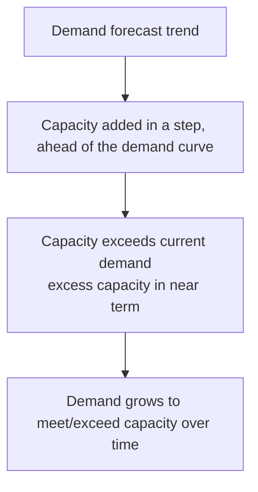
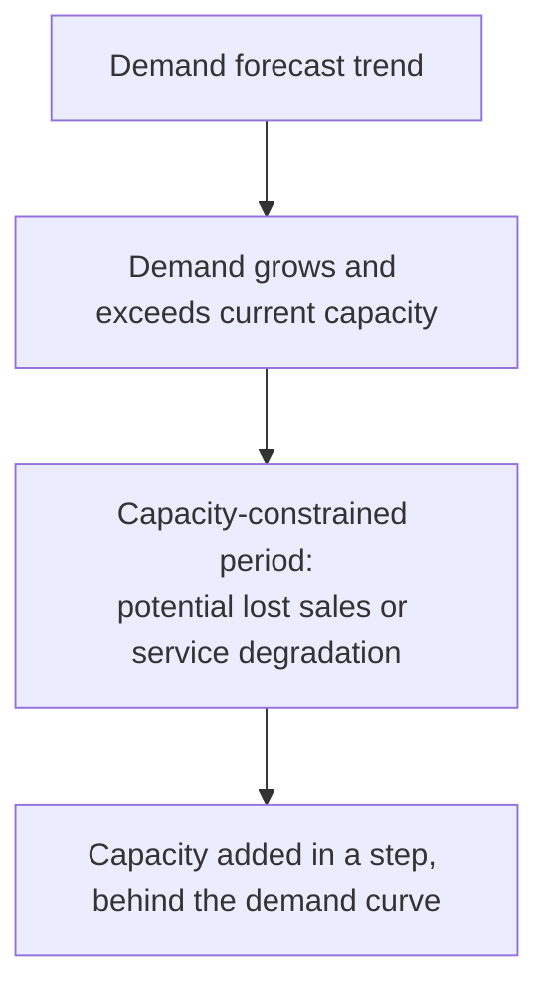
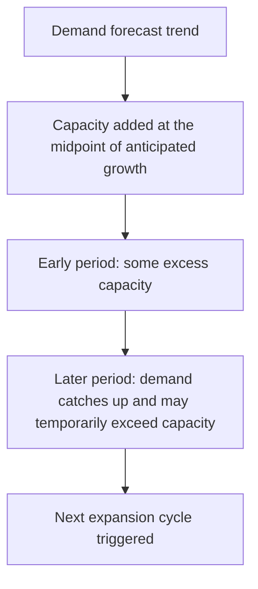
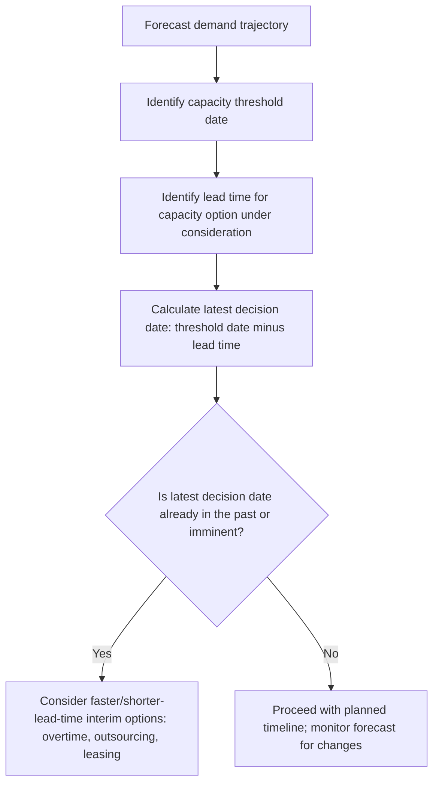
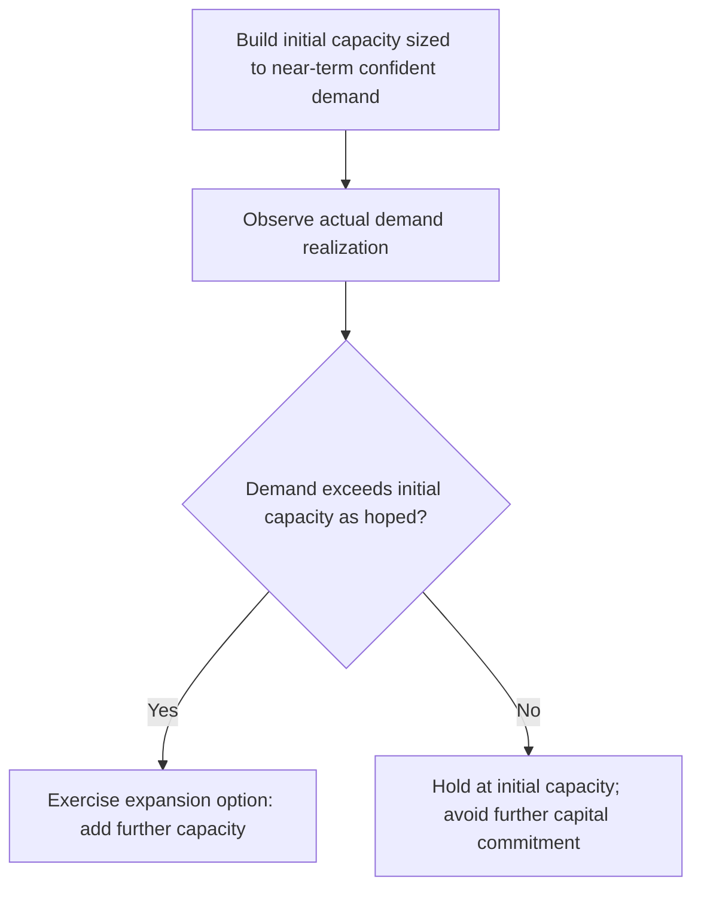
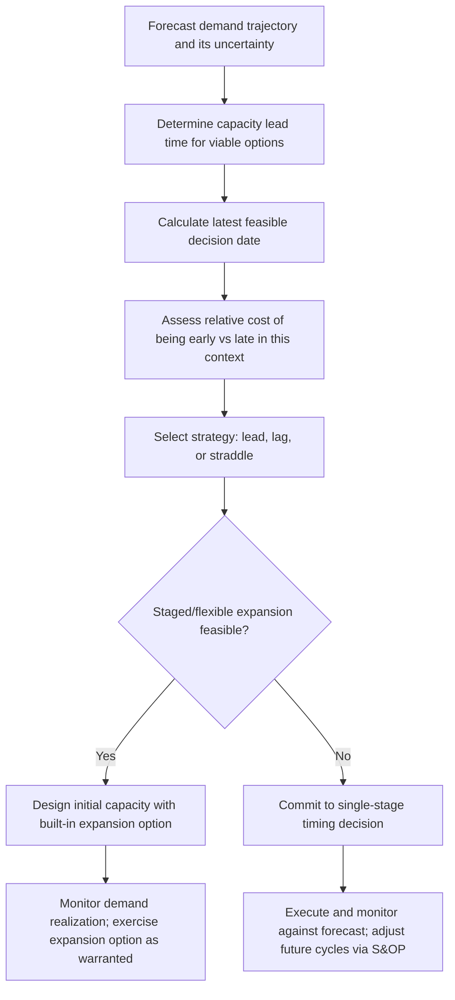

## Timing of Capacity Expansion


### Overview

Timing of capacity expansion addresses *when* to add new capacity relative to anticipated demand growth — a decision distinct from, but closely linked to, how much capacity to add (sizing) and where to add it (location). Because capacity investments typically involve long lead times, large discrete cost increments (step-fixed costs), and significant irreversibility, timing decisions require weighing the cost of expanding too early (idle capacity, carrying cost) against the cost of expanding too late (lost sales, service degradation, market share erosion to competitors who expand sooner).

### The Core Timing Trade-off

```mermaid
flowchart LR
    A[Expand Too Early] --> B[Idle capacity<br/>carrying cost<br/>lower utilization/ROI (svg_diagram)]
    C[Expand Too Late] --> D[Lost sales/stockouts<br/>service degradation<br/>competitive disadvantage]
    E[Expand at Optimal Timing] --> F[Capacity available<br/>closely matched to demand realization]
```

**Key Points**

- The optimal timing depends critically on the **lead time** required to bring new capacity online relative to how far in advance demand can be reliably forecast — connecting directly to the forecast accuracy and horizon considerations covered in the demand forecasting chapter of this curriculum.
- The cost of being early versus being late is rarely symmetric: in industries with high customer switching costs or first-mover advantages, being late can be far more costly (permanent market share loss) than the carrying cost of being early; in industries with low switching costs and rapid technology change, being early risks stranding capital in soon-to-be-obsolete capacity.

### Two Fundamental Timing Strategies

#### 1. Capacity-Leading Strategy (Expand Ahead of Demand)

Capacity is added in anticipation of demand growth, before demand has fully materialized, ensuring sufficient capacity is available when demand arrives.



**Advantages:**

- Ensures capacity is available to capture demand growth without service disruption or lost sales.
- Can serve as a competitive/strategic signal, potentially deterring competitor expansion into the same market (a capacity commitment can function as a credible signal of intent to defend market share).
- Avoids the risk of demand outstripping capacity and causing service-level failures during a growth period.

**Disadvantages:**

- Lower capacity utilization and higher unit costs in the near term, since fixed costs are incurred before volume catches up (directly connecting to the break-even and CVP relationship between utilization and profitability).
- Higher risk of stranded/excess capacity if demand growth does not materialize as forecasted.
- Ties up capital earlier than strictly necessary, with associated opportunity cost.

#### 2. Capacity-Lagging Strategy (Expand Behind Demand)

Capacity is added only after demand has already grown to meet or exceed current capacity, accepting some period of capacity constraint before catching up.



**Advantages:**

- Higher capacity utilization throughout, since capacity is added only once demand has proven sufficient to use it — improving near-term unit economics.
- Lower risk of stranded capacity from demand that fails to materialize.
- Delays capital commitment, preserving financial flexibility and capturing the time value benefit of deferring investment.

**Disadvantages:**

- Risk of lost sales, customer dissatisfaction, or service-level breaches during the capacity-constrained period before new capacity comes online.
- Risk of ceding market share to competitors who expand sooner and capture demand the constrained organization cannot serve.
- Can create a self-reinforcing cycle where capacity constraints themselves suppress the demand growth that would otherwise justify further expansion (a phenomenon sometimes called demand being "capped" by supply).

#### 3. Average/Straddle Strategy

A middle path that adds capacity aimed at the midpoint of the forecasted demand growth trajectory over the expansion's useful planning horizon, alternating between periods of excess capacity and periods of capacity constraint.



**Key Points**

- The straddle strategy is a deliberate compromise, balancing the utilization cost of leading against the stockout/lost-sales risk of lagging, and is common in practice precisely because it avoids the extreme downside of either pure strategy.

### Comparing the Three Strategies

| Strategy | Utilization in Early Period | Risk of Lost Sales | Risk of Stranded Capacity | Capital Timing |
| --- | --- | --- | --- | --- |
| Lead (ahead of demand) | Lower | Lower | Higher | Earlier |
| Lag (behind demand) | Higher | Higher | Lower | Later |
| Straddle (midpoint) | Moderate | Moderate | Moderate | Moderate |

### Quantitative Framing: Incremental Analysis of Timing

The timing decision can be evaluated by comparing the net present value of expanding at different candidate times, since deferring an investment changes both when the capital outflow occurs and when the resulting cash flows begin — directly applying the NPV and capital budgeting techniques covered earlier in this curriculum to the specific question of timing.

$$NPV(\text{expand at time } t) = -\frac{I_0}{(1+r)^t} + \sum_{s=t+1}^{n} \frac{CF_s}{(1+r)^s}$$

**Example**: Comparing expanding now (Year 0) versus deferring one year (Year 1), where deferring means missing one year of incremental cash flow but delaying the capital outflow and potentially building the facility with better information:

| Timing Option | Capital Outflow (discounted) | Cash Flows Captured | NPV |
| --- | --- | --- | --- |
| Expand Year 0 | $2,000,000 (undiscounted) | Years 1–6 | Calculated as in the NPV topic example |
| Expand Year 1 | $1,818,182 (discounted at 10%) | Years 2–6 only (one year of cash flow forgone) | Lower cumulative cash flow, but lower discounted outflow |

The specific numeric comparison depends on the forgone cash flow in the deferred year versus the discounting benefit of delaying the outflow — in general, deferral is favored when the value of additional information (reduced demand uncertainty, as in the expected-value-of-perfect-information logic from decision tree analysis) outweighs the forgone early cash flow, and leading is favored when early cash flow capture and competitive positioning outweigh the benefit of waiting for more certainty.

### Incorporating Lead Time Explicitly

The required **capacity lead time** (time from decision to operational availability) is often the single most important practical constraint on timing strategy, since it sets a floor on how late a decision can be made and still have capacity ready when needed.

$$\text{Latest Decision Date} = \text{Required Capacity Date} - \text{Lead Time}$$

**Example**: If demand is forecasted to require additional capacity by Month 18, and the capacity option under consideration (e.g., a new facility with construction and permitting) has a 14-month lead time, the decision to proceed must be made no later than Month 4 — meaning the decision effectively must be made based on an 18-month-ahead forecast, which typically carries substantially more uncertainty than a shorter-horizon forecast (directly connecting to the forecast error growth with horizon discussed in the forecast error measurement topic).



**Key Points**

- When required lead time exceeds the horizon over which demand can be forecast with reasonable confidence, organizations often adopt interim, shorter-lead-time capacity levers (overtime, subcontracting, leasing, cloud on-demand capacity) as a bridge while committing to longer-lead-time permanent capacity based on a lower-confidence, longer-horizon forecast — directly connecting to the aggregate planning capacity levers covered earlier in this curriculum.
- Reducing lead time itself (through modular construction techniques, pre-permitted sites, or standardized/repeatable facility designs) is a strategic lever that shifts the entire timing trade-off favorably, since it allows decisions to be made closer to the point of demand realization, reducing dependence on long-horizon forecast accuracy.

### The Role of Real Options and Staged Expansion in Timing

As introduced under capital budgeting and decision trees, **staged capacity expansion** — building initial capacity with the option to expand further as demand clarifies — directly addresses the timing trade-off by converting an all-or-nothing timing decision into a sequence of smaller, more information-rich decisions.



**Key Points**

- Staged expansion effectively converts a single high-stakes timing bet into a series of smaller, sequentially-informed bets, directly reducing the cost of being wrong about the demand trajectory compared to a single large, early, all-at-once expansion — this is the same value-of-flexibility logic quantified through decision trees and real options in the capital budgeting discussion.
- Staged approaches typically involve some cost premium (e.g., designing initial infrastructure with expansion capability built in — extra land, oversized utility connections — costs more upfront than a minimal, non-expandable design) which must be weighed against the flexibility value gained, using the same EVPI-style logic covered in decision tree analysis.

### Industry and Context Factors Affecting Optimal Timing Strategy

| Factor | Favors Leading Strategy | Favors Lagging Strategy |
| --- | --- | --- |
| Cost of lost sales/stockouts | High (e.g., critical infrastructure, high customer switching cost industries) | Low (e.g., low switching cost, easily backordered products) |
| Demand forecast confidence | High (reliable, low-variability forecasts support early commitment) | Low (high uncertainty favors waiting for confirmation) |
| Capacity lead time | Long (forces earlier decision regardless of demand certainty) | Short (allows waiting closer to demand realization) |
| Cost of capacity/carrying cost | Low relative to lost-sales cost | High relative to lost-sales cost |
| Competitive dynamics | Strong first-mover advantage or capacity-based deterrence value | Limited first-mover advantage; low competitive urgency |
| Technology change rate | Slow (low obsolescence risk from early commitment) | Fast (high obsolescence risk favors waiting for better technology) |

### Practical Timing Decision Workflow



### Common Pitfalls

- **Ignoring lead time when setting the decision timeline**, effectively forcing a lagging outcome by default because the decision was made too late relative to the required lead time — this is often an unintentional consequence of organizational decision-making delay rather than a deliberate lagging strategy.
- **Treating timing as independent of sizing and location** — the three decisions are genuinely interdependent (a longer lead time option might justify a leading strategy even if a shorter lead time alternative would support lagging), and should be evaluated jointly rather than in isolation.
- **Underweighting the strategic/competitive dimension of timing**, focusing purely on internal cost-minimization (utilization, carrying cost) while ignoring how competitors' likely capacity timing decisions affect the true cost of being late in a competitive market.
- **Failing to revisit timing decisions as forecasts update** — given that S&OP is a rolling, cyclical process (as covered earlier), timing decisions made under an earlier forecast should be explicitly revisited as newer, more accurate near-term forecast information becomes available, rather than treated as fixed once set.

**Conclusion**

Timing of capacity expansion requires balancing the cost of excess, underutilized capacity against the cost of insufficient capacity and lost sales, informed centrally by the capacity option's required lead time relative to the horizon over which demand can be forecast with confidence. Leading strategies prioritize demand capture and competitive positioning at the cost of near-term utilization; lagging strategies prioritize capital efficiency and utilization at the risk of lost sales and ceded market share; and staged, option-based approaches offer a middle path that reduces the cost of timing mistakes by converting a single high-stakes bet into a sequence of smaller, more information-rich decisions — directly applying the real options and decision tree concepts introduced earlier in this curriculum's financial and economic analysis chapter.

**Related Topics**

- Net present value and capital budgeting for capacity
- Decision trees under demand uncertainty
- Real options analysis and staged capacity investment
- Facility location decisions and capacity
- Demand forecasting horizon and lead time alignment
- Economies of scale and minimum efficient scale
- Sales and Operations Planning (S&OP) rolling horizon cycles