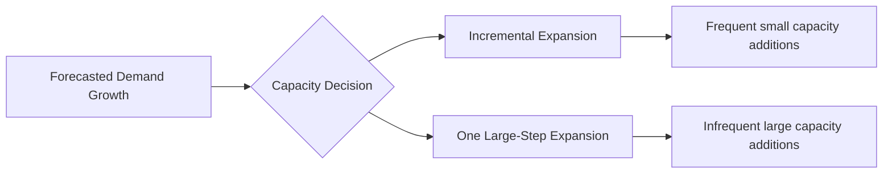
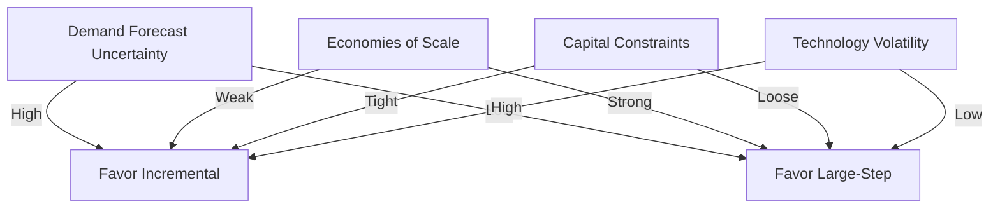

## Incremental Expansion versus One Large-Step Expansion

### Overview

Capacity expansion strategy addresses how an organization adds productive capacity over time in response to growing demand. The core decision is between two archetypal strategies: **incremental expansion** (adding capacity in small, frequent increments) and **one large-step expansion** (adding capacity in large, infrequent jumps). This decision is a classic operations management trade-off between economies of scale, risk exposure, and capital efficiency.

### The Capacity-Demand Gap

Demand typically grows in a smooth or step-wise fashion over time, while capacity can only be added in discrete chunks (a new plant, an additional production line, a new data center). This creates a recurring mismatch between available capacity and required capacity.

### Incremental Expansion

**Definition**: Capacity is added in small, closely-spaced increments that track demand growth more tightly.

**Key Points**

- Capacity additions are triggered more frequently, often on a rolling or periodic basis (annually, or per demand threshold crossed)
- Each addition is sized to cover near-term demand growth only, not long-run projections
- Reduces the average gap between capacity and demand over time
- Common in industries with modular capacity units (e.g., adding servers, adding a single assembly line, hiring additional shifts)

**Advantages**

- Lower risk of stranded (unused) capacity if demand forecasts prove overly optimistic
- Lower upfront capital commitment per expansion event
- Greater flexibility to adjust or halt future expansions based on updated demand signals
- Faster feedback loop between actual demand realization and capacity decisions
- Easier to finance incrementally (smaller capital outlays are easier to fund from operating cash flow or smaller debt tranches)

**Disadvantages**

- Forgoes economies of scale available in larger capacity investments (fixed costs of construction, permitting, equipment procurement are not amortized over as large a capacity base)
- Higher cumulative transaction costs (repeated procurement, repeated commissioning, repeated regulatory approval cycles)
- Risk of chronic undercapacity if each increment is sized conservatively and demand growth accelerates unexpectedly
- Frequent expansions can be operationally disruptive (repeated commissioning, requalification, integration downtime)

### One Large-Step Expansion

**Definition**: Capacity is added in a single large increment sized to cover an extended forecast horizon, intentionally building ahead of near-term demand.

**Key Points**

- A single capacity addition is sized to satisfy demand for several future periods
- Creates a period of capacity surplus immediately following the expansion, which is gradually absorbed as demand grows into it
- Common where capacity units are inherently large and indivisible (e.g., a new manufacturing plant, a semiconductor fab, a power generation facility, a large-scale data center)

**Advantages**

- Captures economies of scale: many capacity investments have a cost function where cost per unit of capacity decreases as scale increases, due to fixed costs (engineering, permitting, land, base infrastructure) being spread over a larger capacity base
- Fewer total expansion events reduce cumulative transaction, coordination, and commissioning costs
- Provides a buffer against demand volatility and forecast error, since built-in slack can absorb short-term demand surges without triggering emergency expansion
- Can serve as a strategic/competitive signal or barrier to entry (excess capacity discourages competitor entry)

**Disadvantages**

- Higher upfront capital expenditure and financing risk
- Risk of stranded capacity if demand growth is slower than forecasted, or if a disruptive technology/substitute shifts demand away
- Capacity sits underutilized for an extended period, which depresses average asset utilization and return on invested capital during the ramp-up phase
- Reduced flexibility: reversing or downsizing an oversized large-step investment is often costly or impossible (sunk cost)
- More exposed to forecast uncertainty compounding over a longer horizon

### The Economics: Scale Economies versus Holding Costs

The trade-off can be framed formally. Let $C(K)$ be the cost of building capacity $K$. In many capacity-intensive industries:

$$C(K) = a + bK^{\alpha}$$

where $a$ is a fixed cost component (permitting, base infrastructure), $b$ is a variable scaling coefficient, and $\alpha < 1$ typically reflects economies of scale (the "six-tenths rule" commonly cited in chemical and process engineering uses $\alpha \approx 0.6$).

Because $\alpha < 1$, cost per unit of capacity, $C(K)/K$, decreases as $K$ increases — this is the mathematical basis for the incentive to build large.

Against this, incremental expansion avoids the **holding cost of excess capacity** — the opportunity cost of capital tied up in capacity that is not yet generating output. If $h$ is the holding cost rate per unit of unused capacity per period, and a large-step expansion creates surplus capacity $S(t)$ over time as demand grows into it, the cumulative holding cost is:

$$\text{Holding Cost} = \int_0^{T} h \cdot S(t)\, dt$$

The optimal expansion strategy balances the scale-economy savings against this holding cost integral, in addition to the transaction costs of each expansion event.

### Decision Framework

**Key Points**

- **Demand growth rate**: Fast, sustained growth favors large-step expansion (capacity is absorbed quickly, minimizing holding cost); slow or uncertain growth favors incremental expansion
- **Demand volatility/forecast uncertainty**: High uncertainty favors incremental expansion (limits downside exposure to a bad forecast); low uncertainty favors large-step (scale economies can be captured with confidence)
- **Scale economy magnitude**: Steep scale economies (large $a$, low $\alpha$) favor large-step; weak or negligible scale economies favor incremental
- **Capital availability and cost of capital**: Constrained capital or high cost of capital favors incremental (spreads financing burden); strong balance sheets can absorb large-step risk
- **Competitive dynamics**: Markets where capacity acts as an entry deterrent favor large-step (pre-emptive capacity); markets with low entry barriers gain less strategic value from surplus capacity
- **Technological volatility**: Rapidly evolving technology favors incremental expansion (avoids stranding capital in soon-to-be-obsolete capacity)
- **Reversibility/salvage value**: Low salvage value of capacity assets increases the risk premium on large-step expansion

### Visualizing the Capacity-Demand Gap Over Time

(svg_diagram) Capacity vs. demand trajectories under each strategy:

<svg xmlns="http://www.w3.org/2000/svg" viewBox="0 0 760 460" font-family="Helvetica, Arial, sans-serif">
<text x="380" y="24" text-anchor="middle" font-size="16" font-weight="bold" fill="#1a1a1a">Incremental vs. One Large-Step Expansion (svg_diagram)</text>

<text x="190" y="50" text-anchor="middle" font-size="13" font-weight="bold" fill="`#1a1a1a`">Incremental Expansion</text>

<line x1="60" y1="200" x2="60" y2="60" stroke="#333" stroke-width="1.5" />

<line x1="60" y1="200" x2="330" y2="200" stroke="#333" stroke-width="1.5" />

<text x="30" y="65" font-size="10" fill="#333">Cap.</text>

<text x="300" y="215" font-size="10" fill="#333">Time</text>

<path d="M 60 195 Q 195 150 330 90" stroke="#d64545" stroke-width="2" fill="none" />
<text x="280" y="85" font-size="9" fill="#d64545">Demand</text>

<path d="M 60 190 L 100 190 L 100 170 L 150 170 L 150 150 L 200 150 L 200 130 L 250 130 L 250 110 L 300 110 L 300 90 L 330 90" stroke="`#2b6cb0`" stroke-width="2.5" fill="none" />

<text x="100" y="180" font-size="9" fill="`#2b6cb0`">Capacity (steps)</text>

<text x="570" y="50" text-anchor="middle" font-size="13" font-weight="bold" fill="`#1a1a1a`">One Large-Step Expansion</text>

<line x1="440" y1="200" x2="440" y2="60" stroke="#333" stroke-width="1.5" />

<line x1="440" y1="200" x2="710" y2="200" stroke="#333" stroke-width="1.5" />

<text x="410" y="65" font-size="10" fill="#333">Cap.</text>

<text x="680" y="215" font-size="10" fill="#333">Time</text>

<path d="M 440 195 Q 575 150 710 90" stroke="#d64545" stroke-width="2" fill="none" />
<text x="660" y="85" font-size="9" fill="#d64545">Demand</text>

<path d="M 440 190 L 470 190 L 470 75 L 710 75" stroke="#2b6cb0" stroke-width="2.5" fill="none" />
<text x="500" y="70" font-size="9" fill="#2b6cb0">Capacity (one jump)</text>

<path d="M 470 75 L 710 75 L 710 90 Q 590 150 470 190 Z" fill="#2b6cb0" fill-opacity="0.12" />
<text x="560" y="130" font-size="9" fill="#2b6cb0" font-style="italic">Surplus capacity</text>

<rect x="40" y="250" width="680" height="180" rx="6" fill="#f7f7f7" stroke="#ccc" />
<text x="60" y="275" font-size="12" font-weight="bold" fill="#1a1a1a">Interpretation</text>
<text x="60" y="300" font-size="11" fill="#333">Incremental: capacity closely tracks demand; small, repeated gaps; low holding cost; higher unit build cost per step.</text>
<text x="60" y="322" font-size="11" fill="#333">Large-step: capacity jumps ahead of demand; large initial surplus absorbed over time; lower unit build cost; higher holding cost and financing risk.</text>
<text x="60" y="350" font-size="11" fill="#333">Shaded region (right chart) represents unused/idle capacity — a carrying cost borne until demand grows into it.</text>
<text x="60" y="378" font-size="11" fill="#333">Optimal choice depends on: scale economy strength (α, a), demand growth rate and volatility, cost of capital, and technology risk.</text>
</svg>

### Quantitative Example

**Example**

Suppose a firm forecasts demand growing linearly from 1,000 to 2,600 units over 8 years (200 units/year). Capacity cost follows $C(K) = 500{,}000 + 2{,}000K^{0.7}$ (in $).

*Incremental strategy*: Add 400 units of capacity every 2 years (4 expansions of 400 units each).

- Cost per expansion: $C(400) = 500{,}000 + 2{,}000(400)^{0.7} \approx 500{,}000 + 2{,}000(61.6) \approx 623{,}200$
- Total build cost: $4 \times 623{,}200 = 2{,}492{,}800$
- Holding cost: low, since capacity closely tracks demand at each step

*Large-step strategy*: Add 1,600 units of capacity once, upfront (covering the full 8-year horizon).

- Cost: $C(1600) = 500{,}000 + 2{,}000(1600)^{0.7} \approx 500{,}000 + 2{,}000(191.6) \approx 883{,}200$
- Total build cost: $883,200 (a single event)
- Holding cost: high — the firm carries idle capacity for years while demand ramps up to fill it; this cost must be estimated separately (e.g., cost of capital tied up in idle assets) and added to the $883,200 to get a fair comparison

**Conclusion**

The large-step strategy has a dramatically lower direct build cost ($883,200 vs. $2,492,800) due to economies of scale, but this saving must be weighed against the holding cost of significant idle capacity in the early years. If the firm's cost of capital or risk of demand shortfall is high, the effective total cost of the large-step approach can exceed the incremental approach once holding costs and stranded-asset risk are included. [Inference: the crossover point depends on firm-specific holding cost rate and forecast confidence, and is not derivable from the scale-economy cost function alone.]

### Hybrid and Advanced Strategies

**Key Points**

- **Modular/staged large-step**: Build large-step infrastructure (land, utilities, permits) upfront, but populate it with production equipment incrementally — captures some scale economies on fixed infrastructure while retaining flexibility on variable capacity additions
- **Capacity options/real options approach**: Treat each expansion decision as a financial option — pay a smaller upfront cost to secure the right (not obligation) to expand later, valued using option pricing techniques adapted from finance
- **Lead vs. lag capacity strategy**: A related but distinct dimension — whether capacity is added *ahead of* (lead) or *behind* (lag) realized demand, orthogonal to whether the increments are large or small
- **Rolling horizon planning**: Re-forecast and re-optimize the expansion schedule periodically, combining features of both incremental and large-step approaches based on updated information

### Practical Considerations Across Industries

| Factor | Incremental Favored | Large-Step Favored |
| --- | --- | --- |
| Semiconductor fabs | Rare (fabs are inherently lumpy) | Common (multi-billion dollar, multi-year capacity) |
| Cloud data centers | Common (rack/server-level additions) | Used for new regions/large facilities |
| Retail store networks | Common (store-by-store rollout) | Rare |
| Power generation | Mixed (depends on technology: solar/wind modular vs. nuclear lumpy) | Common (baseload plants) |
| Software/SaaS infrastructure | Very common (auto-scaling, incremental provisioning) | Rare |

[Unverified: Specific numeric thresholds distinguishing "small" from "large" capacity increments are highly industry- and context-dependent, and no universal benchmark exists across sectors.]

**Related Topics**

- Economies of scale and the six-tenths rule in capacity cost estimation
- Capacity cushion and safety stock analogues in capacity planning
- Real options valuation applied to capacity expansion timing
- Lead, lag, and match capacity strategies
- Demand forecasting under uncertainty for long-horizon capacity decisions
- Break-even analysis and payback period for capacity investment decisions
- Queuing theory and capacity utilization trade-offs