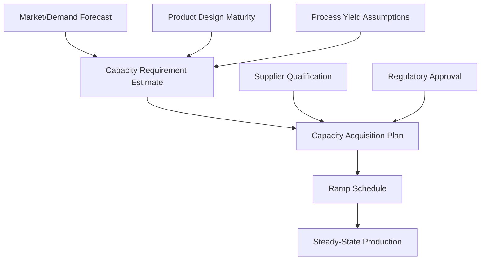

## Capacity Planning for New Product Introduction

### Overview

Capacity planning for new product introduction (NPI) addresses how an organization determines, acquires, and ramps the production, workforce, and infrastructure capacity needed to support a product that has little or no demand history. Unlike capacity planning for mature products — where historical demand data anchors forecasts — NPI capacity planning must operate under high demand uncertainty, evolving process yields, and interdependencies with product design and supply chain readiness.

### Why NPI Capacity Planning Is Distinct

**Key Points**

- No historical demand baseline exists; forecasts rely on market research, analog products, and judgmental methods rather than time-series extrapolation
- Production processes are often immature at launch, meaning yield, cycle time, and throughput rates are themselves uncertain and improve over time (the **manufacturing learning curve**)
- Capacity decisions must often be made and committed to *before* the product design is fully frozen, creating risk of costly retrofits
- Cross-functional dependencies are tighter: capacity plans are coupled to R&D milestones, supplier qualification, tooling lead times, and regulatory approval timelines
- The cost of both under-capacity (lost sales, damaged launch reputation, ceding market share to competitors) and over-capacity (idle capital, inventory obsolescence risk) tends to be more severe and asymmetric than for mature products

### The NPI Demand Forecasting Problem

**Key Points**

- Point forecasts are unreliable for new products; planners typically work with a **forecast distribution or scenario range** (low/base/high cases) rather than a single number
- Common forecasting techniques for NPI:
  - **Analog forecasting**: basing projections on the launch trajectory of a comparable prior product
  - **Bass diffusion model**: models adoption as a function of innovation and imitation effects, commonly used to project cumulative adoption curves for new products
  - **Delphi/expert judgment**: structured elicitation from sales, marketing, and domain experts
  - **Conjoint/market research-based estimates**: survey-based willingness-to-adopt studies translated into unit forecasts
- Capacity plans built on point forecasts alone tend to systematically misallocate capacity; scenario-based or probabilistic capacity planning is preferred practice

The Bass diffusion model, frequently referenced in NPI demand estimation, expresses cumulative adopters $N(t)$ via the adoption rate:

$$\frac{dN(t)}{dt} = \left(p + q\frac{N(t)}{m}\right)(m - N(t))$$

where $m$ is the market potential (total eventual adopters), $p$ is the coefficient of innovation, and $q$ is the coefficient of imitation. Capacity planners use this curve to estimate the timing and magnitude of the demand ramp, not just its eventual peak.

### Capacity Strategy Options for NPI

**Key Points**

- **Lead strategy**: build capacity ahead of confirmed demand, betting on forecast accuracy — reduces risk of stockouts during a critical launch window but increases exposure to demand shortfall
- **Lag strategy**: build capacity only after demand is confirmed — minimizes capital risk but risks missing the early-adopter window and ceding share to faster competitors
- **Match/incremental strategy**: add capacity in stages tied to observed early sales, common when production technology allows modular scaling
- **Match strategy with capacity options**: secure contractual rights to capacity (e.g., reserved contract-manufacturer lines, options on equipment) without committing capital until demand signals firm up

Because NPI carries higher forecast risk than mature-product planning, many organizations bias toward a lead-with-hedging approach: committing to enough capacity to cover a credible base-case launch, while structuring contracts or equipment choices to allow rapid incremental scale-up if the high-case scenario materializes.

### The Manufacturing Ramp Curve

A defining feature of NPI capacity planning is that installed capacity does not equal usable output on day one. Yield, throughput, and labor efficiency typically follow a **learning curve** as the workforce and process mature.

A widely used representation is the power-law learning curve:

$$T(n) = T_1 \cdot n^{\log_2(r)}$$

where $T(n)$ is the time (or cost) to produce the $n$-th unit, $T_1$ is the time for the first unit, and $r$ is the learning rate (e.g., $r = 0.85$ for an "85% learning curve," meaning unit cost falls 15% each time cumulative volume doubles).

Effective usable capacity during ramp is often modeled as:

$$\text{Effective Output}(t) = \text{Installed Capacity} \times Y(t) \times U(t)$$

where $Y(t)$ is time-varying process yield and $U(t)$ is line utilization/uptime, both of which typically start below target and converge upward over the ramp period.

**Example**

A new product line installs equipment rated at 10,000 units/month nameplate capacity. In month 1, yield is 60% and uptime is 70%, giving effective output of $10{,}000 \times 0.60 \times 0.70 = 4{,}200$ units. By month 6, yield has climbed to 92% and uptime to 95%, giving effective output of $10{,}000 \times 0.92 \times 0.95 = 8{,}740$ units. Capacity planners must size *installed* (nameplate) capacity well above the near-term demand forecast to compensate for this ramp shortfall, or accept a period of undersupply during launch. [Inference: specific yield/uptime trajectories are illustrative; actual ramp curves are process- and industry-specific and require empirical calibration.]

### Sizing Installed Capacity Under Ramp Uncertainty

**Key Points**

- Installed capacity is typically sized to the **high-case demand scenario at steady-state ramp maturity**, not the base-case forecast, because retrofitting capacity mid-launch is often more costly and disruptive than carrying temporary excess capacity
- Buffer/safety capacity margins are commonly added to hedge against: yield underperformance, supplier component shortages, and demand forecast error
- A capacity cushion is often expressed as:

$$\text{Capacity Cushion} = \frac{\text{Installed Capacity} - \text{Expected Peak Demand}}{\text{Expected Peak Demand}} \times 100\%$$

- NPI cushions are typically larger than for mature products, reflecting the higher variance of both the demand-side and supply-side forecasts

### Cross-Functional Dependencies and Risk Factors

**Key Points**

- **Design freeze timing**: capacity commitments made before design freeze risk costly tooling rework if the design changes; capacity plans should track design maturity gates (e.g., engineering validation, design validation, production validation stages)
- **Supplier and component readiness**: new products often require newly qualified suppliers or components with their own ramp curves and capacity constraints — a bottleneck at any tier can cap the entire system's effective capacity regardless of internal capacity investment
- **Tooling and long-lead-time equipment**: specialized tooling (molds, fixtures, custom equipment) often has multi-month or multi-quarter lead times that must be initiated well before demand is confirmed, forcing early capacity commitments under high uncertainty
- **Regulatory/certification gating**: in regulated industries (medical devices, automotive, aerospace, pharmaceuticals), production capacity cannot be utilized until certification is achieved, decoupling capacity readiness from capacity *usability*
- **Workforce training and staffing ramp**: labor-intensive processes require hiring and training curves that parallel the equipment ramp curve, and can independently bottleneck effective capacity

### Financial and Risk Framing

**Key Points**

- NPI capacity investment decisions are frequently evaluated using **real options analysis** rather than static net present value (NPV), because the ability to delay, expand, or abandon capacity investment as demand uncertainty resolves has quantifiable value
- **Overage cost** (cost of excess unused capacity) and **underage cost** (cost of insufficient capacity, including lost sales and reputational damage) can be framed analogously to the newsvendor model, with the optimal capacity level $K^*$ satisfying:

$$P(D \leq K^*) = \frac{C_u}{C_u + C_o}$$

where $D$ is demand, $C_u$ is the underage cost per unit, and $C_o$ is the overage cost per unit. This framing is commonly adapted from inventory theory to capacity-sizing decisions under demand uncertainty.

- [Inference: applying the newsvendor framework to capacity (a durable, multi-period asset) rather than a single-period perishable good requires adjusting for the fact that excess capacity, unlike excess inventory, retains option value for future periods.]

### Illustration: NPI Capacity Planning Timeline

(svg_diagram) Cross-functional capacity planning timeline for new product introduction:

<svg xmlns="http://www.w3.org/2000/svg" viewBox="0 0 780 380" font-family="Helvetica, Arial, sans-serif">
<text x="390" y="24" text-anchor="middle" font-size="16" font-weight="bold" fill="#1a1a1a">NPI Capacity Planning Timeline (svg_diagram)</text>
<line x1="60" y1="340" x2="740" y2="340" stroke="#333" stroke-width="1.5" />
<text x="70" y="358" font-size="10" fill="#333">Concept</text>
<text x="230" y="358" font-size="10" fill="#333">Design Freeze</text>
<text x="400" y="358" font-size="10" fill="#333">Pilot Run</text>
<text x="560" y="358" font-size="10" fill="#333">Launch</text>
<text x="700" y="358" font-size="10" fill="#333">Steady State</text>
<circle cx="80" cy="340" r="5" fill="#2b6cb0" />
<circle cx="260" cy="340" r="5" fill="#2b6cb0" />
<circle cx="420" cy="340" r="5" fill="#2b6cb0" />
<circle cx="580" cy="340" r="5" fill="#2b6cb0" />
<circle cx="720" cy="340" r="5" fill="#2b6cb0" />

<rect x="60" y="60" width="680" height="20" fill="#d64545" fill-opacity="0.15" />
<text x="70" y="74" font-size="10" fill="#d64545">Demand forecasting &amp; scenario planning (concept → steady state)</text>

<rect x="150" y="100" width="300" height="20" fill="#2b6cb0" fill-opacity="0.2" />
<text x="160" y="114" font-size="10" fill="#2b6cb0">Tooling / long-lead equipment procurement</text>

<rect x="200" y="140" width="280" height="20" fill="#38a169" fill-opacity="0.2" />
<text x="210" y="154" font-size="10" fill="#38a169">Supplier qualification &amp; component ramp</text>

<rect x="320" y="180" width="260" height="20" fill="#805ad5" fill-opacity="0.2" />
<text x="330" y="194" font-size="10" fill="#805ad5">Workforce hiring &amp; training</text>

<rect x="400" y="220" width="330" height="20" fill="#dd6b20" fill-opacity="0.2" />
<text x="410" y="234" font-size="10" fill="#dd6b20">Process yield &amp; throughput ramp</text>

<rect x="250" y="260" width="200" height="20" fill="#718096" fill-opacity="0.25" />
<text x="260" y="274" font-size="10" fill="#718096">Regulatory / certification gate</text>

<line x1="260" y1="60" x2="260" y2="340" stroke="#999" stroke-dasharray="3,3" />
<line x1="420" y1="60" x2="420" y2="340" stroke="#999" stroke-dasharray="3,3" />
<line x1="580" y1="60" x2="580" y2="340" stroke="#999" stroke-dasharray="3,3" />
</svg>

### Metrics for Monitoring NPI Capacity Performance

**Key Points**

- **Ramp rate**: rate at which effective output approaches nameplate capacity, often tracked as percentage of target capacity achieved per week/month post-launch
- **First-pass yield (FPY)**: percentage of units passing quality checks without rework, tracked over the ramp to validate learning curve assumptions
- **Overall Equipment Effectiveness (OEE)**: composite of availability, performance, and quality, commonly used to track how installed capacity converts to effective capacity during ramp
- **Forecast accuracy metrics** (e.g., MAPE — mean absolute percentage error): tracked against actual early sales to trigger re-planning of capacity if forecasts prove systematically biased

### Common Pitfalls

**Key Points**

- Sizing capacity to the base-case forecast only, leaving no buffer for upside demand scenarios during a critical launch window
- Assuming nameplate capacity is immediately available at full yield and uptime from day one of production
- Failing to align tooling and long-lead-time procurement decisions with the design freeze schedule, leading to costly late-stage retrofits
- Treating capacity planning as purely an operations function, disconnected from marketing's demand signal and R&D's design timeline
- Underestimating supplier-tier capacity constraints, which can bottleneck total system throughput independent of internal capacity investment

**Related Topics**

- Bass diffusion model and technology adoption forecasting
- Manufacturing learning curves and cost-experience curves
- Newsvendor model and capacity sizing under uncertainty
- Real options analysis for capital investment timing
- Supplier qualification and multi-tier capacity constraints
- Design for manufacturability (DFM) and its link to capacity readiness
- Overall Equipment Effectiveness (OEE) and ramp-rate tracking