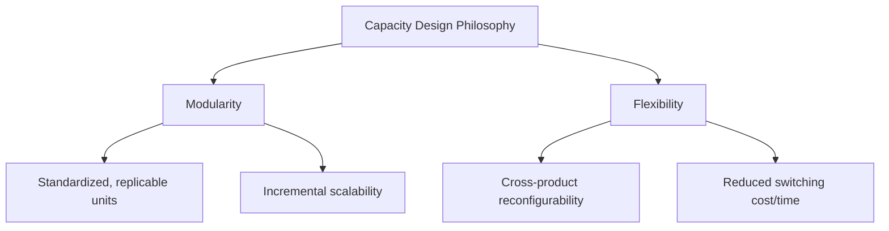
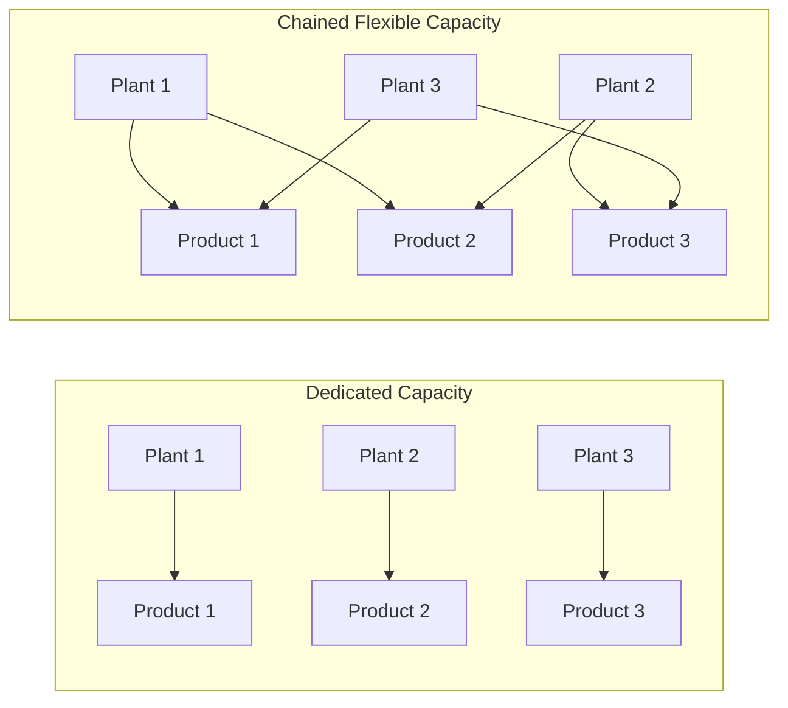
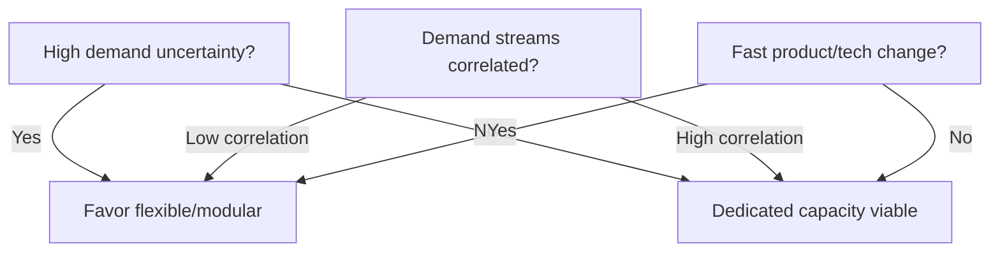

## Modular and Flexible Capacity Design

### Overview

Modular and flexible capacity design refers to structuring production, infrastructure, and organizational capacity as a set of smaller, standardized, reconfigurable units rather than as monolithic, fixed-purpose assets. This design philosophy allows capacity to be added, removed, repurposed, or reallocated with lower cost and lead time than traditional large-scale, purpose-built capacity, directly addressing the risk and inflexibility inherent in long-term capacity commitments.

### Core Concepts

**Key Points**

- **Modularity**: capacity is built from discrete, standardized units (a module, cell, or block) that can be replicated to scale output up or down
- **Flexibility**: the capacity to be reconfigured or redirected across products, processes, or locations without extensive redesign or retooling
- **Fungibility**: the degree to which a unit of capacity (equipment, labor, or facility) can be used interchangeably across multiple products or demand streams
- Modularity and flexibility are related but distinct: a facility can be modular (built in repeatable units) without being flexible (each module still dedicated to one product), and vice versa

### Why Modular/Flexible Design Matters for Long-Term Capacity Planning

**Key Points**

- Reduces the penalty of demand forecast error: instead of committing to a single large, dedicated asset, capacity can be added or reassigned incrementally as actual demand is revealed
- Lowers the effective cost of the incremental expansion strategy (see: incremental vs. one large-step expansion) by making each increment cheaper, faster to deploy, and more reusable
- Mitigates the risk of stranded assets when demand for a specific product declines, since flexible capacity can be redirected to other products
- Supports responsiveness to product mix shifts, seasonal demand variation, and new product introduction without requiring new dedicated capital projects
- Enables **capacity pooling**, where variability across multiple demand streams is aggregated and served by a shared flexible resource pool, reducing the total capacity buffer needed relative to serving each stream with dedicated resources

### The Economics of Flexibility: Pooling and Variance Reduction

A key quantitative justification for flexible/modular capacity is statistical economies of scale from pooling. If $n$ independent demand streams each have variance $\sigma^2$, a dedicated-capacity approach requires a safety buffer sized to each stream's individual variability. A pooled/flexible resource serving the aggregate demand only needs a buffer sized to the variance of the *sum*:

$$\sigma_{\text{pooled}}^2 = \sum_{i=1}^{n} \sigma_i^2 \quad \text{(assuming independence)}$$

Because the standard deviation of the pooled demand, $\sigma_{\text{pooled}} = \sqrt{\sum \sigma_i^2}$, grows slower than the sum of individual standard deviations $\sum \sigma_i$, the *relative* buffer required per unit of capacity decreases as more demand streams are pooled — this is the formal basis for the widely cited principle that flexible ("chaining") capacity requires less total safety capacity than an equivalent set of dedicated resources.

This result underlies the influential concept of **process flexibility chaining**, where a manufacturing plant is not fully flexible (able to produce every product) but is connected in a chain (Plant A can also make Product B's line, Plant B can also make Product C's line, etc.), capturing most of the risk-pooling benefit of full flexibility at a fraction of the cost.

### Design Mechanisms for Modularity

**Key Points**

- **Standardized unit sizing**: designing capacity increments (a "module") at a granularity fine enough to closely track incremental demand growth, avoiding both large lumps of excess capacity and undersized units that require excessive replication
- **Skid-mounted / containerized equipment**: physically self-contained production units (common in chemical processing, data centers, and modular construction) that can be manufactured off-site, transported, and commissioned rapidly
- **Standardized interfaces**: common utility connections (power, water, data, material handling interfaces) across modules so that a new module can be added without redesigning the surrounding infrastructure
- **Repeatable facility layouts**: using a common building/layout template across sites to reduce engineering and commissioning time for each new capacity addition
- **Platform-based product design**: designing multiple products on a shared underlying platform or architecture so the same production equipment/tooling can produce variants with minimal changeover

### Design Mechanisms for Flexibility

**Key Points**

- **Flexible/general-purpose equipment**: machinery capable of processing multiple product variants (e.g., CNC machines, reconfigurable assembly lines) rather than fixed-purpose hard automation
- **Cross-trained workforce**: labor capable of working across multiple product lines or process steps, enabling reallocation of labor capacity in response to shifting demand mix
- **Quick changeover / SMED (Single-Minute Exchange of Die)**: process engineering techniques that reduce the time and cost to switch a production line between products, increasing the practical flexibility of otherwise dedicated equipment
- **Flexible facility shells**: constructing buildings with excess structural, power, and utility capacity ("shell" space) that can be fit out for different uses as needs evolve, deferring the capital cost of interior build-out until required
- **Software-defined / virtualized capacity** (in IT/cloud contexts): capacity abstracted from physical hardware via virtualization, containers, or orchestration layers, allowing compute, storage, and network capacity to be reallocated across workloads programmatically

### Trade-offs and Costs of Flexibility

**Key Points**

- Flexible/general-purpose equipment typically has higher per-unit capital cost and often lower throughput or efficiency than dedicated, purpose-built equipment optimized for a single product
- Modularity can sacrifice some scale economies available to a large, monolithic facility (see: incremental vs. large-step expansion trade-off)
- Cross-training and flexible workforce strategies carry higher training and coordination costs
- Excess "shell" capacity or flexible infrastructure represents idle capital until utilized, similar to the holding-cost trade-off in large-step expansion
- Full flexibility (every resource able to produce every product) is rarely cost-optimal; partial flexibility strategies (e.g., chaining) are frequently found to capture most of the benefit at substantially lower cost [Inference: the specific proportion of benefit captured by partial vs. full flexibility depends on the demand correlation structure and the specific chaining topology chosen, and is typically established via simulation for a given operating context.]

### Decision Framework: When to Invest in Modular/Flexible Capacity

**Key Points**

- **High demand uncertainty or volatility**: favors flexible/modular capacity, since the value of being able to reallocate capacity increases with the variance of the demand streams
- **Correlated vs. uncorrelated demand across products**: pooling/chaining benefits are largest when demand streams are weakly or negatively correlated; if all products' demand moves together, pooling provides little variance reduction
- **Rate of product/technology change**: fast-changing product lines favor flexible, reconfigurable capacity over dedicated hard automation that risks obsolescence
- **Scale economies available in dedicated capacity**: where dedicated equipment offers large efficiency or cost advantages, the flexibility premium must be weighed against forgone scale/efficiency benefits
- **Cost and speed of reconfiguration**: flexibility only has value if the switching cost/time is low relative to the demand fluctuation timescale it is meant to absorb

### Illustration: Modular Capacity Scaling

(svg_diagram) Modular capacity units added incrementally versus a single monolithic facility:

<svg xmlns="http://www.w3.org/2000/svg" viewBox="0 0 760 340" font-family="Helvetica, Arial, sans-serif">
<text x="380" y="24" text-anchor="middle" font-size="16" font-weight="bold" fill="#1a1a1a">Modular Capacity Scaling (svg_diagram)</text>

<text x="190" y="50" text-anchor="middle" font-size="13" font-weight="bold" fill="`#1a1a1a`">Modular Units</text>

<rect x="70" y="220" width="60" height="60" fill="`#2b6cb0`" fill-opacity="0.5" stroke="`#2b6cb0`" />

<rect x="140" y="220" width="60" height="60" fill="`#2b6cb0`" fill-opacity="0.5" stroke="`#2b6cb0`" />

<rect x="210" y="220" width="60" height="60" fill="`#2b6cb0`" fill-opacity="0.3" stroke="`#2b6cb0`" stroke-dasharray="4,3" />

<rect x="280" y="220" width="60" height="60" fill="`#2b6cb0`" fill-opacity="0.15" stroke="`#2b6cb0`" stroke-dasharray="4,3" />

<text x="105" y="255" text-anchor="middle" font-size="10" fill="#fff">M1</text>

<text x="175" y="255" text-anchor="middle" font-size="10" fill="#fff">M2</text>

<text x="245" y="255" text-anchor="middle" font-size="10" fill="`#2b6cb0`">M3</text>

<text x="315" y="255" text-anchor="middle" font-size="10" fill="`#2b6cb0`">M4</text>

<text x="200" y="310" text-anchor="middle" font-size="10" fill="#333">Add modules as demand grows</text>

<text x="570" y="50" text-anchor="middle" font-size="13" font-weight="bold" fill="`#1a1a1a`">Monolithic Facility</text>

<rect x="460" y="150" width="220" height="130" fill="`#d64545`" fill-opacity="0.35" stroke="`#d64545`" />

<text x="570" y="220" text-anchor="middle" font-size="11" fill="#fff">Single Large Facility</text>

<text x="570" y="310" text-anchor="middle" font-size="10" fill="#333">Fixed at commissioning; hard to resize</text>

<line x1="380" y1="70" x2="380" y2="320" stroke="#999" stroke-dasharray="3,3" />
</svg>

### Applications Across Domains

**Key Points**

- **Manufacturing**: modular cellular manufacturing layouts, reconfigurable assembly lines, containerized process skids (common in pharma and chemical processing)
- **Data centers/cloud infrastructure**: modular data center pods, containerized compute/power modules, and virtualization/cloud elasticity as a software-based analog to physical modularity
- **Energy generation**: modular generation technologies (e.g., small modular reactors, distributed solar/wind arrays, battery storage units) contrasted with large, lumpy baseload plants
- **Healthcare facilities**: flexible/convertible hospital wards and modular clinical space designed to be reconfigured for surge capacity (a design principle highlighted during large-scale public health demand surges)
- **Warehousing/logistics**: modular racking and automated storage/retrieval systems that can be reconfigured or expanded incrementally, and flexible third-party logistics (3PL) capacity contracts as an organizational analog to physical modularity

### Related Concepts

**Key Points**

- Modular/flexible design is often paired with an **incremental expansion strategy**, since standardized modules are precisely what make small, frequent capacity additions economically viable
- It also interacts with **capacity options and real options analysis**, since flexible infrastructure often embeds the option to expand, contract, or repurpose capacity, which has quantifiable financial value under demand uncertainty
- In service and workforce contexts, an analogous concept is **cross-training and flexible staffing**, which pools labor capacity across service lines the same way process flexibility pools production capacity across products

**Related Topics**

- Process flexibility chaining and the "chaining" theorem in operations management
- Real options analysis applied to flexible capacity investment
- SMED and quick-changeover methodologies
- Capacity pooling and risk pooling in queuing/inventory systems
- Incremental versus one large-step expansion strategy
- Platform-based product architecture and shared tooling strategies
- Cloud elasticity and virtualization as software-defined flexible capacity