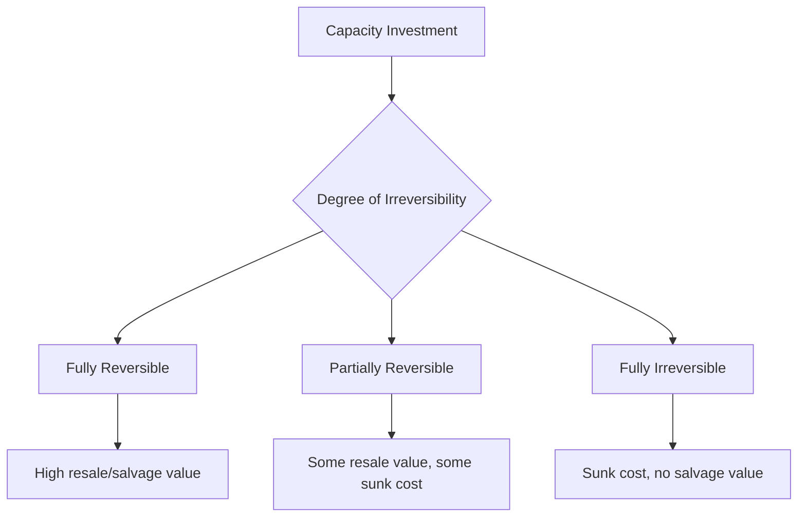
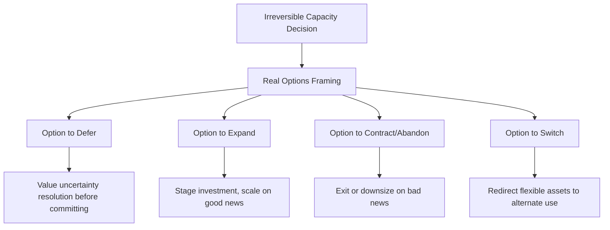

## Expansion Planning Under Irreversible Investment Risk

### Overview

Irreversible investment risk arises when capacity expansion decisions involve capital that, once committed, cannot be recovered or redeployed to another use without substantial loss. This irreversibility fundamentally changes the analytical approach to capacity expansion decisions: standard net present value (NPV) analysis, which assumes a now-or-never investment decision, systematically undervalues the option to wait, and can lead to premature or excessive capacity commitments under uncertainty.

### Defining Irreversibility

**Key Points**

- **Irreversible investment**: capital expenditure with little or no salvage value if conditions change — the asset is highly specific to its intended use (specialized equipment, purpose-built facilities, sunk R&D, long-term contracts with cancellation penalties)
- **Reversible/divestible investment**: capital that retains substantial resale or repurposing value if demand does not materialize (general-purpose equipment, leased rather than owned facilities, modular/flexible assets)
- Irreversibility exists on a spectrum, not as a binary; the degree of irreversibility is typically measured by the gap between acquisition cost and expected resale/salvage value
- Asset specificity, thin secondary markets, regulatory constraints, and long asset lifespans all increase the effective irreversibility of a capacity investment

### Why Standard NPV Undervalues the Decision

**Key Points**

- Classical NPV analysis treats the investment decision as a static, one-time choice: invest now if expected NPV is positive, don't invest otherwise
- This framework ignores the value of **waiting** to resolve uncertainty before committing irreversible capital — once uncertainty resolves, the firm can make a better-informed decision
- The right to delay an irreversible investment decision is economically equivalent to holding a financial call option: the firm has the *right, but not the obligation*, to invest at a future date
- Because exercising a call option early destroys its remaining time value, investing immediately in an irreversible asset destroys the option value of waiting — a cost that traditional NPV does not capture
- This insight is the foundation of **real options theory**, which explicitly values the option to delay, expand, contract, or abandon capacity investments

$$\text{NPV}_{\text{traditional}} = E[\text{PV(cash flows)}] - \text{Investment Cost}$$

$$\text{Expanded NPV} = \text{NPV}_{\text{traditional}} + \text{Value of Managerial Flexibility (Option Value)}$$

A project with a positive traditional NPV may still be suboptimal to undertake immediately if the option value of waiting exceeds the value captured by investing now.

### The Investment Trigger Under Uncertainty

**Key Points**

- Under irreversibility and uncertainty, the optimal investment rule is not "invest when NPV > 0," but "invest when the value of the underlying opportunity exceeds a **threshold** that is strictly greater than the standard break-even point"
- This threshold accounts for the option value being forgone by investing now rather than waiting for more information
- The classic formalization (Dixit & Pindyck) models the investment opportunity as analogous to a perpetual American call option, and derives the optimal exercise threshold using stochastic calculus (e.g., modeling the project value as following a geometric Brownian motion and solving the associated optimal stopping problem)

A simplified representation of the trigger condition, where $V$ is the value of the completed project, $I$ is the investment cost, and $\beta > 1$ is a parameter driven by the volatility of $V$ and the discount rate:

$$V^* = \frac{\beta}{\beta - 1} I$$

Since $\beta/(\beta-1) > 1$, the optimal investment trigger $V^*$ exceeds the investment cost $I$ — meaning the firm should wait until the project's value exceeds the simple break-even point by a margin that grows with uncertainty. [Inference: the exact value of $\beta$ depends on the specific stochastic process assumed for $V$ and the risk-free/discount rate; this formula illustrates the qualitative structure of the result rather than a universally applicable numeric threshold.]

### Key Drivers of the Option Value of Waiting

**Key Points**

- **Volatility of future demand/prices/costs**: higher volatility increases the value of waiting, since more information will be revealed and downside outcomes can be avoided by not committing early
- **Degree of irreversibility**: the more sunk the investment (lower salvage value), the greater the penalty for being wrong, and the higher the value of delaying until more certainty is achieved
- **Competitive preemption risk**: waiting has a cost if competitors can capture the market or erect barriers to entry by moving first — this creates a tension between the option value of waiting and the strategic value of early commitment (a first-mover advantage can offset or reverse the incentive to delay)
- **Rate of information arrival**: if new information about demand will only become available slowly, the benefit of waiting is diminished relative to a situation where uncertainty resolves quickly after a short delay

### Strategies to Manage Irreversibility Risk

**Key Points**

- **Staged/incremental investment**: breaking a large capacity commitment into sequential stages, each conditioned on observing favorable signals from the prior stage (directly related to incremental vs. large-step expansion strategy) — effectively converts one large irreversible bet into a series of smaller options
- **Modular and flexible capacity design**: choosing more general-purpose, reconfigurable, or leasable assets over highly specific ones reduces the effective irreversibility of the investment (see: modular and flexible capacity design)
- **Contractual flexibility**: negotiating cancellation clauses, capacity options with suppliers or contract manufacturers, or take-or-pay contracts with off-ramps, which convert a portion of the capital commitment into an option rather than an obligation
- **Pilot programs and staged rollouts**: committing capital to a small-scale pilot to generate demand and process information before committing to full-scale, irreversible capacity
- **Leasing versus owning**: leasing capacity-related assets preserves greater reversibility (exit optionality) than outright purchase, at the cost of higher ongoing payments and reduced control
- **Diversification of demand exposure**: investing in capacity that can serve multiple products or markets reduces the risk that the investment becomes irreversibly stranded if a single demand source fails to materialize

### Real Options Framework for Capacity Decisions

**Key Points**

- Irreversible capacity expansion decisions are commonly analyzed using the taxonomy of **real options**:
  - **Option to defer**: delay the investment until uncertainty resolves
  - **Option to expand**: make a smaller initial investment with the ability to scale up later if demand is favorable
  - **Option to contract/abandon**: reduce or exit an investment if conditions turn unfavorable (dependent on the degree of reversibility available)
  - **Option to switch**: use flexible assets that can be redirected to alternative uses (linking irreversibility risk to modular/flexible design)
- Real options are valued using techniques adapted from financial option pricing (e.g., binomial lattice models, Black-Scholes-type closed-form solutions, or Monte Carlo simulation), where the "underlying asset" is the project's expected future cash flow value and the "strike price" is the investment cost
- [Unverified: The suitability of financial option-pricing formulas (which assume tradable, hedgeable underlying assets) for real, non-traded project value is a recognized theoretical limitation in the real options literature, and practitioners often rely on simplified decision-tree or lattice approximations rather than closed-form option pricing formulas.]

### Illustration: Investment Trigger Under Uncertainty

(svg_diagram) Optimal investment threshold versus simple NPV break-even under uncertainty:

<svg xmlns="http://www.w3.org/2000/svg" viewBox="0 0 740 400" font-family="Helvetica, Arial, sans-serif">
<text x="370" y="24" text-anchor="middle" font-size="16" font-weight="bold" fill="#1a1a1a">Investment Trigger Under Irreversibility (svg_diagram)</text>
<line x1="80" y1="330" x2="80" y2="60" stroke="#333" stroke-width="1.5" />
<line x1="80" y1="330" x2="680" y2="330" stroke="#333" stroke-width="1.5" />
<text x="40" y="70" font-size="10" fill="#333">Project Value V</text>
<text x="640" y="350" font-size="10" fill="#333">Time / Info</text>

<line x1="80" y1="220" x2="680" y2="220" stroke="#999" stroke-dasharray="5,4" />
<text x="500" y="212" font-size="10" fill="#666">Simple NPV break-even (V = I)</text>

<line x1="80" y1="130" x2="680" y2="130" stroke="#d64545" stroke-width="2" />
<text x="500" y="120" font-size="10" fill="#d64545">Optimal investment trigger (V* &gt; I)</text>

<rect x="80" y="130" width="600" height="90" fill="#d64545" fill-opacity="0.08" />
<text x="120" y="180" font-size="10" fill="#d64545" font-style="italic">"Wait" zone: NPV positive but investment still deferred</text>

<path d="M 100 300 C 160 260, 200 310, 250 270 S 340 200, 380 230 S 460 160, 500 140 S 580 110, 620 100" stroke="`#2b6cb0`" stroke-width="2" fill="none" />

<text x="560" y="90" font-size="10" fill="`#2b6cb0`">Realized project value path</text>

<circle cx="620" cy="100" r="4" fill="#2b6cb0" />
<text x="600" y="80" font-size="10" fill="#1a1a1a">Invest triggered here</text>
</svg>

### Practical Considerations and Limitations

**Key Points**

- Real options analysis requires estimating volatility and stochastic dynamics of project value, which is often more subjective and harder to calibrate for real (non-traded) assets than for financial securities
- Organizations frequently apply simplified versions of this logic in practice — e.g., decision trees with explicit branch points, scenario planning with staged go/no-go gates, or qualitative risk premiums added to hurdle rates — rather than full stochastic option pricing models
- Overreliance on the "wait" logic can itself be a strategic risk: excessive caution can cause a firm to permanently cede a market to a competitor willing to accept irreversibility risk in exchange for a first-mover position
- Behavioral and organizational factors (e.g., escalation of commitment, sunk-cost fallacy once initial capacity investment begins) can cause actual decision-making to deviate from the theoretically optimal option-value framework

**Related Topics**

- Real options valuation methods (binomial lattice, Monte Carlo, Black-Scholes adaptation)
- Incremental versus one large-step expansion strategy
- Modular and flexible capacity design
- Geometric Brownian motion and stochastic modeling of demand/price uncertainty
- Sunk cost fallacy and escalation of commitment in capital investment decisions
- First-mover advantage versus preemption risk in capacity competition
- Decision tree analysis for staged capital investment