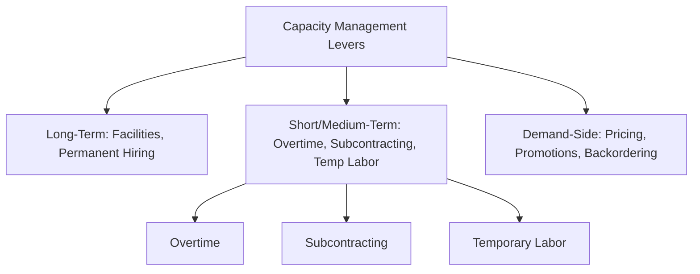
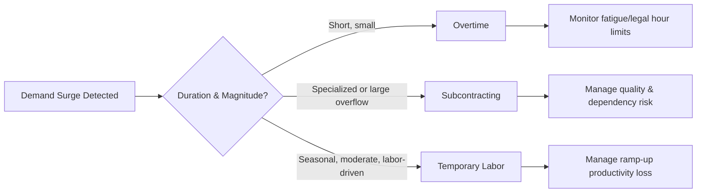

## Overtime, Subcontracting, and Temporary Labor

### Overview

Overtime, subcontracting, and temporary labor are the three principal short-term and medium-term levers organizations use to adjust effective capacity without altering permanent headcount or committing to long-term fixed assets. Unlike long-term capacity expansion, these mechanisms are designed to absorb demand fluctuations on timescales ranging from days to roughly one to two years, trading higher marginal unit cost or lower control for speed and reversibility.

### Positioning Within the Capacity Management Hierarchy

**Key Points**

- Short/medium-term capacity levers sit between **demand management** (pricing, promotions, demand shifting) and **long-term capacity expansion** (new facilities, permanent hiring, equipment purchases)
- These levers are generally reversible or near-reversible, in direct contrast to the irreversible investments discussed in long-term expansion planning
- They are typically deployed to handle demand variability that is expected to be temporary, seasonal, or not yet confirmed as a permanent shift, avoiding premature commitment to permanent capacity
- Each lever has a distinct cost structure, lead time, and flexibility profile, and they are frequently used in combination rather than in isolation

### Overtime

**Definition**: Extending the working hours of the existing permanent workforce beyond standard scheduled hours to increase output without adding headcount.

**Key Points**

- Fastest-response capacity lever available; can typically be implemented within days, sometimes same-day
- Preserves institutional knowledge and skill continuity, since output is produced by already-trained workers
- Commonly regulated by labor law (e.g., overtime pay premiums, maximum hour limits) and by collective bargaining agreements where applicable
- Overtime premium pay (commonly time-and-a-half or double-time, depending on jurisdiction and agreement) raises marginal labor cost per unit of output during overtime hours relative to straight-time production

**Advantages**

- No recruitment, onboarding, or training lag
- No loss of quality/skill consistency, since the same trained workforce performs the work
- Fully reversible — can be scaled back immediately when demand subsides
- Avoids the fixed costs (benefits, long-term commitment) associated with adding permanent headcount

**Disadvantages**

- Higher marginal cost per unit of labor due to overtime pay premiums
- Diminishing returns and rising error/defect/accident rates as worker fatigue accumulates — a well-documented phenomenon in industrial engineering, particularly beyond sustained periods of extended hours
- Legally capped in most jurisdictions (maximum weekly/monthly overtime hours), limiting how much additional capacity this lever alone can provide
- Sustained overtime can lead to workforce burnout, increased turnover, and morale deterioration if relied upon as a chronic rather than temporary measure
- Does not add net new capacity if demand growth is permanent; only defers the need for structural capacity changes

The relationship between overtime cost and output can be represented as a simple marginal cost function:

$$C_{OT} = w \cdot h_{s} + w \cdot m \cdot h_{o}$$

where $w$ is the standard wage rate, $h_s$ is straight-time hours, $h_o$ is overtime hours, and $m > 1$ is the overtime pay multiplier (e.g., $m = 1.5$).

### Subcontracting

**Definition**: Contracting with an external firm to perform production, assembly, or service work that would otherwise be done in-house, on a temporary or ongoing basis.

**Key Points**

- Also referred to as outsourcing when used more strategically, though subcontracting typically implies a shorter-term, capacity-driven arrangement rather than a permanent strategic sourcing decision
- Shifts variable capacity risk to an external party, who typically has the ability to serve multiple clients and thus pool demand variability across a broader customer base
- Commonly used for: overflow production during demand peaks, specialized processes the firm does not have in-house capability for, and non-core activities where external providers have scale or cost advantages
- Contract structures range from one-off purchase orders to standing capacity-reservation agreements (sometimes called capacity options, linking to real options concepts in long-term planning) that guarantee access to subcontractor capacity at a pre-negotiated rate

**Advantages**

- Access to capacity without capital investment in equipment or facilities
- Can provide access to specialized capabilities or technology not economical to build in-house for intermittent demand
- Scales up and down more readily than internal permanent capacity, since the obligation is contractual rather than a fixed asset
- Can reduce cost through the subcontractor's own economies of scale (serving multiple clients) or lower cost structure (e.g., labor cost differentials)

**Disadvantages**

- Reduced direct control over quality, schedule, and process — requires robust quality assurance and contract management systems
- Margin typically retained by the subcontractor increases per-unit cost relative to efficient in-house production
- Creates dependency risk: subcontractor capacity constraints, financial instability, or prioritization of other clients can directly constrain the contracting firm's output
- Intellectual property and process-knowledge leakage risk when sensitive designs or processes must be shared with an external party
- Lead time to establish a new subcontracting relationship (vendor qualification, contracting, ramp-up) can be substantial if not pre-arranged, reducing its usefulness as a purely reactive lever unless standing relationships already exist

### Temporary/Contingent Labor

**Definition**: Hiring workers on a fixed-term, seasonal, or on-demand basis (directly or through staffing agencies) rather than as permanent employees, to flex the internal workforce to match short-term demand.

**Key Points**

- Includes agency temp workers, seasonal hires, fixed-term contract employees, and increasingly, gig/platform-based on-demand labor in some sectors
- Commonly used to handle predictable seasonal peaks (retail holiday season, agricultural harvests, tax season for accounting firms) as well as unpredictable short-term surges
- Staffing agencies typically bear the administrative burden of recruitment and some employment law compliance, in exchange for a markup on the worker's wage

**Advantages**

- Adds net new labor capacity (unlike overtime, which only extends existing capacity) without permanent headcount commitment
- More easily scaled to zero when demand subsides compared to permanent employees, avoiding layoff costs and associated reputational/morale impact
- Provides a lower-risk trial period for evaluating workers who may later be converted to permanent roles
- Can be sourced relatively quickly, particularly for lower-skill roles or where staffing agency relationships are already established

**Disadvantages**

- Typically lower productivity than experienced permanent staff during an initial ramp-up/training period
- Higher per-hour cost when sourced through staffing agencies, due to agency markup
- Quality and consistency risk, particularly in roles requiring significant tacit knowledge or firm-specific training
- Legal and regulatory complexity varies significantly by jurisdiction regarding classification, benefits eligibility, and maximum duration of temporary employment
- Frequent or heavy reliance on temporary labor can create a two-tier workforce dynamic, with potential effects on morale, retention of permanent staff, and organizational culture

### Comparative Framework

| Dimension | Overtime | Subcontracting | Temporary Labor |
| --- | --- | --- | --- |
| Response speed | Fastest (days) | Moderate (weeks, faster if pre-arranged) | Moderate (days to weeks) |
| Reversibility | Fully reversible | High (contract-dependent) | High |
| Marginal cost | Elevated (premium pay) | Elevated (subcontractor margin) | Elevated (agency markup) |
| Skill/quality consistency | High (existing trained staff) | Variable (depends on subcontractor) | Variable (ramp-up period) |
| Capital requirement | None | None to low | None |
| Typical use case | Short bursts, tight deadlines | Overflow production, specialized capability gaps | Seasonal peaks, predictable surges |
| Regulatory constraints | Hour caps, pay premiums | Contract law, IP protection | Employment classification rules |

### Cost-Based Decision Model

A simplified framework for choosing among (or combining) these levers minimizes total cost of meeting a temporary capacity shortfall $\Delta Q$:

$$\min \; C_{OT}(\Delta Q_1) + C_{SUB}(\Delta Q_2) + C_{TEMP}(\Delta Q_3) \quad \text{s.t.} \quad \Delta Q_1 + \Delta Q_2 + \Delta Q_3 \geq \Delta Q$$

subject to capacity constraints on each lever (e.g., legal overtime hour caps, subcontractor available capacity, temp labor market availability). In practice, firms often use overtime first for its speed and quality consistency, then layer in temporary labor and subcontracting as the magnitude or duration of the shortfall grows beyond what overtime alone can economically or legally absorb.

**Example**

A manufacturer faces a temporary demand spike of 2,000 units above normal monthly capacity. Overtime can economically and legally supply 800 additional units (constrained by labor law hour caps) at a marginal cost of $12/unit. A qualified subcontractor can supply up to 1,500 units at $18/unit but requires two weeks' lead time to ramp. Temporary agency labor can supply an estimated 600 units at $15/unit effective cost (net of lower initial productivity), available within one week. A least-cost mix meeting the 2,000-unit shortfall would draw the full 800 units from overtime, then compare the marginal cost and lead-time trade-off between the remaining 1,200 units sourced from subcontracting versus temporary labor, likely blending both to respect the temp labor supply constraint of 600 units, with the remainder from subcontracting. [Inference: illustrative cost and constraint figures; actual optimal allocation depends on firm-specific cost structures, contractual terms, and labor market conditions.]

### Interaction with Workforce and Quality Risk

**Key Points**

- Overreliance on any single lever carries compounding risk: sustained overtime raises safety incident rates and burnout; sustained subcontracting can erode in-house capability and increase dependency; sustained temp labor use can suppress quality metrics and increase training overhead
- Effective short/medium-term capacity management typically blends levers dynamically based on the expected duration and confidence level of the demand signal — brief, uncertain spikes favor overtime; sustained but still temporary surges favor a mix of subcontracting and temp labor
- These levers also interact with long-term capacity planning: persistent reliance on overtime or subcontracting over multiple planning cycles is often a signal that a structural (long-term) capacity expansion decision is warranted rather than continued reliance on short-term levers

**Related Topics**

- Aggregate planning strategies (chase, level, and hybrid production strategies)
- Workforce scheduling and shift design
- Labor law constraints on overtime and contingent employment
- Capacity options and standing subcontractor agreements
- Seasonal demand forecasting and staffing models
- Total cost of ownership for outsourced versus in-house production
- Incremental expansion versus one large-step expansion (long-term capacity linkage)