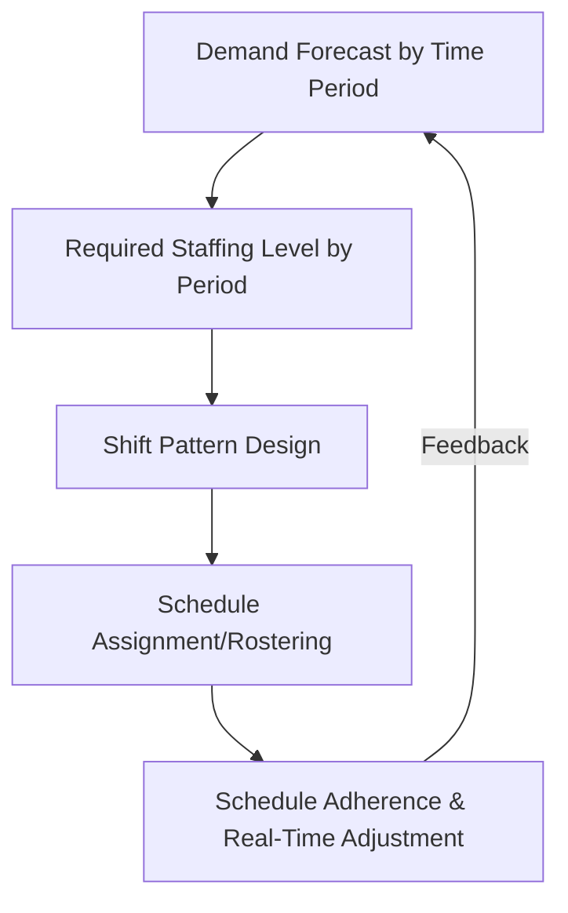
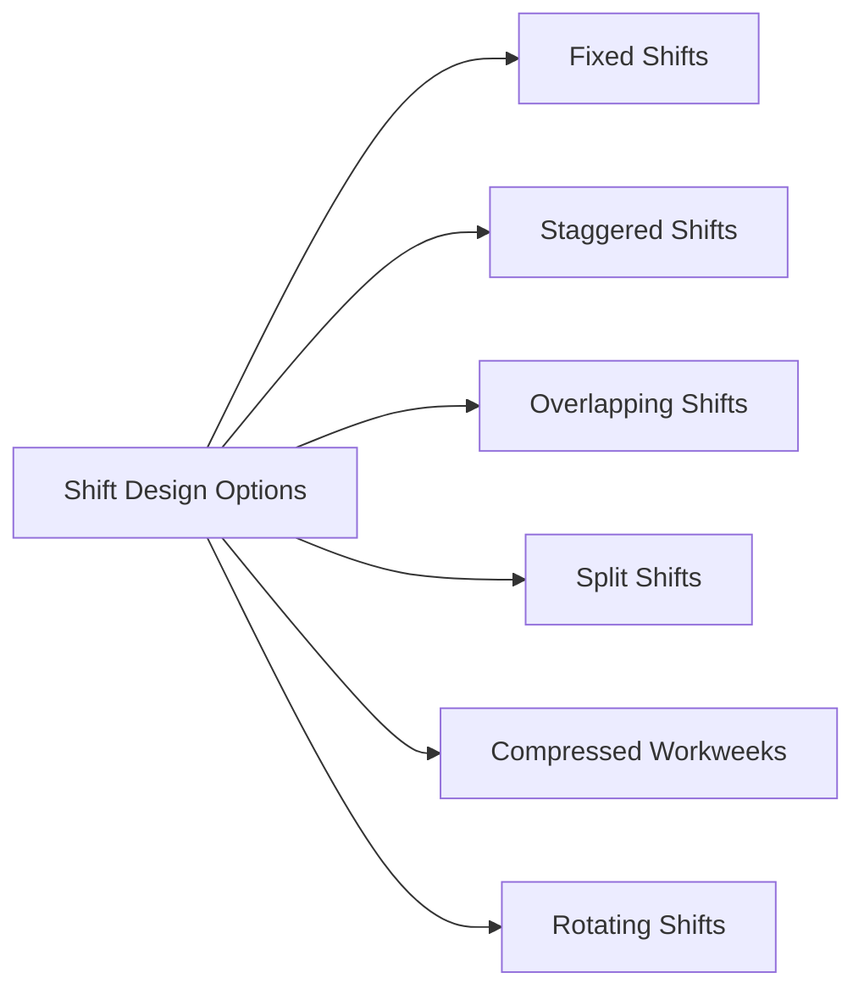
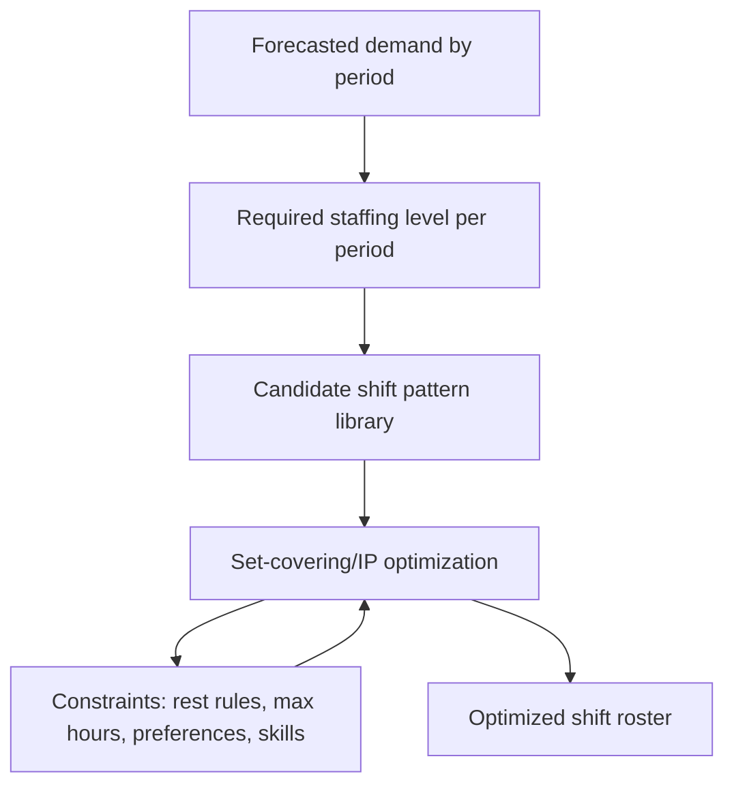

## Workforce Scheduling and Shift Flexibility

### Overview

Workforce scheduling and shift flexibility encompass the methods used to align the timing, quantity, and composition of labor supply with time-varying demand across hours, days, and weeks. Where overtime, subcontracting, and temporary labor adjust the *total volume* of labor capacity, scheduling and shift design adjust *when and how* existing labor capacity is deployed — a distinct but complementary short/medium-term capacity management lever.

### The Scheduling Problem

**Key Points**

- The core challenge is matching a **demand curve** (customer arrivals, order volume, production requirements) that fluctuates by hour of day, day of week, and season against a **labor supply** that must be scheduled in discrete shifts, subject to legal, contractual, and human constraints
- Demand-labor mismatch produces two costly failure modes: **understaffing** (service degradation, missed production targets, employee overload) and **overstaffing** (idle labor cost, reduced labor productivity metrics)
- Unlike overtime/subcontracting/temp labor (which change total capacity), scheduling reallocates a largely fixed labor pool in time, making it a lower-cost first lever before resorting to those volume-based mechanisms

### Demand-Driven Staffing Calculation

**Key Points**

- Required staffing per time interval is typically derived from a forecast of transaction volume divided by the service/production rate per worker, subject to a target service level
- In service operations with stochastic arrivals, staffing levels are frequently calculated using **queuing theory**, most commonly variants of the Erlang C formula (call centers, service counters) to determine the number of agents needed to meet a target wait-time or service-level goal
- In manufacturing/production contexts, required labor is more often derived deterministically from a production schedule and known labor-hours-per-unit standards, adjusted for expected efficiency/yield

The Erlang C model, widely used in service capacity staffing, estimates the probability that an arriving customer must wait ($P_{wait}$) as a function of the number of agents $N$, offered load $A$ (in Erlangs, i.e., arrival rate × average service time):

$$P_{wait} = \frac{\frac{A^N}{N!}\cdot\frac{N}{N-A}}{\sum_{k=0}^{N-1}\frac{A^k}{k!} + \frac{A^N}{N!}\cdot\frac{N}{N-A}}$$

Staffing planners solve for the minimum $N$ such that $P_{wait}$ (or resulting expected wait time) meets a target service level, then translate this into a period-by-period staffing requirement.

### Shift Design Approaches

**Key Points**

- **Fixed shifts**: standard, unchanging shift start/end times (e.g., 9-to-5, or three fixed 8-hour shifts covering 24 hours) — simplest to administer but least responsive to intraday demand variation
- **Staggered shifts**: multiple shift start times offset throughout the day so that shift changeovers occur at different points, smoothing the total headcount curve to better track demand peaks and troughs rather than having all workers arrive/leave simultaneously
- **Overlapping shifts**: shifts deliberately overlap during known peak periods (e.g., a shift covering the lunch rush that overlaps both the morning and afternoon shifts), concentrating labor precisely where volume peaks
- **Split shifts**: a single employee's workday is divided into two non-contiguous blocks (e.g., morning and evening) separated by an extended unpaid break, used when demand has two distinct daily peaks with a trough between them (common in food service and transit)
- **Compressed workweeks**: fewer, longer shifts (e.g., four 10-hour days) — affects weekly coverage patterns and can influence employee retention and fatigue dynamics differently than standard 8-hour shifts
- **Rotating shifts**: employees cycle through different shift times (day/evening/night) on a set rotation, used to distribute less desirable shifts equitably across a workforce, particularly in continuous (24/7) operations

### Flexibility Mechanisms Within Scheduling

**Key Points**

- **On-call/standby scheduling**: employees are scheduled as available-but-not-guaranteed, called in only if demand materializes — maximizes flexibility for the employer but shifts income uncertainty onto workers, and is increasingly subject to "predictive scheduling" or "fair workweek" regulations in some jurisdictions requiring advance notice and compensation for late changes
- **Shift bidding/self-scheduling**: employees select or bid on available shifts from a published set, increasing perceived fairness and employee satisfaction while still meeting coverage requirements
- **Flextime**: employees have some latitude in choosing start/end times around a core coverage window, common in knowledge-work settings with less rigid minute-by-minute demand coupling
- **Cross-training for schedule flexibility**: training employees across multiple roles or stations allows the scheduler to reallocate labor within a shift in response to real-time demand shifts (directly related to the flexibility concepts in modular/flexible capacity design, applied to the labor dimension)
- **Voluntary time off (VTO) and voluntary extra time (VET)**: mechanisms allowing employees to volunteer to leave early during unexpectedly low demand (VTO) or pick up extra hours during unexpected surges (VET), providing a fine-grained, opt-in capacity adjustment mechanism at the shift level

### Optimization Formulation

**Key Points**

- Workforce scheduling is commonly formulated as a **set covering** or **integer programming** problem: given a set of candidate shift patterns, choose the number of workers assigned to each pattern to meet or exceed period-by-period staffing requirements at minimum cost
- A canonical simplified formulation (the shift-scheduling/set-covering model):

$$\min \sum_{j=1}^{J} c_j x_j \quad \text{s.t.} \quad \sum_{j=1}^{J} a_{ij} x_j \geq d_i \;\; \forall i, \quad x_j \geq 0 \text{ and integer}$$

where $x_j$ is the number of workers assigned to shift pattern $j$, $c_j$ is the cost of that shift pattern, $a_{ij}$ is 1 if shift pattern $j$ covers period $i$ (0 otherwise), and $d_i$ is the required staffing level in period $i$

- Real-world implementations add constraints for: legally mandated rest periods between shifts, maximum consecutive workdays, minimum/maximum weekly hours, skill/certification requirements per shift, employee availability and preference constraints, and union or contractual rules on shift assignment
- This class of problem is solved in practice using workforce management software employing mixed-integer programming solvers, heuristics, or metaheuristics (genetic algorithms, simulated annealing) given the combinatorial complexity at scale

### Illustration: Staggered Shifts Matching a Demand Curve

(svg_diagram) Staggered shift coverage tracking an intraday demand curve:

<svg xmlns="http://www.w3.org/2000/svg" viewBox="0 0 760 380" font-family="Helvetica, Arial, sans-serif">
<text x="380" y="24" text-anchor="middle" font-size="16" font-weight="bold" fill="#1a1a1a">Staggered Shifts vs. Demand Curve (svg_diagram)</text>
<line x1="70" y1="320" x2="70" y2="60" stroke="#333" stroke-width="1.5" />
<line x1="70" y1="320" x2="720" y2="320" stroke="#333" stroke-width="1.5" />
<text x="30" y="70" font-size="10" fill="#333">Headcount</text>
<text x="680" y="340" font-size="10" fill="#333">Hour of Day</text>

<text x="90" y="335" font-size="9" fill="#666">6am</text>

<text x="240" y="335" font-size="9" fill="#666">10am</text>

<text x="390" y="335" font-size="9" fill="#666">2pm</text>

<text x="540" y="335" font-size="9" fill="#666">6pm</text>

<text x="670" y="335" font-size="9" fill="#666">10pm</text>

<path d="M 90 300 Q 200 100 300 130 Q 400 260 470 250 Q 570 90 670 280" stroke="`#d64545`" stroke-width="2" fill="none" />

<text x="500" y="80" font-size="10" fill="`#d64545`">Demand curve</text>

<rect x="90" y="270" width="150" height="14" fill="#2b6cb0" fill-opacity="0.5" />
<rect x="180" y="255" width="150" height="14" fill="#38a169" fill-opacity="0.5" />
<rect x="290" y="240" width="150" height="14" fill="#805ad5" fill-opacity="0.5" />
<rect x="380" y="255" width="150" height="14" fill="#dd6b20" fill-opacity="0.5" />
<rect x="480" y="270" width="150" height="14" fill="#2b6cb0" fill-opacity="0.3" />

<text x="95" y="266" font-size="8" fill="`#1a1a1a`">Shift A</text>

<text x="185" y="251" font-size="8" fill="`#1a1a1a`">Shift B</text>

<text x="295" y="236" font-size="8" fill="`#1a1a1a`">Shift C</text>

<text x="385" y="251" font-size="8" fill="`#1a1a1a`">Shift D</text>

<text x="485" y="266" font-size="8" fill="`#1a1a1a`">Shift E</text>

</svg>

### Real-Time Adjustment and Schedule Adherence

**Key Points**

- **Schedule adherence** measures how closely actual staffing and activity match the planned schedule, a key performance metric especially in high-volume service environments (e.g., call centers)
- **Real-time management** processes monitor actual demand against forecast throughout the day and trigger corrective actions (calling in VET workers, releasing staff via VTO, reallocating cross-trained workers between stations) when material deviations occur
- Short-interval forecasting (e.g., 15- or 30-minute buckets) is common in high-variability service environments to support fine-grained real-time schedule adjustment, distinct from the daily/weekly forecasts used for initial shift design

### Trade-offs and Constraints

**Key Points**

- Highly optimized, tightly demand-matched schedules can reduce labor cost but may reduce schedule predictability and work-life balance for employees, increasing turnover risk — a trade-off increasingly addressed through "fair workweek"/predictive scheduling regulation in various jurisdictions
- Excessive shift fragmentation (e.g., heavy reliance on split shifts or very short shifts) can suppress the effective labor pool willing to accept such schedules, creating a recruitment/retention constraint that limits how aggressively demand-matching can be pursued
- Cross-training investments that enable scheduling flexibility carry upfront training cost and time, representing a trade-off against the ongoing flexibility benefit (paralleling the cost/benefit trade-off in modular/flexible capacity design)
- Legal constraints (maximum consecutive hours, mandatory rest periods, minimum shift lengths, overtime thresholds) bound the feasible scheduling solution space and vary substantially by jurisdiction and industry

### Interaction with Other Capacity Levers

**Key Points**

- Effective shift scheduling reduces the need for overtime by better matching baseline headcount to the demand curve, but does not eliminate the need for overtime, subcontracting, or temporary labor during periods where total demand exceeds the maximum feasible staffing achievable through scheduling alone
- Scheduling flexibility and cross-training are often the first lever deployed (lowest cost, most reversible), escalating to volume-based levers (overtime, temp labor, subcontracting) only when demand exceeds what schedule optimization within the existing workforce can absorb
- Aggregate planning decisions (chase vs. level production strategy) set the overall workforce size envelope within which shift scheduling then optimizes the time-based deployment of that workforce

**Related Topics**

- Erlang C and queuing-theory-based staffing models
- Aggregate planning: chase, level, and hybrid workforce strategies
- Overtime, subcontracting, and temporary labor
- Predictive scheduling and fair workweek regulations
- Cross-training and labor flexibility (linked to modular/flexible capacity design)
- Mixed-integer programming for shift/roster optimization
- Real-time workforce management and schedule adherence metrics