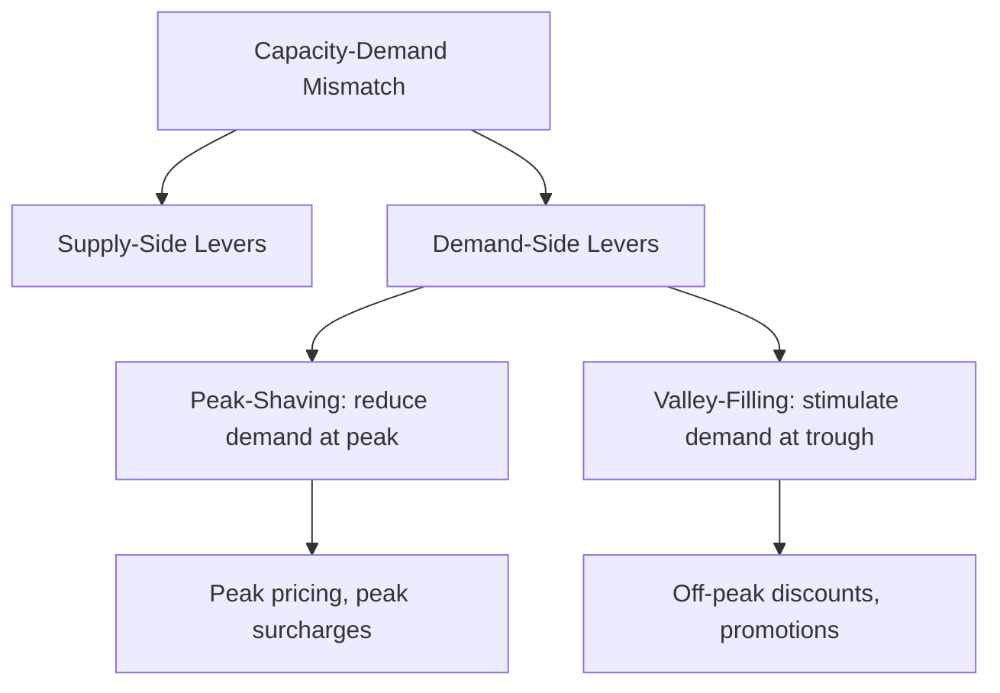
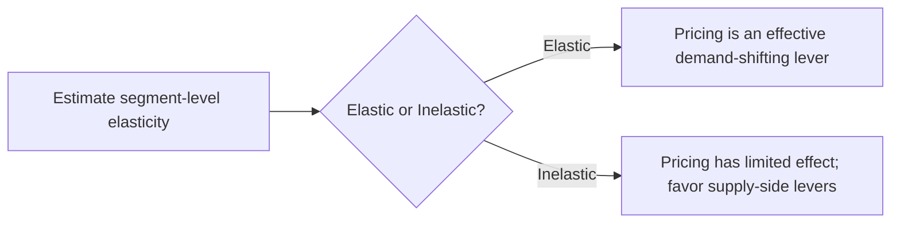
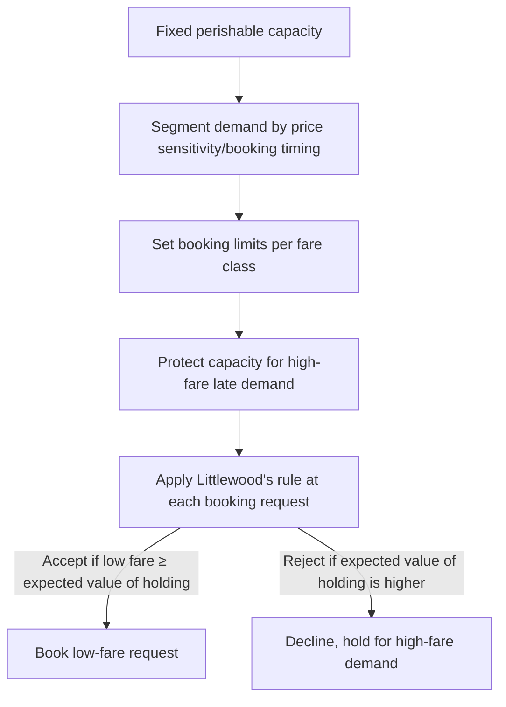

## Demand Management Through Pricing and Promotions

### Overview

Demand management through pricing and promotions is the capacity management lever that adjusts the *demand side* of the capacity-demand balance rather than the supply side. Instead of adding labor, equipment, or scheduling flexibility to meet demand, this approach uses price signals and promotional incentives to shift, smooth, or reduce demand so that it better matches existing available capacity — particularly valuable when supply-side capacity is fixed, expensive to adjust, or perishable.

### Positioning Within Capacity Management

**Key Points**

- Complements supply-side levers (overtime, subcontracting, temporary labor, scheduling flexibility) by addressing the same capacity-demand mismatch from the opposite direction
- Particularly critical for **perishable capacity** — capacity that cannot be stored or carried forward if unused (airline seats, hotel rooms, restaurant tables, live event tickets, perishable production capacity), where unused capacity in one period represents permanently lost revenue rather than deferred output
- Often less costly to implement than supply-side adjustments, since it does not require acquiring or reallocating physical/labor resources — it operates through the pricing and marketing systems already in place
- Works on both directions of imbalance: **peak-shaving** (reducing demand during high-demand periods to avoid overload) and **valley-filling** (stimulating demand during low-demand periods to improve utilization)

### Core Mechanisms

**Key Points**

- **Peak-load/dynamic pricing**: raising prices during periods of high demand relative to capacity, both to ration scarce capacity toward the highest-value customers and to discourage marginal demand that would otherwise cause overload
- **Off-peak discounting**: lowering prices during low-demand periods to draw price-sensitive demand into underutilized capacity windows
- **Promotions and incentives**: time-limited discounts, bundles, loyalty rewards, or other incentives used to shift demand timing (e.g., "early bird" pricing) or stimulate incremental demand that would not otherwise occur
- **Advance-purchase/reservation pricing**: offering lower prices for commitments made further in advance, which improves demand forecast visibility and allows better capacity planning while incentivizing demand smoothing
- **Yield/revenue management**: a more sophisticated, often algorithmic extension of dynamic pricing that segments demand by willingness-to-pay and books capacity across multiple price/fare classes to maximize total revenue given fixed, perishable capacity

### Theoretical Foundation: Price Elasticity of Demand

**Key Points**

- The effectiveness of pricing as a demand management tool depends fundamentally on the **price elasticity of demand** for the good or service in question — the responsiveness of quantity demanded to a change in price
- Price elasticity of demand is defined as:

$$E_d = \frac{\%\, \Delta Q_d}{\%\, \Delta P} = \frac{\partial Q}{\partial P}\cdot\frac{P}{Q}$$

- Goods/services with **elastic demand** ($|E_d| > 1$) respond strongly to price changes, making pricing a powerful demand-shifting tool; goods/services with **inelastic demand** ($|E_d| < 1$) respond weakly, limiting the effectiveness of price-based demand management and making capacity-side adjustments relatively more important
- Elasticity often varies by **time of use and customer segment** — e.g., business air travelers booking near departure typically exhibit lower price elasticity than leisure travelers booking in advance, which is the foundational insight behind fare-class-based revenue management

### Peak-Load Pricing Theory

**Key Points**

- Peak-load pricing is a classical economic framework for allocating cost and setting prices when capacity is costly to build and demand varies systematically by time period (e.g., electricity, telecommunications, transportation)
- The core principle: peak-period users should bear the marginal cost of the capacity that must be built to serve the peak, since off-peak users do not require that incremental capacity
- In its simplest form (two periods, peak and off-peak, with capacity cost $b$ per unit and operating cost $c$ per unit), the theoretically efficient prices are:

$$P_{peak} = c + b, \qquad P_{off\text{-}peak} = c$$

provided the off-peak demand at price $c$ does not exceed the capacity built to serve the peak. This result explains why utilities, telecommunications providers, and transportation systems have historically applied time-of-use pricing with the peak price carrying the full incremental capacity cost.

- [Inference: this simplified two-period peak-load pricing result assumes a single, well-defined capacity constraint and demand independence across periods; real-world implementations typically require more complex multi-period or stochastic extensions to account for demand correlation across periods and uncertainty in peak timing.]

### Revenue Management and Fare-Class Segmentation

**Key Points**

- Revenue management (also called yield management) extends peak-load pricing by segmenting a single pool of perishable capacity into multiple price/fare classes sold at different times and price points to different demand segments
- A foundational tool is the **Littlewood's rule**, used to decide when to accept a lower-fare booking versus reserving capacity for potential higher-fare demand. The rule states that a lower-fare class booking should be accepted only if:

$$P_{low} \geq P_{high} \cdot P(D_{high} > \text{remaining capacity})$$

meaning a discount booking is accepted only when its guaranteed revenue exceeds the expected value of holding that unit of capacity for probabilistic higher-fare demand

- This logic underlies **booking limits** and **protection levels** widely used in airline, hotel, and car rental revenue management systems, where a certain number of seats/rooms are "protected" for late-booking, higher-paying customers even while lower fares remain technically available earlier in the booking horizon

### Illustration: Demand Smoothing via Pricing

(svg_diagram) Effect of peak/off-peak pricing on the demand curve relative to fixed capacity:

<svg xmlns="http://www.w3.org/2000/svg" viewBox="0 0 760 380" font-family="Helvetica, Arial, sans-serif">
<text x="380" y="24" text-anchor="middle" font-size="16" font-weight="bold" fill="#1a1a1a">Demand Smoothing via Pricing (svg_diagram)</text>
<line x1="70" y1="320" x2="70" y2="60" stroke="#333" stroke-width="1.5" />
<line x1="70" y1="320" x2="720" y2="320" stroke="#333" stroke-width="1.5" />
<text x="30" y="70" font-size="10" fill="#333">Demand</text>
<text x="680" y="340" font-size="10" fill="#333">Time</text>

<line x1="70" y1="150" x2="720" y2="150" stroke="#38a169" stroke-width="2" stroke-dasharray="6,3" />
<text x="600" y="142" font-size="10" fill="#38a169">Fixed Capacity Limit</text>

<path d="M 90 300 Q 200 80 300 300 Q 400 60 500 300 Q 600 90 690 300" stroke="`#d64545`" stroke-width="2" fill="none" />

<text x="330" y="55" font-size="10" fill="`#d64545`">Unmanaged demand (peaky, exceeds capacity)</text>

<path d="M 90 260 Q 200 170 300 190 Q 400 160 500 190 Q 600 170 690 250" stroke="`#2b6cb0`" stroke-width="2.5" fill="none" />

<text x="330" y="230" font-size="10" fill="`#2b6cb0`">Smoothed demand (after peak pricing + off-peak promotions)</text>

</svg>

### Practical Techniques and Tactics

**Key Points**

- **Time-of-use pricing**: differentiated rates by hour, day, or season (electricity tariffs, transit fares, cinema ticket pricing)
- **Congestion pricing**: charging for access to a constrained resource (roadways, popular venues) during high-demand periods specifically to reduce peak overload
- **Dynamic/surge pricing**: algorithmically adjusted real-time pricing based on current supply-demand imbalance (ride-hailing platforms, some e-commerce and travel booking systems)
- **Off-peak promotions and bundling**: discounts, loyalty points, or bundled offers specifically timed to underutilized capacity windows (e.g., matinee movie pricing, weekday hotel rates, happy-hour restaurant pricing)
- **Reservation and deposit systems**: encouraging advance commitment through price incentives, improving demand visibility for capacity planning while smoothing booking patterns
- **Segmented product tiers**: offering different service levels (e.g., flexible vs. non-refundable fares) at different prices to separate demand by willingness-to-pay and booking flexibility

### Limitations and Risks

**Key Points**

- Aggressive or poorly calibrated dynamic pricing can generate customer perception of unfairness or "price gouging," carrying reputational and, in some jurisdictions, regulatory risk (particularly during emergencies or essential-good shortages)
- Overreliance on discounting to fill off-peak capacity can erode overall margin and train customers to wait for discounts, potentially shifting demand permanently rather than merely smoothing it (a demand cannibalization risk)
- Requires reasonably accurate demand elasticity estimates by segment and time period; poor elasticity estimation can result in pricing changes that fail to shift demand as intended, or that sacrifice revenue without achieving meaningful demand smoothing
- Effectiveness is fundamentally bounded by the underlying elasticity of the product/service — for goods and services with highly inelastic demand (e.g., essential utilities in the short run, emergency medical care), pricing alone cannot resolve significant capacity-demand mismatches, and supply-side levers become relatively more important
- Coordination is required between pricing/marketing and operations/capacity planning functions; demand-side and supply-side levers are most effective when jointly optimized rather than managed in separate organizational silos

### Interaction with Supply-Side Capacity Levers

**Key Points**

- Effective peak-shaving through pricing directly reduces the magnitude of demand spikes that would otherwise require overtime, subcontracting, or temporary labor to absorb, lowering overall short-term capacity management cost
- Valley-filling promotions improve baseline capacity utilization, which can improve the economics of maintaining a given fixed capacity level (spreading fixed costs over more units sold) rather than requiring capacity reduction during low-demand periods
- Revenue management systems in perishable-capacity industries are frequently integrated directly with operational capacity planning (e.g., airline fleet assignment and scheduling are jointly optimized with revenue management booking limits) since demand-shifted-by-price and available capacity are two sides of the same operational planning problem

**Related Topics**

- Price elasticity of demand and segment-level elasticity estimation
- Peak-load pricing theory in utilities and infrastructure
- Revenue/yield management and Littlewood's rule
- Congestion pricing and dynamic/surge pricing systems
- Overtime, subcontracting, and temporary labor (supply-side complement)
- Booking limits, protection levels, and fare-class inventory control
- Demand forecasting for perishable-capacity industries