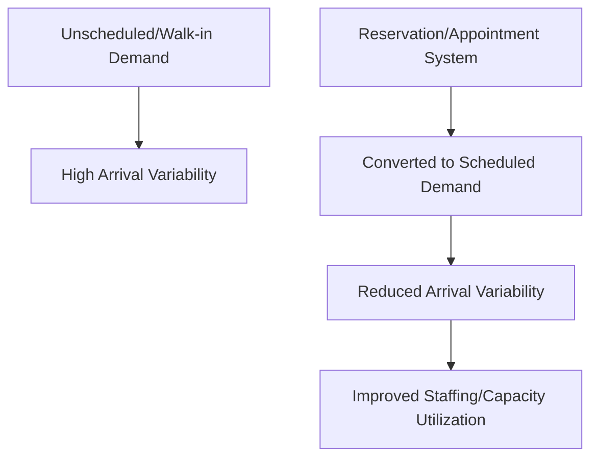
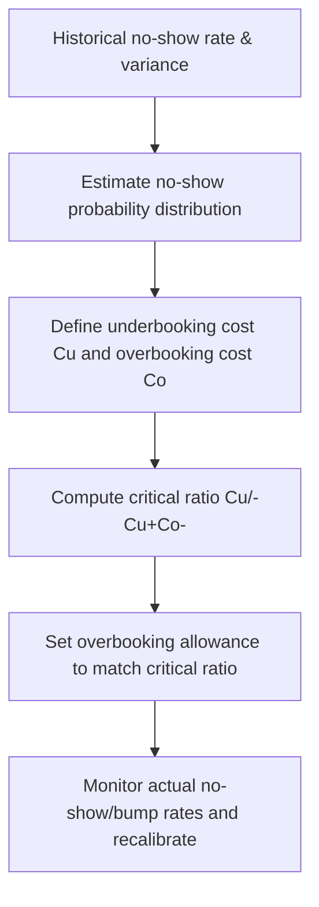

## Reservation and Appointment Systems

### Overview

Reservation and appointment systems are demand-management mechanisms that convert unscheduled, walk-in-style demand into pre-committed, time-slotted demand. By requiring or incentivizing customers to book capacity in advance for a specific time window, these systems give the service provider visibility into future demand and the ability to actively control the rate and timing at which demand arrives, rather than passively absorbing whatever arrival pattern occurs.

### Role Within Capacity Management

**Key Points**

- Directly addresses the core capacity management problem for services with limited, perishable, or costly-to-adjust capacity (medical appointments, restaurant tables, equipment time slots, service technician visits, transportation seats)
- Shifts variability from the **arrival process** to the **booking process** — arrivals become deterministic (or close to it) once booked, while the uncertainty is pushed earlier in time to the booking decision, where it is often easier to manage
- Complements pricing-based demand management (see: demand management through pricing and promotions) by controlling *when* demand is allowed to occur, rather than only influencing willingness to shift via price incentives
- Provides the forecast visibility needed to make short/medium-term staffing and scheduling decisions (see: workforce scheduling and shift flexibility) with much lower uncertainty than walk-in-only environments

### Core Functions of a Reservation System

**Key Points**

- **Slot definition**: dividing available capacity into discrete, bookable time units (appointment slots, table turns, equipment booking blocks) sized according to expected service duration
- **Booking/allocation**: assigning a specific customer to a specific slot, either through direct booking (single resource) or more complex allocation across multiple resources (e.g., multiple providers, multiple rooms)
- **Overbooking management**: deliberately booking beyond nominal capacity in anticipation of no-shows and cancellations, a practice with deep ties to revenue management (see: reservation and fare-class allocation logic)
- **Waitlisting**: managing demand that arrives after a time slot is fully booked, allowing that demand to be captured if a cancellation occurs
- **Reminder and confirmation systems**: reducing no-show rates through automated reminders, deposits, or confirmation requirements

### The No-Show and Overbooking Problem

**Key Points**

- A central operational challenge in reservation systems is that a booked slot does not guarantee the customer will actually arrive — a **no-show** represents lost capacity utilization if the slot cannot be resold or reused
- **Overbooking** — accepting more reservations than available capacity, based on a statistical estimate of the expected no-show rate — is the standard mitigation, most visibly used in the airline and hotel industries
- Overbooking introduces a trade-off: too little overbooking leaves capacity unused due to no-shows (lost revenue); too much overbooking risks turning away or "bumping" customers who do arrive (service failure cost, compensation cost, reputational damage)

The classic overbooking decision can be framed as a newsvendor-type problem. If $C_u$ is the cost of an empty seat/slot due to under-booking (a no-show with no replacement) and $C_o$ is the cost of over-booking (a customer who must be turned away or compensated), the optimal number of reservations to accept above capacity, given a no-show rate distribution, satisfies a critical ratio analogous to:

$$P(\text{no-shows} \leq x^*) = \frac{C_u}{C_u + C_o}$$

where $x^*$ is the optimal overbooking allowance. This mirrors the newsvendor critical fractile logic applied to capacity investment sizing, here applied to the booking-acceptance decision instead.

**Example**

A clinic with 20 appointment slots per day historically observes a 10% no-show rate. If the clinic accepts exactly 20 bookings, the expected number of patients actually seen is only $20 \times 0.90 = 18$, leaving 2 slots of capacity unused on an average day. If the cost of an unused slot ($C_u$) is estimated at $150 (lost billing opportunity) and the cost of an overbooked patient who must be rescheduled ($C_o$) is estimated at $80 (goodwill/rescheduling cost), the critical ratio $C_u/(C_u+C_o) = 150/230 \approx 0.65$ suggests the clinic should overbook up to the point where the probability of no-shows being less than or equal to the overbooking allowance is about 65%, which — given the no-show rate distribution — typically justifies booking a small number of appointments (e.g., 2) beyond the nominal 20-slot capacity. [Inference: the specific overbooking count depends on the full probability distribution of no-shows, not just the mean rate, and should be derived from historical no-show variance data rather than the mean alone.]

### Slot Design and Capacity Allocation

**Key Points**

- **Fixed-length slots**: uniform time blocks (e.g., every appointment is 15 minutes) — simple to administer, but inefficient when actual service time varies significantly by customer/case type
- **Variable-length slots**: slot duration tailored to the expected service requirement of the specific booking (e.g., a new-patient visit allocated more time than a follow-up) — improves capacity utilization accuracy at the cost of more complex scheduling logic
- **Buffer/slack time**: intentionally leaving gaps between scheduled slots to absorb service-time variability and prevent cascading delays when one appointment runs long — a direct trade-off between schedule tightness (utilization) and punctuality/service-level reliability
- **Batching and block scheduling**: grouping similar service types into contiguous blocks (e.g., all similar procedures scheduled together) to reduce setup/changeover time between appointments, distinct from open scheduling where any service type can be booked into any slot

### Advance-Booking Windows and Demand Shaping

**Key Points**

- The **booking horizon** (how far in advance customers may reserve) affects both demand visibility and customer behavior — longer horizons improve forecast lead time but can encourage speculative or duplicate bookings if cancellation is low-cost
- **Tiered access windows** (e.g., loyalty members or higher-value customers granted earlier booking access) parallel fare-class segmentation in revenue management, allowing preferential capacity allocation to priority segments
- **Cancellation and modification policies** directly affect no-show and effective utilization rates — stricter cancellation policies (deposits, cancellation fees, shorter free-cancellation windows) generally reduce no-show rates but may also reduce total booking volume if they discourage tentative bookings
- **Dynamic slot release**: releasing additional capacity or opening new slots incrementally as the booking window approaches, based on updated demand signals, rather than opening all capacity simultaneously far in advance

### Illustration: Reservation System Booking Funnel

(svg_diagram) Booking funnel showing capacity allocation, no-shows, and effective utilization:

<svg xmlns="http://www.w3.org/2000/svg" viewBox="0 0 740 380" font-family="Helvetica, Arial, sans-serif">
<text x="370" y="24" text-anchor="middle" font-size="16" font-weight="bold" fill="#1a1a1a">Reservation Booking Funnel (svg_diagram)</text>
<rect x="60" y="60" width="620" height="50" fill="#2b6cb0" fill-opacity="0.5" stroke="#2b6cb0" />
<text x="370" y="90" text-anchor="middle" font-size="12" fill="#fff">Nominal Capacity (e.g., 20 slots)</text>
<rect x="60" y="130" width="660" height="50" fill="#38a169" fill-opacity="0.5" stroke="#38a169" />
<text x="390" y="160" text-anchor="middle" font-size="12" fill="#fff">Bookings Accepted (Nominal + Overbooking Allowance)</text>
<rect x="60" y="200" width="600" height="50" fill="#dd6b20" fill-opacity="0.5" stroke="#dd6b20" />
<text x="360" y="230" text-anchor="middle" font-size="12" fill="#fff">Expected Arrivals (after no-show rate applied)</text>
<rect x="60" y="270" width="80" height="50" fill="#d64545" fill-opacity="0.4" stroke="#d64545" />
<text x="100" y="300" text-anchor="middle" font-size="10" fill="#1a1a1a">Bumped/</text>
<text x="100" y="312" text-anchor="middle" font-size="10" fill="#1a1a1a">Waitlisted</text>
<rect x="160" y="270" width="500" height="50" fill="#2b6cb0" fill-opacity="0.6" stroke="#2b6cb0" />
<text x="410" y="300" text-anchor="middle" font-size="12" fill="#fff">Effectively Utilized Capacity</text>
</svg>

### Waitlist Management

**Key Points**

- Waitlists function as a demand-buffering mechanism, allowing capacity freed by cancellations to be immediately reallocated to demand that could not initially be accommodated
- Effective waitlist systems require rapid notification and confirmation processes, since waitlisted customers must often respond quickly to claim a freed slot before it lapses
- Priority rules for waitlists (first-come-first-served, urgency-based, value-based) mirror the segmentation logic used in fare-class/reservation allocation and should generally be aligned with the organization's broader demand-prioritization strategy

### Trade-offs and Limitations

**Key Points**

- Reservation requirements can suppress overall demand if the booking process introduces friction, particularly for customers who prefer spontaneous or walk-in access — some businesses deliberately reserve a portion of capacity for walk-ins to balance this trade-off
- Overbooking, while capacity-efficient on average, creates real customer-facing risk (bumping, delays) that must be actively managed through compensation policies and service recovery processes to limit reputational damage
- Rigid slot structures can reduce flexibility to accommodate atypical service durations, creating either wasted slack time (fixed slots too long) or cascading delays (fixed slots too short)
- Reservation systems shift some forecasting burden from aggregate demand forecasting to individual booking-level prediction (e.g., no-show probability per booking), which may require more granular customer-level data and modeling than aggregate approaches

### Interaction with Other Capacity Management Levers

**Key Points**

- Reservation data directly feeds workforce scheduling decisions, since known future bookings provide much more accurate near-term staffing requirements than demand forecasts alone (see: workforce scheduling and shift flexibility)
- Reservation and appointment systems are frequently combined with pricing-based demand management — e.g., differential pricing by time slot, deposits, or cancellation fees function as both a demand-shaping and a no-show-mitigation mechanism simultaneously
- In systems with highly perishable capacity, reservation and overbooking logic converges closely with revenue/yield management fare-class allocation, since both are fundamentally about optimally allocating a fixed capacity pool across time-differentiated demand under uncertainty

**Related Topics**

- Overbooking optimization and the newsvendor critical ratio
- No-show prediction modeling
- Revenue/yield management and fare-class allocation
- Workforce scheduling and shift flexibility
- Demand management through pricing and promotions
- Queuing theory and service-level design
- Waitlist prioritization and service recovery policy