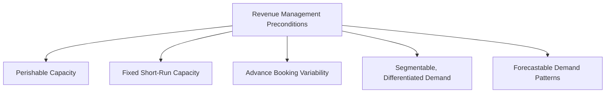
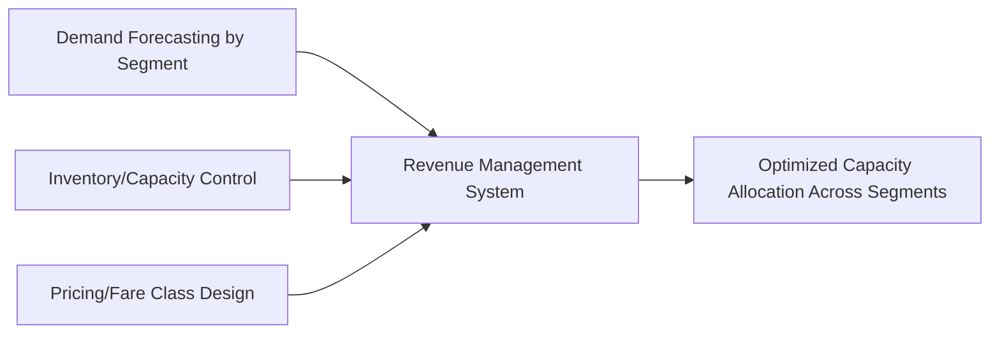
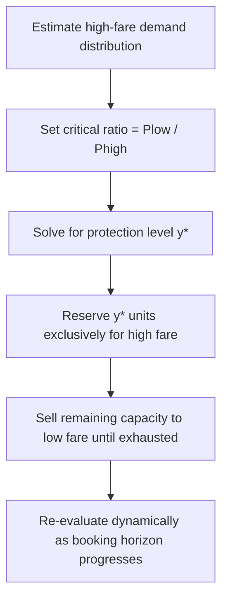
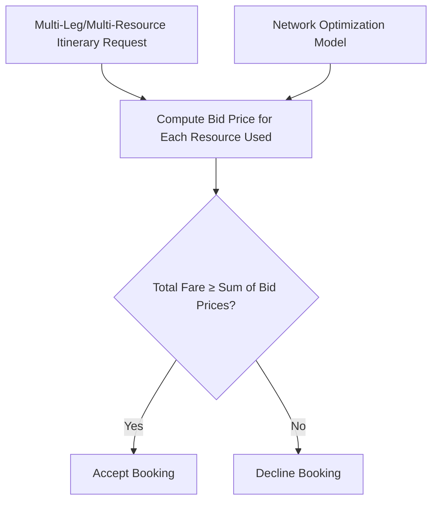

## Yield and Revenue Management

### Overview

Yield and revenue management is the discipline of maximizing revenue from a fixed, perishable capacity pool by controlling how that capacity is allocated across different customer segments, price points, and booking times. It formalizes and extends the pricing and reservation concepts already introduced, combining demand forecasting, price segmentation, and inventory control into an integrated system for capacity allocation under uncertainty.

### Foundational Conditions for Revenue Management

**Key Points**

- Revenue management is most effective, and was historically developed, in industries exhibiting a specific combination of characteristics:
  - **Perishable inventory/capacity**: unsold capacity in a given period cannot be stored or carried forward (an empty airline seat, hotel room, or event ticket at departure/checkout/showtime is permanently lost)
  - **Fixed (or near-fixed) capacity in the short run**: capacity cannot be quickly adjusted to match demand fluctuations
  - **Advance booking with variable lead times**: customers book at different points in time relative to consumption, creating an opportunity to segment by booking behavior
  - **Segmentable demand with differing price sensitivity**: distinct customer groups (e.g., business vs. leisure travelers) place different value on the same unit of capacity
  - **Predictable, though uncertain, demand patterns**: sufficient historical data exists to forecast demand by segment and time period, even if individual outcomes remain stochastic
- Industries most closely associated with mature revenue management practice include airlines, hotels, car rental, cruise lines, and increasingly, other sectors with perishable capacity (advertising inventory, event ticketing, healthcare scheduling, energy markets)

### The Three Pillars of Revenue Management

**Key Points**

- **Forecasting**: predicting demand by segment, price class, and booking time-to-consumption, typically decomposed into forecasts by fare/rate class and by booking curve (the pattern of bookings arriving over time before the service date)
- **Inventory/capacity control**: deciding how many units of capacity to make available to each price/fare class at any given point in the booking horizon (booking limits, protection levels, nested allocation)
- **Pricing**: setting the price points themselves for each class or segment, which interacts with, but is analytically distinct from, the inventory control decision of how much capacity to allocate to each price point

### Fare Class Structures and Nested Allocation

**Key Points**

- Capacity is divided into multiple **fare classes** (or rate classes), each with a different price and typically different restrictions (advance purchase requirement, refundability, minimum stay), which serve as **fences** that discourage high-value customers from self-selecting into low-price classes
- Fare classes are typically **nested**: a booking limit is set for each class, but higher fare classes have access to the inventory of all classes below them, ensuring that if lower-fare demand is exhausted, the remaining capacity is still available to sell (just not below the current class's floor)
- The central inventory control decision is the **protection level**: the amount of capacity reserved exclusively for higher-fare classes, which is not sold to lower-fare demand even if that lower-fare demand arrives first

### Littlewood's Rule and the Two-Class Problem

**Key Points**

- **Littlewood's Rule**, the foundational result in revenue management inventory control, addresses the simplest case of two fare classes: a low fare $P_L$ that books first, and a high fare $P_H$ that books later and closer to the service date
- The rule states that a booking request for the low fare class should be **accepted** only if the certain revenue from accepting it is at least as great as the expected revenue from protecting that unit of capacity for potential high-fare demand:

$$P_L \geq P_H \cdot P(D_H > x)$$

where $D_H$ is the (random) demand for the high fare class and $x$ is the remaining capacity if the low-fare request is declined. Equivalently, the **protection level** $y^*$ for the high fare class is the value satisfying:

$$P(D_H > y^*) = \frac{P_L}{P_H}$$

- This is structurally identical to the newsvendor critical fractile used in capacity sizing and overbooking decisions, here applied to the *inventory allocation* decision across fare classes rather than to total capacity sizing

**Example**

An airline route has a high fare of $400 and a low fare of $150 for a flight with a given remaining capacity. Setting the protection level requires finding $y^*$ such that $P(D_H > y^*) = 150/400 = 0.375$. If historical high-fare demand for this route follows a distribution where the probability of demand exceeding 20 seats is approximately 0.375, the airline should protect 20 seats exclusively for high-fare bookings and allow the remaining seats to be sold at the low fare, even while low-fare demand is still arriving. [Inference: the specific protection level number depends on the actual historical demand distribution for the route, which must be estimated from booking data rather than assumed.]

### Extension to Multiple Fare Classes: EMSR

**Key Points**

- Real-world revenue management typically involves more than two fare classes, requiring an extension of Littlewood's Rule. The most widely referenced heuristic approaches are **EMSR-a** (Expected Marginal Seat Revenue, version a) and its refinement **EMSR-b**
- **EMSR-b** aggregates demand for all higher fare classes into a single "virtual" class with a weighted-average fare, then applies Littlewood's rule pairwise against each lower class, providing a computationally tractable approximation to the theoretically optimal but more complex multi-class nested allocation problem
- These heuristics remain foundational in commercial revenue management systems, though many modern systems now supplement or replace them with more sophisticated network-level and choice-based optimization approaches (see below)

### Network Revenue Management

**Key Points**

- Simple fare-class allocation models (like Littlewood's rule and EMSR) consider a single resource (e.g., one flight leg) in isolation, which is suboptimal when customers' itineraries span multiple connected resources (e.g., a connecting flight using two flight legs, or a multi-night hotel stay)
- **Network revenue management** optimizes capacity allocation jointly across all interconnected resources, typically formulated as a large-scale linear or integer program that maximizes total expected network revenue subject to capacity constraints on every individual resource (leg, room-night, etc.) simultaneously
- **Bid-price control** is a common network revenue management approach: each resource is assigned a dynamically updated "bid price" (an opportunity cost/shadow price derived from the network optimization), and an itinerary/booking request is accepted only if its total fare exceeds the sum of bid prices for all resources it consumes
- Network approaches are computationally more demanding than single-resource models but capture revenue interdependencies that single-leg/single-resource models miss, particularly important for hub-and-spoke transportation networks and multi-property hotel chains

### Choice-Based and Customer-Behavior-Aware Models

**Key Points**

- Traditional revenue management models assume independent demand by fare class, but in practice, customers often make active trade-offs between available fare/price options — a customer denied a low fare may **buy up** to a higher fare rather than leaving entirely, or may **buy down**/switch if a lower fare becomes visible
- **Choice-based revenue management** explicitly models customer choice behavior (commonly using discrete choice models, such as the multinomial logit model) to capture buy-up and buy-down substitution effects, rather than treating each fare class's demand as independent
- This class of models better reflects modern e-commerce and travel booking environments, where customers frequently see and compare multiple price/fare options simultaneously rather than encountering a single posted price
- [Unverified: The specific choice model form (e.g., multinomial logit versus more complex nested or mixed logit specifications) used varies substantially by implementation and industry, and the appropriate model depends on the specific substitution patterns observed in a given market's booking data.]

### Illustration: Nested Fare Class Allocation

(svg_diagram) Nested booking limits and protection levels across three fare classes:

<svg xmlns="http://www.w3.org/2000/svg" viewBox="0 0 740 340" font-family="Helvetica, Arial, sans-serif">
<text x="370" y="24" text-anchor="middle" font-size="16" font-weight="bold" fill="#1a1a1a">Nested Fare Class Allocation (svg_diagram)</text>
<rect x="100" y="70" width="540" height="50" fill="#2b6cb0" fill-opacity="0.7" stroke="#2b6cb0" />
<text x="370" y="100" text-anchor="middle" font-size="12" fill="#fff">Class Y (Full/High Fare) — access to ALL capacity</text>
<rect x="160" y="140" width="420" height="50" fill="#38a169" fill-opacity="0.7" stroke="#38a169" />
<text x="370" y="170" text-anchor="middle" font-size="12" fill="#fff">Class M (Mid Fare) — access to nested subset</text>
<rect x="220" y="210" width="300" height="50" fill="#dd6b20" fill-opacity="0.7" stroke="#dd6b20" />
<text x="370" y="240" text-anchor="middle" font-size="12" fill="#fff">Class Q (Low Fare) — smallest booking limit</text>

<text x="370" y="290" text-anchor="middle" font-size="10" fill="#333">Protection levels widen for higher fare classes; lower classes see smaller available inventory</text>

<text x="370" y="308" text-anchor="middle" font-size="10" fill="#333">as the system reserves capacity for anticipated higher-value late bookings</text>

</svg>

### Performance Metrics

**Key Points**

- **Revenue Per Available Unit** (e.g., RevPAR — Revenue Per Available Room in hotels; RASK/RASM — Revenue per Available Seat Kilometer/Mile in airlines): the standard composite metric combining both price realization and capacity utilization into a single revenue efficiency measure
- **Load factor / occupancy rate**: the proportion of available capacity actually sold, a utilization metric that must be interpreted jointly with average realized price, since maximizing load factor alone (e.g., by deep discounting) can reduce total revenue if it comes at the expense of higher-fare bookings
- **Yield**: average revenue per unit of output sold (e.g., average fare per passenger), distinct from load factor — the tension between maximizing yield and maximizing load factor is the central optimization problem revenue management systems are designed to resolve

### Trade-offs and Limitations

**Key Points**

- Effective revenue management requires substantial historical booking data and reasonably stable demand patterns; new products, new routes, or highly volatile markets have limited historical basis for accurate segment-level demand forecasting
- Overly aggressive fare-class fencing or protection levels can generate customer perception of unfairness (adjacent customers paying very different prices for functionally identical service), a reputational risk parallel to that of dynamic pricing more broadly
- Revenue management optimizes for revenue, not necessarily total volume or market share — aggressive yield optimization can suppress unit sales in ways that may be strategically undesirable in markets where volume or customer acquisition carries independent strategic value
- Network and choice-based models require significantly greater data infrastructure and computational sophistication than simple single-resource fare-class models, creating an implementation cost and complexity barrier, particularly for smaller operators

### Interaction with Other Capacity Management Levers

**Key Points**

- Revenue management is the natural extension of the reservation/appointment system and pricing/promotion levers already discussed, unifying them into a single optimization framework for perishable capacity
- Forecasts generated for revenue management purposes (segment-level, booking-curve-based) often also feed operational capacity and staffing decisions, since accurate near-term demand-by-segment forecasts improve short-term workforce scheduling accuracy
- Overbooking policy (discussed under reservation and appointment systems) is typically integrated directly into the revenue management system, since both the overbooking decision and the fare-class allocation decision jointly determine expected realized revenue and capacity utilization

**Related Topics**

- Littlewood's Rule and EMSR heuristics for fare-class allocation
- Network revenue management and bid-price control
- Choice-based/discrete choice demand modeling
- Overbooking optimization and no-show management
- Demand management through pricing and promotions
- Reservation and appointment systems
- RevPAR, RASK, and other revenue efficiency metrics