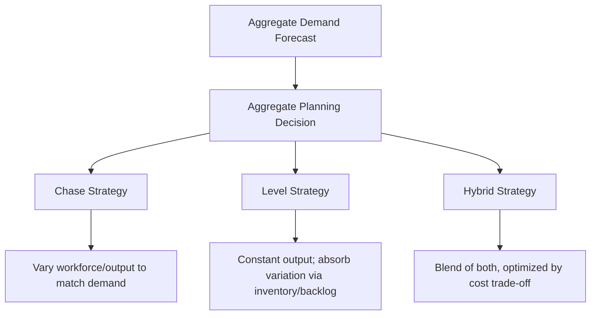
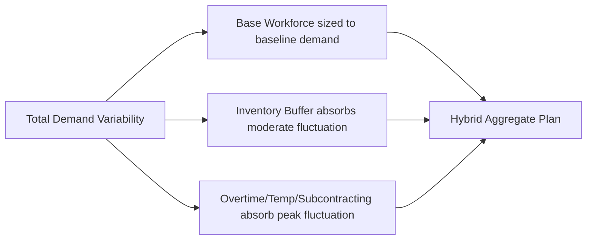
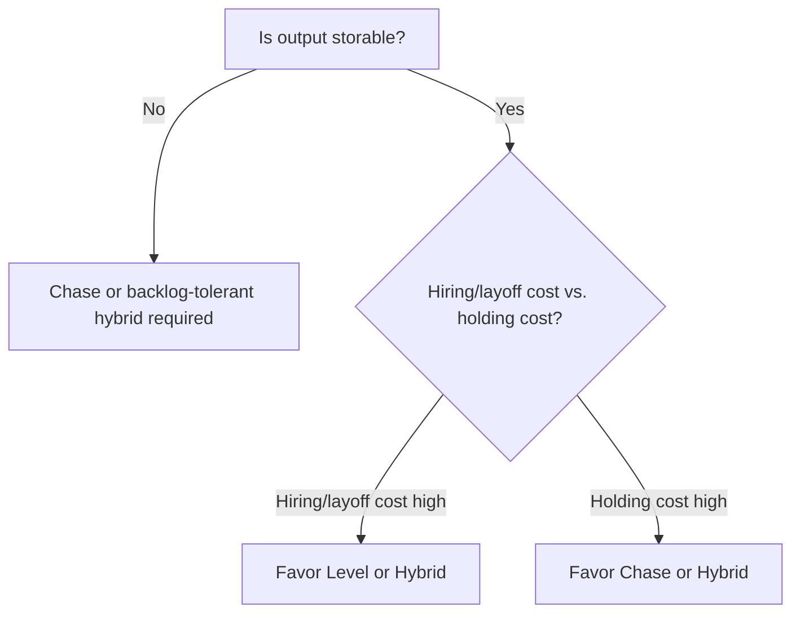

## Chase, Level, and Hybrid Capacity Plans

### Overview

Chase, level, and hybrid capacity plans are the three archetypal strategies for **aggregate planning** — the medium-term process of setting production/workforce output rates over a planning horizon (typically 3–18 months) in response to forecasted demand fluctuations. These strategies determine how much of the demand-capacity mismatch is absorbed by varying output/workforce versus by using inventory or backlog as a buffer, integrating and coordinating the individual levers already discussed (overtime, subcontracting, temporary labor, scheduling) into a coherent overall plan.

### The Aggregate Planning Problem

**Key Points**

- Aggregate planning operates at a coarser level than daily scheduling: it deals with aggregate units of output (e.g., total units, total labor-hours) rather than individual products or shifts, over a rolling medium-term horizon
- The central trade-off is how to reconcile a fluctuating demand forecast with a production/workforce system that has costs and constraints associated with changing its output rate
- Three cost categories dominate the aggregate planning decision: **cost of changing capacity** (hiring/layoff costs, overtime premiums), **cost of carrying inventory** (holding cost, obsolescence, capital tied up), and **cost of not meeting demand** (backorder cost, lost sales, stockout penalty)

### Chase Strategy

**Definition**: Production/workforce capacity is adjusted period-by-period to closely match the demand forecast for that period, keeping inventory levels minimal.

**Key Points**

- Achieved primarily through the short-term levers already covered: hiring and layoffs, overtime and undertime, subcontracting, and temporary labor, deployed dynamically as demand rises and falls
- Inventory is kept at a minimum (ideally near zero for finished goods) since output is designed to track demand directly rather than being smoothed and buffered by stock
- Most naturally suited to services and other situations where output cannot be inventoried (a defining feature of many perishable-capacity industries already discussed under yield management and reservation systems)

**Advantages**

- Minimizes inventory holding costs and the risk of inventory obsolescence
- Avoids the working capital tied up in carrying stock ahead of demand
- Directly appropriate for non-storable outputs (services, perishable goods)

**Disadvantages**

- High cost and disruption from frequent hiring/layoff cycles, including recruitment, training, severance, and morale/reputational costs
- Overtime premiums and temporary/subcontracted labor markups (previously detailed) raise marginal cost per unit relative to a stable workforce operating at standard rates
- Workforce fluctuation can erode institutional knowledge, training investment, and quality consistency
- In unionized or heavily regulated labor environments, frequent headcount changes may face contractual or legal constraints that limit the feasibility of pure chase strategies

### Level Strategy

**Definition**: Production/workforce output is held constant (or changed only gradually, at long intervals) across the planning horizon, regardless of period-by-period demand fluctuations, using inventory (or backlog) to absorb the difference between constant output and variable demand.

**Key Points**

- Inventory builds up during low-demand periods and is drawn down during high-demand periods, acting as a buffer between a steady production rate and a fluctuating demand rate
- Alternatively, for services or make-to-order environments where inventory is not feasible, a level strategy manifests as a stable backlog/queue that grows during peaks and shrinks during troughs, rather than adjusting capacity
- Workforce and equipment utilization remain stable, avoiding the disruption costs associated with a chase strategy

**Advantages**

- Stable, predictable workforce supports higher labor productivity, better quality consistency, and stronger employee morale/retention
- Avoids the recurring hiring, training, layoff, and overtime premium costs associated with a chase strategy
- Smoother, more predictable production scheduling and supplier ordering patterns

**Disadvantages**

- Requires sufficient inventory holding capacity and capital to carry stock built up during low-demand periods
- Carries inventory holding costs, including capital cost, storage cost, insurance, obsolescence, and shrinkage risk
- Not feasible for non-storable outputs (most services, perishable goods) without instead accepting a growing backlog/queue, which risks customer dissatisfaction or lost sales if wait times become excessive
- Risk of inventory obsolescence if demand patterns shift unexpectedly after inventory has already been built

### Hybrid Strategy

**Definition**: A blended approach that partially adjusts workforce/output capacity in response to demand while also using inventory/backlog as a buffer, seeking a cost-minimizing combination of the two pure strategies rather than committing fully to either extreme.

**Key Points**

- In practice, the large majority of real-world aggregate plans are hybrid strategies, since pure chase and pure level strategies each represent a cost-minimizing solution only under specific, often unrealistic, cost structure assumptions
- Typical hybrid designs set a stable "base" workforce sized to a moderate baseline demand level, then use overtime, temporary labor, and subcontracting (chase-like adjustments) for demand above the base level, while allowing modest inventory build/drawdown to smooth some of the remaining fluctuation
- The optimal hybrid mix depends on the relative magnitude of the underlying cost parameters: hiring/layoff cost, overtime premium, inventory holding cost rate, and backorder/stockout cost

### Formal Cost-Minimization Framework

**Key Points**

- Aggregate planning can be formulated as a linear or mixed-integer optimization problem minimizing total cost over the planning horizon, subject to demand-satisfaction and capacity constraints
- A simplified version of the aggregate planning cost-minimization model:

$$\min \sum_{t=1}^{T} \left[ c_h H_t + c_l L_t + c_o O_t + c_i I_t + c_b B_t \right]$$

subject to:

$$I_{t-1} + P_t - D_t = I_t - B_t \quad \forall t$$

where $H_t, L_t$ are units of workforce hired/laid off in period $t$; $O_t$ is overtime output; $I_t, B_t$ are ending inventory and backorder levels; $P_t$ is production output; $D_t$ is demand; and $c_h, c_l, c_o, c_i, c_b$ are the respective unit costs of hiring, layoff, overtime, inventory holding, and backordering

- Solving this model (via linear programming or, historically, simpler heuristic/graphical transportation-method approaches) yields the cost-minimizing blend of workforce changes, overtime use, and inventory/backlog levels across the planning horizon — effectively deriving the optimal point on the chase-to-level spectrum for the specific cost structure at hand

### Illustration: Chase vs. Level vs. Hybrid Output Patterns

(svg_diagram) Production/workforce output patterns under each strategy relative to fluctuating demand:

<svg xmlns="http://www.w3.org/2000/svg" viewBox="0 0 760 420" font-family="Helvetica, Arial, sans-serif">
<text x="380" y="24" text-anchor="middle" font-size="16" font-weight="bold" fill="#1a1a1a">Chase vs. Level vs. Hybrid Strategies (svg_diagram)</text>
<line x1="70" y1="380" x2="70" y2="60" stroke="#333" stroke-width="1.5" />
<line x1="70" y1="380" x2="720" y2="380" stroke="#333" stroke-width="1.5" />
<text x="30" y="70" font-size="10" fill="#333">Output</text>
<text x="680" y="400" font-size="10" fill="#333">Period</text>

<path d="M 90 300 Q 200 100 300 280 Q 400 90 500 300 Q 600 110 690 280" stroke="`#d64545`" stroke-width="2" fill="none" />

<text x="450" y="80" font-size="10" fill="`#d64545`">Demand</text>

<path d="M 90 300 Q 200 100 300 280 Q 400 90 500 300 Q 600 110 690 280" stroke="`#2b6cb0`" stroke-width="2" fill="none" stroke-dasharray="6,3" />

<text x="130" y="320" font-size="10" fill="`#2b6cb0`">Chase (tracks demand)</text>

<line x1="90" y1="220" x2="690" y2="220" stroke="#38a169" stroke-width="2.5" />
<text x="600" y="212" font-size="10" fill="#38a169">Level (constant output)</text>

<path d="M 90 260 Q 200 180 300 250 Q 400 160 500 250 Q 600 180 690 240" stroke="`#805ad5`" stroke-width="2.5" fill="none" />

<text x="130" y="270" font-size="10" fill="`#805ad5`">Hybrid (partial adjustment)</text>

</svg>

### Selecting Among Strategies: Key Decision Factors

**Key Points**

- **Storability of output**: non-storable outputs (services, perishables) structurally rule out a pure level strategy with inventory buffering, forcing reliance on chase-like capacity adjustment or backlog/queue tolerance instead
- **Relative cost magnitudes**: high hiring/layoff and overtime costs relative to inventory holding costs favor a level or hybrid strategy; low inventory holding capacity/high holding cost relative to labor flexibility costs favors chase
- **Demand volatility and predictability**: highly volatile but well-forecasted demand can be handled by either strategy depending on cost structure; low-confidence forecasts increase the risk of a level strategy's built inventory becoming obsolete or mismatched to actual demand
- **Labor market and regulatory constraints**: markets with strong employment protections, high severance costs, or skilled/scarce labor favor level or hybrid strategies that minimize hiring/layoff cycles
- **Capital availability for inventory carrying costs**: constrained working capital limits the feasibility of a level strategy's inventory buildup, pushing the optimal solution toward chase or hybrid

### Interaction With Other Capacity Management Levers

**Key Points**

- Chase, level, and hybrid strategies are the aggregate planning "envelope" within which the previously discussed short-term levers operate: a chase strategy is implemented largely *through* overtime, subcontracting, and temporary labor; a level strategy relies on inventory/backlog rather than these levers
- Workforce scheduling and shift flexibility operate at a finer time granularity *within* whatever aggregate plan (chase, level, or hybrid) has set the overall workforce size and output rate for the period
- Demand management through pricing, promotions, and reservation systems can shift the demand curve itself before aggregate planning is applied, effectively reducing the amplitude of the demand fluctuation that the chase/level/hybrid decision must then absorb — a well-designed capacity management system typically uses demand-side levers first to smooth the problem, then applies the appropriate aggregate planning strategy to the residual variability

**Related Topics**

- Linear programming and transportation-method solutions to aggregate planning
- Overtime, subcontracting, and temporary labor
- Workforce scheduling and shift flexibility
- Inventory holding cost and backorder cost trade-offs
- Demand management through pricing and promotions
- Master production scheduling as the next planning-level refinement
- Sales and Operations Planning (S&OP) as the cross-functional process housing aggregate planning decisions