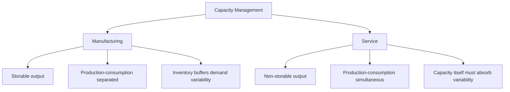
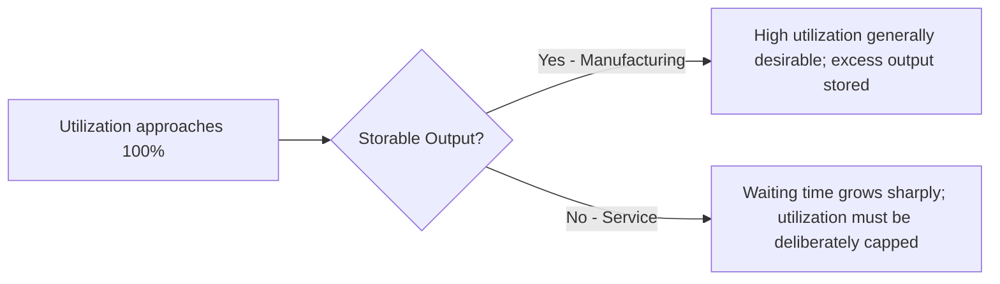
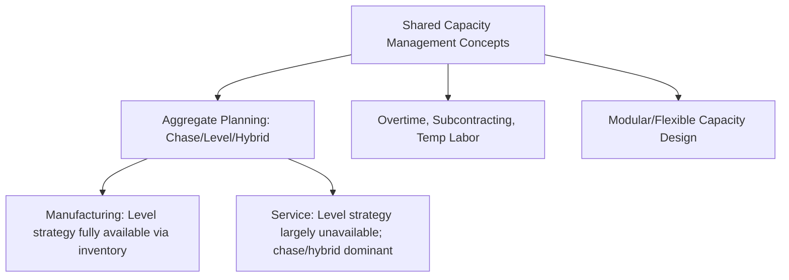

## Service Capacity versus Manufacturing Capacity Management

### Overview

Service capacity and manufacturing capacity management share the same underlying goal — matching available capacity to demand at minimum cost — but differ fundamentally in the operational constraints they face, primarily due to the inherent characteristics of services: intangibility, simultaneity of production and consumption, and customer involvement in the service process. These differences reshape which capacity management levers are available and effective in each context.

### Fundamental Structural Differences

**Key Points**

- **Storability of output**: manufactured goods can be produced ahead of demand and held in inventory; services generally cannot be inventoried, since the "product" is the act of service delivery itself, consumed at the moment of production
- **Simultaneity of production and consumption**: services are typically produced and consumed at the same time and often the same place (a haircut, a consulting session, a restaurant meal), whereas manufacturing separates production (factory) from consumption (point of sale/use) in both time and location
- **Customer presence and participation**: many services require the customer to be physically or virtually present during production, directly coupling capacity utilization to real-time customer arrival patterns in a way manufacturing rarely experiences
- **Perishability of capacity**: an unused service capacity unit in a given time period (an empty hotel room for a night, an empty seat on a departed flight, an idle service technician's hour) is permanently lost — there is no equivalent to work-in-process or finished goods inventory that can be carried forward
- **Demand variability visibility**: manufacturing demand is typically smoothed by intermediate inventory buffers (distributor stock, retailer stock) before reaching the factory; service demand often arrives directly and immediately at the point of capacity consumption, with much less smoothing

### Implications for the Inventory Buffer

**Key Points**

- Manufacturing capacity management can rely on **finished goods inventory** as a primary buffer between a relatively stable production rate and fluctuating demand — this is the mechanism underlying the level strategy in aggregate planning
- Service capacity management generally cannot use this buffer, since there is no service equivalent to finished goods inventory; the closest analogs are **queues/waiting lines** (customers wait for available capacity) or **backlogs** for services that can be delayed (non-urgent repairs, scheduled maintenance, back-office processing)
- This absence of an inventory buffer means service operations are structurally pushed toward either a chase-oriented aggregate planning strategy (adjusting capacity to match demand directly) or toward demand-side management (pricing, reservations, promotions) to reshape the arrival pattern itself, since the supply-side buffering option is largely unavailable
- Some services partially escape this constraint through **decoupling**: separating a back-office, storable component of the service (e.g., meal preparation, document processing) from the front-office, non-storable, customer-facing component — allowing partial use of inventory-like buffering for the decoupled portion

### Capacity Measurement Differences

**Key Points**

- Manufacturing capacity is typically measured in **output units per period** (units produced per hour/day), often benchmarked against a well-defined maximum theoretical or practical capacity rate for a given piece of equipment or line
- Service capacity is frequently measured in terms of **available service hours, stations, or servers**, translated into throughput via queuing relationships rather than a fixed, deterministic production rate — service capacity utilization is inherently tied to stochastic arrival and service-time processes
- **Utilization** in manufacturing often targets very high rates (close to 100% of available machine/line time) since output can be stored for later sale; in services, very high utilization targets are often counterproductive, since queuing theory shows that waiting times increase sharply (non-linearly) as utilization approaches 100% under variable arrivals and service times, directly degrading the customer experience even while "capacity" appears highly utilized

The relationship between utilization $\rho$ and expected waiting time in a simple queuing system (e.g., M/M/1) illustrates this: expected waiting time grows according to

$$W_q = \frac{\rho}{\mu(1-\rho)}$$

where $\mu$ is the service rate. As $\rho \to 1$, $W_q \to \infty$ — meaning service capacity planners must deliberately target utilization rates below 100%, often substantially below, to keep waiting times acceptable, whereas manufacturing planners generally do not face this same waiting-time penalty for pursuing near-maximum utilization of storable-output equipment.

### Illustration: Waiting Time vs. Utilization in Service Capacity

(svg_diagram) Non-linear relationship between service capacity utilization and customer waiting time:

<svg xmlns="http://www.w3.org/2000/svg" viewBox="0 0 700 380" font-family="Helvetica, Arial, sans-serif">
<text x="350" y="24" text-anchor="middle" font-size="16" font-weight="bold" fill="#1a1a1a">Waiting Time vs. Utilization (svg_diagram)</text>
<line x1="70" y1="330" x2="70" y2="60" stroke="#333" stroke-width="1.5" />
<line x1="70" y1="330" x2="650" y2="330" stroke="#333" stroke-width="1.5" />
<text x="30" y="70" font-size="10" fill="#333">Wait Time</text>
<text x="600" y="350" font-size="10" fill="#333">Utilization (ρ)</text>
<text x="640" y="335" font-size="9" fill="#666">100%</text>
<text x="70" y="345" font-size="9" fill="#666">0%</text>

<path d="M 70 320 Q 300 300 450 250 Q 550 180 590 100 Q 615 60 630 35" stroke="`#d64545`" stroke-width="2.5" fill="none" />

<line x1="500" y1="330" x2="500" y2="60" stroke="#999" stroke-dasharray="4,3" />
<text x="440" y="55" font-size="10" fill="#666">Recommended service target zone (~70-85%)</text>
<rect x="410" y="60" width="90" height="270" fill="#38a169" fill-opacity="0.1" />
</svg>

### Demand Management Lever Differences

**Key Points**

- Manufacturing can smooth demand variability through channel inventory (distributor/retailer stock absorbs some end-customer variability before it reaches the factory) in addition to demand-shaping tools
- Services rely more heavily on the demand-side levers already covered — pricing and promotions, reservation and appointment systems, and yield/revenue management — precisely because the supply-side inventory buffer is unavailable; this is why revenue management originated in, and remains most developed within, service industries (airlines, hotels)
- Manufacturing demand management more often focuses on order batching, minimum order quantities, and lead-time quoting, whereas service demand management more often directly targets *when* the customer consumes the service, via appointment slots, time-of-day pricing, and queue/reservation systems

### Workforce and Flexibility Differences

**Key Points**

- Both domains use workforce scheduling and shift flexibility, but service scheduling is typically driven by much finer-grained, higher-frequency demand fluctuation (hourly or even 15-minute intraday patterns) than manufacturing scheduling, which more often deals with daily or weekly production-run planning
- Cross-training and labor flexibility tend to carry outsized importance in services, since labor is frequently the dominant (or only) capacity constraint, whereas manufacturing capacity is often jointly constrained by both labor and capital equipment, giving manufacturers an additional capacity lever (equipment capacity) not directly analogous in pure service settings
- Front-line service employees often simultaneously perform the dual role of capacity (labor input) and quality/experience delivery (the customer interacts directly with them), meaning workforce management decisions in services carry a customer-experience dimension that is typically more indirect in manufacturing labor management

### Overlapping Concepts and Shared Frameworks

**Key Points**

- Aggregate planning concepts (chase, level, hybrid strategies) apply to both domains, but pure level strategies are far less accessible to services due to the non-storability constraint — most service aggregate plans are inherently closer to chase or heavily hybrid strategies
- Both domains use overtime, subcontracting, and temporary labor as short-term capacity levers, though subcontracting in services more often takes the form of outsourced customer contact (call center outsourcing, contracted field service technicians) rather than outsourced physical production
- Queuing theory is far more central to service capacity planning (staffing to meet service-level/wait-time targets) than to manufacturing capacity planning, which more often relies on deterministic or statistically simpler production-rate calculations, though queuing concepts do apply within manufacturing to work-in-process flow and bottleneck analysis (e.g., in job shops)
- Both domains benefit from modular/flexible capacity design, though its manifestation differs: manufacturing flexibility centers on reconfigurable equipment and cross-product tooling, while service flexibility centers on cross-trained personnel and flexible physical space (e.g., convertible seating/room configurations)

### Practical Synthesis

**Key Points**

- A useful diagnostic for any specific operation is the degree to which its output is storable and separable from the moment of customer consumption — the more manufacturing-like an operation's output storability, the more available the full range of inventory-based buffering strategies; the more service-like (simultaneous production/consumption), the more the operation must rely on real-time capacity flexing and demand-shaping tools
- Many real-world operations are hybrids of both (e.g., a restaurant has a storable back-of-house food preparation component and a non-storable front-of-house seating/service component; a hospital has storable supply/pharmacy inventory alongside non-storable bed and clinical staff capacity), and effective capacity management often requires applying manufacturing-style tools to the storable sub-components and service-style tools to the non-storable sub-components within the same overall operation
- [Inference: the appropriate blend of manufacturing-style versus service-style capacity tools for a hybrid operation depends on the specific decoupling point between its storable and non-storable components, which must be identified through operational analysis of the specific business rather than assumed from its industry classification alone.]

**Related Topics**

- Queuing theory and service-level staffing models
- Decoupling point and postponement strategy in service/manufacturing hybrids
- Chase, level, and hybrid capacity plans
- Yield and revenue management
- Reservation and appointment systems
- Overall Equipment Effectiveness (manufacturing-specific capacity metric)
- Bottleneck analysis and Theory of Constraints in manufacturing flow