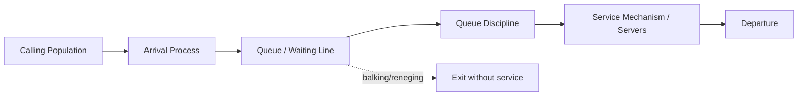
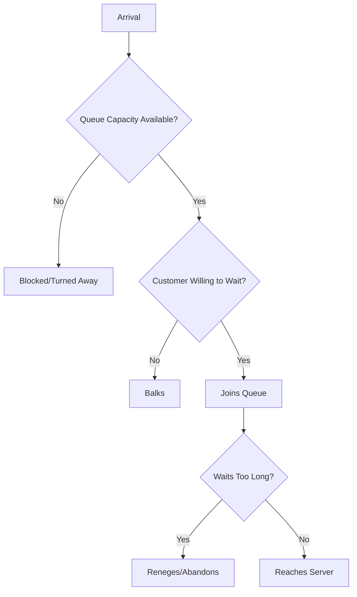
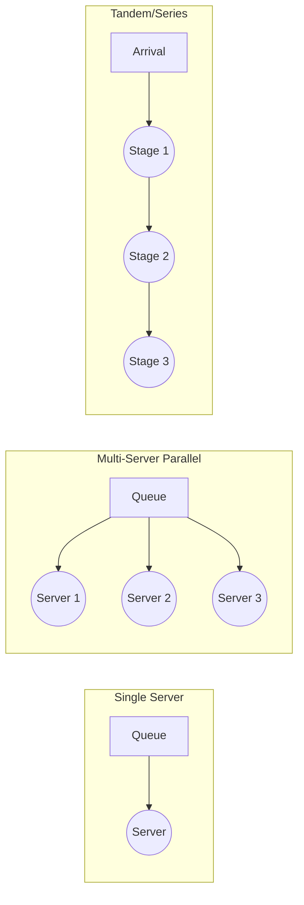
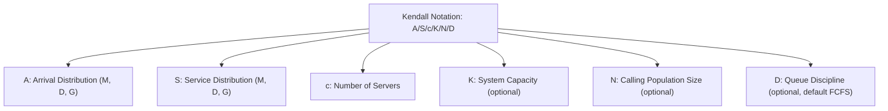

## Elements of a Queuing System

### Overview

A queuing system (or waiting-line system) is any process in which entities (customers, jobs, calls, parts) arrive requiring service from a limited number of resources (servers), and may need to wait if a server is not immediately available. Queuing theory provides the mathematical framework for analyzing the performance of such systems — waiting times, queue lengths, server utilization — as a function of the system's structural elements. Understanding these elements is the prerequisite for applying any of the analytical models (M/M/1, M/M/c, and beyond) covered in subsequent chapters.

### The Basic Queuing System Structure

**Key Points**

- Every queuing system can be decomposed into a common structural sequence: a **calling population** generates arrivals, which enter the system via an **arrival process**, wait in a **queue** (if necessary) according to a **queue discipline**, are processed by a **service mechanism**, and then depart
- These components interact to determine system performance; queuing models formalize each component mathematically to derive performance measures such as average wait time, average queue length, and probability of delay

### 1. Calling Population (Input Source)

**Key Points**

- The **calling population** is the source from which arrivals are drawn — it may be **finite** (a limited, known number of potential customers, such as machines that may break down in a factory with a fixed machine count) or **infinite** (effectively unlimited, such as customers arriving at a retail store from a large general public)
- The distinction matters analytically: finite-population models must account for the fact that as more members of the population are already in the system, the rate of new arrivals from the remaining population decreases (since fewer potential arrivals remain available), while infinite-population models treat the arrival rate as independent of how many are already in the system
- The calling population may be **homogeneous** (all arrivals have statistically identical characteristics) or **heterogeneous** (multiple distinct customer classes with different arrival rates, service requirements, or priorities)

### 2. Arrival Process

**Key Points**

- The arrival process describes the **pattern and timing** with which entities enter the system, characterized by an arrival rate (commonly denoted $\lambda$) and a probability distribution governing the time between successive arrivals (the interarrival time distribution)
- The most common assumption in analytically tractable queuing models is that arrivals follow a **Poisson process**, meaning the number of arrivals in a fixed time interval follows a Poisson distribution, and interarrival times are consequently **exponentially distributed**. This assumption is denoted by "M" (for Markovian/memoryless) in standard queuing notation
- The Poisson arrival assumption is often empirically reasonable for arrivals that occur independently and at a roughly constant average rate (e.g., calls to a call center, customers entering a store), though it does not hold well for arrivals with strong scheduling structure (e.g., appointment-based systems) or significant batch/clustered arrivals
- Arrivals can also occur individually or in **batches** (e.g., a bus arriving with multiple passengers simultaneously), which requires modification of the standard single-arrival queuing formulas
- The arrival rate itself may be **stationary** (constant over the period analyzed) or **time-varying** (e.g., higher during lunch rush), with time-varying arrivals typically requiring either time-segmented stationary analysis or more complex non-stationary queuing methods

The probability mass function for the number of arrivals $n$ in time $t$ under a Poisson process with rate $\lambda$ is:

$$P(N(t) = n) = \frac{(\lambda t)^n e^{-\lambda t}}{n!}$$

with the corresponding interarrival time $T$ following an exponential distribution:

$$f(t) = \lambda e^{-\lambda t}, \quad t \geq 0$$

### 3. Queue (Waiting Line) Characteristics

**Key Points**

- The queue itself is characterized by its **capacity** — finite (a limited physical or virtual space for waiting, e.g., a parking lot with limited spaces, a phone system with limited hold lines) or infinite (effectively unlimited waiting room assumed for analytical simplicity)
- Finite queue capacity introduces the possibility that arriving customers are turned away (blocked) when the queue is full, a distinct performance measure (blocking probability) not present in infinite-capacity models
- Customer behavior at or before the queue can include:
  - **Balking**: an arriving customer decides not to join the queue at all upon observing its length or the wait it implies
  - **Reneging**: a customer who has already joined the queue leaves before being served, due to impatience
  - **Jockeying**: in multi-queue systems, customers switch from one queue to another in an attempt to reduce their wait (common in supermarket checkout lines)
- These behaviors are important because they mean that not all "demand" for service is actually captured or served by the system — a queuing analysis that ignores balking/reneging may overstate the effective arrival rate the system must serve

### 4. Queue Discipline

**Key Points**

- Queue discipline defines the **rule by which waiting entities are selected for service** from the queue. Common disciplines include:
  - **FCFS (First-Come, First-Served)**: the most common assumption in basic queuing models; also referred to as FIFO (First-In, First-Out)
  - **LCFS (Last-Come, First-Served)**: the most recently arrived entity is served next (e.g., certain inventory retrieval systems, some computing/stack-based processing)
  - **Priority disciplines**: entities are served based on an assigned priority class rather than arrival order (e.g., emergency room triage, expedited shipping tiers), which can be **preemptive** (a higher-priority arrival interrupts service of a lower-priority entity already in progress) or **non-preemptive** (the current service is completed before a higher-priority entity is served)
  - **SIRO (Service In Random Order)**: entities are selected for service randomly, regardless of arrival time
- The choice of queue discipline affects the *distribution* of waiting times across customers even when it does not necessarily change the *average* waiting time for the system as a whole (a result that holds under certain conditions, such as when service times are independent of the discipline used)

### 5. Service Mechanism

**Key Points**

- The service mechanism is defined by the **number of servers**, their **configuration**, and the **service time distribution**
- **Number of servers**: single-server systems (one resource processes all arrivals sequentially) versus multi-server systems (multiple parallel resources, either sharing a single common queue or each with a separate dedicated queue)
- **Service time distribution**: analogous to the interarrival time distribution, service times are often modeled as exponentially distributed (denoted "M") for analytical tractability, though **deterministic** service times (denoted "D", constant service duration) and **general** service time distributions (denoted "G", any arbitrary distribution) are also used depending on how well they fit the process being modeled
- **Service rate** (commonly denoted $\mu$) is the reciprocal of the mean service time, representing the average number of entities a single server can process per unit time
- **Configuration of multiple servers**: servers may operate in **parallel** (each independently capable of completing the full service), in **series/tandem** (an entity passes sequentially through multiple distinct service stages, as in a multi-stage manufacturing or processing line), or in more complex **network** configurations combining both

### Kendall's Notation: A Compact Classification System

**Key Points**

- **Kendall's notation** provides a standard shorthand for classifying queuing systems using the form $A/S/c/K/N/D$, where:
  - $A$: arrival process distribution (e.g., M for Markovian/Poisson, D for deterministic, G for general)
  - $S$: service time distribution (same notation options as $A$)
  - $c$: number of parallel servers
  - $K$: system capacity (maximum number in system, including those in service; often omitted if infinite)
  - $N$: size of the calling population (often omitted if infinite)
  - $D$: queue discipline (often omitted if FCFS, the default assumption)
- The most commonly analyzed basic model, **M/M/1**, denotes a system with Poisson arrivals, exponential service times, a single server, infinite queue capacity, an infinite calling population, and FCFS discipline
- **M/M/c** extends this to $c$ parallel servers; **M/G/1** allows a general (non-exponential) service time distribution with a single server; **M/M/1/K** introduces a finite system capacity $K$

### Illustration: Complete Queuing System Anatomy

(svg_diagram) Full anatomy of a queuing system showing all structural elements:

<svg xmlns="http://www.w3.org/2000/svg" viewBox="0 0 780 380" font-family="Helvetica, Arial, sans-serif">
<text x="390" y="24" text-anchor="middle" font-size="16" font-weight="bold" fill="#1a1a1a">Anatomy of a Queuing System (svg_diagram)</text>
<ellipse cx="90" cy="190" rx="60" ry="45" fill="#805ad5" fill-opacity="0.3" stroke="#805ad5" />
<text x="90" y="185" text-anchor="middle" font-size="10" fill="#1a1a1a">Calling</text>
<text x="90" y="198" text-anchor="middle" font-size="10" fill="#1a1a1a">Population</text>
<path d="M 150 190 L 210 190" stroke="#333" stroke-width="1.5" marker-end="url(#arrow)" />
<text x="150" y="170" font-size="9" fill="#333">Arrival Process (λ)</text>
<rect x="215" y="150" width="130" height="80" fill="#2b6cb0" fill-opacity="0.2" stroke="#2b6cb0" />
<text x="280" y="185" text-anchor="middle" font-size="10" fill="#1a1a1a">Queue</text>
<text x="280" y="200" text-anchor="middle" font-size="9" fill="#1a1a1a">(capacity, discipline)</text>
<circle cx="240" cy="215" r="6" fill="#2b6cb0" />
<circle cx="260" cy="215" r="6" fill="#2b6cb0" />
<circle cx="280" cy="215" r="6" fill="#2b6cb0" />
<path d="M 345 190 L 400 190" stroke="#333" stroke-width="1.5" marker-end="url(#arrow)" />
<rect x="405" y="140" width="160" height="100" fill="#38a169" fill-opacity="0.2" stroke="#38a169" />
<text x="485" y="165" text-anchor="middle" font-size="10" fill="#1a1a1a">Service Mechanism</text>
<circle cx="440" cy="200" r="16" fill="#38a169" fill-opacity="0.5" stroke="#38a169" />
<text x="440" y="204" text-anchor="middle" font-size="9" fill="#fff">S1</text>
<circle cx="485" cy="200" r="16" fill="#38a169" fill-opacity="0.5" stroke="#38a169" />
<text x="485" y="204" text-anchor="middle" font-size="9" fill="#fff">S2</text>
<circle cx="530" cy="200" r="16" fill="#38a169" fill-opacity="0.5" stroke="#38a169" />
<text x="530" y="204" text-anchor="middle" font-size="9" fill="#fff">S3</text>
<path d="M 570 190 L 630 190" stroke="#333" stroke-width="1.5" marker-end="url(#arrow)" />
<text x="640" y="195" font-size="10" fill="#333">Departure</text>
<path d="M 280 240 C 280 290, 150 290, 90 245" stroke="#d64545" stroke-width="1.5" fill="none" stroke-dasharray="4,3" marker-end="url(#arrow)" />
<text x="140" y="300" font-size="9" fill="#d64545">Balking / Reneging (exits without service)</text>
</svg>

### Performance Measures Derived From These Elements

**Key Points**

- Once a queuing system's elements are specified, standard performance measures can be derived, most fundamentally:
  - $L$: average number of entities in the system (queue plus in service)
  - $L_q$: average number of entities in the queue only
  - $W$: average time an entity spends in the system
  - $W_q$: average time an entity spends waiting in the queue
  - $\rho$: server utilization (fraction of time servers are busy)
- These are linked by **Little's Law**, a fundamental and broadly applicable relationship independent of the specific arrival/service distributions:

$$L = \lambda W$$

where $\lambda$ is the effective arrival rate (accounting for any balking/blocking). Little's Law and its component measures form the analytical foundation built upon by the specific queuing models (M/M/1, M/M/c, finite-capacity and finite-population variants) covered in subsequent material.

### Practical Considerations in Identifying System Elements

**Key Points**

- Correctly modeling a real-world system requires accurately identifying which of the standard distributional assumptions (Poisson arrivals, exponential service) reasonably fit the observed data, since applying a mismatched analytical model can produce materially inaccurate performance predictions
- Systems with strong scheduling structure (e.g., reservation-based services, discussed in prior chapter material) often violate the Poisson arrival assumption, since arrivals are not memoryless when they are pre-scheduled — such systems may require simulation-based analysis rather than closed-form queuing formulas
- Real systems frequently combine multiple structural elements simultaneously (e.g., finite queue capacity, priority discipline, multiple parallel servers, and balking behavior all at once), which can make closed-form analytical solutions intractable, motivating the use of discrete-event simulation as a complementary or alternative analysis method for complex queuing systems
- [Inference: the practical threshold at which a real system becomes too complex for closed-form analysis and requires simulation depends on the specific combination of features present, and is typically determined case-by-case rather than by a fixed rule.]

**Related Topics**

- Kendall's notation and queuing model classification
- Little's Law and its derivation/applications
- M/M/1 and M/M/c queuing models
- Poisson processes and exponential distributions in queuing theory
- Finite-capacity and finite-population queuing models
- Discrete-event simulation for complex queuing systems
- Priority queuing and preemptive vs. non-preemptive service disciplines