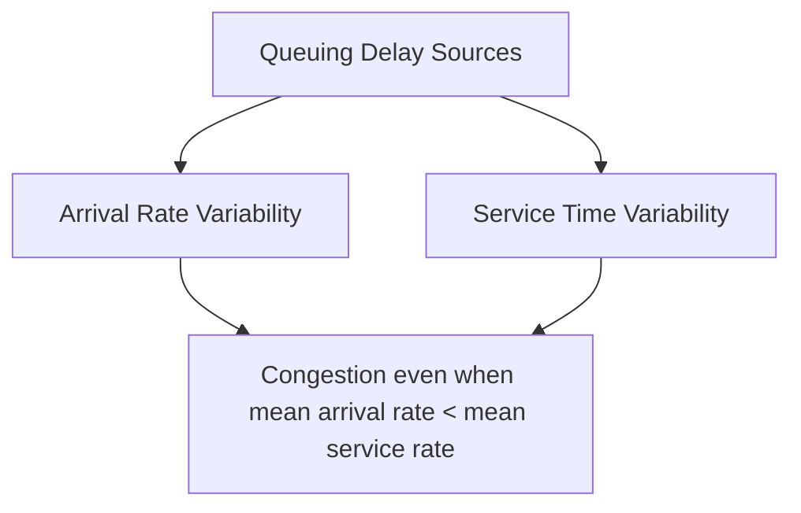
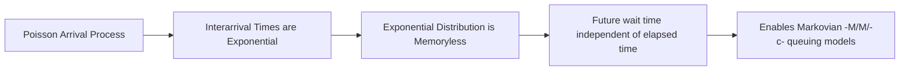
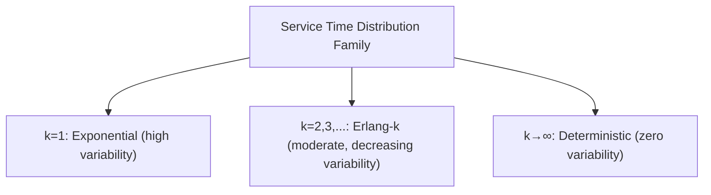
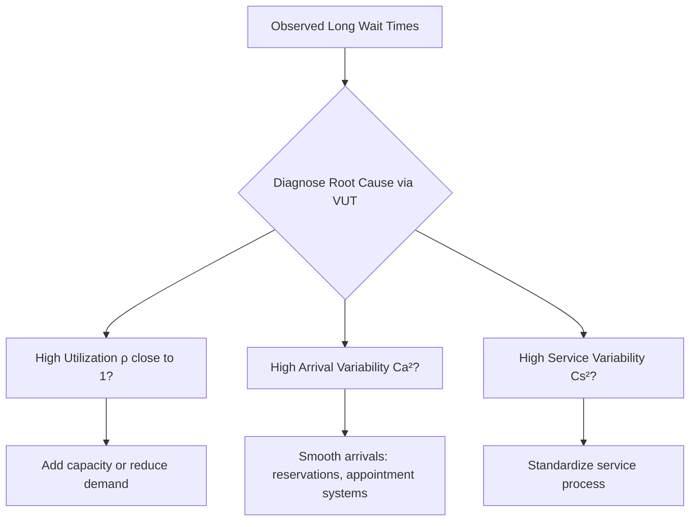

## Arrival Processes and Service-Time Distributions

### Overview

Arrival processes and service-time distributions are the two probabilistic building blocks that determine the behavior of a queuing system. While the previous chapter material introduced these as structural elements of a queuing system, this material develops their mathematical properties in depth — the distributions used to model them, the assumptions underlying those distributions, and the conditions under which each is appropriate.

### The Role of Randomness in Queuing Systems

**Key Points**

- Queuing delays arise not from arrival rate exceeding service rate on average (a system can have average arrival rate below average service rate and still experience substantial queuing), but from the **variability** in both arrival timing and service duration
- If both arrivals and service times were perfectly deterministic (constant, predictable), a system with average service rate exceeding average arrival rate would experience no persistent queuing at all
- This is why queuing theory centers on characterizing full probability distributions, not just average rates — the variance and shape of these distributions directly determine congestion, independent of the mean utilization level

### The Poisson Process for Arrivals

**Key Points**

- The **Poisson process** is the most widely used model for arrivals in queuing theory, chosen both for its frequent empirical fit to independently occurring arrival events and for its mathematical tractability
- A Poisson process is defined by three properties:
  - **Independence**: the number of arrivals in one time interval is independent of the number of arrivals in any other non-overlapping interval
  - **Stationarity**: the probability of a given number of arrivals in an interval depends only on the length of the interval, not on when the interval starts
  - **Orderliness**: the probability of two or more arrivals occurring simultaneously (in an infinitesimally small time interval) is negligible
- Under these assumptions, the number of arrivals $N(t)$ in a time period of length $t$ follows a **Poisson distribution** with parameter $\lambda t$:

$$P(N(t) = n) = \frac{(\lambda t)^n e^{-\lambda t}}{n!}, \quad n = 0, 1, 2, \dots$$

where $\lambda$ is the arrival rate (average arrivals per unit time)

- A defining property of the Poisson distribution is that its mean equals its variance: $E[N(t)] = \text{Var}[N(t)] = \lambda t$

### The Exponential Distribution and Memorylessness

**Key Points**

- A direct consequence of Poisson arrivals is that the time between successive arrivals (the **interarrival time**) follows an **exponential distribution**:

$$f(t) = \lambda e^{-\lambda t}, \quad t \geq 0, \qquad E[T] = \frac{1}{\lambda}, \qquad \text{Var}(T) = \frac{1}{\lambda^2}$$

- The exponential distribution has the unique **memoryless property**: the probability of waiting an additional time $s$ for the next arrival, given that no arrival has occurred in the past $t$ units of time, is the same as the probability of waiting $s$ from any arbitrary starting point:

$$P(T > t + s \mid T > t) = P(T > s)$$

- This memorylessness is what makes Markovian ("M") queuing models analytically tractable — the system's future behavior depends only on its current state, not on how long it has already been in that state, eliminating the need to track elapsed time since the last event
- The memoryless property is also what makes the exponential distribution potentially a poor fit for certain real processes: it implies that the probability of an arrival in the "next instant" does not depend on how long it has been since the last arrival, which is a reasonable approximation for many independent-event processes (calls to a helpline) but a poor approximation for processes with inherent scheduling or "aging" structure (a bus arriving on a fixed timetable, an appointment-based clinic)

### Testing and Validating the Poisson/Exponential Assumption

**Key Points**

- Before applying Poisson/exponential-based models to a real system, analysts typically examine whether observed interarrival time data is consistent with the exponential distribution, using techniques such as:
  - **Coefficient of variation (CV)** of interarrival times: for an exponential distribution, $CV = \sigma/\mu = 1$ exactly; observed data with $CV$ significantly different from 1 suggests the exponential assumption is a poor fit
  - **Goodness-of-fit tests**: statistical tests (e.g., chi-square goodness-of-fit, Kolmogorov-Smirnov) comparing the empirical distribution of observed interarrival times against the theoretical exponential distribution
  - **Visual inspection**: histograms of interarrival times compared against the characteristic exponential decay shape
- When the Poisson/exponential assumption does not hold, analysts typically move to **general arrival process models** (denoted "G" in Kendall's notation) or to distributions such as the **Erlang** or **hyperexponential** distribution, which can better capture arrival patterns that are more regular (less variable, CV < 1) or more clustered/bursty (more variable, CV > 1) than pure Poisson

### Service Time Distributions

**Key Points**

- Service times describe the duration required to complete service for a single entity once it reaches a server. As with arrivals, the **exponential distribution** is the most commonly used analytical assumption (denoted "M" for the service component in Kendall's notation) due to its memoryless property and mathematical tractability
- However, service times often deviate from the exponential assumption more frequently than arrival times do in practice, since service processes frequently have a **minimum required duration** (a exponential distribution has its highest probability density at time zero, implying the most likely service time is instantaneous — an assumption that is often unrealistic for real service processes with a physically necessary minimum duration)
- Common alternative service time distributions include:
  - **Deterministic (constant) service time** (denoted "D"): every service takes exactly the same fixed duration — a reasonable approximation for highly automated or standardized processes (e.g., an automated car wash, a vending machine)
  - **Erlang distribution** (denoted $E_k$): models a service process as the sum of $k$ sequential exponential stages, useful for representing service processes with a more realistic bell-shaped duration distribution and a non-zero, more predictable typical duration, with variability decreasing as $k$ increases
  - **General distribution** (denoted "G"): any arbitrary distribution, used when the empirical service time data does not fit a simpler standard form, typically requiring the **Pollaczek-Khinchine formula** (for M/G/1 systems) or simulation for analysis rather than a simple closed-form solution

The Erlang-$k$ distribution's probability density function is:

$$f(t) = \frac{(k\mu)^k t^{k-1} e^{-k\mu t}}{(k-1)!}, \quad t \geq 0$$

with mean $E[T] = 1/\mu$ and variance $\text{Var}(T) = \frac{1}{k\mu^2}$ — note that as $k \to \infty$, variance approaches zero, recovering the deterministic case, while $k=1$ recovers the exponential distribution exactly. This makes the Erlang family a flexible bridge between the highly variable exponential distribution and the zero-variance deterministic distribution.

### Illustration: Comparing Distribution Shapes

(svg_diagram) Probability density comparison: exponential, Erlang, and deterministic service times:

<svg xmlns="http://www.w3.org/2000/svg" viewBox="0 0 740 360" font-family="Helvetica, Arial, sans-serif">
<text x="370" y="24" text-anchor="middle" font-size="16" font-weight="bold" fill="#1a1a1a">Service Time Distribution Shapes (svg_diagram)</text>
<line x1="70" y1="300" x2="70" y2="60" stroke="#333" stroke-width="1.5" />
<line x1="70" y1="300" x2="680" y2="300" stroke="#333" stroke-width="1.5" />
<text x="30" y="70" font-size="10" fill="#333">Density</text>
<text x="650" y="320" font-size="10" fill="#333">Time</text>

<path d="M 70 70 Q 150 150 250 220 Q 350 260 450 280 Q 550 292 650 297" stroke="`#d64545`" stroke-width="2.5" fill="none" />

<text x="150" y="90" font-size="10" fill="`#d64545`">Exponential (k=1, high variance)</text>

<path d="M 70 300 Q 150 280 200 180 Q 240 100 280 90 Q 320 100 360 170 Q 420 260 500 292 Q 580 299 650 300" stroke="`#2b6cb0`" stroke-width="2.5" fill="none" />

<text x="260" y="75" font-size="10" fill="`#2b6cb0`">Erlang-3 (moderate variance)</text>

<line x1="330" y1="300" x2="330" y2="65" stroke="#38a169" stroke-width="3" />
<text x="340" y="60" font-size="10" fill="#38a169">Deterministic (zero variance)</text>
</svg>

### The Squared Coefficient of Variation and General Models

**Key Points**

- For general (non-exponential) arrival and service processes, the **squared coefficient of variation** ($C^2 = \sigma^2/\mu^2$) is the key parameter summarizing variability's impact on queuing performance, since it captures the relative dispersion of a distribution independent of its scale
- The **Pollaczek-Khinchine (P-K) formula**, used for M/G/1 queues (Poisson arrivals, general service time distribution, single server), expresses the average number waiting in queue as a function of the service time's mean and variance:

$$L_q = \frac{\lambda^2 \sigma_s^2 + \rho^2}{2(1-\rho)}$$

where $\rho = \lambda/\mu$ is utilization and $\sigma_s^2$ is the variance of the service time distribution. This formula directly demonstrates that, holding the mean service rate constant, *reducing the variance* of service times reduces queue length and waiting time — a foundational insight motivating process standardization efforts in service operations, independent of any change in average processing speed

- [Inference: the magnitude of queue-length reduction achievable through variance reduction alone, versus reducing mean service time, depends on the specific values of $\rho$ and $\sigma_s^2$ in a given system, and should be evaluated numerically for the system in question rather than assumed to generalize.]

### Combined Arrival-Service Variability: The Kingman/VUT Approximation

**Key Points**

- For systems where neither arrivals nor service times are exactly Poisson/exponential, the **Kingman formula** (also known as the VUT equation — Variability, Utilization, Time) provides a widely used approximation for expected waiting time in a G/G/1 queue:

$$W_q \approx \left(\frac{C_a^2 + C_s^2}{2}\right)\left(\frac{\rho}{1-\rho}\right)\left(\frac{1}{\mu}\right)$$

where $C_a^2$ and $C_s^2$ are the squared coefficients of variation of the interarrival and service time distributions, respectively

- This approximation makes explicit the three drivers of waiting time captured in its name: the **Variability** term (combined arrival and service variability), the **Utilization** term (which grows sharply as $\rho \to 1$), and the base processing **Time** ($1/\mu$) — providing a practical diagnostic tool for identifying whether congestion in a real system is being driven primarily by high utilization, high variability, or both

### Batch Arrivals and Batch Service

**Key Points**

- Some systems involve **batch arrivals**, where multiple entities arrive simultaneously as a group (e.g., a tour bus arriving at an attraction, a container ship's cargo arriving for processing), requiring modification of the standard single-arrival Poisson framework to a **compound Poisson process** that models both the batch arrival rate and the batch size distribution
- Similarly, some systems involve **batch service**, where a single service operation processes multiple entities simultaneously (e.g., an elevator, a bus, a batch manufacturing oven), requiring corresponding adjustments to the service mechanism model
- These variations are typically treated as extensions of the basic Poisson/exponential framework rather than fundamentally different models, but require distinct formulas that explicitly incorporate the batch size distribution

### Practical Guidance for Model Selection

**Key Points**

- When arrival and service processes both reasonably fit Poisson/exponential assumptions (CV near 1 for both), standard M/M/1 or M/M/c closed-form models provide fast, accurate performance estimates
- When one or both processes deviate meaningfully from exponential (CV significantly different from 1), analysts should move to Erlang-based models (if service is more regular than exponential), general-distribution formulas like Pollaczek-Khinchine (for M/G/1 cases), or the Kingman/VUT approximation (for general G/G/1 cases) rather than forcing an ill-fitting exponential assumption
- For highly complex systems (multiple stages, batch arrivals/service, time-varying rates, complex priority rules) where no closed-form approximation adequately captures the system's structure, **discrete-event simulation** remains the standard practical approach, since it can incorporate arbitrary empirical distributions directly rather than requiring a parametric assumption

**Related Topics**

- Little's Law and its role linking arrival/service parameters to system performance
- M/M/1, M/M/c, and M/G/1 queuing models
- Pollaczek-Khinchine formula and its derivation
- Kingman's approximation (VUT equation) for general queuing systems
- Coefficient of variation as a variability diagnostic
- Batch arrival and batch service queuing extensions
- Discrete-event simulation for complex, non-Markovian queuing systems