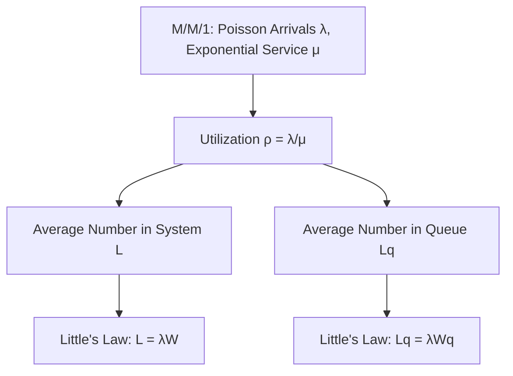
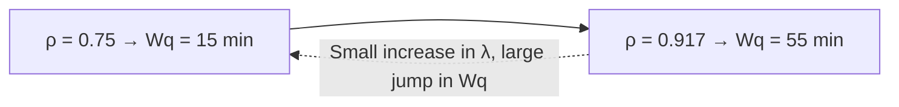
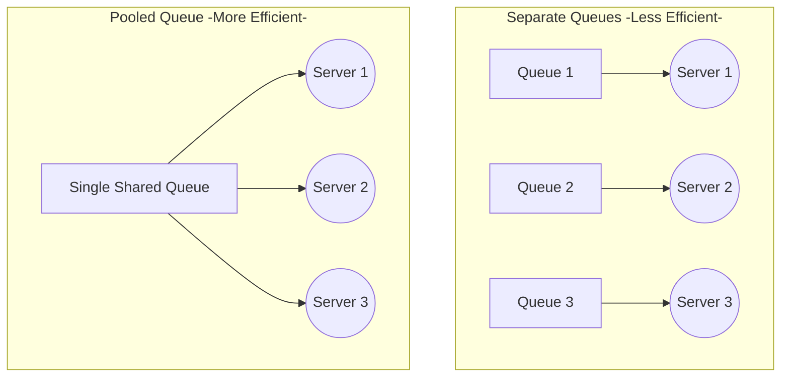
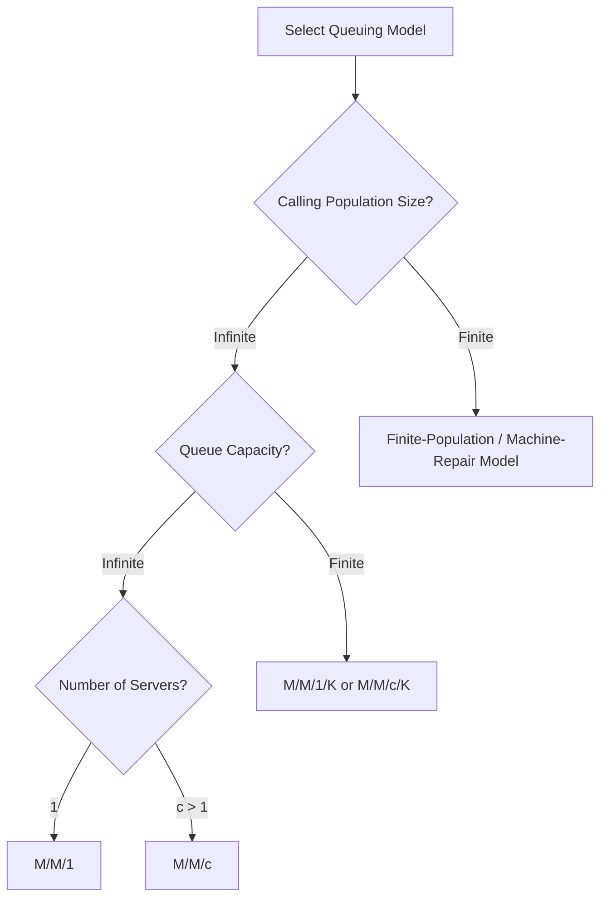

## Single-Server and Multi-Server Queuing Models

### Overview

Single-server and multi-server queuing models are the core analytical tools of queuing theory, providing closed-form formulas for system performance measures — waiting time, queue length, utilization, probability of delay — under specified arrival and service process assumptions. Building on the elements and distributions covered previously, this material develops the specific mathematical models used to analyze systems with one server (M/M/1) versus multiple parallel servers (M/M/c), along with key variants.

### The M/M/1 Model: Single Server, Poisson Arrivals, Exponential Service

**Key Points**

- The **M/M/1 model** is the foundational queuing model: a single server, Poisson arrivals at rate $\lambda$, exponentially distributed service times with rate $\mu$, infinite queue capacity, infinite calling population, and FCFS discipline
- The system is stable (queue does not grow indefinitely over time) only if the **traffic intensity** $\rho = \lambda/\mu < 1$, meaning the server must be able to process entities faster, on average, than they arrive
- Under steady-state conditions, the M/M/1 model yields the following closed-form performance measures:

$$\rho = \frac{\lambda}{\mu} \quad \text{(utilization)}$$

$$P_0 = 1 - \rho \quad \text{(probability system is empty)}$$

$$P_n = (1-\rho)\rho^n \quad \text{(probability of } n \text{ entities in system)}$$

$$L = \frac{\rho}{1-\rho} = \frac{\lambda}{\mu - \lambda} \quad \text{(average number in system)}$$

$$L_q = \frac{\rho^2}{1-\rho} = \frac{\lambda^2}{\mu(\mu-\lambda)} \quad \text{(average number in queue)}$$

$$W = \frac{L}{\lambda} = \frac{1}{\mu - \lambda} \quad \text{(average time in system)}$$

$$W_q = \frac{L_q}{\lambda} = \frac{\lambda}{\mu(\mu - \lambda)} \quad \text{(average time in queue)}$$

- These relationships are all connected via **Little's Law** ($L = \lambda W$ and $L_q = \lambda W_q$), which holds regardless of the specific arrival/service distributions and provides a consistency check across the derived measures

### The Non-Linear Relationship Between Utilization and Waiting

**Key Points**

- A critical qualitative insight from the M/M/1 formulas is that $L$, $L_q$, $W$, and $W_q$ all grow **non-linearly** — specifically, they approach infinity as $\rho \to 1$, due to the $(1-\rho)$ or $(\mu - \lambda)$ term in each denominator
- This means the marginal cost of an incremental increase in utilization grows disproportionately as utilization approaches 100%: moving utilization from 50% to 60% has a small effect on waiting time, while moving from 90% to 95% can dramatically increase waiting time
- This non-linearity is the formal basis for the practical guidance (introduced in prior service-versus-manufacturing capacity material) that service capacity planners should avoid targeting utilization rates close to 100%, since the resulting waiting-time penalty grows sharply in that region

**Example**

A single customer service representative processes requests at a rate of $\mu = 12$ per hour. If requests arrive at $\lambda = 9$ per hour ($\rho = 0.75$), the average time in queue is $W_q = \frac{9}{12(12-9)} = \frac{9}{36} = 0.25$ hours (15 minutes). If arrivals increase to $\lambda = 11$ per hour ($\rho \approx 0.917$), despite only a 22% increase in arrival rate, $W_q = \frac{11}{12(12-11)} = \frac{11}{12} \approx 0.917$ hours (55 minutes) — more than a threefold increase in waiting time. This demonstrates the sharply non-linear congestion effect near high utilization. [Inference: figures illustrative; actual system performance requires validated arrival/service rate estimates specific to the operation being modeled.]

### The M/M/c Model: Multiple Parallel Servers

**Key Points**

- The **M/M/c model** extends M/M/1 to $c$ identical parallel servers sharing a single common queue, with Poisson arrivals at rate $\lambda$ and each server processing at rate $\mu$
- Stability requires $\rho = \lambda/(c\mu) < 1$, where $\rho$ now represents the average utilization *per server* across the $c$-server system
- The steady-state probability of zero entities in the system is:

$$P_0 = \left[ \sum_{n=0}^{c-1} \frac{(\lambda/\mu)^n}{n!} + \frac{(\lambda/\mu)^c}{c!} \cdot \frac{1}{1-\rho} \right]^{-1}$$

- The average number waiting in queue is given by the **Erlang C formula** (previously introduced in the workforce scheduling material as the standard tool for service staffing):

$$L_q = \frac{P_0 (\lambda/\mu)^c \rho}{c!(1-\rho)^2}$$

with corresponding $W_q = L_q/\lambda$, $L = L_q + \lambda/\mu$, and $W = L/\lambda$ following from Little's Law as before

### Why Pooling Servers Improves Performance

**Key Points**

- A central result from comparing M/M/1 and M/M/c models is that **pooling** multiple servers into a single shared queue (M/M/c) outperforms an equivalent total capacity split across multiple independent single-server queues (multiple separate M/M/1 systems), even when total service capacity ($c\mu$) is held constant
- This occurs because a shared queue eliminates the possibility that one server sits idle while a queue forms at another — any waiting entity can be served by the next available server, rather than being "stuck" behind a queue at one specific server while another server sits empty
- This result underlies the common design choice of a single serpentine ("snake") queue feeding multiple servers (as seen in banks, airport security, and many retail settings) rather than separate lines for each server, and is directly connected to the risk-pooling logic previously discussed in modular/flexible capacity design, here applied to server/queue configuration rather than physical capacity

### Illustration: Waiting Time Comparison, Pooled vs. Separate Queues

(svg_diagram) Comparative waiting time under pooled versus separate single-server queues at equal total capacity:

<svg xmlns="http://www.w3.org/2000/svg" viewBox="0 0 740 340" font-family="Helvetica, Arial, sans-serif">
<text x="370" y="24" text-anchor="middle" font-size="16" font-weight="bold" fill="#1a1a1a">Pooled vs. Separate Queues (svg_diagram)</text>
<line x1="80" y1="290" x2="80" y2="60" stroke="#333" stroke-width="1.5" />
<line x1="80" y1="290" x2="640" y2="290" stroke="#333" stroke-width="1.5" />
<text x="30" y="70" font-size="10" fill="#333">Wq</text>
<rect x="150" y="90" width="100" height="200" fill="#d64545" fill-opacity="0.5" stroke="#d64545" />
<text x="200" y="310" text-anchor="middle" font-size="11" fill="#1a1a1a">3 Separate M/M/1</text>
<text x="200" y="80" text-anchor="middle" font-size="10" fill="#d64545">Higher Wq</text>
<rect x="400" y="200" width="100" height="90" fill="#38a169" fill-opacity="0.5" stroke="#38a169" />
<text x="450" y="310" text-anchor="middle" font-size="11" fill="#1a1a1a">Pooled M/M/3</text>
<text x="450" y="190" text-anchor="middle" font-size="10" fill="#38a169">Lower Wq</text>
</svg>

### Finite Queue Capacity: The M/M/1/K and M/M/c/K Models

**Key Points**

- The **M/M/1/K model** extends M/M/1 by imposing a maximum system capacity $K$ (including the one in service), reflecting real systems where waiting room, buffer space, or holding lines are physically limited
- A key consequence is that arrivals occurring when the system is already at capacity $K$ are **blocked** (turned away) rather than joining a queue, introducing a **blocking probability** ($P_K$, the steady-state probability the system is full) as an additional performance measure not present in infinite-capacity models
- Because blocked arrivals never enter the system, the **effective arrival rate** ($\lambda_{eff} = \lambda(1 - P_K)$) is lower than the nominal arrival rate $\lambda$, and this effective rate must be used in Little's Law calculations rather than the nominal rate
- Finite capacity models are essential for accurately analyzing systems such as call centers with limited hold lines, parking facilities, or emergency rooms with limited waiting room capacity, where the possibility of turning away demand is itself an important performance and cost consideration

### Finite Calling Population: The M/M/1//N and M/M/c//N Models

**Key Points**

- The **finite-population models** (sometimes denoted M/M/1//N or using the **machine repair model** framework) apply when the calling population itself is limited — a classic example is a fixed set of $N$ machines that may break down and require repair by one or more repair technicians
- In finite-population models, the effective arrival rate decreases as more members of the population are already in the system (already broken down and awaiting/receiving repair), since fewer machines remain available to generate new arrivals — this is a structurally different assumption from the infinite-population models, where arrival rate is independent of the number already in the system
- These models require a modified set of formulas reflecting the population-dependent arrival rate, and are particularly relevant for maintenance/repair capacity planning, where the "customers" are a firm's own limited set of equipment

### Model Selection Framework

**Key Points**

- **Number of servers**: single dedicated resource → M/M/1 family; multiple parallel resources sharing one queue → M/M/c family
- **Queue capacity**: effectively unlimited waiting space → standard infinite-capacity models; physically or practically limited waiting space → finite-capacity (/K) variants, which introduce blocking probability as a key output
- **Calling population**: large or effectively unlimited source of arrivals → infinite-population models; small, known, fixed source (e.g., a firm's own equipment fleet) → finite-population/machine-repair models
- **Distributional fit**: if arrival and service processes both reasonably approximate Poisson/exponential, the closed-form M/M/x formulas above apply directly; if either deviates substantially, the general-distribution extensions (Erlang service, Pollaczek-Khinchine for M/G/1, Kingman's approximation for G/G/1) introduced in prior material should be used instead

### Practical Applications and Cost Trade-off

**Key Points**

- M/M/c models are the standard analytical basis for the staffing-level decisions introduced in workforce scheduling material — determining the minimum number of servers $c$ required to meet a target service level (e.g., maximum acceptable $W_q$ or probability of waiting) for a given forecasted arrival rate
- The staffing decision itself typically balances the **cost of providing capacity** (each additional server/agent has a direct cost) against the **cost of customer waiting** (lost sales, dissatisfaction, opportunity cost of customer time), an optimization structure directly analogous to the newsvendor-style critical ratio trade-offs seen in capacity sizing and overbooking decisions covered previously
- Because $L_q$ and $W_q$ decline sharply but with diminishing marginal benefit as additional servers are added (each additional server reduces $\rho$ and thus reduces congestion, but at a decreasing rate once $\rho$ is already comfortably below 1), practical capacity planning typically finds a point of sharply diminishing returns beyond which additional servers add cost without materially improving service level

**Related Topics**

- Erlang C formula and its use in service staffing (linking to workforce scheduling)
- Little's Law and its role in deriving all queuing performance measures
- Pollaczek-Khinchine formula and Kingman's approximation for non-Markovian systems
- Finite-capacity (blocking) and finite-population (machine-repair) queuing variants
- Server pooling and the risk-pooling principle in queue design
- Cost trade-off optimization between capacity cost and waiting cost
- Discrete-event simulation for queuing systems beyond closed-form model assumptions