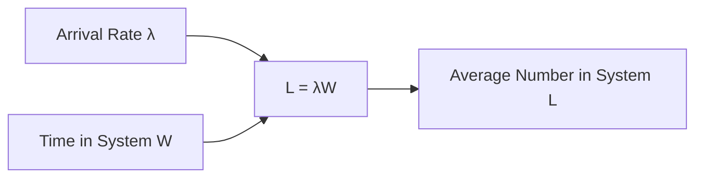
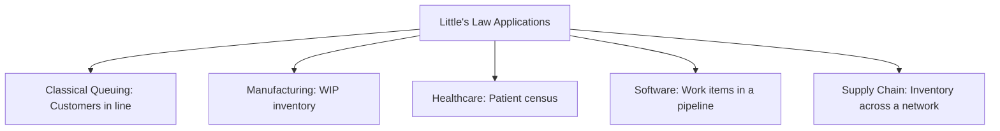
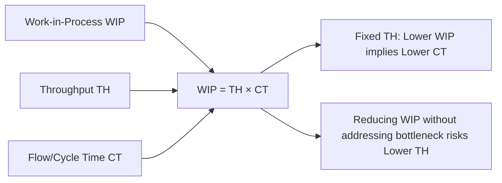
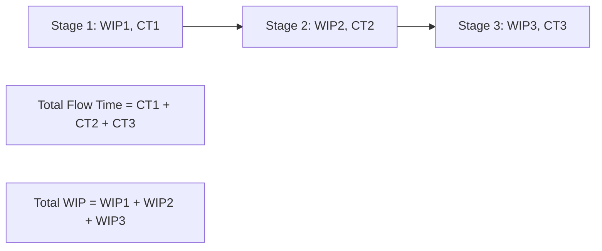

## Little's Law and Flow-Time Analysis

### Overview

Little's Law is one of the most general and widely applicable results in queuing theory and operations management, relating the average number of entities in a system, the average arrival rate, and the average time entities spend in that system. Unlike the M/M/1 or M/M/c formulas, which require specific distributional assumptions (Poisson arrivals, exponential service), Little's Law holds under extremely general conditions, making it a foundational tool for flow-time analysis across queuing systems, production processes, and service operations alike.

### Statement of Little's Law

**Key Points**

- Little's Law states that, for a stable system in steady state, the average number of entities in the system ($L$) equals the average arrival rate ($\lambda$) multiplied by the average time each entity spends in the system ($W$):

$$L = \lambda W$$

- An equivalent formulation applies specifically to the queue (excluding entities currently in service):

$$L_q = \lambda W_q$$

- The relationship holds for **any** arrival process and **any** service time distribution, under only mild conditions: the system must be stable (not accumulating entities indefinitely) and operating in **steady state** (long-run averages are well-defined and not changing systematically over time)
- This generality is what distinguishes Little's Law from the M/M/1, M/M/c, and other specific queuing models covered previously — those models require particular distributional assumptions to derive $L$, $L_q$, $W$, and $W_q$ individually, whereas Little's Law provides a distribution-free relationship connecting whichever of these quantities can be measured or estimated

### Intuition Behind the Relationship

**Key Points**

- Little's Law can be understood intuitively through a simple accounting argument: if entities arrive at rate $\lambda$ and each stays in the system for time $W$ on average, then at any given snapshot in time, the number of entities present is the product of the rate at which they are "flowing in" and how long each one "lingers"
- A useful physical analogy: if a highway has cars entering at a rate of 100 cars per hour, and each car spends 15 minutes (0.25 hours) on that stretch of highway, then on average there are $100 \times 0.25 = 25$ cars on that stretch of highway at any given moment
- This relationship holds regardless of whether cars enter at a perfectly steady rate or in bursts, and regardless of whether every car takes exactly 15 minutes or some take more and some take less — only the *averages* need to be well-defined for the law to hold

**Example**

A coffee shop serves an average of 40 customers per hour ($\lambda = 40$/hour). Based on observation, the average customer spends 6 minutes (0.1 hours) in the shop from entry to exit. By Little's Law, the average number of customers in the shop at any given time is $L = 40 \times 0.1 = 4$ customers. If the shop's management wants to reduce the average number of customers present (e.g., to comply with a maximum occupancy limit) without turning away business, Little's Law shows this can only be achieved by reducing average time in system $W$ (e.g., faster service) since reducing $\lambda$ directly reduces revenue-generating throughput. [Inference: numbers illustrative; real systems require directly measured arrival rate and time-in-system data.]

### Generality and Scope of Application

**Key Points**

- Little's Law applies not only to simple single-queue systems but to **any well-defined subsystem** with a measurable inflow rate and residence time — a single server, an entire multi-stage queuing network, a warehouse, a hospital, or an entire supply chain
- This makes it a powerful tool for **flow-time analysis** in contexts well beyond classical queuing theory, including manufacturing work-in-process (WIP) analysis, hospital patient flow, software development pipeline analysis, and project/task management systems
- The law can be applied at multiple **levels of aggregation** simultaneously and consistently — e.g., to an entire hospital, to a single department within that hospital, or to a single bed — as long as $L$, $\lambda$, and $W$ are all measured consistently for the same defined boundary
- Because of this generality, Little's Law is often used not just to *predict* system performance from known arrival rates and service processes (as in the M/M/1/M/M/c formulas), but to **infer** an unmeasured quantity from two measured ones — e.g., inferring average flow time $W$ from more easily measured throughput $\lambda$ and inventory/WIP level $L$

### Application to Manufacturing: Work-in-Process and Flow Time

**Key Points**

- In manufacturing operations management, Little's Law is commonly rewritten using the terminology of **WIP (Work-in-Process)**, **throughput (TH)**, and **flow time (or cycle time, CT)**:

$$WIP = TH \times CT$$

- This formulation directly links three of the most important operational performance metrics in production system design: the amount of inventory tied up in the production process (WIP), the rate at which the process completes units (throughput), and the average time a unit spends moving through the entire process (flow/cycle time)
- A key strategic implication: for a **fixed throughput target** (a required output rate, often set by demand), reducing flow time requires reducing WIP, and conversely, if WIP is reduced without addressing the underlying process bottleneck, throughput will fall rather than flow time improving — this relationship is central to lean manufacturing and Just-In-Time (JIT) production philosophy, which emphasizes minimizing WIP as a mechanism for reducing flow time and exposing process inefficiencies
- [Inference: the specific causal direction — whether reducing WIP first exposes bottlenecks (a common lean manufacturing argument) or whether bottleneck resolution must precede WIP reduction to avoid throughput loss — depends on the specific system's constraint structure and is a matter of practical process design judgment rather than a universal rule derivable from Little's Law alone.]

### Illustration: Little's Law as a Flow Balance

(svg_diagram) Little's Law represented as a flow-balance relationship across a system boundary:

<svg xmlns="http://www.w3.org/2000/svg" viewBox="0 0 740 340" font-family="Helvetica, Arial, sans-serif">
<text x="370" y="24" text-anchor="middle" font-size="16" font-weight="bold" fill="#1a1a1a">Little's Law as Flow Balance (svg_diagram)</text>
<rect x="220" y="90" width="300" height="160" fill="#2b6cb0" fill-opacity="0.15" stroke="#2b6cb0" stroke-width="2" stroke-dasharray="6,3" />
<text x="370" y="80" text-anchor="middle" font-size="11" fill="#1a1a1a">System Boundary</text>
<circle cx="270" cy="140" r="10" fill="#38a169" />
<circle cx="320" cy="180" r="10" fill="#38a169" />
<circle cx="380" cy="150" r="10" fill="#38a169" />
<circle cx="430" cy="190" r="10" fill="#38a169" />
<circle cx="470" cy="130" r="10" fill="#38a169" />
<text x="370" y="230" text-anchor="middle" font-size="11" fill="#1a1a1a">L entities present (on average)</text>
<path d="M 130 170 L 215 170" stroke="#333" stroke-width="2" marker-end="url(#arrow2)" />
<text x="130" y="155" font-size="10" fill="#333">Arrival rate λ</text>
<path d="M 525 170 L 610 170" stroke="#333" stroke-width="2" marker-end="url(#arrow2)" />
<text x="530" y="155" font-size="10" fill="#333">Departure rate λ</text>

<text x="370" y="290" text-anchor="middle" font-size="13" font-weight="bold" fill="`#d64545`">L = λ × W</text>

<text x="370" y="310" text-anchor="middle" font-size="10" fill="#333">where W = average time an entity spends inside the boundary</text>

</svg>

### Decomposing Flow Time Across Multiple Stages

**Key Points**

- In multi-stage systems (a process with several sequential steps, each potentially with its own queue and service time), total flow time is the sum of the flow times at each individual stage, and Little's Law can be applied both to the system as a whole and to each individual stage
- This decomposition allows analysts to identify which specific stage of a multi-step process contributes most to total flow time or WIP, directing process improvement efforts toward the highest-impact stage rather than treating the system as an undifferentiated whole
- Little's Law applied stage-by-stage is also the basis for identifying the **bottleneck** in a process: the stage with the highest utilization (closest to its capacity limit) typically has the highest WIP and contributes disproportionately to total flow time, connecting flow-time analysis directly to bottleneck/constraint identification in process design

### Practical Uses in Capacity and Operations Analysis

**Key Points**

- **Diagnosing capacity problems**: if throughput ($\lambda$) is measured and flow time ($W$) is observed to be increasing over time while $\lambda$ remains constant or grows, Little's Law implies WIP/queue length ($L$) must also be increasing — a leading indicator of a developing capacity shortfall even before service-level failures become directly visible
- **Setting capacity targets**: given a target maximum flow time (e.g., a service level commitment) and an expected throughput requirement, Little's Law can be rearranged to solve for the maximum allowable WIP/queue length the system can carry while still meeting the flow-time target
- **Auditing measurement consistency**: because $L$, $\lambda$, and $W$ are linked by a fixed identity, Little's Law can be used as a consistency check on operational data — if directly measured values of $L$, $\lambda$, and $W$ do not approximately satisfy $L = \lambda W$, this often signals a measurement error, an inconsistent system boundary definition, or a system that is not actually in steady state
- **Cross-industry applicability**: because the law requires no assumption about the specific arrival or service distribution, it is used identically in queuing systems, manufacturing flow analysis, healthcare patient-flow studies, software/IT ticket-queue analysis, and project management (e.g., relating the number of open tasks, task arrival rate, and average task completion time)

### Limitations and Required Conditions

**Key Points**

- Little's Law requires the system to be in **steady state** — a system undergoing significant transient change (a rapidly growing startup process, a system just starting up or shutting down, a highly seasonal business measured over too short a window) may not satisfy the long-run average conditions the law assumes, producing potentially misleading results if applied naively over a non-representative time window
- The law describes **averages**, not the full distribution of number-in-system or time-in-system — two systems with the same $L$, $\lambda$, and $W$ can have very different variability/predictability characteristics, meaning Little's Law alone does not fully characterize system performance (variance-related insight instead comes from the distributional queuing models, e.g., Erlang C, Pollaczek-Khinchine, or Kingman's approximation covered previously)
- Consistent system boundary definition is essential: $L$, $\lambda$, and $W$ must all refer to the *same* defined system or subsystem; mixing measurements from inconsistent boundaries (e.g., counting arrivals to the whole system while measuring time-in-system for only part of it) will violate the identity

**Related Topics**

- M/M/1 and M/M/c queuing models and their reliance on Little's Law for derived measures
- Work-in-Process (WIP), throughput, and cycle time in manufacturing flow analysis
- Bottleneck identification and Theory of Constraints
- Lean manufacturing and Just-In-Time (JIT) production principles
- Kingman's approximation and Pollaczek-Khinchine formula for variability-aware flow analysis
- Process flow diagrams and multi-stage system decomposition
- Healthcare patient-flow and software/IT ticket-queue applications of Little's Law