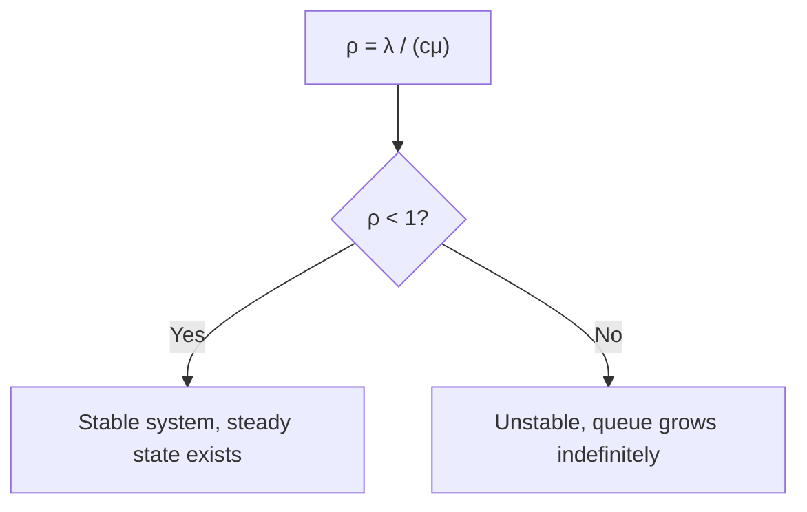
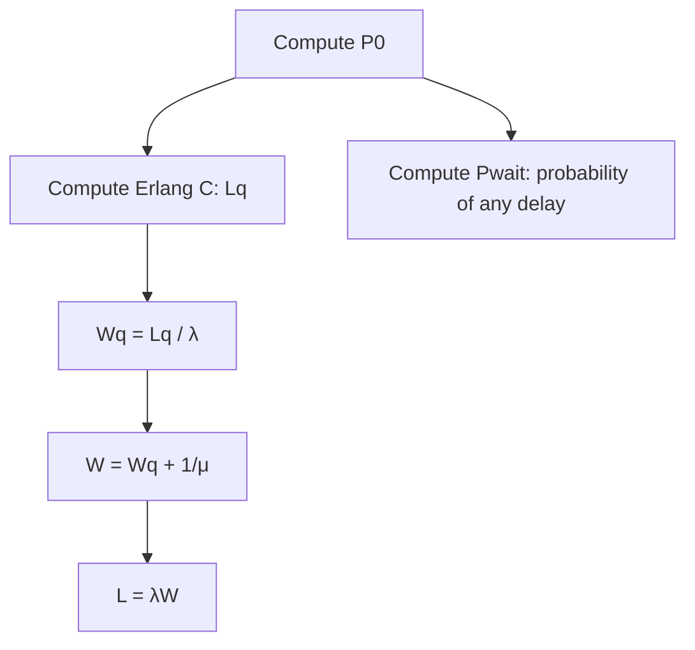
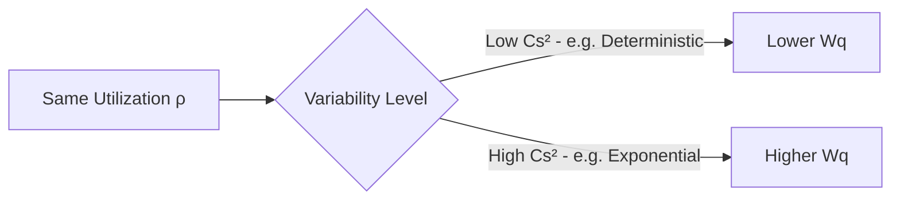

## Utilization, Waiting Time, and Queue Length Formulas

### Overview

This material consolidates the core performance formulas for utilization, waiting time, and queue length across the standard queuing models introduced previously, organizing them into a unified reference and highlighting the relationships, derivations, and practical interpretation that connect them. Where earlier chapters introduced these formulas within specific model contexts (M/M/1, M/M/c, general distributions), this material treats them as a systematic toolkit for capacity analysis.

### Utilization: The Foundational Ratio

**Key Points**

- **Utilization** ($\rho$), also called traffic intensity, is the ratio of the rate at which work arrives to the rate at which the system can process that work:

$$\rho = \frac{\lambda}{c\mu}$$

where $\lambda$ is the arrival rate, $\mu$ is the service rate per server, and $c$ is the number of parallel servers ($c=1$ for single-server systems)

- Utilization represents the **long-run fraction of time servers are busy**, and is the single most important diagnostic parameter in queuing analysis, since nearly every other performance measure (queue length, waiting time, probability of delay) is expressed as a function of $\rho$
- **Stability condition**: a queuing system only reaches a well-defined steady state if $\rho < 1$; if $\rho \geq 1$, the arrival rate meets or exceeds total service capacity, and queue length grows without bound over time (an unstable system)
- Utilization alone does not determine system performance — as established in the arrival/service distribution material, the *variability* of arrivals and service times (captured by $C_a^2$ and $C_s^2$) also strongly affects waiting time and queue length at a given utilization level

### Consolidated Formula Reference: M/M/1

**Key Points**

- For the single-server Poisson-arrival, exponential-service system, all key measures derive from $\rho = \lambda/\mu$:

| Measure | Formula | Interpretation |
| --- | --- | --- |
| Utilization | $\rho = \lambda/\mu$ | Fraction of time server is busy |
| $P_0$ | $1 - \rho$ | Probability system is empty |
| $P_n$ | $(1-\rho)\rho^n$ | Probability of exactly $n$ in system |
| $L$ | $\dfrac{\rho}{1-\rho}$ | Average number in system |
| $L_q$ | $\dfrac{\rho^2}{1-\rho}$ | Average number in queue |
| $W$ | $\dfrac{1}{\mu-\lambda}$ | Average time in system |
| $W_q$ | $\dfrac{\lambda}{\mu(\mu-\lambda)}$ | Average time in queue |

- These are all interrelated via Little's Law ($L = \lambda W$, $L_q = \lambda W_q$) and the identity $W = W_q + 1/\mu$ (total time in system equals time waiting plus time being served)

### Consolidated Formula Reference: M/M/c

**Key Points**

- For the multi-server case, the formulas require first computing $P_0$, then applying the Erlang C formula for $L_q$:

$$P_0 = \left[\sum_{n=0}^{c-1}\frac{(\lambda/\mu)^n}{n!} + \frac{(\lambda/\mu)^c}{c!}\cdot\frac{1}{1-\rho}\right]^{-1}, \qquad \rho = \frac{\lambda}{c\mu}$$

$$L_q = \frac{P_0(\lambda/\mu)^c \rho}{c!\,(1-\rho)^2} \quad \text{(Erlang C)}$$

$$W_q = \frac{L_q}{\lambda}, \qquad W = W_q + \frac{1}{\mu}, \qquad L = \lambda W = L_q + \frac{\lambda}{\mu}$$

- An additional and often-cited measure specific to multi-server systems is the **probability an arriving entity must wait at all** ($P_{wait}$, sometimes called $C(c,\lambda/\mu)$, the Erlang C probability):

$$P_{wait} = \frac{(\lambda/\mu)^c}{c!(1-\rho)} \cdot P_0$$

- This measure is frequently used directly as a **service-level target** in staffing decisions (e.g., "no more than 20% of callers should have to wait at all"), distinct from targeting a specific average waiting time

### Formula Reference: General and Finite-Variant Models

**Key Points**

- **M/G/1 (Pollaczek-Khinchine)**: for general service time distributions with a single server,

$$L_q = \frac{\lambda^2\sigma_s^2 + \rho^2}{2(1-\rho)}, \qquad W_q = \frac{L_q}{\lambda}$$

where $\sigma_s^2$ is the variance of the service time distribution — this formula reduces to the M/M/1 $L_q$ formula when $\sigma_s^2 = 1/\mu^2$ (the exponential case)

- **G/G/1 (Kingman's approximation)**: for general arrival and service distributions,

$$W_q \approx \left(\frac{C_a^2+C_s^2}{2}\right)\left(\frac{\rho}{1-\rho}\right)\left(\frac{1}{\mu}\right)$$

- **M/M/1/K (finite capacity)**: introduces blocking probability $P_K$ and requires using the **effective arrival rate** $\lambda_{eff} = \lambda(1-P_K)$ in place of $\lambda$ within the standard Little's Law relationships, since blocked arrivals never actually enter the system

### Illustration: Formula Selection Decision Tree

(svg_diagram) Decision path for selecting the correct utilization/waiting/queue-length formula set:

<svg xmlns="http://www.w3.org/2000/svg" viewBox="0 0 760 420" font-family="Helvetica, Arial, sans-serif">
<text x="380" y="24" text-anchor="middle" font-size="16" font-weight="bold" fill="#1a1a1a">Formula Selection Path (svg_diagram)</text>
<rect x="300" y="50" width="160" height="40" rx="6" fill="#2b6cb0" fill-opacity="0.3" stroke="#2b6cb0" />
<text x="380" y="75" text-anchor="middle" font-size="10" fill="#1a1a1a">Poisson arrivals &amp;</text>
<text x="380" y="87" text-anchor="middle" font-size="10" fill="#1a1a1a">exponential service?</text>
<line x1="330" y1="90" x2="180" y2="140" stroke="#333" />
<text x="220" y="115" font-size="9" fill="#333">Yes, c=1</text>
<rect x="100" y="140" width="160" height="40" rx="6" fill="#38a169" fill-opacity="0.3" stroke="#38a169" />
<text x="180" y="165" text-anchor="middle" font-size="10" fill="#1a1a1a">Use M/M/1 formulas</text>
<line x1="430" y1="90" x2="580" y2="140" stroke="#333" />
<text x="520" y="115" font-size="9" fill="#333">Yes, c&gt;1</text>
<rect x="500" y="140" width="160" height="40" rx="6" fill="#38a169" fill-opacity="0.3" stroke="#38a169" />
<text x="580" y="165" text-anchor="middle" font-size="10" fill="#1a1a1a">Use M/M/c / Erlang C</text>
<line x1="380" y1="90" x2="380" y2="210" stroke="#333" />
<text x="390" y="200" font-size="9" fill="#333">No</text>
<rect x="290" y="210" width="180" height="40" rx="6" fill="#dd6b20" fill-opacity="0.3" stroke="#dd6b20" />
<text x="380" y="235" text-anchor="middle" font-size="10" fill="#1a1a1a">Service general, arrivals Poisson?</text>
<line x1="330" y1="250" x2="200" y2="300" stroke="#333" />
<text x="240" y="280" font-size="9" fill="#333">Yes</text>
<rect x="110" y="300" width="180" height="40" rx="6" fill="#805ad5" fill-opacity="0.3" stroke="#805ad5" />
<text x="200" y="325" text-anchor="middle" font-size="10" fill="#1a1a1a">Use M/G/1 (P-K formula)</text>
<line x1="430" y1="250" x2="560" y2="300" stroke="#333" />
<text x="520" y="280" font-size="9" fill="#333">No (both general)</text>
<rect x="470" y="300" width="200" height="40" rx="6" fill="#805ad5" fill-opacity="0.3" stroke="#805ad5" />
<text x="570" y="325" text-anchor="middle" font-size="10" fill="#1a1a1a">Use Kingman's G/G/1 approx.</text>
</svg>

### Sensitivity of Performance Measures to Utilization

**Key Points**

- All the formulas above share the qualitative property that performance measures degrade sharply and non-linearly as $\rho$ approaches 1, due to the $(1-\rho)$ term appearing in the denominator of $L_q$, $W_q$ across every model variant
- The **rate** of this degradation differs across models based on the variability terms present: an M/M/1 system degrades faster near $\rho=1$ than an M/D/1 system (deterministic service, zero service-time variance) at the same utilization, since the numerator terms involving variance ($\sigma_s^2$ or $C_s^2$) directly scale the severity of the congestion effect
- This means two systems with identical utilization can have substantially different waiting times purely due to differences in variability — a key reason why simply reporting "utilization" as a capacity metric, without reference to variability, provides an incomplete picture of actual system congestion

### Practical Use in Capacity Sizing

**Key Points**

- Given a target service level (e.g., maximum acceptable $W_q$, or minimum acceptable $P(\text{wait} \leq t)$), these formulas can be used in reverse — solving for the minimum number of servers $c$ (or the maximum sustainable $\rho$) required to meet the target, which is the standard analytical basis for capacity/staffing sizing decisions
- Because closed-form solutions for $c$ often require iterative or tabulated approaches (particularly for the Erlang C formula, which is not easily inverted algebraically), practical implementations frequently use **Erlang C staffing tables** or software tools that compute the required $c$ for a given $\lambda$, $\mu$, and target service level directly, rather than manual algebraic inversion
- The relationship between added servers and marginal service-level improvement typically exhibits diminishing returns once $\rho$ is already comfortably below 1, meaning capacity planners must weigh the marginal cost of each additional server against the marginal improvement in waiting time or delay probability it provides, echoing the general capacity-cost trade-off framework introduced in earlier short-term capacity management material

### Common Pitfalls in Applying These Formulas

**Key Points**

- Applying M/M/1 or M/M/c formulas to systems with substantially non-exponential service times (e.g., highly standardized, low-variance service processes) without adjustment can significantly **overestimate** actual waiting times, since these formulas assume the relatively high variability of the exponential distribution
- Failing to use the **effective arrival rate** (accounting for balking, reneging, or blocking) rather than the nominal arrival rate in finite-capacity or behaviorally realistic systems produces internally inconsistent results that violate Little's Law
- Treating time-varying (non-stationary) arrival rates as if they were constant over an entire analysis period can substantially misstate peak-period congestion, since the formulas assume a single, stable $\lambda$; time-varying systems typically require either time-segmented steady-state analysis (analyzing each sub-period separately) or simulation
- Ignoring the number-of-servers effect on pooling benefits (as discussed in the single/multi-server model material) can lead analysts to understate the performance improvement available from consolidating separate queues into a single shared queue at equivalent total capacity

**Related Topics**

- Erlang C formula, staffing tables, and service-level target setting
- Little's Law as the unifying relationship across all queuing formulas
- Pollaczek-Khinchine formula and Kingman's approximation for non-Markovian systems
- Server pooling and shared-queue design
- Finite-capacity (blocking) and finite-population (machine-repair) model adjustments
- Cost trade-off optimization between server capacity cost and waiting cost
- Discrete-event simulation for time-varying or highly complex queuing systems