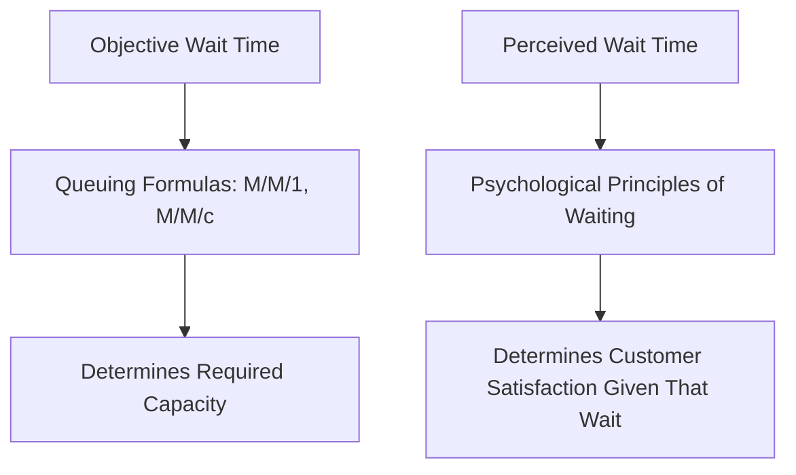
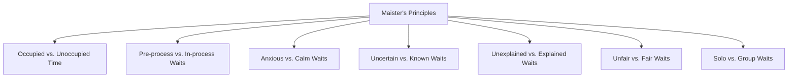
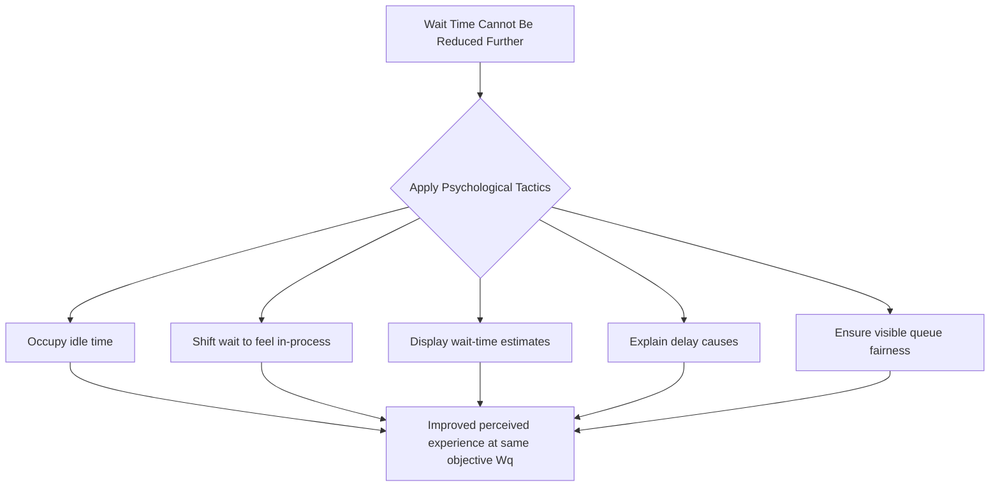

## Psychology of Waiting and Perceived Capacity

### Overview

The psychology of waiting addresses a critical gap in purely mathematical queuing analysis: the actual, objectively measured waiting time (as computed by the M/M/1, M/M/c, and related formulas covered previously) is not the same as the *perceived* waiting time experienced by customers, nor does it fully determine customer satisfaction or willingness to continue waiting. This material examines the behavioral and psychological factors that shape how waiting is experienced, and how capacity managers can influence perceived wait quality independent of, or in combination with, objective queuing performance improvements.

### Why Perceived Time Diverges from Actual Time

**Key Points**

- Foundational research on service waiting (most notably the framework developed by David Maister) established that customer satisfaction with a wait depends not only on its objective duration but on a set of psychological principles governing how that duration is subjectively experienced
- This distinction matters directly for capacity management: since perceived wait time drives satisfaction, retention, and complaint behavior, capacity investments aimed purely at reducing objective $W_q$ (as computed by queuing formulas) may be less cost-effective than psychologically-informed interventions that reduce *perceived* wait without necessarily reducing actual wait time
- This does not diminish the value of the objective queuing models covered previously — it adds a complementary lens: objective queuing analysis determines *how much* capacity is needed to hit a wait-time target, while wait psychology determines *how that same objective wait time is experienced and evaluated* by the customer

### Maister's Principles of Waiting

**Key Points**

- **Unoccupied time feels longer than occupied time**: customers who have nothing to do while waiting perceive the wait as longer than customers engaged in some activity (reading material, browsing, watching a screen) during an objectively identical wait duration
- **Pre-process waits feel longer than in-process waits**: time spent waiting before service has visibly begun (e.g., waiting for a host to seat you) feels longer than an equivalent amount of time spent waiting once the service process has visibly started (e.g., waiting for food after being seated and having ordered)
- **Anxiety makes waits feel longer**: uncertainty about whether one is in the correct queue, whether one has been forgotten, or concern about missing a subsequent appointment amplifies the perceived duration of a wait
- **Uncertain waits feel longer than known, finite waits**: not knowing how long a wait will last is more frustrating than knowing the wait will last a specific, even lengthy, duration — this is the basis for the common practice of displaying estimated wait times
- **Unexplained waits feel longer than explained waits**: providing a reason for a delay (e.g., "we are experiencing higher than normal call volume") reduces perceived wait duration and frustration relative to an unexplained delay of the same length
- **Unfair waits feel longer than fair waits**: customers who observe others being served out of turn (violating an expected FCFS norm) experience heightened frustration, independent of their own objective wait duration
- **The more valuable the service, the longer people will wait**: willingness to tolerate a wait scales with the perceived value of the service being waited for, meaning acceptable wait thresholds are not uniform across service types or customer segments
- **Solo waits feel longer than group waits**: waiting alone is generally perceived as more tedious than waiting with companions, since social interaction provides a distraction during the unoccupied time

### Illustration: Perceived vs. Actual Wait Time

(svg_diagram) Gap between objective and perceived wait duration under different conditions:

<svg xmlns="http://www.w3.org/2000/svg" viewBox="0 0 740 360" font-family="Helvetica, Arial, sans-serif">
<text x="370" y="24" text-anchor="middle" font-size="16" font-weight="bold" fill="#1a1a1a">Perceived vs. Actual Wait Time (svg_diagram)</text>
<line x1="90" y1="300" x2="90" y2="60" stroke="#333" stroke-width="1.5" />
<line x1="90" y1="300" x2="680" y2="300" stroke="#333" stroke-width="1.5" />
<text x="40" y="70" font-size="10" fill="#333">Duration</text>

<rect x="130" y="120" width="60" height="180" fill="#2b6cb0" fill-opacity="0.5" stroke="#2b6cb0" />
<text x="160" y="315" text-anchor="middle" font-size="9" fill="#1a1a1a">Actual</text>
<rect x="200" y="80" width="60" height="220" fill="#d64545" fill-opacity="0.5" stroke="#d64545" />
<text x="230" y="315" text-anchor="middle" font-size="9" fill="#1a1a1a">Perceived</text>
<text x="195" y="330" text-anchor="middle" font-size="10" fill="#1a1a1a">Unoccupied, Uncertain Wait</text>

<rect x="400" y="120" width="60" height="180" fill="#2b6cb0" fill-opacity="0.5" stroke="#2b6cb0" />
<text x="430" y="315" text-anchor="middle" font-size="9" fill="#1a1a1a">Actual</text>
<rect x="470" y="160" width="60" height="140" fill="#38a169" fill-opacity="0.5" stroke="#38a169" />
<text x="500" y="315" text-anchor="middle" font-size="9" fill="#1a1a1a">Perceived</text>
<text x="465" y="330" text-anchor="middle" font-size="10" fill="#1a1a1a">Occupied, Explained Wait</text>

<text x="370" y="345" text-anchor="middle" font-size="10" fill="#333" font-style="italic">Same actual duration, different perceived duration</text>

</svg>

### Operational Tactics Derived From Wait Psychology

**Key Points**

- **Occupying idle wait time**: providing entertainment (television, music, reading material), engagement (menus to review, forms to fill out, interactive displays), or productive activity (mobile ordering, self-service kiosks usable while waiting) during the wait
- **Converting pre-process wait into in-process wait**: visibly beginning some part of the service process as early as possible (e.g., taking a drink order while a table waits to be seated, beginning intake paperwork while a patient waits for a provider) to shift the wait's psychological category from pre-process to in-process
- **Providing wait-time estimates**: displaying expected wait time (digital displays, mobile notifications, verbal estimates from staff) directly addresses the uncertainty principle, and is one of the most widely implemented psychological wait-management tactics across industries
- **Explaining delays**: proactive communication about the cause of an unusual delay reduces the "unexplained wait" frustration effect, even when the delay itself cannot be shortened
- **Managing fairness perception**: visible, transparent queue structures (a single serpentine line feeding multiple servers, numbered ticket systems) reduce the perception of unfairness relative to ambiguous multi-line systems where jockeying and perceived queue-jumping are more likely to occur
- **Segmenting or diverting anxious waits**: reducing anxiety-inducing uncertainty (e.g., confirming an appointment has been received, providing position-in-queue updates) directly addresses the anxiety principle

### Economic Framing: Perceived Wait as a Capacity Substitute

**Key Points**

- Because customer satisfaction and retention depend on *perceived* rather than purely objective wait time, psychologically-informed wait management can function as a partial **substitute for physical capacity investment** — a given level of customer satisfaction may be achievable with less added capacity (fewer servers, less overtime, less subcontracted labor) if perceived wait quality is actively managed
- This creates a cost trade-off structurally similar to the earlier capacity-versus-waiting-cost framework, but with an added dimension: the "cost" of reducing dissatisfaction can be met either by reducing $W_q$ directly (adding capacity, per the queuing formulas) or by reducing the *perceived* burden of a given $W_q$ (psychological interventions, often at substantially lower cost than adding servers)
- [Inference: the relative cost-effectiveness of psychological interventions versus direct capacity addition depends on the specific service context, the baseline severity of the wait, and the cost of implementing the given psychological tactic, and is typically evaluated empirically (e.g., through satisfaction surveys or A/B testing of interventions) rather than derived analytically.]

### Interaction With Queue Discipline and Fairness

**Key Points**

- The queue discipline choices introduced in the queuing system elements material (FCFS, priority, SIRO) carry direct psychological implications: FCFS is generally perceived as the fairest discipline and is the default expectation in most consumer contexts, while priority disciplines, even when operationally justified (e.g., medical triage), require clear communication to avoid perceived unfairness among lower-priority waiting customers
- Visible violations of expected queue norms — a perception (accurate or not) that another customer was served out of turn — can generate disproportionate dissatisfaction relative to the objective time cost involved, reinforcing why transparent, well-communicated queue structures matter beyond their purely operational function
- Systems using multiple separate queues (rather than the pooled single-queue design discussed in multi-server model material) are also more psychologically vulnerable to **jockeying** and the associated frustration of choosing a "slow" line, an additional psychological argument (beyond the objective performance argument) favoring pooled-queue designs

### Measurement and Management Implications

**Key Points**

- Because perceived wait diverges from actual wait, organizations focused on service quality often supplement objective queuing metrics ($W_q$, $L_q$, service-level percentages) with **direct customer satisfaction measurement** (surveys, satisfaction scores correlated with wait experience) rather than relying on objective wait-time metrics alone as a proxy for customer experience
- Wait psychology interventions are frequently lower-cost than capacity additions (a wait-time display, an occupying activity, or a delay explanation typically costs far less than an additional server, technician, or piece of equipment), making them an attractive complement to, though not a full substitute for, the capacity-sizing decisions derived from the objective queuing formulas
- Effective capacity management in customer-facing service environments typically integrates both domains: use the objective queuing models to determine the minimum capacity required to meet a defensible wait-time target, and layer psychological wait-management tactics on top to maximize satisfaction and perceived service quality at that chosen capacity level, rather than treating either domain in isolation

**Related Topics**

- Maister's psychology of waiting framework
- Queue discipline and fairness perception (FCFS, priority, SIRO)
- Server pooling and its psychological (jockeying-reduction) benefits
- Erlang C, waiting time, and service-level formulas
- Customer satisfaction measurement in service operations
- Reservation and appointment systems as an uncertainty-reduction tool
- Behavioral operations management more broadly