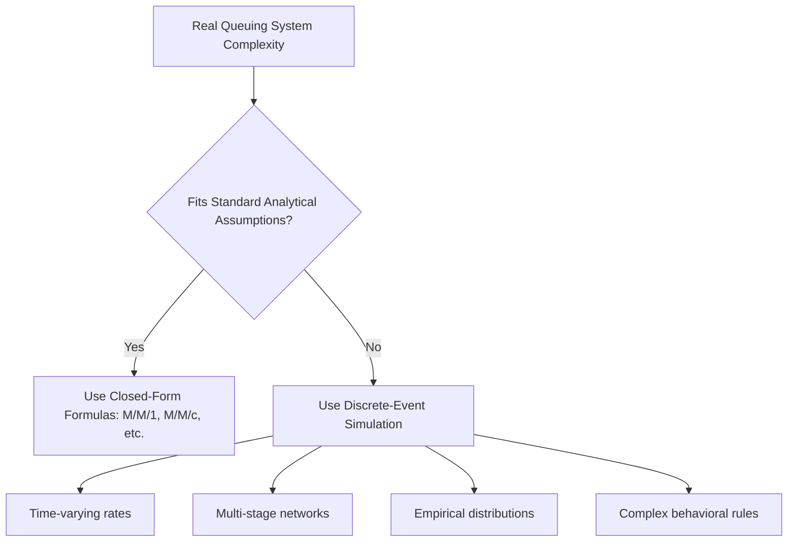
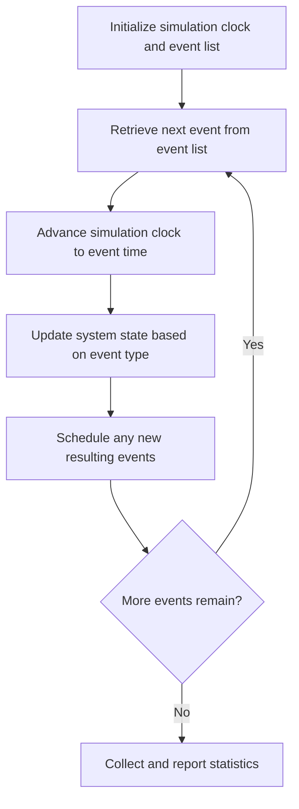
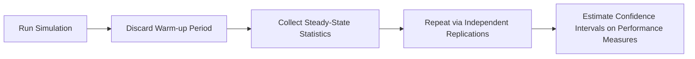
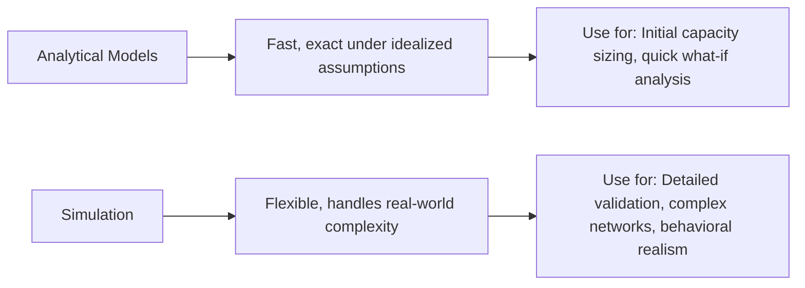

## Simulation Modeling of Queuing Systems

### Overview

Simulation modeling provides an alternative, computational approach to analyzing queuing systems when the closed-form analytical models covered previously (M/M/1, M/M/c, Pollaczek-Khinchine, Kingman's approximation) are insufficient to capture a system's real complexity. Where analytical models require restrictive assumptions to remain mathematically tractable, discrete-event simulation can represent arbitrary arrival patterns, service distributions, queue disciplines, and system topologies at the cost of requiring computational execution rather than yielding a direct formula.

### When Analytical Models Break Down

**Key Points**

- Closed-form queuing formulas rely on simplifying assumptions — Poisson arrivals, exponential or Erlang service times, single-stage systems, stationary (time-constant) rates — that are frequently violated in real operational systems
- Common real-world complexities that exceed the scope of standard analytical formulas include:
  - **Time-varying (non-stationary) arrival rates**, where demand fluctuates by hour of day or day of week in a way that cannot be reasonably approximated by a single constant $\lambda$
  - **Multi-stage networks** with complex routing (entities move between stations in a pattern that depends on prior service outcomes, not a simple linear sequence)
  - **Complex, empirically-derived service time distributions** that do not fit any standard parametric family (exponential, Erlang, deterministic)
  - **Behavioral phenomena** such as balking, reneging, and jockeying with complex, state-dependent probabilities not easily captured in closed-form
  - **Resource interdependencies**, such as multiple resource types required simultaneously for service (e.g., both a room and a specialist needed concurrently in a healthcare setting)
  - **Priority and preemption rules** with multiple interacting priority classes
- When several of these complexities occur simultaneously, deriving an exact analytical solution becomes intractable, making simulation the practical tool of choice

### Discrete-Event Simulation: Core Concept

**Key Points**

- **Discrete-event simulation (DES)** models a system as a sequence of discrete events (arrivals, service completions, balking decisions) occurring at specific points in simulated time, with the system state updated only at each event rather than continuously
- The simulation maintains a **future event list** (or event calendar) — a time-ordered queue of scheduled future events — and advances simulated time by repeatedly processing the next chronologically scheduled event, updating system state, and scheduling any new events that result
- This "next-event" time-advance mechanism is computationally efficient because simulated time jumps directly from one event to the next, skipping over periods where nothing changes, rather than advancing in small fixed time increments

### Random Number Generation and Distribution Sampling

**Key Points**

- Simulation of stochastic queuing behavior requires generating random samples from the specified interarrival time and service time distributions (exponential, Erlang, empirical, or any other fitted distribution)
- This is typically accomplished using **pseudo-random number generators** combined with **inverse transform sampling** or other distribution-specific sampling techniques, converting uniformly distributed random numbers ($U \sim \text{Uniform}(0,1)$) into samples from the target distribution
- For the exponential distribution specifically, inverse transform sampling yields a simple closed-form generator:

$$T = -\frac{1}{\lambda}\ln(U)$$

where $U$ is a uniform random draw between 0 and 1 — this allows simulated interarrival or service times to be generated directly from the exponential distribution's cumulative distribution function

- For distributions without a simple closed-form inverse (many empirically fitted distributions), numerical inversion or acceptance-rejection sampling methods are used instead

### Illustration: Discrete-Event Simulation Timeline

(svg_diagram) Event-driven time advancement in a discrete-event simulation:

<svg xmlns="http://www.w3.org/2000/svg" viewBox="0 0 760 320" font-family="Helvetica, Arial, sans-serif">
<text x="380" y="24" text-anchor="middle" font-size="16" font-weight="bold" fill="#1a1a1a">Discrete-Event Simulation Timeline (svg_diagram)</text>
<line x1="60" y1="180" x2="720" y2="180" stroke="#333" stroke-width="1.5" />
<text x="700" y="200" font-size="10" fill="#333">Simulated Time</text>
<circle cx="100" cy="180" r="6" fill="#2b6cb0" />
<text x="100" y="160" text-anchor="middle" font-size="9" fill="#1a1a1a">Arrival 1</text>
<circle cx="220" cy="180" r="6" fill="#38a169" />
<text x="220" y="160" text-anchor="middle" font-size="9" fill="#1a1a1a">Service Start 1</text>
<circle cx="300" cy="180" r="6" fill="#2b6cb0" />
<text x="300" y="220" text-anchor="middle" font-size="9" fill="#1a1a1a">Arrival 2</text>
<circle cx="380" cy="180" r="6" fill="#d64545" />
<text x="380" y="160" text-anchor="middle" font-size="9" fill="#1a1a1a">Service Complete 1</text>
<circle cx="440" cy="180" r="6" fill="#38a169" />
<text x="440" y="220" text-anchor="middle" font-size="9" fill="#1a1a1a">Service Start 2</text>
<circle cx="560" cy="180" r="6" fill="#2b6cb0" />
<text x="560" y="160" text-anchor="middle" font-size="9" fill="#1a1a1a">Arrival 3</text>
<circle cx="620" cy="180" r="6" fill="#d64545" />
<text x="620" y="220" text-anchor="middle" font-size="9" fill="#1a1a1a">Service Complete 2</text>

<text x="380" y="270" text-anchor="middle" font-size="10" fill="#333" font-style="italic">Clock advances directly to next scheduled event, not in fixed increments</text>

</svg>

### Simulation Output Analysis and Statistical Considerations

**Key Points**

- Because simulations rely on random number generation, a single simulation run produces just one possible **sample path** of system behavior, not a definitive answer — proper analysis requires multiple independent replications (repeated runs with different random number streams) to characterize the distribution of outcomes, not just a single point estimate
- Key statistical concepts in simulation output analysis include:
  - **Warm-up period**: the initial transient portion of a simulation run before the system reaches steady-state-like behavior, which is typically excluded from performance statistics to avoid bias from unrepresentative startup conditions
  - **Replication**: running the simulation multiple times with independent random streams to estimate confidence intervals around performance measures (e.g., average $W_q$ across 30 independent replications, with an associated confidence interval)
  - **Variance reduction techniques**: methods such as common random numbers or antithetic variates, used to improve the statistical precision of comparative simulation studies (e.g., comparing two proposed staffing configurations) without requiring proportionally more replications
- [Inference: the specific number of replications and warm-up length needed for adequate statistical precision depends on the variability of the specific system being modeled and the precision required for the decision at hand, and is typically determined through pilot runs and sequential precision checks rather than a fixed rule of thumb.]

### Modeling Complex Queuing Networks

**Key Points**

- Simulation naturally extends to **queuing networks**, where entities move between multiple interconnected service stations according to routing logic that may be deterministic, probabilistic, or dependent on prior service outcomes — a capability far beyond the scope of the single-stage closed-form models covered previously
- Multi-stage systems can be modeled with station-specific arrival, service, and queue discipline parameters, and simulation can capture the propagation of congestion from one bottleneck station through the rest of the network — a phenomenon that is difficult to characterize analytically but emerges naturally from a correctly specified simulation
- Simulation is also well-suited to capturing **resource contention** across multiple entity types competing for shared resources, and **time-varying arrival patterns**, both by directly specifying a time-dependent arrival rate function or empirically-derived hourly/daily arrival pattern rather than requiring a single stationary rate assumption

### Comparing Analytical and Simulation Approaches

**Key Points**

- **Analytical models** (M/M/1, M/M/c, and the general-distribution extensions) provide immediate, exact (or well-approximated) closed-form answers with minimal computational effort, and are preferable whenever their underlying assumptions reasonably fit the system being analyzed
- **Simulation** trades this speed and mathematical elegance for flexibility: it can represent essentially any system configuration, distribution, or behavioral rule, at the cost of requiring computational execution, careful statistical output analysis, and generally providing estimated rather than exact results
- A common and effective practice is to use analytical models for **initial, approximate capacity sizing** (leveraging their speed to quickly narrow the range of reasonable configurations) and simulation for **detailed validation and refinement** of the most promising configurations identified analytically, particularly when the analytical assumptions are known to be approximate rather than exact fits to the real system

### Practical Implementation Considerations

**Key Points**

- Simulation models require careful **input distribution fitting** — using historical data to determine which theoretical or empirical distribution best represents observed arrival and service patterns, since a simulation is only as accurate as the input distributions it draws from
- **Model validation** against known historical performance (e.g., comparing simulated average wait times against actually observed historical wait times for a comparable period) is essential before using a simulation model to evaluate proposed changes with confidence
- Simulation is particularly valuable for **what-if scenario analysis** in capacity planning — evaluating the impact of proposed changes (adding a server, changing a queue discipline, introducing a reservation system) before committing to costly real-world implementation, directly supporting the capacity investment decisions covered throughout prior long-term and short-term capacity management material
- Modern simulation is commonly implemented using dedicated discrete-event simulation software packages (offering built-in distribution libraries, animation, and statistical output analysis tools) or general-purpose programming languages with simulation libraries, chosen based on the complexity of the system being modeled and the analytical sophistication required

### Interaction With the Broader Capacity Planning Toolkit

**Key Points**

- Simulation serves as the natural extension of the analytical queuing toolkit developed throughout this chapter, applied precisely where the M/M/1, M/M/c, Pollaczek-Khinchine, and Kingman approximation formulas reach the limits of their underlying assumptions
- Simulation-based scenario testing directly supports the capacity investment decisions covered in long-term capacity expansion planning (e.g., testing whether a proposed incremental capacity addition would meet target service levels under realistic, non-idealized demand patterns) and the short-term levers covered in aggregate planning (e.g., testing the effect of a specific overtime or subcontracting policy on simulated queue performance under variable demand)
- Because simulation can incorporate the psychological and behavioral factors discussed in wait psychology material (e.g., modeling balking probability as a function of observed queue length, or reneging probability as a function of elapsed wait time) far more flexibly than closed-form models, it is often the preferred tool when behavioral realism is a priority alongside pure operational performance measurement

**Related Topics**

- Discrete-event simulation software and modeling frameworks
- Input distribution fitting and goodness-of-fit testing
- Warm-up period determination and steady-state statistics
- Variance reduction techniques in simulation output analysis
- Queuing networks and multi-stage system modeling
- M/M/1, M/M/c, and general-distribution analytical queuing models
- What-if scenario analysis for capacity investment decisions