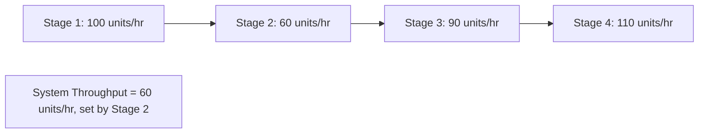
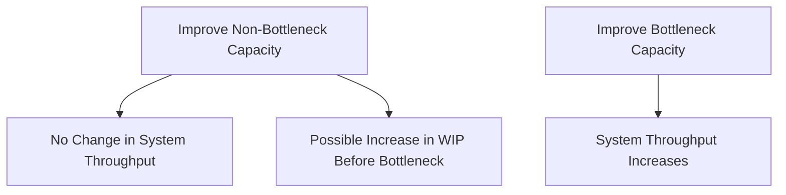
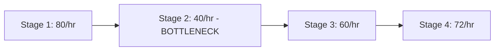
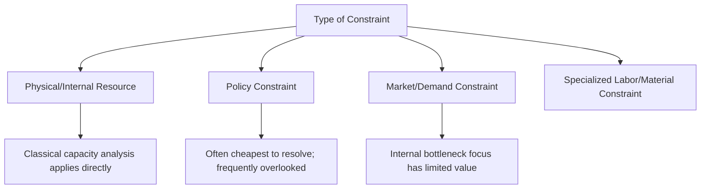
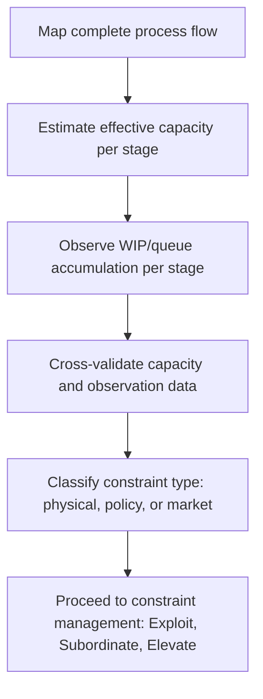

## Identifying Bottlenecks in a Process

### Overview

Identifying bottlenecks is the foundational diagnostic step of the Theory of Constraints (TOC), a management philosophy centered on the principle that any process has at least one constraint that limits its overall throughput, and that system-wide performance can only be improved by identifying and addressing that specific constraint. Correctly locating the bottleneck is the prerequisite for every subsequent step in constraint management, since effort applied anywhere other than the true bottleneck typically yields little or no improvement in overall system output.

### Defining the Bottleneck

**Key Points**

- A **bottleneck** (or **constraint**) is the resource, step, or stage in a process whose capacity is lower than the capacity of every other resource in the process, such that it limits the maximum achievable throughput of the entire system
- The bottleneck's capacity effectively **becomes** the system's capacity: no matter how much capacity exists elsewhere in the process, total system throughput cannot exceed what the bottleneck can process
- This is a direct consequence of the general principle that a chain of sequential (or interdependent) processing stages is only as strong as its weakest link — a principle explicitly foregrounded in the Theory of Constraints framework popularized by Eliyahu Goldratt
- A bottleneck can be a physical resource (a specific machine, a specific workstation), a human resource (a specialized skill in short supply), a policy (a batch-size rule, an approval requirement), or an external constraint (market demand, supplier capacity) — not all constraints are internal physical capacity limits

### Why Bottleneck Identification Matters

**Key Points**

- Investing in capacity improvements at a non-bottleneck resource does **not** increase total system throughput, since the bottleneck remains the limiting factor regardless of how much excess capacity exists elsewhere — this makes bottleneck misidentification a source of wasted capital investment
- Improving a non-bottleneck resource can even be counterproductive, since it may increase work-in-process (WIP) inventory piling up in front of the actual bottleneck without improving final output, raising holding costs and clutter without any throughput benefit
- Correct bottleneck identification directly connects to Little's Law and flow-time analysis (covered previously): the stage with the highest utilization typically has the highest queue/WIP accumulation in front of it, and this WIP buildup is often the most visible symptom used to locate the constraint empirically

### Quantitative Methods for Bottleneck Identification

**Key Points**

- **Capacity/utilization comparison**: the most direct method — calculate the maximum processing rate (capacity) of each stage in the process and identify the stage with the lowest capacity relative to demand; this stage will also exhibit the highest utilization ($\rho$) when the process is run near its constraint
- **Queue/WIP accumulation observation**: in real, observable processes, the bottleneck is often identifiable simply by observing which stage has the largest accumulation of waiting work (inventory, people, jobs) immediately upstream of it, since work piles up in front of the slowest stage
- **Cycle time decomposition**: breaking down total process cycle time by stage and identifying which stage contributes the largest and most variable share of total time, particularly under peak-load conditions
- **Throughput accounting**: measuring actual completed output per unit time at each stage under sustained operation; the stage with the lowest sustained completed-output rate is the constraint, since it caps what all downstream stages can ultimately receive and process

$$\text{Capacity}_i = \frac{\text{Available Time}}{\text{Processing Time per Unit at Stage } i}$$

$$\text{Bottleneck} = \arg\min_i \left(\text{Capacity}_i\right)$$

**Example**

A four-stage assembly process has stage processing times of 45, 90, 60, and 50 seconds per unit respectively, all running with a single resource per stage and no parallel paths. Converting to hourly capacity ($3600/\text{processing time}$): Stage 1 = 80 units/hr, Stage 2 = 40 units/hr, Stage 3 = 60 units/hr, Stage 4 = 72 units/hr. Stage 2, with the lowest capacity (40 units/hr), is the bottleneck — regardless of how much idle capacity exists at Stages 1, 3, and 4, the entire line cannot produce more than 40 units per hour on a sustained basis. [Inference: figures illustrative; real-world bottleneck identification also requires accounting for variability, changeover time, and downtime, not just nominal processing time.]

### Illustration: Bottleneck Identification via Capacity Profile

(svg_diagram) Capacity profile across process stages, showing the constraint as the lowest point:

<svg xmlns="http://www.w3.org/2000/svg" viewBox="0 0 740 380" font-family="Helvetica, Arial, sans-serif">
<text x="370" y="24" text-anchor="middle" font-size="16" font-weight="bold" fill="#1a1a1a">Bottleneck Capacity Profile (svg_diagram)</text>
<line x1="80" y1="320" x2="80" y2="60" stroke="#333" stroke-width="1.5" />
<line x1="80" y1="320" x2="680" y2="320" stroke="#333" stroke-width="1.5" />
<text x="30" y="70" font-size="10" fill="#333">Capacity</text>
<text x="640" y="340" font-size="10" fill="#333">Process Stage</text>
<rect x="120" y="120" width="90" height="200" fill="#2b6cb0" fill-opacity="0.5" stroke="#2b6cb0" />
<text x="165" y="335" text-anchor="middle" font-size="10" fill="#1a1a1a">Stage 1</text>
<text x="165" y="110" text-anchor="middle" font-size="10" fill="#1a1a1a">80/hr</text>
<rect x="240" y="220" width="90" height="100" fill="#d64545" fill-opacity="0.6" stroke="#d64545" />
<text x="285" y="335" text-anchor="middle" font-size="10" fill="#1a1a1a">Stage 2</text>
<text x="285" y="210" text-anchor="middle" font-size="10" fill="#d64545" font-weight="bold">40/hr ← Bottleneck</text>
<rect x="360" y="170" width="90" height="150" fill="#38a169" fill-opacity="0.5" stroke="#38a169" />
<text x="405" y="335" text-anchor="middle" font-size="10" fill="#1a1a1a">Stage 3</text>
<text x="405" y="160" text-anchor="middle" font-size="10" fill="#1a1a1a">60/hr</text>
<rect x="480" y="140" width="90" height="180" fill="#805ad5" fill-opacity="0.5" stroke="#805ad5" />
<text x="525" y="335" text-anchor="middle" font-size="10" fill="#1a1a1a">Stage 4</text>
<text x="525" y="130" text-anchor="middle" font-size="10" fill="#1a1a1a">72/hr</text>
<line x1="80" y1="220" x2="680" y2="220" stroke="#d64545" stroke-dasharray="6,3" />
<text x="600" y="212" font-size="9" fill="#d64545">System throughput ceiling = bottleneck capacity</text>
</svg>

### Distinguishing Types of Constraints

**Key Points**

- **Physical/internal constraints**: a specific machine, workstation, or resource within the process whose capacity is the limiting factor — the type most directly addressed by classical capacity analysis
- **Policy constraints**: rules, procedures, or decision criteria (minimum batch sizes, required approval chains, scheduling rules) that limit throughput even when physical capacity would otherwise allow more — policy constraints are often overlooked because they do not appear as a physical resource shortage, but can be just as limiting and, notably, are typically far cheaper to relax than physical capacity constraints
- **Market/demand constraints**: cases where the process has more physical capacity than current demand requires, meaning the "constraint" is external market demand rather than any internal process step — in this case, internal bottleneck-focused improvement has limited value until demand itself grows to exceed internal capacity
- **Resource constraints beyond equipment**: skilled labor, specialized expertise, or a particular material/component in limited supply can function as the bottleneck just as readily as a machine, requiring analysts to look beyond only equipment-centric capacity metrics

### Common Pitfalls in Bottleneck Identification

**Key Points**

- **Confusing the busiest resource with the bottleneck**: a resource can appear highly active (high utilization) without actually being the true constraint if its output is not what limits final system throughput — this is particularly common in complex networks with multiple paths or where a downstream buffer masks the true limiting stage
- **Static, single-point measurement**: measuring capacity or utilization at a single point in time, or under atypical conditions, can misidentify the bottleneck if the true constraint only becomes binding during specific demand peaks or specific product mixes — bottleneck location can shift ("wandering bottleneck") as product mix, demand level, or staffing changes over time
- **Ignoring variability and downtime**: nominal processing-time-based capacity calculations (as in the simplified example above) can misidentify the bottleneck if they ignore setup/changeover time, unplanned downtime, or variability effects that disproportionately affect one particular stage
- **Overlooking non-obvious constraint types**: focusing exclusively on physical equipment capacity while overlooking policy constraints, information/approval bottlenecks, or shared/scarce specialized labor can lead to misdirected improvement efforts
- **Treating a temporary or demand-driven constraint as permanent**: applying capital-intensive fixes to a constraint that is actually a temporary market-demand limitation, rather than a persistent internal process limitation, wastes investment that could be redirected more productively

### Diagnostic Process for Bottleneck Identification

**Key Points**

- A structured approach to bottleneck identification typically follows these steps: (1) map the complete process flow, including all parallel paths and shared resources; (2) measure or estimate the effective capacity of each stage, accounting for downtime, changeover, and variability, not just nominal processing rate; (3) observe or measure WIP/queue accumulation at each stage under representative operating conditions; (4) cross-validate the capacity-based and observation-based identifications, since they should generally agree on the true bottleneck location; (5) verify whether the identified constraint is physical, policy-based, or market-driven, since this determines the appropriate subsequent management approach

### Connection to the Broader Theory of Constraints Process

**Key Points**

- Bottleneck identification corresponds to the first step ("Identify") of the well-known Theory of Constraints five-focusing-steps methodology (Identify, Exploit, Subordinate, Elevate, Repeat), which provides the structured process for not just locating but then systematically managing and improving upon the identified constraint
- Because the bottleneck determines overall system throughput, all downstream capacity management decisions — where to add overtime, where to invest in additional equipment, where to focus process improvement effort — should be informed by an accurate, validated bottleneck identification rather than applied uniformly or intuitively across the entire process
- Bottleneck identification is inherently a recurring, not one-time, activity: since bottlenecks can shift due to changes in product mix, demand pattern, or process improvements at the current constraint (the "wandering bottleneck" phenomenon), organizations practicing constraint management typically re-verify the bottleneck location periodically rather than assuming a fixed constraint indefinitely

**Related Topics**

- The Five Focusing Steps of Theory of Constraints (Identify, Exploit, Subordinate, Elevate, Repeat)
- Little's Law and flow-time analysis as a bottleneck diagnostic tool
- Drum-Buffer-Rope scheduling methodology
- Throughput accounting versus traditional cost accounting
- Policy constraints and their disproportionate cost-effectiveness to resolve
- Capacity utilization and queue-length formulas (queuing theory linkage)
- Work-in-process (WIP) management and lean manufacturing principles