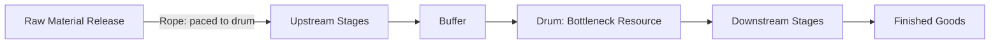
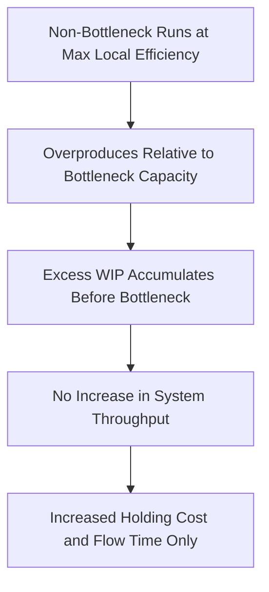
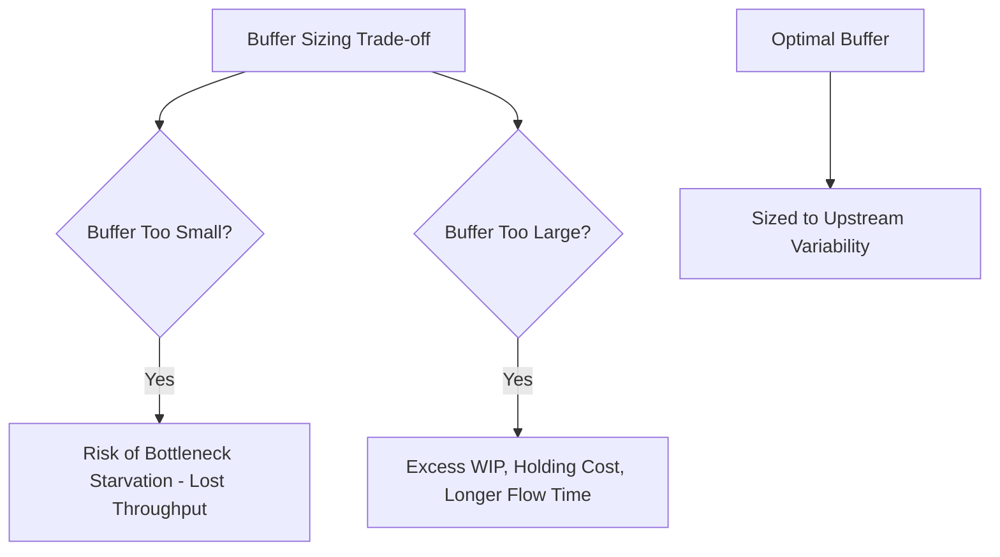
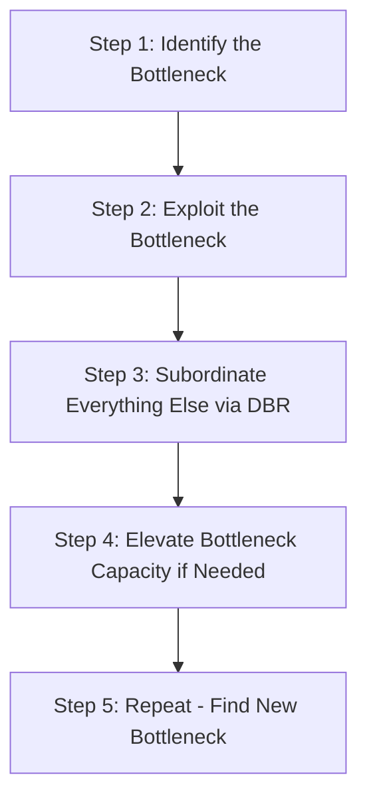
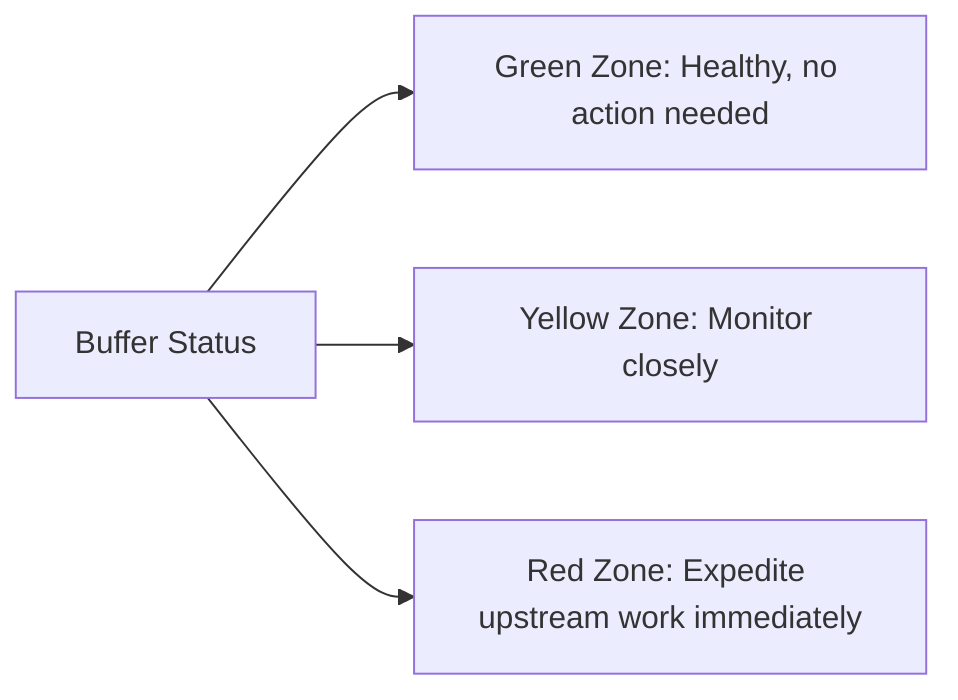

## Drum-Buffer-Rope Scheduling

### Overview

Drum-Buffer-Rope (DBR) is the production scheduling methodology developed within the Theory of Constraints framework to synchronize an entire process around its identified bottleneck (or "drum"). Rather than scheduling each process stage independently to maximize its own local utilization, DBR subordinates the entire system's pace to the bottleneck's capacity, using buffers and a release mechanism ("rope") to protect bottleneck throughput while minimizing unnecessary work-in-process elsewhere in the system.

### The Three Components

**Key Points**

- **Drum**: the bottleneck resource identified through the process covered in the prior material, which sets the pace ("beats the drum") for the entire system — since the bottleneck determines maximum system throughput, its schedule becomes the master schedule that all other stages are synchronized to
- **Buffer**: a strategically placed time or inventory cushion positioned immediately before the bottleneck (and sometimes at other critical points, such as before final assembly or shipping) to protect the bottleneck from ever starving for work due to upstream variability or disruption
- **Rope**: a communication/signaling mechanism that paces material release into the system at the front end, synchronized to the bottleneck's actual consumption rate — the "rope" conceptually connects the release of raw materials at the start of the process back to the drum's pace, preventing upstream stages from producing faster than the bottleneck can consume

### Why Uniform Local Efficiency Fails

**Key Points**

- Traditional production scheduling often optimizes each stage or workstation to maximize its own local efficiency/utilization independently, an approach the Theory of Constraints explicitly identifies as counterproductive at the system level
- If non-bottleneck stages are run at their own maximum local efficiency (producing as much as they physically can), they will inevitably produce **more than the bottleneck can consume**, since by definition every other stage has higher capacity than the bottleneck
- This excess non-bottleneck production does not increase system throughput (which remains capped by the bottleneck) but does increase work-in-process inventory, holding costs, and clutter — directly connecting to the Little's Law relationship (WIP = Throughput × Cycle Time) covered previously, where excess WIP with fixed throughput simply extends flow time without benefit
- DBR explicitly rejects local efficiency maximization at non-bottleneck stages in favor of **subordinating** their pace to what the bottleneck actually requires — a stage may deliberately run below its own maximum capacity if doing so aligns overall system flow to the bottleneck's rate

### The Buffer: Types and Purpose

**Key Points**

- **Time buffer**: rather than specifying a fixed inventory quantity, the buffer is often expressed as a time cushion — enough lead time built into the schedule before the bottleneck stage so that, even accounting for typical upstream variability or minor disruptions, work reliably arrives at the bottleneck before it is needed
- **Constraint buffer**: positioned directly in front of the drum/bottleneck itself, this is the most critical buffer in the system, since any starvation of the bottleneck represents permanently lost system throughput (unlike idle time at a non-bottleneck stage, which can be made up later without loss, since that stage has surplus capacity)
- **Shipping buffer**: positioned at the end of the process (before customer delivery/shipping) to protect the promised delivery date from variability occurring in the stages downstream of the bottleneck
- **Assembly buffer**: used in more complex process structures where parts must converge from multiple paths (some through the bottleneck, some not) to ensure the non-bottleneck-path parts arrive in time to be assembled with bottleneck-processed parts, without either path causing a stall
- Buffer sizing involves a direct trade-off: buffers too small risk bottleneck starvation (permanently lost throughput); buffers too large increase WIP, flow time, and holding cost unnecessarily — buffer sizing is typically informed by the variability of the upstream process feeding the buffer, echoing the variability-driven queuing relationships (Pollaczek-Khinchine, Kingman's approximation) from prior queuing theory material

### The Rope: Pacing Material Release

**Key Points**

- The rope mechanism ensures that material is released into the front of the process at a rate matched to the bottleneck's actual consumption rate, rather than released as fast as the first stage can physically process it
- This directly limits total system WIP, since material is not introduced into the system faster than the bottleneck can eventually process it — excess WIP inherently cannot accumulate anywhere in the system beyond what the constraint buffer is designed to hold
- Practically, the rope is often implemented via a signal (a kanban-style card, an electronic release trigger, or a simple production schedule communicated back to the material release point) tied to the bottleneck's current buffer status or consumption rate — conceptually similar to pull-based systems in lean manufacturing, though DBR is explicitly derived from constraint theory rather than lean's broader waste-elimination philosophy
- [Inference: the exact mechanical implementation of the rope signal (physical kanban cards, digital ERP-triggered releases, or simple time-based release schedules) varies by industry and system sophistication, and the specific choice does not change the underlying synchronization principle.]

### Illustration: Drum-Buffer-Rope System Structure

(svg_diagram) Complete Drum-Buffer-Rope system showing material flow, buffer placement, and pacing signal:

<svg xmlns="http://www.w3.org/2000/svg" viewBox="0 0 780 380" font-family="Helvetica, Arial, sans-serif">
<text x="390" y="24" text-anchor="middle" font-size="16" font-weight="bold" fill="#1a1a1a">Drum-Buffer-Rope System (svg_diagram)</text>
<rect x="50" y="150" width="90" height="60" fill="#2b6cb0" fill-opacity="0.4" stroke="#2b6cb0" />
<text x="95" y="185" text-anchor="middle" font-size="10" fill="#1a1a1a">Material Release</text>
<rect x="180" y="150" width="90" height="60" fill="#38a169" fill-opacity="0.4" stroke="#38a169" />
<text x="225" y="185" text-anchor="middle" font-size="10" fill="#1a1a1a">Stage A</text>
<rect x="310" y="150" width="70" height="60" fill="#dd6b20" fill-opacity="0.4" stroke="#dd6b20" />
<text x="345" y="185" text-anchor="middle" font-size="9" fill="#1a1a1a">Constraint Buffer</text>
<rect x="410" y="140" width="100" height="80" fill="#d64545" fill-opacity="0.6" stroke="#d64545" stroke-width="2" />
<text x="460" y="175" text-anchor="middle" font-size="11" fill="#1a1a1a" font-weight="bold">DRUM</text>
<text x="460" y="192" text-anchor="middle" font-size="9" fill="#1a1a1a">(Bottleneck)</text>
<rect x="540" y="150" width="90" height="60" fill="#38a169" fill-opacity="0.4" stroke="#38a169" />
<text x="585" y="185" text-anchor="middle" font-size="10" fill="#1a1a1a">Stage B</text>
<rect x="660" y="150" width="80" height="60" fill="#805ad5" fill-opacity="0.4" stroke="#805ad5" />
<text x="700" y="180" text-anchor="middle" font-size="9" fill="#1a1a1a">Shipping</text>
<text x="700" y="192" text-anchor="middle" font-size="9" fill="#1a1a1a">Buffer</text>
<path d="M 140 180 L 175 180" stroke="#333" stroke-width="1.5" marker-end="url(#arrow3)" />
<path d="M 270 180 L 305 180" stroke="#333" stroke-width="1.5" marker-end="url(#arrow3)" />
<path d="M 380 180 L 405 180" stroke="#333" stroke-width="1.5" marker-end="url(#arrow3)" />
<path d="M 510 180 L 535 180" stroke="#333" stroke-width="1.5" marker-end="url(#arrow3)" />
<path d="M 630 180 L 655 180" stroke="#333" stroke-width="1.5" marker-end="url(#arrow3)" />
<path d="M 460 220 C 460 300, 95 300, 95 215" stroke="#d64545" stroke-width="2" stroke-dasharray="6,3" fill="none" marker-end="url(#arrow3)" />
<text x="270" y="320" text-anchor="middle" font-size="11" fill="#d64545" font-weight="bold">ROPE: paces material release to Drum's consumption rate</text>
</svg>

### Relationship to the Five Focusing Steps

**Key Points**

- DBR is the primary scheduling mechanism used to implement the second and third steps of the Theory of Constraints five-focusing-steps process (introduced in the prior material on bottleneck identification): **Exploit** (get maximum output from the existing bottleneck without additional investment) and **Subordinate** (align every other process step to support the bottleneck's schedule)
- **Exploiting** the bottleneck under DBR typically involves ensuring the bottleneck never sits idle due to starvation (addressed by the constraint buffer), minimizing setup/changeover time at the bottleneck specifically (since lost bottleneck time is lost system throughput, unlike lost time at non-bottleneck stages), and prioritizing bottleneck-bound work appropriately when the bottleneck itself has competing job types to process
- **Subordinating** under DBR means every non-bottleneck stage's schedule is derived from, and adjusts to, the bottleneck's schedule and buffer status — rather than each stage optimizing independently, as would occur under traditional decentralized scheduling approaches

### Buffer Management as an Ongoing Control Mechanism

**Key Points**

- Beyond initial sizing, DBR systems typically employ **buffer management** as an ongoing operational control tool: the buffer is conceptually divided into zones (commonly a simple three-zone red/yellow/green scheme based on how much of the buffer has been consumed relative to when the corresponding work is due at the bottleneck)
- A buffer status showing significant erosion into the "red zone" (buffer nearly depleted, work not yet arrived) signals an emerging risk of bottleneck starvation and triggers expediting action on the specific upstream work causing the delay
- This buffer-zone monitoring approach provides real-time operational visibility into constraint health, functioning analogously to the real-time schedule adherence monitoring discussed in workforce scheduling material, but focused specifically on protecting the identified constraint's continuous operation
- Systematic buffer penetration patterns (e.g., certain upstream stages or certain job types repeatedly eating deeply into the buffer) can also reveal secondary process issues or emerging additional constraints that warrant separate investigation

### Advantages and Limitations

**Key Points**

- **Advantages**: directly maximizes system throughput by focusing all scheduling logic on the true system constraint; reduces excess WIP and associated holding costs relative to traditional locally-optimized scheduling; provides clear, actionable priorities (protect the drum, sized buffers, paced release) rather than requiring complex global optimization across every stage
- **Limitations**: requires accurate, validated bottleneck identification (an incorrect drum designation undermines the entire schedule); can be less effective in highly complex networks with frequently shifting bottlenecks ("wandering bottleneck" phenomenon), which requires more frequent re-application of the identification and buffer-resizing process; DBR's classical formulation assumes a relatively stable process structure and may require adaptation (e.g., Simplified DBR variants) for highly dynamic, high-mix, or make-to-order environments where the bottleneck location or magnitude shifts frequently
- [Unverified: the relative effectiveness of DBR compared to alternative scheduling approaches such as CONWIP (constant work-in-process) or kanban-based pull systems in highly volatile, high-mix production environments is context-dependent and is typically evaluated empirically for a specific operation rather than assumed from general principles.]

### Interaction With Broader Capacity Management

**Key Points**

- DBR operationalizes the bottleneck-focused improvement principle established in the prior identification material, translating the abstract concept of "the constraint sets system throughput" into a concrete, implementable scheduling methodology
- DBR's buffer and rope mechanisms are structurally analogous to concepts introduced earlier in this course of study: the buffer parallels the capacity cushion concept from long-term capacity planning (protecting against variability), and the rope's pacing function parallels the demand-shaping intent of reservation and appointment systems (controlling the rate at which new work enters a constrained system)
- Once a bottleneck has been elevated (its capacity increased through the fourth focusing step) to the point where it is no longer the binding constraint, the DBR schedule must be reconfigured around the newly emergent bottleneck, reinforcing that constraint management, like bottleneck identification, is an iterative and ongoing discipline rather than a one-time fix

**Related Topics**

- The Five Focusing Steps of Theory of Constraints
- Identifying bottlenecks in a process
- Buffer management and buffer-zone (red/yellow/green) monitoring
- Little's Law and WIP/throughput/cycle-time relationships
- Kanban and pull-based production systems (comparison to DBR)
- CONWIP (constant work-in-process) as an alternative scheduling philosophy
- Throughput accounting in Theory of Constraints