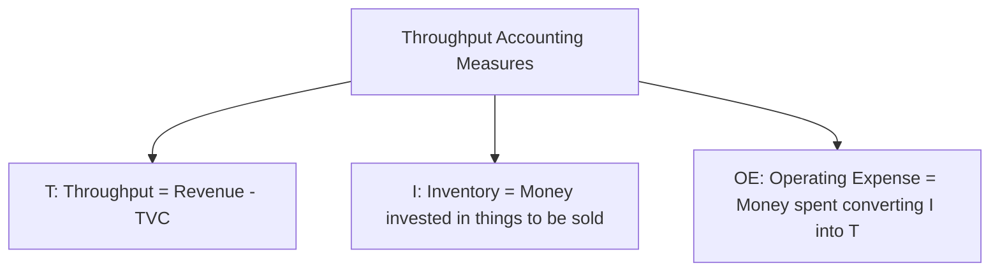
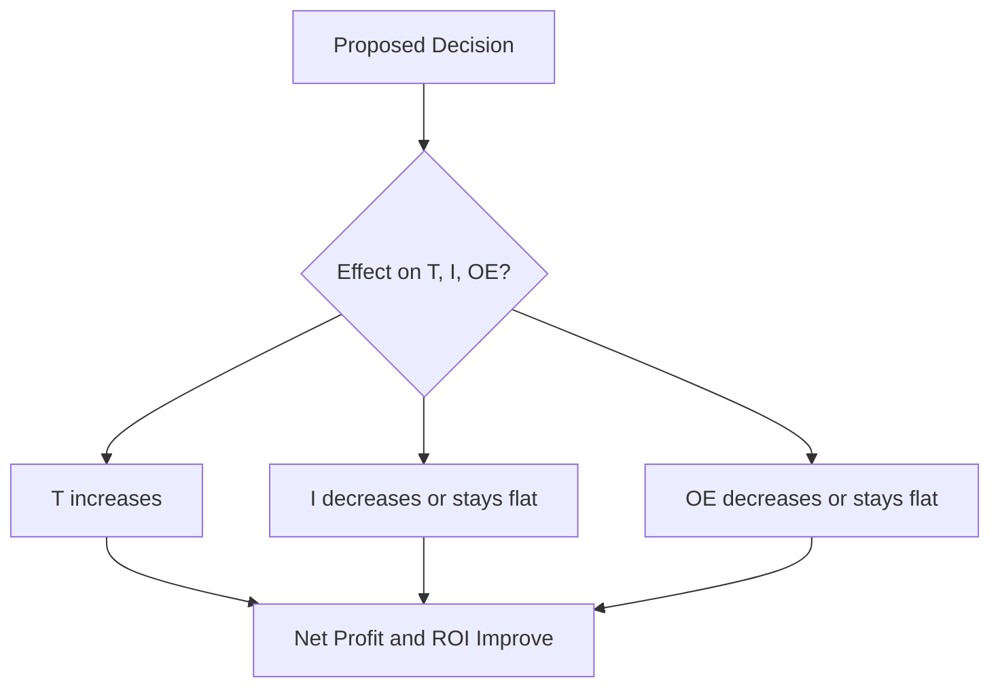
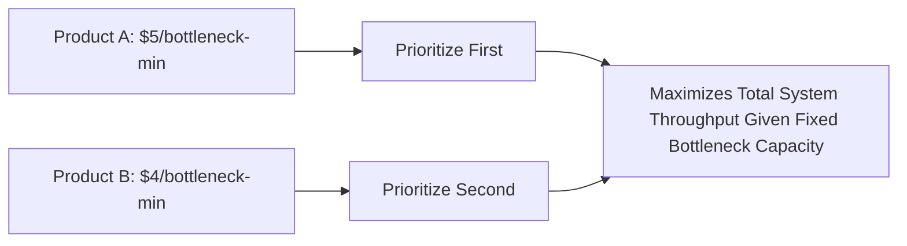
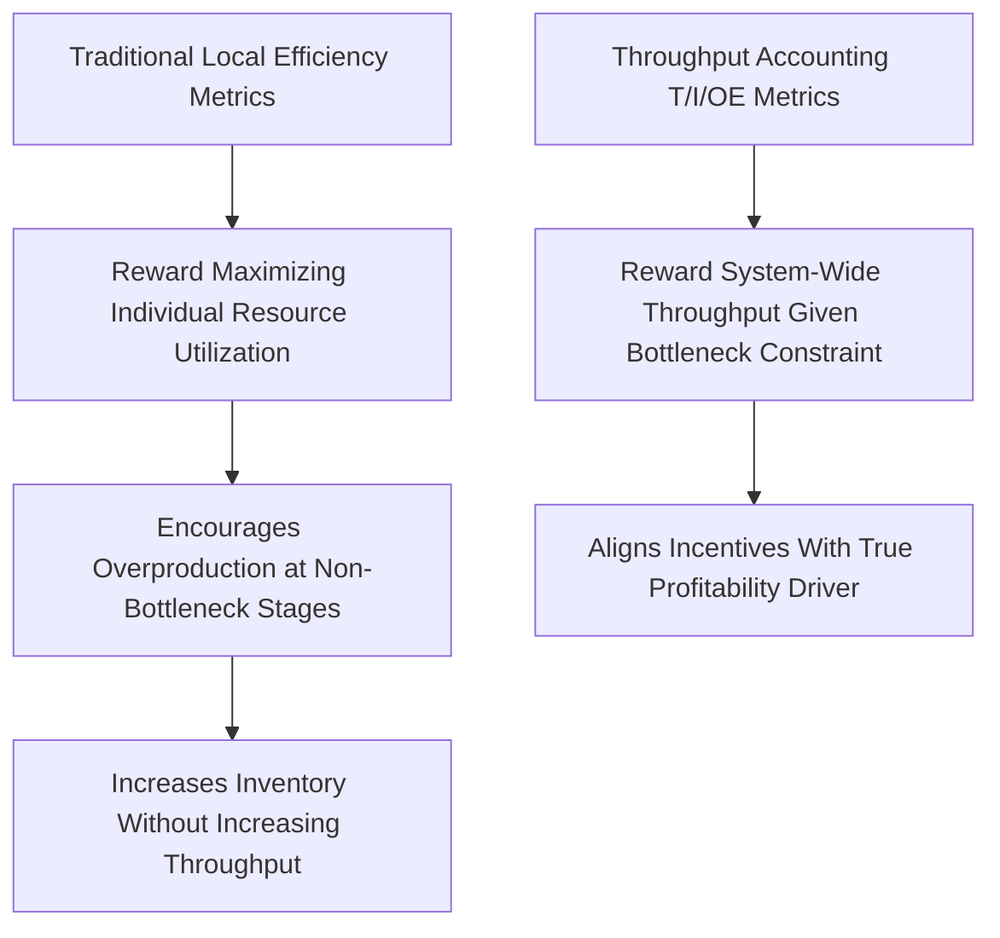

## Throughput, Inventory, and Operating Expense

### Overview

Throughput, Inventory, and Operating Expense (commonly abbreviated T, I, and OE) are the three fundamental measures at the core of **Throughput Accounting**, the financial and operational measurement system developed within the Theory of Constraints as an alternative to traditional cost accounting. These three measures provide the basis for evaluating whether a proposed decision — an investment, a process change, a product mix choice — genuinely improves organizational performance, particularly in the presence of an identified bottleneck.

### Defining the Three Measures

**Key Points**

- **Throughput (T)**: the rate at which the system generates money through sales — defined specifically as revenue minus totally variable cost (most commonly, raw material and other directly variable costs), *not* total revenue and *not* the accounting concept of "gross profit," since Throughput Accounting deliberately excludes labor and overhead from this calculation regardless of how they are treated in traditional cost accounting

$$T = \text{Sales Revenue} - \text{Totally Variable Cost (TVC)}$$

- **Inventory (I)**: all the money the system has invested in purchasing things it intends to sell, including raw materials, work-in-process, and finished goods — notably, Throughput Accounting values inventory only at its purchased material cost, explicitly excluding any labor or overhead value-added, in contrast to traditional cost accounting's practice of allocating labor and overhead into inventory valuation
- **Operating Expense (OE)**: all the money the system spends turning Inventory into Throughput — this includes labor, utilities, depreciation, rent, and all other costs not classified as totally variable cost, regardless of whether those costs are traditionally labeled "direct" or "indirect" in conventional accounting

### The Core Decision Rule

**Key Points**

- Every operational or investment decision can be evaluated against its effect on these three measures, with the overarching goal typically framed as: **increase Throughput while simultaneously decreasing (or at least not increasing) Inventory and Operating Expense**
- This provides a clear, simple decision heuristic that Theory of Constraints proponents argue is more directly aligned with actual profitability and cash generation than traditional cost accounting metrics, which can create misleading incentives (discussed below)
- The relationship between these measures and standard financial outcomes is direct:

$$\text{Net Profit} = T - OE$$

$$\text{Return on Investment} = \frac{T - OE}{I}$$

- Because $T$, $I$, and $OE$ map directly to net profit and return on investment, any proposed change can, in principle, be evaluated by estimating its impact on these three measures before implementation, providing a decision framework grounded in the same fundamentals as standard financial performance measurement

### Why Throughput Accounting Diverges From Traditional Cost Accounting

**Key Points**

- Traditional cost accounting typically allocates labor and overhead costs into individual product costs (via cost drivers, activity-based costing, or simpler volume-based allocation), producing a per-unit "full cost" figure used to evaluate product profitability and guide decisions such as pricing, make-or-buy, and product mix
- Theory of Constraints proponents argue this allocation process can produce **misleading local optimization signals**, particularly regarding product mix decisions: a product that appears highly profitable under full-cost allocation may actually consume a disproportionate amount of the bottleneck's scarce capacity, making it less attractive from a true system-throughput perspective than its allocated per-unit cost would suggest
- Because Operating Expense (labor, overhead) is treated in Throughput Accounting as a largely fixed, period-based cost (not allocated per unit) rather than a variable cost that scales with each unit produced, a decision's true impact on profitability is evaluated based on how it affects total system Throughput relative to the bottleneck's usage, not based on a per-unit fully-allocated cost figure
- [Inference: the appropriateness of treating labor as fixed rather than variable in a specific Throughput Accounting application depends on the actual short-run flexibility of that labor cost in the organization being analyzed — in contexts with highly flexible, easily-adjusted labor (e.g., heavy reliance on temporary staffing or overtime, covered in earlier short-term capacity management material), the "OE as fixed" simplification requires more careful case-by-case judgment.]

### Product Mix Decisions Under Throughput Accounting

**Key Points**

- The classic application of Throughput Accounting is optimizing product mix when a bottleneck constrains total production capacity: rather than ranking products by traditional per-unit profit margin, Throughput Accounting ranks products by **Throughput per unit of the bottleneck resource consumed** ($T$ per bottleneck-minute, or per bottleneck-unit), since this metric directly reflects how efficiently each product uses the system's single limiting resource

$$\text{Throughput per Bottleneck Unit} = \frac{T_{\text{product}}}{\text{Bottleneck Time Required per Unit}}$$

- Products should generally be prioritized (produced first, up to demand limits) in descending order of this ratio, since this maximizes total system Throughput given the fixed bottleneck capacity constraint — a materially different prioritization than would result from ranking products by traditional per-unit gross margin or full-cost profitability

**Example**

A factory bottleneck (a single specialized machine) has 400 available minutes per day. Product A generates $50 of Throughput per unit and requires 10 minutes of bottleneck time ($5/minute); Product B generates $80 of Throughput per unit but requires 20 minutes of bottleneck time ($4/minute). Despite Product B having a higher per-unit Throughput ($80 vs. $50), Product A generates more Throughput per unit of the scarce bottleneck resource ($5/min vs. $4/min) and should be prioritized first, up to the limit of its market demand, before allocating remaining bottleneck time to Product B. Traditional per-unit profitability analysis, if it looked only at per-unit margin without considering bottleneck time consumption, could have reached the opposite (and system-suboptimal) conclusion. [Inference: figures illustrative; a full mix optimization also requires checking market demand limits for each product and confirming the bottleneck is correctly identified as the true binding constraint.]

### Illustration: Product Mix Ranking by Bottleneck Efficiency

(svg_diagram) Comparing traditional margin ranking versus Throughput-per-bottleneck-unit ranking:

<svg xmlns="http://www.w3.org/2000/svg" viewBox="0 0 740 360" font-family="Helvetica, Arial, sans-serif">
<text x="370" y="24" text-anchor="middle" font-size="16" font-weight="bold" fill="#1a1a1a">Product Mix Ranking Comparison (svg_diagram)</text>

<text x="190" y="55" text-anchor="middle" font-size="12" font-weight="bold" fill="`#1a1a1a`">Traditional: Per-Unit Margin</text>

<rect x="100" y="80" width="180" height="40" fill="`#805ad5`" fill-opacity="0.5" stroke="`#805ad5`" />

<text x="190" y="105" text-anchor="middle" font-size="11" fill="#fff">Product B: $80/unit (Ranked #1)</text>

<rect x="100" y="130" width="180" height="40" fill="`#2b6cb0`" fill-opacity="0.5" stroke="`#2b6cb0`" />

<text x="190" y="155" text-anchor="middle" font-size="11" fill="#fff">Product A: $50/unit (Ranked #2)</text>

<text x="550" y="55" text-anchor="middle" font-size="12" font-weight="bold" fill="`#1a1a1a`">Throughput Accounting: Per Bottleneck-Min</text>

<rect x="460" y="80" width="180" height="40" fill="`#2b6cb0`" fill-opacity="0.5" stroke="`#2b6cb0`" />

<text x="550" y="105" text-anchor="middle" font-size="11" fill="#fff">Product A: $5/min (Ranked #1)</text>

<rect x="460" y="130" width="180" height="40" fill="`#805ad5`" fill-opacity="0.5" stroke="`#805ad5`" />

<text x="550" y="155" text-anchor="middle" font-size="11" fill="#fff">Product B: $4/min (Ranked #2)</text>

<text x="370" y="210" text-anchor="middle" font-size="11" fill="`#d64545`" font-style="italic">Rankings reverse depending on measurement approach</text>

<text x="370" y="230" text-anchor="middle" font-size="11" fill="#333">Throughput Accounting ranking maximizes total system profit given the bottleneck constraint</text>

</svg>

### Local Efficiency Metrics and Their Pitfalls

**Key Points**

- Traditional cost accounting and many conventional performance metrics (machine utilization, labor efficiency, cost per unit) implicitly encourage **local optimization** at each individual resource or department, rewarding managers for maximizing their own area's output or efficiency independent of system-wide throughput impact
- As established in the prior bottleneck identification and Drum-Buffer-Rope material, maximizing local efficiency at non-bottleneck resources does not increase system Throughput and can actively harm system performance by increasing Inventory (WIP) without benefit
- Throughput Accounting's T/I/OE framework is explicitly designed to counteract this misalignment, since it evaluates decisions based on system-wide Throughput impact and bottleneck-resource efficiency rather than local, resource-by-resource efficiency metrics — directly reinforcing the "Subordinate" principle from the Drum-Buffer-Rope methodology
- [Unverified: the degree to which any specific organization's existing local-efficiency-based performance metrics and incentive systems would need to change to fully align with Throughput Accounting principles is highly organization-specific, and typically requires a deliberate management/incentive redesign process rather than a purely analytical fix.]

### Evaluating Capacity Investment Decisions Using T/I/OE

**Key Points**

- Capacity investment decisions (adding equipment, expanding a bottleneck's capacity via the "Elevate" step of the five focusing steps) can be directly evaluated using the T/I/OE framework: does the investment increase system Throughput by more than the resulting increase in Operating Expense (and any associated Inventory investment), and does the resulting improvement in Net Profit and ROI justify the capital outlay?
- This framework naturally integrates with the broader capacity investment analysis introduced in earlier long-term capacity expansion material (NPV, real options, incremental versus large-step expansion), providing a specifically Theory-of-Constraints-aligned lens for evaluating whether a proposed capacity addition actually targets the true system bottleneck (and would therefore increase T) versus adding capacity to a non-bottleneck resource (which would increase OE and/or I without a corresponding Throughput benefit)
- A capacity investment that elevates the current bottleneck to the point where a different resource becomes the new constraint should be evaluated not just on its immediate T/I/OE impact, but with awareness that the system's next-most-limiting constraint will require its own subsequent identification and management cycle

### Practical Application and Limitations

**Key Points**

- Throughput Accounting is most directly applicable in operations with a clearly identifiable production bottleneck and relatively stable process structure; in highly complex, multi-bottleneck, or rapidly shifting-constraint environments, applying the simple T/I/OE product-mix ranking requires more sophisticated linear programming-style optimization across multiple simultaneously binding constraints rather than a single-ratio ranking
- Organizations transitioning from traditional cost accounting to Throughput Accounting principles often face a period of measurement system conflict, since traditional financial reporting requirements (which typically require full-cost inventory valuation for external reporting under standard accounting frameworks) may still require maintaining traditional cost allocations in parallel with Throughput Accounting's simplified internal decision-making metrics
- The T/I/OE framework's central insight — that Inventory should be valued at material cost only, and that labor/overhead should be treated as a largely period-based Operating Expense rather than allocated into per-unit product cost for decision-making purposes — represents a significant philosophical departure from standard managerial accounting practice, and adoption typically requires deliberate organizational buy-in beyond a purely technical or analytical change

**Related Topics**

- Identifying bottlenecks in a process
- Drum-Buffer-Rope scheduling and the Five Focusing Steps
- Product mix optimization under a single binding constraint
- Traditional cost accounting versus Throughput Accounting philosophy
- Activity-based costing and its comparison to Throughput Accounting
- Return on investment and net profit derivation from T, I, and OE
- Linear programming approaches to multi-constraint product mix optimization