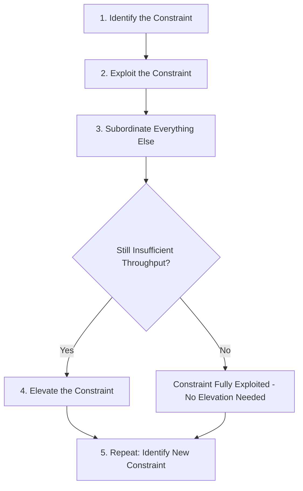
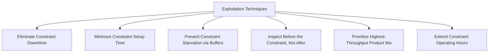
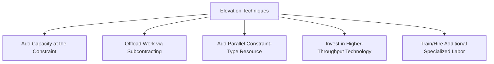
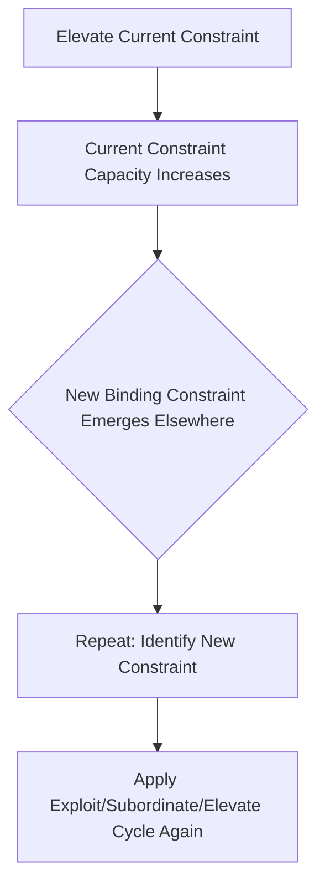

## Elevating and Exploiting Constraints

### Overview

Exploiting and elevating a constraint are the second and fourth steps of the Theory of Constraints five-focusing-steps methodology (Identify, Exploit, Subordinate, Elevate, Repeat), forming the core action-oriented phases of constraint management. Where bottleneck identification locates the constraint and Drum-Buffer-Rope subordinates the rest of the system to it, exploitation and elevation are the specific techniques for extracting maximum value from the existing constraint and, when necessary, permanently increasing its capacity.

### Positioning Within the Five Focusing Steps

**Key Points**

- The five focusing steps proceed in strict sequence: **Identify** the constraint (covered previously), **Exploit** the constraint (get the most out of it without spending capital), **Subordinate** everything else to the constraint's needs (implemented via Drum-Buffer-Rope), **Elevate** the constraint (invest capital to increase its capacity if exploitation and subordination are insufficient), and **Repeat** the cycle since a new constraint will emerge once the prior one is resolved
- The sequencing is deliberate: exploitation is placed before elevation specifically because it is typically far cheaper — often requiring no capital investment at all — and organizations following the methodology are expected to exhaust exploitation opportunities before committing capital to elevation, avoiding premature or unnecessary capacity investment
- This ordering directly parallels the broader capacity management principle introduced in earlier short-term capacity management material: cheaper, more reversible levers (analogous to exploitation) should generally be applied before more capital-intensive, less reversible ones (analogous to elevation)

### Exploiting the Constraint: Core Principle

**Key Points**

- **Exploitation** means extracting the maximum possible output from the constraint resource using its current capacity, without spending capital to increase that capacity — the guiding question is "how do we get the most out of what we already have?"
- Because every minute of lost time at the constraint is a minute of lost system throughput (unlike lost time at a non-bottleneck resource, which has no such consequence since it has surplus capacity), exploitation efforts specifically target eliminating any waste, delay, or inefficiency occurring *at* the constraint itself
- Exploitation is considered the most cost-effective lever in the entire Theory of Constraints toolkit, since it typically requires only process discipline, scheduling changes, and targeted management attention rather than capital expenditure

### Common Exploitation Techniques

**Key Points**

- **Eliminating constraint downtime**: ensuring the constraint resource never sits idle due to preventable causes — scheduled preventive maintenance timed to avoid constraint downtime during planned production windows, rapid response protocols for constraint breakdowns, and dedicated technical support prioritized to the constraint over other equipment
- **Minimizing setup/changeover time at the constraint**: since changeover time at the constraint directly consumes scarce constraint capacity, techniques such as SMED (Single-Minute Exchange of Die, introduced in earlier modular/flexible capacity design material) are especially high-value when applied specifically to the constraint resource, even if the same technique would offer lower marginal value if applied to a non-bottleneck resource
- **Ensuring the constraint is never starved for input**: this is the direct purpose of the constraint buffer in Drum-Buffer-Rope scheduling — protecting the constraint from ever waiting for upstream work to arrive, since starvation of the constraint represents permanently lost throughput
- **Ensuring only "good" (non-defective) work reaches the constraint**: quality control and inspection are often deliberately positioned *before* the constraint in the process flow, since a defective unit that reaches the constraint and consumes its scarce processing time, only to be scrapped afterward, represents a doubly costly loss of both the constraint's time and the input material
- **Prioritizing the constraint's product mix**: as established in the throughput accounting material, sequencing which products or jobs the constraint processes first — prioritizing by Throughput generated per unit of constraint time — maximizes the value extracted from the constraint's fixed available time
- **Extending constraint operating hours**: where feasible, running the constraint resource for additional hours (weekend operation, an extra shift dedicated to the constraint specifically, even while other stages remain on standard hours) directly increases available constraint capacity without requiring new equipment

### Illustration: Exploitation Impact on Effective Constraint Capacity

(svg_diagram) Effect of exploitation techniques on available constraint output without capital investment:

<svg xmlns="http://www.w3.org/2000/svg" viewBox="0 0 740 340" font-family="Helvetica, Arial, sans-serif">
<text x="370" y="24" text-anchor="middle" font-size="16" font-weight="bold" fill="#1a1a1a">Exploitation: Recovering Lost Constraint Capacity (svg_diagram)</text>

<text x="370" y="55" text-anchor="middle" font-size="11" fill="`#1a1a1a`">Available Constraint Time (100%)</text>

<rect x="80" y="70" width="580" height="50" fill="`#2b6cb0`" fill-opacity="0.2" stroke="`#2b6cb0`" />

<rect x="80" y="70" width="230" height="50" fill="#38a169" fill-opacity="0.6" stroke="#38a169" />
<text x="195" y="100" text-anchor="middle" font-size="10" fill="#fff">Productive Output (46%)</text>
<rect x="310" y="70" width="90" height="50" fill="#d64545" fill-opacity="0.5" stroke="#d64545" />
<text x="355" y="100" text-anchor="middle" font-size="9" fill="#fff">Downtime</text>
<rect x="400" y="70" width="80" height="50" fill="#dd6b20" fill-opacity="0.5" stroke="#dd6b20" />
<text x="440" y="100" text-anchor="middle" font-size="9" fill="#fff">Setup Time</text>
<rect x="480" y="70" width="90" height="50" fill="#805ad5" fill-opacity="0.5" stroke="#805ad5" />
<text x="525" y="100" text-anchor="middle" font-size="9" fill="#fff">Starvation Wait</text>
<rect x="570" y="70" width="90" height="50" fill="#666" fill-opacity="0.4" stroke="#666" />
<text x="615" y="100" text-anchor="middle" font-size="9" fill="#fff">Scrap/Rework</text>

<text x="370" y="160" text-anchor="middle" font-size="11" fill="`#1a1a1a`">After Exploitation: Downtime, setup, starvation, and scrap losses reduced</text>

<rect x="80" y="180" width="580" height="50" fill="`#2b6cb0`" fill-opacity="0.2" stroke="`#2b6cb0`" />

<rect x="80" y="180" width="420" height="50" fill="`#38a169`" fill-opacity="0.6" stroke="`#38a169`" />

<text x="290" y="210" text-anchor="middle" font-size="10" fill="#fff">Productive Output (72%) — Recovered Without Capital Investment</text>

<rect x="500" y="180" width="60" height="50" fill="`#d64545`" fill-opacity="0.3" stroke="`#d64545`" />

<rect x="560" y="180" width="50" height="50" fill="`#dd6b20`" fill-opacity="0.3" stroke="`#dd6b20`" />

<rect x="610" y="180" width="50" height="50" fill="`#805ad5`" fill-opacity="0.3" stroke="`#805ad5`" />

</svg>

### Elevating the Constraint: Core Principle

**Key Points**

- **Elevation** means increasing the constraint's capacity through capital investment or other resource commitment — the guiding question shifts from "how do we get more from what we have?" to "how do we add more capacity?" and is pursued only once exploitation and subordination have been fully applied and remain insufficient to meet required throughput
- Elevation directly corresponds to the long-term capacity expansion concepts covered in earlier material (incremental versus large-step expansion, modular/flexible capacity design, expansion under irreversible investment risk), specifically applied to the identified constraint resource rather than the process as a whole
- Because elevation requires capital investment, it should be evaluated using the same rigorous investment analysis frameworks covered in that earlier material — NPV analysis, real options consideration for demand uncertainty, and awareness of irreversibility risk — rather than pursued reflexively once a constraint is identified

### Common Elevation Techniques

**Key Points**

- **Adding capacity at the constraint resource itself**: purchasing additional equivalent equipment, adding a parallel unit of the constrained resource, or upgrading to higher-capacity equipment
- **Offloading work from the constraint**: redirecting a portion of the work currently requiring the constraint to an alternative path — subcontracting a specific processing step to an external vendor (directly connecting to the subcontracting lever from short-term capacity management material) so that only the remaining work continues to require the internal constraint resource
- **Adding a second, parallel constraint-type resource**: if the constraint is a specific machine type, adding a second machine of the same type directly increases the constraint's total capacity, though this converts a single-resource constraint into a multi-resource constraint requiring its own scheduling coordination
- **Investing in higher-throughput technology**: replacing the constraint resource with a fundamentally faster or higher-capacity version, which may also alter the underlying processing time distribution (potentially reducing variability as well as increasing raw capacity, with downstream benefits for buffer sizing as discussed in the Drum-Buffer-Rope material)
- **Cross-training or hiring additional specialized labor**: where the constraint is a scarce skill or labor type rather than equipment, elevation may take the form of training additional staff in that skill or hiring specialized personnel, directly connecting to the modular/flexible capacity design principles covered in long-term capacity planning

### Evaluating Elevation Decisions

**Key Points**

- Elevation decisions should be evaluated using the T/I/OE framework introduced previously: does the proposed elevation increase system Throughput by an amount that justifies the resulting increase in Operating Expense and/or Inventory investment, and does the resulting Net Profit and ROI improvement justify the capital outlay
- Because elevating the current constraint will, by definition, eventually cause a **different resource to become the new binding constraint** (the "Repeat" step), elevation decisions should ideally be sized with some awareness of where the next constraint is likely to emerge, to avoid either underinvesting (quickly hitting a new constraint at only marginally higher throughput) or overinvesting (adding far more capacity to the current constraint than the next-most-limiting resource can actually utilize)
- This connects directly to the long-term capacity expansion strategies covered previously: elevation decisions can be structured as incremental (smaller, more frequent capacity additions to the constraint, preserving flexibility) or as a larger single-step investment (capturing scale economies but committing more capital under demand uncertainty), with the same trade-off considerations applying as in general long-term capacity expansion planning

### The Danger of Skipping Exploitation

**Key Points**

- A commonly cited pitfall in Theory of Constraints practice is proceeding directly to elevation (capital investment) without first fully exploiting the existing constraint, resulting in unnecessary capital expenditure to solve a problem that could have been resolved through process discipline and scheduling changes alone
- Organizations under pressure to increase output quickly sometimes default to capacity investment as the visible, decisive-seeming action, while exploitation techniques (eliminating downtime, minimizing changeover, improving scheduling discipline) can appear less immediately impressive despite often delivering comparable throughput gains at a small fraction of the cost
- Inertia and organizational silos can also work against effective exploitation, since fully exploiting a constraint often requires coordinated changes across multiple departments (maintenance scheduling, quality control placement, production scheduling, staffing) rather than a single localized fix, whereas an elevation decision (e.g., "buy another machine") can sometimes be executed by a single department in isolation

### Interaction With the Broader Capacity Management Framework

**Key Points**

- Exploitation is conceptually the Theory of Constraints analog to the short-term capacity management levers covered earlier (overtime, subcontracting, temporary labor, scheduling flexibility) — both emphasize extracting maximum value from existing resources before committing to structural change, though exploitation specifically targets the constraint resource with surgical precision rather than applying these levers uniformly across the whole process
- Elevation is the Theory of Constraints analog to long-term capacity expansion (incremental versus large-step expansion, modular/flexible capacity design, investment under irreversibility risk), applied specifically and deliberately to the resource identified as the true system constraint, rather than applied as generic across-the-board capacity growth
- Together, exploitation and elevation embody the broader principle that capacity management decisions should be targeted at the specific resource that actually limits system performance, sequenced from lowest-cost/most-reversible interventions to highest-cost/least-reversible ones — a principle that recurs throughout this entire course of study, from short-term labor levers through long-term capital investment

**Related Topics**

- Identifying bottlenecks in a process
- Drum-Buffer-Rope scheduling and buffer management
- Throughput, Inventory, and Operating Expense (T/I/OE framework)
- SMED and setup-time reduction techniques
- Incremental versus one large-step expansion (applied to constraint elevation)
- Overtime, subcontracting, and temporary labor (parallel to exploitation techniques)
- Real options and irreversible investment risk in constraint elevation decisions