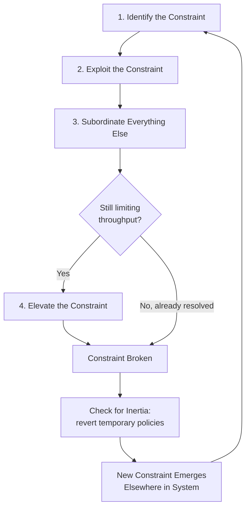

## Continuous Improvement Through Constraint Management

### Overview

Continuous improvement through constraint management is the application of the **Theory of Constraints (TOC)**, developed by Eliyahu Goldratt, as an ongoing operational discipline rather than a one-time fix. The core premise is that any system has at most a small number of true constraints (bottlenecks) limiting its overall throughput at any given time, and sustained improvement comes from a repeatable cycle of identifying, exploiting, subordinating, elevating, and re-identifying that constraint.

### The Five Focusing Steps (5FS)

This is the central iterative loop of TOC-based continuous improvement.

1. **Identify** the constraint — locate the resource, policy, or process step that limits system throughput.
2. **Exploit** the constraint — get maximum output from the constraint without spending capital (better scheduling, eliminating idle time, reducing setup/changeover time).
3. **Subordinate** everything else — align all non-constraint resources to support the constraint's schedule, even if this creates idle capacity elsewhere.
4. **Elevate** the constraint — if exploitation and subordination aren't enough, invest in additional capacity (new equipment, staffing, outsourcing).
5. **Repeat** — once a constraint is broken, a new one emerges elsewhere in the system. Return to Step 1 and avoid **inertia** (letting old policies/decisions linger and become the new limiting factor).

$$\text{Throughput}_{system} = \min(\text{Capacity}_1, \text{Capacity}_2, \ldots, \text{Capacity}_n)$$

The system's throughput is bounded by the weakest link, not the sum or average of all resources.

### Why "Continuous" Matters

A single pass through the 5FS improves the system once. Treating it as continuous improvement means:

- **Institutionalizing the cycle**: constraint identification becomes a recurring cadence (daily standups, weekly ops reviews) rather than a project.
- **Avoiding local optimization traps**: improving non-constraint resources ("efficiency theater") does not raise system throughput and can even worsen it by creating excess work-in-process (WIP) upstream of the constraint.
- **Managing constraint migration**: as constraints shift (from a machine, to a policy, to the market, to management capacity itself), the organization must have a standing process to detect the shift rather than rediscovering it painfully after a throughput drop.

### Types of Constraints Encountered Over Iterations

| Constraint Type | Description | Typical Resolution |
| --- | --- | --- |
| Physical/Capacity | A machine, workstation, or person with insufficient throughput capacity | Exploit via scheduling; elevate via added capacity |
| Policy | Internal rules (batch sizes, approval chains, shift rules) that limit flow | Revise or eliminate the policy; often free to fix |
| Market | Demand is lower than production capacity | Shift focus to sales/marketing, product differentiation |
| Supplier | External supply chain limits input availability | Buffer management, dual-sourcing, supplier collaboration |
| Managerial/Paradigm | Outdated mental models or measurement systems drive suboptimal local decisions | Change performance metrics (e.g., from cost-based to throughput-based) |

### Throughput Accounting as a Feedback Mechanism

TOC pairs constraint management with **Throughput Accounting (TA)**, which provides the measurement lens for judging whether an improvement action actually helps:

- **Throughput (T)**: rate of generating money through sales — $T = \text{Sales Revenue} - \text{Totally Variable Cost}$
- **Investment/Inventory (I)**: money tied up in the system (raw materials, WIP, equipment)
- **Operating Expense (OE)**: money spent turning Investment into Throughput

$$\text{Net Profit} = T - OE$$

$$\text{ROI} = \frac{T - OE}{I}$$

An improvement action is only genuinely valuable if it increases $T$, decreases $I$, or decreases $OE$ **at the system level** — not merely at a local workstation.

### Buffer Management as a Continuous Signal

Buffer management (time buffers, stock buffers, capacity buffers placed before/after the constraint) doubles as an ongoing improvement signal system:

- **Green zone** (buffer largely full): no action needed.
- **Yellow zone** (buffer partially consumed): monitor closely.
- **Red zone** (buffer critically consumed): immediate expediting action required.

Recurring red-zone penetration at a specific point reveals where the *next* constraint is forming, feeding directly back into Step 1 of the 5FS — this is the mechanism that makes the cycle self-sustaining rather than requiring a fresh top-down analysis each time.

### Process Flow (svg_diagram)

### Practical Example

A software delivery team (analogous structure applies to Batac-DMS-style project workflows) notices releases are consistently delayed at the QA stage.

1. **Identify**: QA testing throughput (tickets verified/day) is lower than development throughput (tickets completed/day) — QA is the constraint.
2. **Exploit**: Reprioritize QA to test highest-value/highest-risk tickets first; eliminate QA idle time caused by waiting for dev environment resets; batch similar test types together to reduce context-switching.
3. **Subordinate**: Developers slow down new feature starts and instead pull in to write more detailed test cases and reproducible bug reports, reducing QA's investigation overhead, even though this looks like "reduced developer output."
4. **Elevate**: If backlog still grows, invest in test automation tooling or add a QA engineer.
5. **Repeat**: Once QA throughput matches or exceeds development, the constraint may shift to code review turnaround or deployment approval — the cycle restarts on the new bottleneck.

### Common Pitfalls

- **Local efficiency bias**: Rewarding every resource for maximum utilization creates excess WIP at non-constraints and starves or overloads the true constraint.
- **Failure to subordinate**: Exploiting the constraint without adjusting upstream/downstream processes causes chaos (e.g., upstream keeps overproducing, downstream can't absorb output).
- **Constraint blindness after elevation**: Teams often stop the cycle after one successful fix, missing that a new constraint has already formed. [Inference] this is one of the most frequently cited failure modes in TOC case studies, though the exact frequency is not independently benchmarked across industries.
- **Metric misalignment**: Using cost-accounting metrics (e.g., machine utilization %) instead of throughput-based metrics can directly contradict TOC recommendations and cause managers to fight the system's true improvement direction.

### Related Topics

- Drum-Buffer-Rope (DBR) scheduling methodology
- Critical Chain Project Management (CCPM)
- Throughput Accounting vs. Cost Accounting decision-making
- Little's Law and its relationship to WIP and cycle time
- Lean Manufacturing and Six Sigma integration with TOC ("TOC-Lean-Six Sigma" hybrid models)
- Constraint identification in knowledge-work systems (vs. manufacturing)