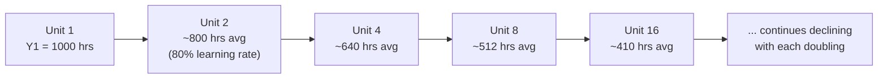

## Historical Origins in Aircraft Manufacturing

### Overview

The learning curve concept, as a quantitative model of cost/time reduction with cumulative production, originates from empirical observations in the U.S. aircraft manufacturing industry during the 1920s–1930s. It formalized the intuitive idea that workers and organizations become more efficient at a task as they repeat it, but did so with a specific mathematical relationship that proved robust enough to become an industrial planning standard.

### T.P. Wright and the 1936 Study

The foundational contribution came from **Theodore Paul Wright**, an engineer at Curtiss-Wright Corporation, in his 1936 paper *"Factors Affecting the Cost of Airplanes"* published in the *Journal of the Aeronautical Sciences*.

- Wright analyzed labor-hour data from airframe assembly and observed that as cumulative production of a given aircraft model doubled, the labor hours required per unit decreased by a **consistent percentage**.
- He proposed that direct labor input per unit follows a power-law relationship with cumulative output, rather than declining linearly or leveling off after a fixed number of units.
- This became known as **Wright's Law** or the **cumulative average model** of the learning curve.

### The Mathematical Formulation

Wright's model expresses the cumulative average labor hours per unit as:

$$Y_x = Y_1 \cdot x^{b}$$

Where:

- $Y_x$ = cumulative average labor hours (or cost) for the $x$-th unit
- $Y_1$ = labor hours (or cost) for the first unit
- $x$ = cumulative unit count
- $b = \frac{\ln(\text{learning rate})}{\ln(2)}$, a negative exponent derived from the learning rate

The **learning rate** (e.g., 80%, commonly observed in airframe assembly) means that every time cumulative production doubles, the cumulative average labor hours fall to 80% of their prior value.

### Why Aircraft Manufacturing Was the Origin Point

Several conditions specific to 1920s–30s aircraft production made the phenomenon both visible and measurable:

- **High labor content**: Airframe assembly was overwhelmingly manual (riveting, fitting, wiring), making labor-hour tracking a direct and sensitive proxy for process efficiency.
- **Long production runs of standardized designs**: Military procurement (especially ramping into WWII-era production) created large, consistent batches of identical airframes, giving analysts enough data points to observe the doubling pattern clearly.
- **Government cost oversight**: Military contracts required detailed cost accounting, which generated the labor-hour records Wright and later analysts could mine.
- **Rapidly scaling output**: Wartime production quotas caused output to scale by orders of magnitude in short periods, making the doubling-based decline dramatic and easy to detect statistically, as opposed to industries with slower or more sporadic production growth.

### From Wright's Law to Broader Adoption

- **World War II production planning**: The U.S. Army Air Forces and aircraft manufacturers (e.g., Boeing, Douglas, North American Aviation) used learning-curve-based forecasts to plan labor requirements, contract pricing, and delivery schedules for bomber and fighter production.
- **RAND Corporation and Boston Consulting Group**: In the 1960s, researchers generalized the concept beyond direct labor to total unit cost (materials, overhead, capital), producing the related but distinct **experience curve** used in strategic management and pricing.
- **Distinction from the experience curve**: The original aircraft-manufacturing learning curve models *labor hours per unit*; the later experience curve models *total real unit cost* and includes effects beyond individual worker learning (economies of scale, process/technology improvements, product redesign).

### Two Competing Model Forms

Historically, two mathematical formulations emerged from this lineage and are still both used in industrial engineering:

| Model | Formula | What It Represents |
| --- | --- | --- |
| Cumulative Average Model (Wright's Law) | $Y_x = Y_1 x^b$ | Average labor hours across all units up to unit $x$ |
| Unit/Incremental Model (Crawford's Law) | $Y_x = Y_1 x^b$ (applied per-unit, not cumulative average) | Labor hours for the *specific* $x$-th unit only |

**Crawford's Law**, attributed to J.R. Crawford at Lockheed in the same era, models the marginal unit's labor hours directly rather than the cumulative average — the two forms are frequently confused but yield different total labor-hour projections for the same dataset.

### Diagram: Cumulative Average Decline (svg_diagram)

### Worked Example

Given a first unit requiring 1,000 labor hours and an 80% learning rate ($b = \ln(0.8)/\ln(2) \approx -0.322$):

$$Y_2 = 1000 \times 2^{-0.322} \approx 800 \text{ hours (cumulative average)}$$

$$Y_4 = 1000 \times 4^{-0.322} \approx 640 \text{ hours (cumulative average)}$$

Each doubling of cumulative units (1→2→4→8→16) multiplies the cumulative average labor hours by 0.8, producing the characteristic decelerating decline curve rather than a linear one.

### Legacy and Continued Relevance

- Learning curve percentages derived from this original aircraft work (typically ranging 70–90% depending on process automation and complexity) remain reference benchmarks in aerospace and defense cost estimating today.
- U.S. Department of Defense cost-estimating handbooks and NASA cost models still cite Wright's and Crawford's formulations as the baseline learning curve models for major program cost projections. [Unverified] the exact learning-rate percentages currently used in specific modern DoD/NASA handbooks may have been revised since Wright's original publication and vary by program.
- The model's cross-industry generalization (shipbuilding, semiconductor fabrication, software development effort estimation) traces its mathematical lineage directly back to this aircraft manufacturing origin.

### Related Topics

- Wright's Law vs. Crawford's Law: computational differences and when each applies
- The experience curve and Boston Consulting Group's strategic applications
- Learning rate estimation from empirical production data (regression techniques)
- Forgetting curves and learning curve resets after production breaks
- Application of learning curves to software development effort estimation