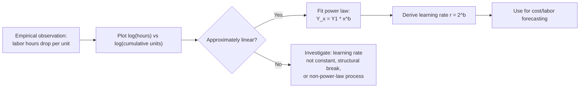

## Wright's Observation and Early Formulations

### Historical Origin

<svg viewBox="0 0 800 260" xmlns="http://www.w3.org/2000/svg">
<text x="400" y="24" text-anchor="middle" font-size="15" font-weight="bold" fill="#1a1a1a">Timeline of the Learning Curve's Early Formulation (svg_diagram)</text>
<line x1="60" y1="130" x2="740" y2="130" stroke="#333" stroke-width="2"/>
<circle cx="120" cy="130" r="6" fill="#2563eb"/>
<text x="120" y="160" text-anchor="middle" font-size="12" fill="#1a1a1a">1920s</text>
<text x="120" y="178" text-anchor="middle" font-size="11" fill="#444">Wright Field</text>
<text x="120" y="192" text-anchor="middle" font-size="11" fill="#444">observes cost</text>
<text x="120" y="206" text-anchor="middle" font-size="11" fill="#444">decline in</text>
<text x="120" y="220" text-anchor="middle" font-size="11" fill="#444">airframe labor</text>
<circle cx="400" cy="130" r="6" fill="#16a34a"/>
<text x="400" y="160" text-anchor="middle" font-size="12" fill="#1a1a1a">1936</text>
<text x="400" y="178" text-anchor="middle" font-size="11" fill="#444">T.P. Wright publishes</text>
<text x="400" y="192" text-anchor="middle" font-size="11" fill="#444">"Factors Affecting</text>
<text x="400" y="206" text-anchor="middle" font-size="11" fill="#444">the Cost of Airplanes"</text>
<text x="400" y="220" text-anchor="middle" font-size="11" fill="#444">Journal of Aeronautical Sciences</text>
<circle cx="680" cy="130" r="6" fill="#d97706"/>
<text x="680" y="160" text-anchor="middle" font-size="12" fill="#1a1a1a">1940s+</text>
<text x="680" y="178" text-anchor="middle" font-size="11" fill="#444">Formalization into</text>
<text x="680" y="192" text-anchor="middle" font-size="11" fill="#444">"experience curve" /</text>
<text x="680" y="206" text-anchor="middle" font-size="11" fill="#444">"progress function"</text>
<text x="680" y="220" text-anchor="middle" font-size="11" fill="#444">by BCG & others</text>
</svg>

Theodore Paul Wright, an aeronautical engineer, documented a consistent pattern while studying labor-hour requirements at aircraft manufacturing plants in the 1920s–1930s. His formal publication appeared in 1936 in the *Journal of Aeronautical Sciences* under the title "Factors Affecting the Cost of Airplanes." He observed that the direct labor hours required to build an airframe declined by a consistent percentage each time cumulative production doubled.

This is distinct from, though related to, the general economic notion of "learning by doing" — Wright's specific contribution was the **mathematical regularity** of the decline, not merely the qualitative observation that workers improve with repetition.

### The Core Empirical Claim

Wright's central finding: every time cumulative unit production doubles, the labor input per unit falls by a fixed percentage. This percentage is called the **learning rate** (or, in its complement form, the **progress ratio**).

**Key Points**

- The relationship is expressed in *cumulative* units produced, not elapsed time
- The decline rate is constant in percentage terms across doublings — not a fixed absolute amount
- Originally measured specifically for direct labor hours per airframe, not total cost or overhead
- The pattern held across multiple aircraft models Wright studied, suggesting a general phenomenon rather than a one-off

### The Original Mathematical Formulation

Wright expressed the relationship as a power function:

$$Y_x = Y_1 \cdot x^{b}$$

Where:

- $Y_x$ = labor hours (or cost) required to produce the $x$-th unit
- $Y_1$ = labor hours required to produce the first unit
- $x$ = cumulative unit number
- $b$ = the learning index (a negative exponent, since cost decreases)

The learning index $b$ relates to the learning rate $r$ (expressed as a decimal, e.g., 0.80 for an "80% curve") by:

$$b = \frac{\ln(r)}{\ln(2)}$$

**Example**

For an 80% learning curve ($r = 0.80$):

$$b = \frac{\ln(0.80)}{\ln(2)} = \frac{-0.2231}{0.6931} \approx -0.3219$$

If the first unit takes 1,000 labor hours ($Y_1 = 1000$), the 2nd, 4th, and 8th units require:

- $Y_2 = 1000 \cdot 2^{-0.3219} \approx 800$ hours (80% of $Y_1$, by definition)
- $Y_4 = 1000 \cdot 4^{-0.3219} \approx 640$ hours (80% of $Y_2$)
- $Y_8 = 1000 \cdot 8^{-0.3219} \approx 512$ hours (80% of $Y_4$)

This doubling-based decay is the defining signature of Wright's Law, distinguishing it from linear or exponential-in-time cost reduction models.

### Two Variants: Unit Curve vs. Cumulative Average Curve

Wright's original data and subsequent formalizations split into two related but distinct models:

**Unit Model (Wright's original formulation)**

$$Y_x = Y_1 \cdot x^{b}$$

Describes the labor hours for the $x$-th individual unit.

**Cumulative Average Model (Crawford / later variant)**

$$\bar{Y}_x = Y_1 \cdot x^{b}$$

Describes the *average* labor hours across all units produced through unit $x$. Total cumulative hours are then $\bar{Y}_x \cdot x$.

[Unverified] The precise attribution of the cumulative-average variant to a specific individual (commonly cited as J.R. Crawford at Lockheed) is repeated across secondary sources but the primary original documentation is not as widely accessible as Wright's 1936 paper itself; treat the attribution as historically probable rather than fully confirmed.

These two variants produce meaningfully different numeric predictions for total program cost and are a common source of confusion when learning curve analyses are compared across studies without stating which model was used.

### Log-Linear Representation

Because the underlying function is a power law, taking logarithms of both sides linearizes it — this was central to how Wright and later analysts fit empirical data using slide-rule and graphical methods before computational regression was routine:

$$\log(Y_x) = \log(Y_1) + b \cdot \log(x)$$

Plotted on log-log paper, this produces a straight line with slope $b$. This graphical property is why learning curves are often visually presented on log-log axes — a straight line is the empirical signature confirming (or disconfirming) that a power-law learning relationship holds.

### Assumptions Embedded in Wright's Original Model

- **Constant learning rate**: the percentage improvement per doubling does not change over the production run
- **No plateau**: the pure power law implies asymptotic but never-terminating improvement (in practice, real processes plateau — this is a known limitation, not part of Wright's original claim)
- **Homogeneous product**: the units being produced are essentially the same design; major design changes were understood by Wright to reset or disrupt the curve
- **Uninterrupted production**: gaps in production (tooling changes, shutdowns) were empirically observed to cause "forgetting," partially reversing accumulated learning — Wright's original work primarily addressed continuous production runs

### Why Cumulative Production, Not Time

A frequently misunderstood aspect of Wright's formulation: the independent variable is **cumulative units produced**, not calendar time or elapsed labor hours. Two factories producing at different rates would, under Wright's model, still exhibit the same percentage cost reduction per doubling of output — just reaching each doubling at different calendar dates. This was a deliberate and important distinction Wright drew, since it implied the driver of cost reduction was experience/repetition itself, not the mere passage of time.

### Relationship to Later Terminology

Wright's original term was framed around labor hours in airframe manufacturing. Later extensions and renamings include:

- **Learning curve**: general term, often used interchangeably, sometimes restricted to labor-hour effects at the individual/task level
- **Experience curve**: term popularized by the Boston Consulting Group (1960s), extended to cover *all* costs (not just labor), including overhead, materials, and capital
- **Progress function** / **Progress curve**: alternative names used in industrial engineering literature, sometimes emphasizing the general power-law form independent of the specific cost driver

[Inference] The shift from "labor hours" (Wright) to "total cost" (BCG's experience curve) represents a substantive theoretical broadening, not merely a renaming — it assumes the same power-law dynamic applies to categories of cost Wright did not originally study. This extension's validity is discussed further under the Experience Curve chapter topic, not this one.

### Limitations and Later Critiques (Foundational Context)

- Wright's original curves were fitted from a limited number of airframe programs; the generality of a fixed learning rate across unrelated industries was assumed by later adopters, not empirically demonstrated by Wright himself
- Behavior may vary considerably in industries with different labor-to-capital ratios, batch sizes, or automation levels, so the specific numeric learning rate is not a universal constant
- No mechanism was originally specified — Wright documented the *pattern*, not the underlying causal drivers (worker skill, tooling refinement, process redesign, supervision effects), which later researchers attempted to decompose

**Next Steps**

- Boston Consulting Group's Experience Curve and its generalization beyond labor cost
- Unit curve vs. cumulative average curve: computational differences in cost forecasting
- Sources of learning: Dutton & Thomas's decomposition of learning-curve drivers
- Plateau effects and the limits of pure power-law extrapolation
- Organizational forgetting and production-break effects on the curve
- Statistical fitting methods for empirical learning rate estimation (log-linear regression, nonlinear least squares)