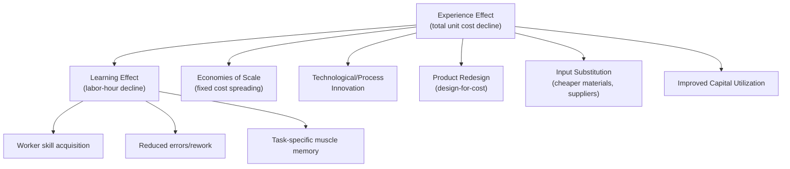

## Distinguishing the Learning Effect from the Experience Effect

### Core Distinction

The two terms are often used interchangeably in casual usage, but in the formal capacity-planning and strategy literature they refer to conceptually distinct — though overlapping — phenomena. Conflating them is a common source of forecasting error.

**Key Points**

- **Learning effect**: narrow, refers specifically to the decline in *direct labor hours* (or task-completion time) per unit as a specific task is repeated — this is Wright's original 1936 observation
- **Experience effect**: broad, refers to the decline in *total unit cost* (labor + materials + overhead + capital + distribution + marketing, etc.) as *cumulative production/output* increases across an entire business or product line
- The experience effect subsumes the learning effect as one of several contributing mechanisms, not a synonym for it
- The experience curve concept was formalized primarily by the Boston Consulting Group (BCG) in the 1960s–70s, building on but substantially extending Wright's narrower labor-hours framework

### Conceptual Hierarchy

The experience effect is the umbrella empirical pattern (total cost falls a fixed percentage per doubling of cumulative volume); the learning effect is one specific, well-documented mechanism that contributes to that decline, isolated at the level of direct labor input on a repeated task.

### Scope Comparison Table

| Dimension | Learning Effect | Experience Effect |
| --- | --- | --- |
| Originator | T.P. Wright (1936) | BCG (Bruce Henderson, 1960s) |
| Cost scope | Direct labor hours only | Total value-added cost (labor, overhead, capital, materials) |
| Unit of measurement | Labor hours per unit | Real (inflation-adjusted) cost per unit |
| Primary driver | Individual/team skill acquisition | Multiple: learning, scale, technology, redesign, substitution |
| Typical context | Manufacturing task, single plant | Entire product line, potentially multi-plant/multi-firm |
| Mathematical form | Power law: $Y_x = Y_1 x^{b}$ | Same power-law form applied to a broader cost base |
| Resets on... | New task/design; production breaks | Also resets/shifts on scale-driven structural change (e.g., automation investment) |

### Why the Distinction Matters for Capacity Planning

[Inference] Treating "experience curve" cost declines as if they were purely attributable to labor learning leads planners to over-predict how much of the cost reduction is under the direct control of workforce training or repetition, when in practice a meaningful share may come from capital investment, scale economies, or supplier renegotiation — factors with entirely different lead times, capital requirements, and risk profiles than workforce learning.

Practical implications:

- **Staffing/training decisions** should be modeled against the *learning* curve specifically (labor hours per unit), since that is the component actually responsive to training investment and task repetition
- **Pricing and competitive strategy** decisions (the classic BCG use case) should be modeled against the *experience* curve, since competitors' relative cost position depends on total cost, not labor hours alone
- A firm can exhibit strong experience-curve cost decline while having a flat or weak learning curve, if the majority of its cost reduction comes from scale-driven capital efficiency or automation rather than labor skill — automation, in fact, tends to *substitute for* the labor learning effect over time even as it may *reinforce* the broader experience effect

### Mathematical Formulation of Each

Both are conventionally fit to the same power-law form, differing only in which cost variable $Y$ represents:

**Learning effect:**

$$L_x = L_1 \cdot x^{b_L}$$

where $L_x$ is direct labor hours for the $x$-th unit.

**Experience effect:**

$$C_x = C_1 \cdot x^{b_E}$$

where $C_x$ is total real unit cost at cumulative volume $x$.

Because $C_x$ includes cost categories with their own independent decline dynamics (e.g., capital cost amortization, which may decline for reasons unrelated to labor learning), $b_E$ and $b_L$ are generally **not required to be equal**, and empirically are often found to differ — $|b_E|$ can exceed $|b_L|$ when scale and technology effects compound on top of pure labor learning, though the reverse is also observed in labor-intensive, low-automation industries.

**Example**

Consider a firm producing electronic components:

- Direct labor hours per unit fall from 10 to 8 hours between cumulative unit 100 and unit 200 (an 80% learning curve applied to labor alone: $8/10 = 0.80$)
- Total unit cost over the same doubling falls from $50 to $38 (a 76% experience curve: $38/50 = 0.76$)

The gap between 80% and 76% is attributable to non-labor contributors — perhaps a supplier discount negotiated at higher volumes, or fixed tooling costs spread over more units. Isolating the labor-only figure (80%) versus the blended figure (76%) is essential if the planning question is "how much additional training will reduce assembly time" versus "how should we price against a competitor at 2x our volume."

### Common Sources of Conflation in Practice

- Aggregate cost data reported by finance/accounting systems frequently bundles labor and overhead, making it difficult to isolate the pure learning-effect labor curve without operational (not just financial) data
- Casual industry usage of "the learning curve is steep" often actually describes experience-curve (total cost) dynamics, especially in tech/software or semiconductor contexts (e.g., "chip fabrication has a steep learning curve") where labor is a small fraction of total cost and the dominant driver is yield improvement and capital utilization, not worker skill
- [Unverified] The degree to which popular business commentary distinguishes these terms rigorously varies significantly by source; assume ambiguity unless a source explicitly specifies which cost base ($ labor-only vs. total cost) its stated percentage refers to

### Diagram: Divergence of the Two Curves Over Cumulative Volume

<svg xmlns="http://www.w3.org/2000/svg" viewBox="0 0 800 380">
<text x="400" y="24" text-anchor="middle" font-size="15" font-weight="bold" fill="#1a1a1a">Learning Effect vs. Experience Effect Over Cumulative Volume (svg_diagram)</text>
<line x1="70" y1="320" x2="740" y2="320" stroke="#333" stroke-width="2" />
<line x1="70" y1="320" x2="70" y2="50" stroke="#333" stroke-width="2" />
<text x="400" y="355" text-anchor="middle" font-size="12" fill="#1a1a1a">Cumulative Units Produced (log scale)</text>
<text x="30" y="185" text-anchor="middle" font-size="12" fill="#1a1a1a" transform="rotate(-90 30 185)">Cost / Labor Hours (log scale)</text>
<path d="M 90 80 Q 250 140 400 175 T 720 220" stroke="#2563eb" stroke-width="2.5" fill="none" />
<text x="600" y="200" font-size="12" fill="#2563eb" font-weight="bold">Experience Curve (total cost)</text>
<path d="M 90 80 Q 250 150 400 200 T 720 250" stroke="#16a34a" stroke-width="2.5" fill="none" stroke-dasharray="6,4" />
<text x="600" y="270" font-size="12" fill="#16a34a" font-weight="bold">Learning Curve (labor only)</text>
<text x="90" y="70" font-size="11" fill="#444">Unit 1</text>
<text x="700" y="70" font-size="11" fill="#444">Unit N (large cumulative volume)</text>
</svg>

The gap between the two curves widens as cumulative volume grows, representing the increasing share of cost reduction attributable to non-labor mechanisms (scale, capital, technology) relative to pure labor learning — a pattern especially pronounced in capital-intensive or automation-heavy industries.

### Empirical Identification Challenge

Distinguishing which effect is driving observed cost decline in a given dataset typically requires:

- Disaggregated cost accounting (separating labor hours from materials, overhead, and capital charges)
- Controlling for concurrent scale changes (plant expansions, new equipment) that would affect the experience curve without necessarily reflecting labor learning
- Controlling for input price changes (e.g., falling component prices unrelated to the firm's own production experience) which can distort experience-curve measurements if not deflated properly

[Inference] Because true separation requires granular operational data rarely available outside the firm itself, most published "learning curve" percentages in industry benchmarks and consulting reports are more accurately characterized as blended experience-curve figures, even when labeled as learning curves.

**Related Topics**

- Boston Consulting Group's Experience Curve framework and strategic implications
- Sources of learning: decomposing labor learning from scale, technology, and design effects (Dutton & Thomas taxonomy)
- Economies of scale vs. economies of experience: static vs. dynamic cost advantages
- Organizational forgetting and its differential effect on labor learning vs. capital-driven cost curves
- Deflation and real-cost adjustment methods in experience-curve estimation