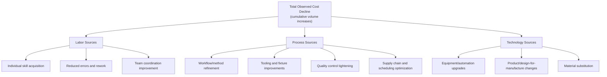

## Sources of Learning: Labor, Process, and Technology

### Overview

The aggregate decline observed in a learning or experience curve is not a single homogeneous phenomenon — it is the composite result of several distinct underlying mechanisms. Decomposing "why cost falls with cumulative volume" into its component sources is essential for capacity planners because each source has a different lead time, cost, controllability, and durability. This decomposition is most closely associated with the taxonomy developed by Dutton and Thomas (1984), who analyzed variance in progress ratios across firms and attributed it to distinguishable causal categories.

### The Three-Way (and Extended) Taxonomy

**Key Points**

- Labor-source learning is what Wright originally measured; it is the most "human capital"-centric and the slowest to scale beyond the individual/team level
- Process-source learning is organizational rather than individual — it persists even as individual workers turn over, since it is embedded in documented procedures, jigs, and standard work
- Technology-source learning is capital-embodied — it requires investment and is realized in discrete jumps (a new machine, a redesigned part) rather than continuous incremental improvement
- The relative contribution of each source varies substantially by industry: labor-intensive assembly work skews toward labor and process sources; capital-intensive/automated manufacturing (semiconductors, chemicals) skews toward technology sources

### Labor-Based Learning

This is the mechanism closest to Wright's 1936 original observation: as an individual or team repeats a specific motor or cognitive task, task-completion time falls due to:

- **Motor skill refinement** — physical dexterity and motion economy improve with repetition (classic industrial engineering "learning by doing")
- **Reduced hesitation and decision time** — workers internalize sequencing and no longer need to consult instructions or supervisors
- **Error and rework reduction** — fewer defective units mean less time is spent redoing work, which shows up as an effective decline in net labor hours per good unit produced
- **Team coordination** — in multi-person assembly, coordination overhead (handoffs, waiting, communication) falls as the team develops shared routines

[Inference] Labor-based learning curves are generally understood in the literature to plateau faster than process or technology-based improvements, since there is a physiological/cognitive ceiling to how much faster a fixed motor task can be performed — this is a widely cited characteristic of the mechanism rather than a universal quantitative law, and the specific plateau point is task- and individual-dependent.

**Characteristics relevant to planning:**

- Fastest to *begin* improving (starts from unit 1)
- Most sensitive to workforce turnover — new hires reset individual (though not necessarily team-level) learning
- Most directly responsive to training investment
- Bounded improvement ceiling — cannot continue indefinitely under a fixed task design

### Process-Based Learning

Process-source improvement operates at the organizational and workflow level rather than the individual level:

- **Method study and standard work revision** — formal industrial engineering review of the sequence of operations, identifying and eliminating non-value-added steps
- **Jigs, fixtures, and workstation ergonomics** — physical aids that make a task easier or faster regardless of who performs it
- **Quality control and defect-cause elimination** — statistical process control (SPC) identifying and removing systematic sources of variation and defects
- **Scheduling, batching, and supply-chain refinement** — reducing setup times, improving material flow, and reducing work-in-process inventory

**Key distinction from labor-based learning**: process improvements are typically captured in documentation, tooling, or physical plant changes, and therefore **persist independent of individual worker tenure**. A process improvement made by an engineer redesigning a workstation layout benefits every future worker at that station, whereas a skilled worker's individual dexterity does not automatically transfer to a replacement.

**Example**

A circuit-board assembly line initially requires manual component placement (labor-driven learning: workers get faster over the first several hundred units). An industrial engineer then redesigns the workstation with a color-coded parts tray and a fixture that constrains component orientation (process-driven improvement): this produces a discrete step-change reduction in cycle time and defect rate that benefits every worker at that station from that point forward, independent of individual tenure — distinct in character from the smooth, continuous decline of pure labor learning.

### Technology-Based Learning

Technology-source improvement is embodied in capital equipment, product design, or material choices rather than in workflow or worker skill:

- **Automation and equipment upgrades** — replacing manual steps with machine-performed steps, which can shift the effective learning curve of the *machine's* output rather than a human's
- **Design-for-manufacture (DFM) changes** — redesigning the product itself to require fewer parts, simpler assembly steps, or more manufacturable tolerances
- **Material and component substitution** — switching to materials or components that are cheaper, more consistent, or require less processing
- **Yield improvement** (especially relevant in semiconductor and chemical process industries) — increasing the fraction of units that meet specification on the first pass, which is often the dominant driver of cost decline in these industries and is realized through process/equipment tuning rather than direct labor skill

[Inference] In highly automated or capital-intensive industries, most of the industry's colloquially-labeled "learning curve" is a mislabeling of what is more accurately technology-driven yield and process improvement, since direct labor is a small fraction of total cost in these contexts — this reasoning follows from the definitions above rather than being a specific empirical claim about any one firm's cost structure.

**Characteristics relevant to planning:**

- Requires upfront capital investment; improvement is realized in discrete jumps tied to investment timing, not continuously with cumulative volume
- Largely turnover-insensitive (embodied in equipment/design, not people)
- Often the dominant driver of cost decline in industries where direct labor is a small cost share
- Carries capital risk (the investment may not pay back if volume assumptions are wrong) distinct from the near-zero-marginal-cost nature of labor-learning-based improvement

### Comparative Table

| Source | Locus of Improvement | Turnover Sensitivity | Improvement Pattern | Typical Investment Required |
| --- | --- | --- | --- | --- |
| Labor | Individual/team skill | High | Continuous, decelerating | Low (training time only) |
| Process | Workflow, documentation, tooling | Low | Discrete steps + continuous refinement | Moderate (engineering time, minor capital) |
| Technology | Equipment, product design, materials | Very low | Discrete jumps | High (capital expenditure) |

### Mathematical Note: Decomposition Is Not Directly Observable from Aggregate Data

The standard power-law fit,

$$C_x = C_1 \cdot x^{b}$$

estimates a single blended exponent $b$ from aggregate cost or time data. This exponent does not, by itself, reveal the relative contribution of labor, process, and technology sources — the decomposition requires either:

- Controlled experiments/audits isolating one factor while holding others constant (rare in practice), or
- Structural/econometric modeling that includes proxy variables for process changes (e.g., dummy variables for known tooling upgrades) and technology investment (e.g., capital expenditure timing) to statistically partition the variance in $b$

[Unverified] The specific proportion of cost decline attributable to each source in any given empirical study is highly dependent on industry, task type, and study methodology; general statements in secondary literature about "labor accounts for X% of learning-curve effects" should be treated as context-specific findings rather than universal constants, and the original figures should be checked against the specific source and industry before being applied elsewhere.

### Diagram: Improvement Pattern Shape by Source

<svg xmlns="http://www.w3.org/2000/svg" viewBox="0 0 800 320">
<text x="400" y="24" text-anchor="middle" font-size="15" font-weight="bold" fill="#1a1a1a">Characteristic Improvement Patterns by Source (svg_diagram)</text>
<line x1="70" y1="270" x2="740" y2="270" stroke="#333" stroke-width="2" />
<line x1="70" y1="270" x2="70" y2="50" stroke="#333" stroke-width="2" />
<text x="400" y="300" text-anchor="middle" font-size="12" fill="#1a1a1a">Cumulative Volume / Time</text>
<path d="M 90 90 Q 200 180 320 220 T 560 250 T 720 258" stroke="#2563eb" stroke-width="2.5" fill="none" />
<text x="560" y="240" font-size="11" fill="#2563eb" font-weight="bold">Labor (smooth, plateaus)</text>
<path d="M 90 100 L 250 150 L 250 190 L 450 200 L 450 230 L 720 235" stroke="#16a34a" stroke-width="2.5" fill="none" />
<text x="460" y="190" font-size="11" fill="#16a34a" font-weight="bold">Process (step changes)</text>
<path d="M 90 110 L 350 110 L 350 160 L 620 160 L 620 210 L 720 210" stroke="#d97706" stroke-width="2.5" fill="none" />
<text x="500" y="150" font-size="11" fill="#d97706" font-weight="bold">Technology (discrete jumps at investment points)</text>
</svg>

### Implications for Capacity Planning

- **Workforce planning**: labor-source learning informs training curricula, staffing ramp-up schedules, and expectations for new-hire productivity ramp
- **Industrial engineering roadmaps**: process-source learning should be actively managed through scheduled kaizen/continuous-improvement cycles rather than assumed to happen passively
- **Capital budgeting**: technology-source learning requires explicit investment decisions and should be modeled as discrete capacity/cost step-functions in financial planning, not smoothed into a continuous curve
- Conflating the three sources when forecasting future cost declines risks both over-optimism (assuming technology-driven gains will continue without further capital investment) and under-investment (assuming labor training alone can achieve gains that actually require process redesign or automation)

**Next Steps**

- Dutton and Thomas's empirical taxonomy and progress-ratio variance study
- Standard work and industrial engineering methods for capturing process-based learning
- Capital investment timing and its effect on discrete learning-curve step changes
- Yield-curve dynamics in semiconductor and chemical process manufacturing
- Organizational forgetting: which sources of learning are most vulnerable to production interruptions