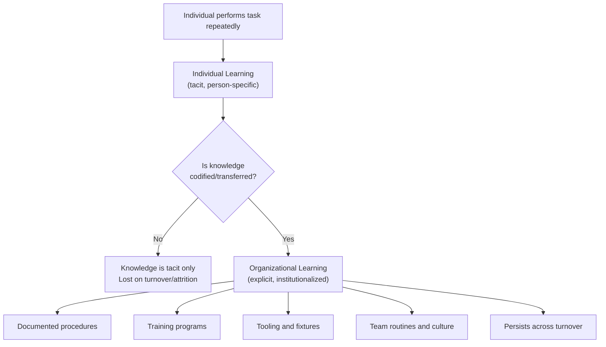

## Individual Learning versus Organizational Learning

### Core Distinction

Both phenomena produce the observable signature of a learning curve — declining time or cost per unit as cumulative repetitions increase — but they operate at different levels of aggregation, have different persistence properties, and respond differently to workforce changes. Conflating them leads to systematic errors in workforce transition planning, knowledge management investment, and forecasting the impact of turnover or facility relocation.

**Key Points**

- **Individual learning**: skill and speed improvement residing in a specific person, accumulated through their own personal repetition of a task
- **Organizational learning**: skill and efficiency improvement residing in the collective — embedded in documented procedures, shared routines, institutional knowledge, tooling, and culture — that persists independent of any single person's continued presence
- Individual learning is necessary but not sufficient to produce durable organizational learning; the transfer step (codification, training, knowledge management) is what converts one into the other
- The distinction closely parallels, but is not identical to, the labor/process source distinction from learning-curve decomposition — organizational learning is broader, also encompassing spillovers between individuals and across time that no single "process" artifact captures

### Conceptual Model

### Individual Learning

Individual learning is the mechanism most directly captured by Wright's original labor-hours formulation: a specific worker performing a specific task grows faster and more accurate through personal repetition.

**Characteristics:**

- **Tacit knowledge dominant** — much of what improves is procedural/motor knowledge that is difficult to articulate explicitly (Polanyi's "tacit knowledge" concept is frequently invoked in this context)
- **Person-bound** — the improvement does not automatically transfer when the individual leaves, is reassigned, or is absent
- **Fast onset, bounded ceiling** — begins improving from the very first repetition but is constrained by the individual's physiological and cognitive limits for that specific task
- **Directly measurable** via individual time-and-motion studies, though rarely tracked at this granularity outside specific industrial engineering contexts

[Inference] Because tacit, individually-held knowledge cannot be directly inventoried, its presence is usually inferred indirectly — for example, through an observed productivity drop following turnover — rather than measured directly during ordinary operations.

### Organizational Learning

Organizational learning refers to durable capability improvement at the level of the firm, team, or facility that survives the departure of any specific individual who contributed to it.

**Mechanisms of institutionalization:**

- **Codification** — converting tacit individual know-how into explicit documentation (standard operating procedures, work instructions, checklists)
- **Training systems** — formal onboarding and skill-transfer programs that accelerate new hires toward the productivity level previously achieved only through extended individual experience
- **Embedded artifacts** — jigs, fixtures, templates, software tools, and physical plant layout changes that encode process improvements independent of any person's memory
- **Routines and culture** — shared informal norms, communication patterns, and problem-solving approaches that a team develops collectively and transmits to new members through socialization rather than formal documentation
- **Organizational memory systems** — deliberate knowledge management infrastructure (wikis, case databases, post-mortem repositories) explicitly designed to retain lessons learned beyond any individual's tenure

**Characteristics:**

- **Slower onset** — typically lags individual learning, since codification and institutionalization require deliberate effort and time after the underlying individual knowledge exists
- **Turnover-resilient** — a well-institutionalized process retains most of its efficiency even as individual staff rotate, because the knowledge lives in the artifact/procedure rather than solely in people
- **Higher ceiling** — organizational learning can, in principle, continue accumulating indefinitely as new individual insights are continually captured and integrated, unlike the bounded ceiling of any single person's task-specific skill

### Comparative Table

| Dimension | Individual Learning | Organizational Learning |
| --- | --- | --- |
| Locus | Specific person | Team, department, or firm |
| Knowledge type | Predominantly tacit | Mix of explicit (documented) and tacit (culture/routines) |
| Persistence under turnover | Lost or significantly degraded | Substantially retained |
| Onset speed | Immediate (from first repetition) | Delayed (requires codification effort) |
| Improvement ceiling | Bounded by individual capability | Higher/less bounded; cumulative across contributors |
| Primary risk | Key-person dependency | Institutional inertia; codification lag; knowledge silos |
| Investment lever | Individual practice/repetition, personal coaching | Documentation systems, training programs, knowledge management tooling |

### The Turnover Test: Empirical Signature

A widely used diagnostic for separating the two in practice is to observe what happens to unit cost or cycle time when a substantial share of the experienced workforce is replaced:

- **If cost/time reverts sharply toward early-curve levels** → the observed learning was predominantly individual and tacit; little had been institutionalized
- **If cost/time dips only modestly and recovers quickly** → the observed learning was predominantly organizational; new hires are onboarded against a strong institutional base (documentation, training systems, embedded tooling) rather than needing to independently rediscover the same efficiencies

[Inference] This turnover-based diagnostic is a commonly cited heuristic in organizational learning literature for distinguishing the two mechanisms empirically, though the magnitude of reversion in any specific case depends heavily on how much of the relevant knowledge had actually been codified versus left tacit, and is not a strict quantitative law.

**Example**

A specialty manufacturing cell operates for two years with a stable team, reaching a mature per-unit cycle time through individual skill accumulation. If the entire team is replaced simultaneously and cycle time reverts close to first-year levels, this indicates the mature performance depended heavily on individual tacit skill with little institutionalization — a **key-person risk** exposure. Conversely, if a facility with a formal training academy, documented standard work, and purpose-built fixtures experiences 30% annual turnover yet maintains stable cycle times, this indicates the process has been substantially institutionalized — process- and technology-embedded learning (see the labor/process/technology decomposition) has substituted for dependence on any specific individual's tenure.

### Relationship to the Broader Learning-Curve Decomposition

Organizational learning overlaps substantially with, but is not identical to, the "process" and "technology" sources from the labor/process/technology decomposition:

- **Process-source improvements** (tooling, documented standard work, QC systems) are a primary *mechanism* by which individual learning becomes organizational learning
- **Technology-source improvements** (automation, DFM redesign) similarly institutionalize gains independent of any person, though they arise from engineering investment rather than from converting worker tacit knowledge
- Organizational learning additionally includes softer elements — team communication patterns, informal mentoring networks, and cultural problem-solving norms — that do not map cleanly onto either the process or technology categories, making it a somewhat broader construct than the sum of those two sources alone

### Mathematical Treatment: Modeling the Distinction

Individual and organizational learning are not typically fit as separate power-law curves from standard production data, since aggregate output does not by default distinguish "which worker" produced "which unit." Where the distinction is quantified, it is generally through:

- **Cross-sectional variance analysis** — comparing time-per-unit across individuals with different personal tenure but the same overall organizational tenure/training exposure, to isolate the individual-specific component
- **Structural break modeling** — fitting the aggregate curve $C_x = C_1 \cdot x^{b}$ separately before and after a known turnover event, and comparing the discontinuity magnitude and the post-event learning rate to the pre-event level
- **Panel/mixed-effects models** in organizational learning research, which include both individual-level random effects (capturing tenure-specific skill) and organization-level fixed effects (capturing the institutionalized baseline) to statistically decompose observed productivity into individual and organizational components

[Unverified] Formal econometric decomposition of this kind is more common in academic organizational-learning research than in day-to-day industrial capacity planning, where the turnover-event diagnostic described above is typically used as a simpler practical proxy; the availability and rigor of such analysis varies significantly by firm and industry, and specific published decomposition results should be checked against their original study context before being generalized.

### Diagram: Divergent Recovery Patterns After a Turnover Event

<svg xmlns="http://www.w3.org/2000/svg" viewBox="0 0 800 340">
<text x="400" y="24" text-anchor="middle" font-size="15" font-weight="bold" fill="#1a1a1a">Cycle Time Response to Workforce Turnover (svg_diagram)</text>
<line x1="70" y1="290" x2="740" y2="290" stroke="#333" stroke-width="2" />
<line x1="70" y1="290" x2="70" y2="50" stroke="#333" stroke-width="2" />
<text x="400" y="320" text-anchor="middle" font-size="12" fill="#1a1a1a">Time / Cumulative Volume</text>
<text x="30" y="200" text-anchor="middle" font-size="12" fill="#1a1a1a" transform="rotate(-90 30 200)">Cycle Time per Unit</text>
<line x1="400" y1="60" x2="400" y2="290" stroke="#999" stroke-width="1" stroke-dasharray="4,3" />
<text x="400" y="50" text-anchor="middle" font-size="11" fill="#666">Turnover Event</text>
<path d="M 90 250 Q 200 150 400 110" stroke="#dc2626" stroke-width="2.5" fill="none" />
<path d="M 400 110 L 410 250 Q 500 190 740 130" stroke="#dc2626" stroke-width="2.5" fill="none" stroke-dasharray="6,4" />
<text x="500" y="270" font-size="11" fill="#dc2626" font-weight="bold">Individual-dominated: sharp reversion</text>
<path d="M 90 260 Q 200 170 400 130" stroke="#2563eb" stroke-width="2.5" fill="none" />
<path d="M 400 130 L 410 155 Q 500 135 740 100" stroke="#2563eb" stroke-width="2.5" fill="none" stroke-dasharray="6,4" />
<text x="500" y="95" font-size="11" fill="#2563eb" font-weight="bold">Organization-dominated: modest, brief dip</text>
</svg>

### Implications for Capacity Planning

- **Key-person risk assessment**: processes with strong individual-learning dependence and weak institutionalization represent a specific operational risk category that should be explicitly flagged and mitigated (cross-training, documentation initiatives, succession planning)
- **Facility relocation/expansion planning**: replicating a process at a new site or with a substantially new workforce will re-incur individual learning costs even where organizational-level documentation exists, though the ramp-up should be faster than the original curve if institutionalization was strong at the source site
- **M&A and outsourcing due diligence**: evaluating whether a target's operational efficiency reflects durable organizational capability or fragile dependence on specific tenured individuals is a material consideration in valuing the transferability of that efficiency
- **Knowledge management investment justification**: the cost of codification efforts (documentation, training system development) can be framed as an investment in converting fragile individual learning into resilient organizational learning, reducing future turnover-driven cost volatility

**Related Topics**

- Tacit vs. explicit knowledge (Polanyi/Nonaka knowledge-creation frameworks)
- Sources of learning: labor, process, and technology (decomposition mechanics)
- Organizational forgetting and knowledge depreciation
- Key-person risk and succession planning in operations
- Knowledge transfer methods: documentation, training academies, and mentoring systems