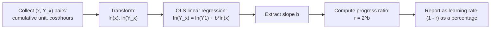

## Progress Ratio and Learning Rate Percentage

### Definitions

The **progress ratio** (also called the **learning curve slope** or simply the **curve percentage**) is the single most commonly cited summary statistic in learning-curve analysis. It quantifies how much cost or labor time is retained (not eliminated) each time cumulative production doubles.

**Key Points**

- **Progress ratio ($r$)**: the fraction of prior cost/time retained per doubling of cumulative output. An 80% progress ratio means each doubling reduces cost to 80% of its prior level
- **Learning rate ($1 - r$)**: the complementary fraction — the percentage *improvement* per doubling. An 80% progress ratio corresponds to a 20% learning rate
- These two terms are frequently used loosely and interchangeably in industry commentary ("an 80% learning curve") — always confirm from context whether "80%" refers to retained cost ($r$) or improvement ($1-r$), since misreading this inverts the entire forecast
- A **lower** progress ratio (e.g., 70%) indicates **faster** learning; a **higher** progress ratio (e.g., 95%) indicates **slower** learning; a ratio of 100% indicates no learning effect at all

### Mathematical Relationship to the Power-Law Exponent

Recall Wright's original formulation:

$$Y_x = Y_1 \cdot x^{b}$$

The progress ratio $r$ and the exponent $b$ are related by:

$$r = 2^{b}$$

equivalently

$$b = \frac{\ln(r)}{\ln(2)}$$

**Example**

For $b = -0.152$:

$$r = 2^{-0.152} \approx 0.90$$

This is a 90% progress ratio (10% learning rate) — a relatively slow-learning process, often seen in mature, already-optimized manufacturing environments or in processes where labor is a small share of total cost.

For $b = -0.515$:

$$r = 2^{-0.515} \approx 0.70$$

This is a 70% progress ratio (30% learning rate) — an unusually fast learning process, more typical of highly novel, labor-intensive, or previously undocumented tasks.

### Reference Table: Common Progress Ratios and Their Exponents

| Progress Ratio ($r$) | Learning Rate ($1-r$) | Exponent $b$ | Qualitative Interpretation |
| --- | --- | --- | --- |
| 95% | 5% | $-0.074$ | Very slow learning; near-mature process |
| 90% | 10% | $-0.152$ | Slow learning; typical of complex, capital-intensive processes |
| 85% | 15% | $-0.234$ | Moderate learning; common in general manufacturing |
| 80% | 20% | $-0.322$ | Classic textbook benchmark; historically associated with aircraft assembly |
| 75% | 25% | $-0.415$ | Fast learning; often associated with highly manual, novel tasks |
| 70% | 30% | $-0.515$ | Very fast learning; less common, typically early-stage/experimental production |

[Unverified] These qualitative industry associations (e.g., "80% is typical of aircraft assembly") are widely repeated in secondary/textbook sources tracing back to historical aggregate studies; specific progress ratios for any particular firm or product should be estimated from that firm's own empirical data rather than assumed from generic industry benchmarks, since actual observed ratios vary considerably by task complexity, automation level, and workforce stability.

### Deriving the Progress Ratio from Empirical Data

Given two data points — labor hours (or cost) at two different cumulative volumes — the progress ratio can be backed out directly, without needing to first solve for $b$ explicitly:

$$r = \left( \frac{Y_{x_2}}{Y_{x_1}} \right)^{\frac{\ln(2)}{\ln(x_2/x_1)}}$$

This simplifies considerably when $x_2$ is exactly double $x_1$ (the natural case):

$$r = \frac{Y_{2x}}{Y_x}$$

**Example (Direct Doubling Case)**

Suppose unit 50 required 120 labor hours and unit 100 required 96 labor hours:

$$r = \frac{96}{120} = 0.80$$

An 80% progress ratio is directly observed from this single doubling — no logarithms needed when the two volumes are an exact doubling pair.

**Example (Non-Doubling Case)**

Suppose unit 40 required 150 hours and unit 130 required 105 hours (not an exact doubling, ratio $x_2/x_1 = 3.25$):

$$r = \left( \frac{105}{150} \right)^{\frac{\ln(2)}{\ln(3.25)}} = (0.70)^{\frac{0.6931}{1.1787}} = (0.70)^{0.5880}$$

$$r \approx e^{0.5880 \cdot \ln(0.70)} = e^{0.5880 \times (-0.3567)} = e^{-0.2098} \approx 0.811$$

This yields an implied progress ratio of approximately 81.1%, illustrating how the formula generalizes beyond exact doublings using the two data points available.

### Fitting the Progress Ratio from Multiple Data Points (Regression)

With more than two observations, the standard approach is ordinary least squares (OLS) regression on the log-linearized form:

$$\ln(Y_x) = \ln(Y_1) + b \cdot \ln(x)$$

This is a simple linear regression of $\ln(Y_x)$ against $\ln(x)$, where the slope coefficient is $b$, from which $r = 2^{b}$ is recovered.

[Inference] Because this regression is fit in log-space, ordinary least squares implicitly minimizes squared errors in *log* cost rather than in raw cost or raw percentage terms — this means the fit can be disproportionately influenced by early, low-volume data points relative to later ones if the two are not weighted or filtered consistently, a standard caveat in applied learning-curve estimation rather than a claim about any specific dataset.

### Distinguishing the Unit-Model Ratio from the Cumulative-Average-Model Ratio

As with Wright's original formulations, a progress ratio computed from **unit** cost/time data is not directly comparable to one computed from **cumulative average** cost/time data — the same underlying process can yield different numeric $r$ values depending on which model was fit. Any reported progress ratio should specify which convention was used; absent that specification, the figure cannot be reliably compared across sources or reused in a different planning context.

### Practical Use in Capacity and Cost Forecasting

Once a progress ratio is estimated, it is used to project future labor requirements or unit costs at any target cumulative volume:

$$Y_{x_{target}} = Y_1 \cdot x_{target}^{\,\log_2(r)}$$

**Example — Forecasting Application**

A firm has produced 200 units at a measured progress ratio of $r = 0.85$, with the first unit having required 40 labor hours ($Y_1 = 40$). To forecast labor hours for unit 800 (a further two doublings: $200 \to 400 \to 800$):

$$b = \log_2(0.85) \approx -0.2345$$

$$Y_{800} = 40 \cdot 800^{-0.2345}$$

$$800^{-0.2345} = e^{-0.2345 \times \ln(800)} = e^{-0.2345 \times 6.6846} = e^{-1.5675} \approx 0.2085$$

$$Y_{800} \approx 40 \times 0.2085 \approx 8.34 \text{ hours}$$

This forecast should be presented with the caveat that it assumes the same progress ratio remains valid at substantially higher cumulative volumes than the data used to estimate it — an assumption that becomes progressively less reliable as extrapolation distance grows, since real-world learning curves are commonly observed to flatten as production matures (a limitation of the simple power-law model discussed further under curve-plateau topics).

### Sensitivity of Forecasts to Progress Ratio Precision

Because the progress ratio enters the forecast as an exponent applied to cumulative volume, small differences in the estimated $r$ compound substantially at high cumulative volumes.

**Example — Sensitivity Illustration**

Starting from $Y_1 = 100$ hours, projected hours at unit 1,000 under three closely-spaced progress ratios:

| Progress Ratio | $b = \log_2(r)$ | $Y_{1000} = 100 \times 1000^{b}$ |
| --- | --- | --- |
| 78% | $-0.3589$ | $\approx 9.44$ hours |
| 80% | $-0.3219$ | $\approx 11.03$ hours |
| 82% | $-0.2851$ | $\approx 12.84$ hours |

A 4-percentage-point spread in the estimated progress ratio (78% to 82%) produces roughly a 36% spread in the unit-1000 forecast — this illustrates why progress ratio estimates should be reported with confidence intervals or sensitivity ranges in serious capacity planning work, rather than as a single deterministic point estimate. [Inference] This sensitivity pattern is a direct mathematical consequence of the power-law form and compounds further at higher target volumes; it is not specific to the particular numbers used here.

### Common Pitfalls

- **Confusing progress ratio with learning rate** — always state explicitly which convention ("80% progress ratio" vs. "20% learning rate") is being used in any report or model
- **Mixing unit and cumulative-average models** — comparing an $r$ value derived from one model against a benchmark derived from the other without adjustment
- **Extrapolating far beyond the observed data range** — the fitted $r$ is only validated within the cumulative-volume range actually observed; long-range extrapolation assumes the mechanism generating the ratio remains structurally unchanged (no automation step-change, no major product redesign, no significant workforce turnover)
- **Ignoring production breaks** — a progress ratio estimated across a dataset that includes a significant production interruption may conflate genuine learning with post-break "forgetting" recovery, distorting the fitted slope

**Next Steps**

- Cumulative average model vs. unit model: full computational treatment and conversion formulas
- Regression diagnostics and confidence intervals for progress-ratio estimation
- Plateau effects: when and why real-world curves deviate from the pure power law
- Organizational forgetting and its effect on progress-ratio estimation across production breaks
- Applying progress ratios to multi-generation product cost forecasting