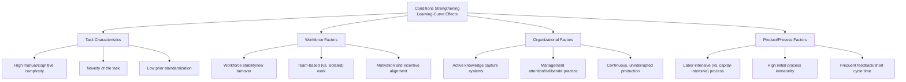

## Conditions That Strengthen Learning-Curve Effects

### Overview

The strength of a learning-curve effect — how low the progress ratio is, or equivalently how fast the learning rate — is not a fixed constant of any given task. It varies substantially based on identifiable structural, organizational, and task-level conditions. Understanding these conditions allows capacity planners to anticipate whether a new product, process, or facility is likely to exhibit fast (low $r$) or slow (high $r$) learning, prior to having enough production history to fit an empirical curve directly.

### Categories of Strengthening Conditions

### Task Characteristics

**Task complexity and manual content**

Tasks with high manual/cognitive complexity and many discrete sub-steps tend to exhibit stronger learning effects than simple, already-near-optimal tasks, because there is simply more room for sequencing, motion-economy, and error-reduction improvements to be discovered through repetition.

**Novelty**

A genuinely new task — one with no pre-existing standard method, documentation, or trained workforce — starts from a comparatively inefficient baseline and therefore has substantial headroom for rapid early improvement. [Inference] This is a primary reason low progress ratios (fast learning, e.g., 70-75%) are more often associated with newly introduced products or processes than with mature, long-established ones — the mechanism is the amount of headroom available for improvement, not novelty itself as an independent driver.

**Low prior standardization**

Where a task has not yet been subjected to formal method study or standard-work documentation, there is more latent inefficiency for either individual learning or process-source improvement (see the labor/process/technology decomposition) to eliminate.

### Workforce Factors

**Stability and low turnover**

Learning-curve effects are strengthened — meaning cumulative gains are retained and compound further — when the workforce performing the task remains relatively stable. High turnover interrupts individual learning accumulation and, absent strong organizational-learning institutionalization, can cause repeated resets toward earlier-curve performance levels (see the individual-vs-organizational-learning distinction).

**Team-based work structures**

Where tasks are performed by intact, stable teams rather than by isolated individuals rotated frequently across stations, coordination-based learning (reduced handoff friction, shared informal problem-solving routines) adds an additional layer of improvement beyond individual motor-skill learning alone.

**Motivation and incentive alignment**

[Inference] Learning-curve literature and industrial engineering practice generally attribute stronger observed learning effects to settings where workers are motivated to improve — whether through incentive pay tied to output, recognition systems, or simply engaged supervision — compared to settings with low engagement or misaligned incentives, though isolating the causal magnitude of motivation specifically (versus other concurrent factors) is difficult from aggregate production data alone.

### Organizational Factors

**Active knowledge capture and management attention**

Deliberate practices — structured after-action reviews, time-and-motion studies, kaizen/continuous-improvement programs, and management systems that actively look for and capture process improvements — strengthen the *process*-source contribution to the overall learning curve (see the labor/process/technology decomposition), on top of whatever passive individual learning would occur regardless.

**Continuous, uninterrupted production**

Learning-curve theory, including Wright's original formulation, assumes continuous production. Interruptions (tooling changeovers, plant shutdowns, seasonal gaps) are empirically associated with partial "forgetting" — a reversion of accumulated learning that is only partially recovered upon resumption. Maintaining continuity in production therefore strengthens the *net* cumulative learning effect actually realized over time, as distinct from the underlying rate at which learning would occur under ideal uninterrupted conditions.

**Feedback loop speed**

Short cycle times between performing a task and receiving feedback on its quality/efficiency (defect detection, cycle-time reporting, supervisor coaching) allow faster iterative improvement than settings where feedback is delayed or infrequent — a general principle from skill-acquisition research applied to the industrial learning-curve context.

### Product and Process Factors

**Labor intensity relative to capital intensity**

Because the classic learning-curve effect (in Wright's original, narrow sense) operates through direct labor hours, processes where labor constitutes a larger share of total value-added have more absolute room for the labor-learning mechanism to manifest in overall cost terms, compared to highly automated processes where labor is already a minor cost component (in the latter case, the *experience* curve may still decline substantially, but predominantly through technology and yield mechanisms rather than labor learning — see the learning-effect-vs-experience-effect distinction).

**Initial process immaturity**

A process still early in its design maturity — with unresolved engineering issues, unoptimized tooling, and unrefined work sequences — has more combined labor-, process-, and technology-source improvement potential available than a process that has already been engineered close to its practical efficiency frontier before initial production even began.

**Production volume and batch size consistency**

Larger, more consistent batch sizes allow workers and teams to sustain focus on a single task configuration long enough to realize learning gains, compared to highly fragmented, low-volume, high-mix production where frequent task-switching limits the depth of repetition-based improvement on any single configuration.

### Summary Table

| Condition | Effect on Progress Ratio | Underlying Mechanism |
| --- | --- | --- |
| High task complexity/novelty | Lowers $r$ (faster learning) | More headroom for skill and sequencing improvement |
| Workforce stability | Lowers $r$ (faster/more retained learning) | Reduces resets from turnover |
| Team-based (vs. isolated) work | Lowers $r$ | Adds coordination-learning on top of individual learning |
| Active knowledge capture | Lowers $r$ | Strengthens process-source contribution |
| Continuous production | Lowers $r$ (more learning retained) | Avoids forgetting/reversion from breaks |
| Fast feedback loops | Lowers $r$ | Enables faster iterative correction |
| High labor intensity | Lowers $r$ in cost terms | Larger cost base subject to labor-learning mechanism |
| Low initial process maturity | Lowers $r$ | More combined improvement potential across all sources |
| Consistent, large batch sizes | Lowers $r$ | Sustains focused repetition per task configuration |

Recall from the progress-ratio topic: a **lower** $r$ indicates a **stronger/faster** learning effect, so every condition above that "strengthens" the effect corresponds to a *decrease* in the fitted progress ratio.

### Diagram: Combined Effect on the Fitted Curve

<svg xmlns="http://www.w3.org/2000/svg" viewBox="0 0 800 320">
<text x="400" y="24" text-anchor="middle" font-size="15" font-weight="bold" fill="#1a1a1a">Effect of Strengthening Conditions on the Learning Curve (svg_diagram)</text>
<line x1="70" y1="270" x2="740" y2="270" stroke="#333" stroke-width="2" />
<line x1="70" y1="270" x2="70" y2="50" stroke="#333" stroke-width="2" />
<text x="400" y="300" text-anchor="middle" font-size="12" fill="#1a1a1a">Cumulative Units Produced (log scale)</text>
<text x="30" y="180" text-anchor="middle" font-size="12" fill="#1a1a1a" transform="rotate(-90 30 180)">Cost / Labor Hours (log scale)</text>
<path d="M 90 80 Q 250 160 400 195 T 720 235" stroke="#d97706" stroke-width="2.5" fill="none" />
<text x="600" y="215" font-size="11" fill="#d97706" font-weight="bold">Weak conditions: r ≈ 92% (slow learning)</text>
<path d="M 90 80 Q 250 190 400 225 T 720 258" stroke="#2563eb" stroke-width="2.5" fill="none" />
<text x="500" y="248" font-size="11" fill="#2563eb" font-weight="bold">Moderate conditions: r ≈ 82%</text>
<path d="M 90 80 Q 200 210 300 245 T 720 270" stroke="#16a34a" stroke-width="2.5" fill="none" />
<text x="450" y="278" font-size="11" fill="#16a34a" font-weight="bold">Strong conditions: r ≈ 70% (fast learning)</text>
</svg>

### Practical Application in Capacity Planning

- **Pre-production estimation**: before empirical data exists, planners commonly select a progress-ratio assumption by analogy to similar past tasks, adjusted upward or downward from that baseline according to how many of the above strengthening conditions are present in the new context
- **Design of the production ramp-up plan**: deliberately engineering favorable conditions (workforce retention incentives, structured training, active industrial engineering support, protecting production continuity from planned interruptions) is itself an actionable lever for accelerating the realized learning curve, not merely a set of conditions to be passively observed
- **Risk flagging**: contexts lacking most of the strengthening conditions (high turnover, low process maturity investment, fragmented low-volume production) should be flagged for planning with a conservatively high progress-ratio assumption (slow learning), to avoid over-optimistic capacity or cost forecasts

[Unverified] The specific numeric progress-ratio adjustments implied by the presence or absence of any one condition (e.g., "high turnover adds X points to r") are not established as universal constants in the literature; such adjustments are typically calibrated from a firm's own historical analogues rather than derived from a general formula, and should be treated as heuristics rather than precise quantitative rules.

**Related Topics**

- Sources of learning: labor, process, and technology (mechanism-level detail)
- Individual learning versus organizational learning (turnover-sensitivity mechanics)
- Organizational forgetting and the effect of production interruptions
- Progress ratio estimation and regression methods
- Designing ramp-up plans to deliberately accelerate learning-curve realization