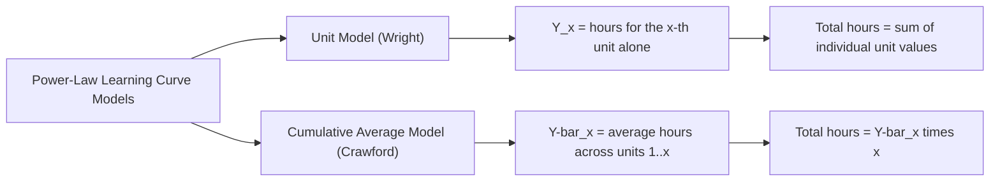

## The Power Law Cumulative Average Model

### Definition and Origin

The cumulative average model — often referred to as the **Crawford model** (attributed to J.R. Crawford at Lockheed) — is one of the two principal power-law formulations of the learning curve, alongside Wright's original **unit model**. Rather than describing the labor hours/cost of the $x$-th individual unit directly, it describes the *average* labor hours/cost across all units produced through cumulative unit $x$.

$$\bar{Y}_x = Y_1 \cdot x^{b}$$

Where:

- $\bar{Y}_x$ = the cumulative **average** labor hours (or cost) per unit, across all units 1 through $x$
- $Y_1$ = labor hours for the first unit
- $x$ = cumulative unit number
- $b$ = the learning index (negative, as in Wright's unit model), related to the progress ratio by $b = \log_2(r)$

[Unverified] The specific historical attribution to J.R. Crawford at Lockheed is repeated consistently across secondary and textbook sources on learning curves, but primary original documentation is less readily verifiable than Wright's 1936 paper; the attribution should be treated as the standard convention in the field rather than independently confirmed here.

### Contrast with the Unit Model

**Key Points**

- Both models share the identical power-law functional form and the same interpretation of $b$/progress ratio in isolation — the difference lies entirely in what the dependent variable $Y$ represents
- The unit model requires summation (or integral approximation) across all units to obtain total program cost; the cumulative average model obtains total cost by simple multiplication ($\bar{Y}_x \cdot x$), which was a significant practical advantage in the pre-computer era when Crawford's variant was developed
- The two models produce **numerically different** total-cost and marginal-cost predictions for the *same* progress ratio and the *same* first-unit cost — they are not interchangeable, and conflating them is a common and consequential error in learning-curve applications

### Why the Cumulative Average Model Exists: Historical Motivation

Under the unit model, computing total program labor hours for a production run of $N$ units requires summing $Y_1 \cdot x^{b}$ across every integer $x$ from 1 to $N$ — a calculation that, before computational tools were routine, was approximated using published tables or integral approximations rather than computed exactly. The cumulative average model sidesteps this by directly modeling the *average*, so total cost is simply:

$$\text{Total Hours} = \bar{Y}_N \cdot N = Y_1 \cdot N^{b} \cdot N = Y_1 \cdot N^{b+1}$$

This closed-form simplicity was a major practical driver of the cumulative average model's adoption in aerospace and defense contracting, where total program cost estimation was the primary planning need.

### Deriving Individual Unit Cost from the Cumulative Average Model

A frequently needed but less direct calculation under this model is the *marginal* cost of a specific individual unit, since the model's native output is a running average, not a per-unit value.

Total cumulative hours through unit $x$:

$$T_x = \bar{Y}_x \cdot x = Y_1 \cdot x^{b+1}$$

The marginal hours for the $x$-th unit specifically:

$$Y_x^{marginal} = T_x - T_{x-1} = Y_1 \left[ x^{b+1} - (x-1)^{b+1} \right]$$

**Example**

Given $Y_1 = 1000$ hours and a progress ratio $r = 0.80$ (so $b = \log_2(0.80) \approx -0.3219$, and $b + 1 = 0.6781$):

Cumulative average through unit 100:

$$\bar{Y}_{100} = 1000 \cdot 100^{-0.3219}$$

$$100^{-0.3219} = e^{-0.3219 \times \ln(100)} = e^{-0.3219 \times 4.6052} = e^{-1.4826} \approx 0.2270$$

$$\bar{Y}_{100} \approx 227.0 \text{ hours (average per unit, across units 1–100)}$$

Total hours through unit 100:

$$T_{100} = 227.0 \times 100 = 22{,}700 \text{ hours}$$

Total hours through unit 99 (for comparison, to extract the marginal 100th unit):

$$T_{99} = 1000 \times 99^{0.6781}$$

$$99^{0.6781} = e^{0.6781 \times \ln(99)} = e^{0.6781 \times 4.5951} = e^{3.1160} \approx 22.56$$

$$T_{99} \approx 22{,}560 \text{ hours}$$

Marginal hours for unit 100 specifically:

$$Y_{100}^{marginal} = 22{,}700 - 22{,}560 = 140 \text{ hours}$$

This 140-hour marginal figure for unit 100, derived from the cumulative average model, is **not** the same value that Wright's unit model would directly predict for unit 100 using the same $Y_1$ and $r$ — the two models diverge numerically even when initialized with identical inputs, which is the central practical caution associated with this topic.

### Numerical Comparison: Unit Model vs. Cumulative Average Model

Using $Y_1 = 1000$ hours and $r = 0.80$ ($b \approx -0.3219$) for both models:

| Cumulative Unit ($x$) | Unit Model: $Y_x$ (hours for unit $x$) | Cum. Avg. Model: Marginal hours for unit $x$ |
| --- | --- | --- |
| 1 | 1000.0 | 1000.0 |
| 10 | 478.6 | ≈ 421 |
| 50 | 279.0 | ≈ 231 |
| 100 | 227.0 | ≈ 140 |
| 200 | 182.0 | ≈ 113 |

[Inference] The general pattern that the cumulative-average-model's implied marginal cost declines faster at higher cumulative volumes than the unit model's direct prediction, for the same nominal $Y_1$ and $r$, follows mathematically from the definitions above (since the cumulative-average model's marginal unit cost is pulled down by averaging against all prior — higher-cost — units); the specific numeric magnitude of the gap shown in this table is illustrative of that general pattern rather than a universal ratio applicable to all parameter choices.

### Diagram: Divergence Between Models

<svg xmlns="http://www.w3.org/2000/svg" viewBox="0 0 800 340">
<text x="400" y="24" text-anchor="middle" font-size="15" font-weight="bold" fill="#1a1a1a">Unit Model vs. Cumulative Average Model — Same Inputs (svg_diagram)</text>
<line x1="70" y1="290" x2="740" y2="290" stroke="#333" stroke-width="2" />
<line x1="70" y1="290" x2="70" y2="50" stroke="#333" stroke-width="2" />
<text x="400" y="320" text-anchor="middle" font-size="12" fill="#1a1a1a">Cumulative Units Produced (log scale)</text>
<text x="30" y="180" text-anchor="middle" font-size="12" fill="#1a1a1a" transform="rotate(-90 30 180)">Hours (log scale)</text>
<path d="M 90 80 Q 250 150 400 190 T 720 235" stroke="#2563eb" stroke-width="2.5" fill="none" />
<text x="600" y="215" font-size="11" fill="#2563eb" font-weight="bold">Unit Model: Y_x</text>
<path d="M 90 80 Q 220 180 400 235 T 720 270" stroke="#16a34a" stroke-width="2.5" fill="none" />
<text x="500" y="280" font-size="11" fill="#16a34a" font-weight="bold">Cum. Avg. Model: marginal unit cost</text>
</svg>

### When Each Model Is Conventionally Preferred

- **Cumulative average model**: historically favored in aerospace/defense contracting and total-program cost estimation, where the object of interest is total contract cost across a fixed production quantity, and the closed-form total-cost formula ($T_N = Y_1 \cdot N^{b+1}$) is directly usable
- **Unit model**: favored when the specific interest is the marginal/incremental cost of the *next* individual unit — for example, in make-or-buy decisions, incremental pricing negotiations, or detailed workforce/capacity scheduling at the level of a specific upcoming unit or batch

[Inference] Because the two models are not numerically interchangeable, industry practice generally treats the choice between them as a convention that should be fixed at the start of a given program's cost-estimating relationship and applied consistently, rather than switched between opportunistically mid-program — switching models mid-analysis without adjustment is a documented source of estimating error in the learning-curve literature.

### Fitting the Cumulative Average Model to Data

Given empirical observations of *average* cost per unit at various cumulative volumes (rather than individual-unit costs), the same log-linearization and OLS regression approach used for the unit model applies directly:

$$\ln(\bar{Y}_x) = \ln(Y_1) + b \cdot \ln(x)$$

The critical prerequisite is ensuring the empirical data being fit is genuinely a *cumulative average* (total hours to date divided by units to date) rather than individual-unit hours — fitting cumulative-average-model mathematics to unit-level data (or vice versa) without adjustment produces a mischaracterized $b$ and a progress ratio that does not correspond to either model's proper interpretation.

### Total Program Cost Formula (Closed Form)

The defining practical advantage of this model — direct total-cost computation without summation — is expressed as:

$$T_N = Y_1 \cdot N^{(b+1)}$$

**Example**

For a production run of $N = 500$ units, $Y_1 = 1000$ hours, $r = 0.85$ ($b = \log_2(0.85) \approx -0.2345$, so $b+1 = 0.7655$):

$$T_{500} = 1000 \times 500^{0.7655}$$

$$500^{0.7655} = e^{0.7655 \times \ln(500)} = e^{0.7655 \times 6.2146} = e^{4.7573} \approx 116.4$$

$$T_{500} \approx 116{,}400 \text{ total labor hours across all 500 units}$$

This single-formula computation of total program cost — without needing to sum 500 individual terms — illustrates the model's original practical rationale.

### Limitations Shared with the Unit Model

- Both models are pure power laws and share the same underlying limitations discussed in the Wright's-observation topic: no built-in plateau, sensitivity to production breaks, and an assumption of a constant progress ratio across the entire volume range being modeled
- Neither model, on its own, distinguishes between labor-, process-, or technology-source contributions to the observed decline (see the sources-of-learning decomposition) — both are purely descriptive/statistical fits to aggregate cost or hours data

**Next Steps**

- Wright's unit model: detailed derivation and historical context
- Converting between unit-model and cumulative-average-model progress ratios for the same underlying process
- Total program cost estimation techniques in aerospace/defense contracting
- Regression fitting methods and data-quality prerequisites for learning-curve models
- Plateau and curve-flattening extensions to the basic power-law framework