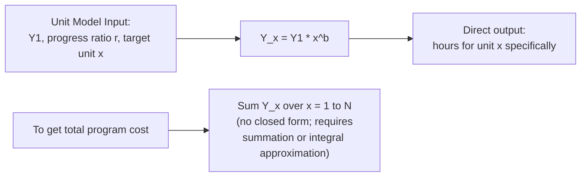

## The Unit Model (Wright's Model)

### Clarifying Note on Naming

**Key Points**

- The **unit model** — direct-unit-cost power law — is conventionally attributed to **T.P. Wright** (1936), covered in detail under "Wright's observation and early formulations"
- The **cumulative average model** is conventionally attributed to **J.R. Crawford** (Lockheed), covered in the immediately preceding topic
- "Crawford model" as a label for the *unit* model reverses the standard convention found in learning-curve literature; this content documents the unit model correctly under its standard attribution rather than perpetuating the mismatched label

### Definition

$$Y_x = Y_1 \cdot x^{b}$$

Where:

- $Y_x$ = labor hours (or cost) to produce the $x$-th individual unit, directly
- $Y_1$ = labor hours for the first unit
- $x$ = cumulative unit number
- $b$ = learning index, $b = \log_2(r)$, where $r$ is the progress ratio

This is the same functional form introduced under Wright's original 1936 observation — this topic treats it specifically as one of the two canonical model variants, in direct contrast with the cumulative average model.

### Core Property: Direct Per-Unit Prediction

Unlike the cumulative average model, the unit model's output *is* the marginal cost of a specific unit — no derivation via subtraction of cumulative totals is required.

### Total Program Cost: No Simple Closed Form

This is the defining practical contrast with the cumulative average model. Total hours across $N$ units requires summation:

$$T_N = \sum_{x=1}^{N} Y_1 \cdot x^{b} = Y_1 \sum_{x=1}^{N} x^{b}$$

There is no elementary closed-form expression for $\sum_{x=1}^{N} x^{b}$ when $b$ is a non-integer (which it always is in practical learning-curve applications). Historically, this was handled via:

- **Published unit-model tables** — precomputed cumulative totals for standard progress ratios (80%, 85%, 90%, etc.) at various production quantities, widely used in aerospace cost estimating before computational tools were routine
- **Integral approximation** — approximating the discrete sum with a continuous integral:

  $$T_N \approx \int_{0.5}^{N+0.5} Y_1 \cdot x^{b} \, dx = \frac{Y_1}{b+1}\left[(N+0.5)^{b+1} - (0.5)^{b+1}\right]$$

  the $\pm 0.5$ offset is a standard correction (sometimes called the "continuity correction") to better approximate the discrete sum with a continuous integral
- **Direct computation** — in modern practice, simply summing the series numerically, which is now the standard approach given ubiquitous computational tools

**Example**

For $Y_1 = 1000$ hours, $r = 0.80$ ($b \approx -0.3219$), total hours for the first 10 units computed by direct summation:

| $x$ | $Y_x = 1000 \cdot x^{-0.3219}$ |
| --- | --- |
| 1 | 1000.0 |
| 2 | 800.0 |
| 3 | 702.1 |
| 4 | 640.0 |
| 5 | 595.7 |
| 6 | 561.7 |
| 7 | 534.2 |
| 8 | 512.0 |
| 9 | 493.1 |
| 10 | 478.6 |

$$T_{10} = 1000.0 + 800.0 + 702.1 + 640.0 + 595.7 + 561.7 + 534.2 + 512.0 + 493.1 + 478.6 = 6317.4 \text{ hours}$$

This term-by-term summation — straightforward with modern computation, but originally a significant practical burden for large $N$ — is precisely the friction that motivated the development of the cumulative average model as a computationally simpler alternative.

### Integral Approximation Check

Using the continuity-corrected integral formula for the same example ($N=10$, $b=-0.3219$, $b+1=0.6781$):

$$T_{10} \approx \frac{1000}{0.6781}\left[(10.5)^{0.6781} - (0.5)^{0.6781}\right]$$

$$(10.5)^{0.6781} = e^{0.6781 \times \ln(10.5)} = e^{0.6781 \times 2.3514} = e^{1.5946} \approx 4.928$$

$$(0.5)^{0.6781} = e^{0.6781 \times \ln(0.5)} = e^{0.6781 \times (-0.6931)} = e^{-0.4700} \approx 0.625$$

$$T_{10} \approx \frac{1000}{0.6781} \times (4.928 - 0.625) = 1474.7 \times 4.303 \approx 6346.3 \text{ hours}$$

The integral approximation (≈6346.3) closely tracks the exact discrete sum (6317.4), with the small residual gap being the expected discretization error at low $N$ — this gap narrows proportionally as $N$ grows larger, which is a standard property of continuous approximations to discrete sums of this kind.

### Direct Per-Unit Marginal Cost: The Key Advantage

Because $Y_x$ is the model's native output, the unit model directly answers "what will the next specific unit cost," without derivation:

**Example**

Continuing $Y_1 = 1000$, $r=0.80$: the marginal cost of unit 200 is read directly:

$$Y_{200} = 1000 \times 200^{-0.3219}$$

$$200^{-0.3219} = e^{-0.3219 \times \ln(200)} = e^{-0.3219 \times 5.2983} = e^{-1.7055} \approx 0.1817$$

$$Y_{200} \approx 181.7 \text{ hours}$$

No subtraction of cumulative totals is needed — contrast this with the cumulative average model, where the same question required computing $T_{200} - T_{199}$.

### Comparison Table: Unit Model vs. Cumulative Average Model

| Aspect | Unit Model (Wright) | Cumulative Average Model (Crawford) |
| --- | --- | --- |
| Direct output | Cost/hours for a specific individual unit | Average cost/hours across units 1 to $x$ |
| Marginal unit cost | Direct: $Y_x$ | Derived: $T_x - T_{x-1}$ |
| Total program cost | Requires summation or integral approximation | Closed form: $T_N = Y_1 \cdot N^{b+1}$ |
| Historical use case | Incremental/marginal cost analysis, detailed scheduling | Total contract/program cost estimation |
| Pre-computer tractability | Lower (required tables) | Higher (single formula) |
| Modern computational burden | Negligible (trivial to sum numerically) | Negligible |

[Inference] With modern computing, the historical tractability advantage that motivated the cumulative average model's adoption is largely obsolete — both models are equally trivial to compute today — so the choice between them in current practice is better driven by which quantity (marginal unit cost vs. total program cost) is of primary planning interest, and by which convention a given industry or contracting context has standardized on, rather than by computational convenience.

### Fitting the Unit Model to Empirical Data

Identical log-linearization approach as previously described:

$$\ln(Y_x) = \ln(Y_1) + b \cdot \ln(x)$$

fit via OLS regression on individual-unit observations. The critical data requirement, as with the cumulative average model, is that the empirical values being fit must genuinely represent **individual unit** cost/hours — not running averages — since fitting unit-model mathematics to cumulative-average data (or vice versa) produces a mischaracterized $b$ that does not correspond to either model's proper interpretation.

### Diagram: Unit Model Decay Curve

<svg xmlns="http://www.w3.org/2000/svg" viewBox="0 0 800 320">
<text x="400" y="24" text-anchor="middle" font-size="15" font-weight="bold" fill="#1a1a1a">Unit Model: Per-Unit Hours vs. Cumulative Volume (svg_diagram)</text>
<line x1="70" y1="270" x2="740" y2="270" stroke="#333" stroke-width="2" />
<line x1="70" y1="270" x2="70" y2="50" stroke="#333" stroke-width="2" />
<text x="400" y="300" text-anchor="middle" font-size="12" fill="#1a1a1a">Cumulative Unit Number (log scale)</text>
<text x="30" y="180" text-anchor="middle" font-size="12" fill="#1a1a1a" transform="rotate(-90 30 180)">Labor Hours for Unit x (log scale)</text>
<path d="M 90 70 Q 250 150 400 190 T 720 230" stroke="#2563eb" stroke-width="2.5" fill="none" />
<circle cx="90" cy="70" r="4" fill="#2563eb" />
<circle cx="400" cy="190" r="4" fill="#2563eb" />
<circle cx="720" cy="230" r="4" fill="#2563eb" />
<text x="90" y="55" font-size="11" fill="#444">Unit 1: 1000 hrs</text>
<text x="400" y="175" font-size="11" fill="#444">Unit 100: 227 hrs</text>
<text x="720" y="215" font-size="11" fill="#444">Unit 1000: ~109 hrs</text>
</svg>

### Practical Guidance on Model Selection

- Use the **unit model** when the planning question centers on: staffing a specific future unit or batch, negotiating price for a specific incremental order, or detailed workforce scheduling tied to individual unit throughput
- Use the **cumulative average model** when the planning question centers on: total contract/program cost, budgeting across an entire production run, or when replicating standard practice in industries (notably aerospace/defense) where that convention is historically embedded
- Whichever model is chosen, the progress ratio $r$ fit under one model **cannot be directly substituted** into the other model's formula and expected to produce consistent results — converting between the two requires either refitting from raw data under the target model's assumptions, or applying documented conversion approximations, which carry their own approximation error

**Related Topics**

- Wright's observation and early formulations (original historical source)
- The cumulative average (Crawford) model — direct comparison
- Regression fitting methods for learning-curve parameter estimation
- Aerospace/defense cost-estimating relationships and historical unit-model tables
- Converting progress ratios between unit and cumulative average model conventions