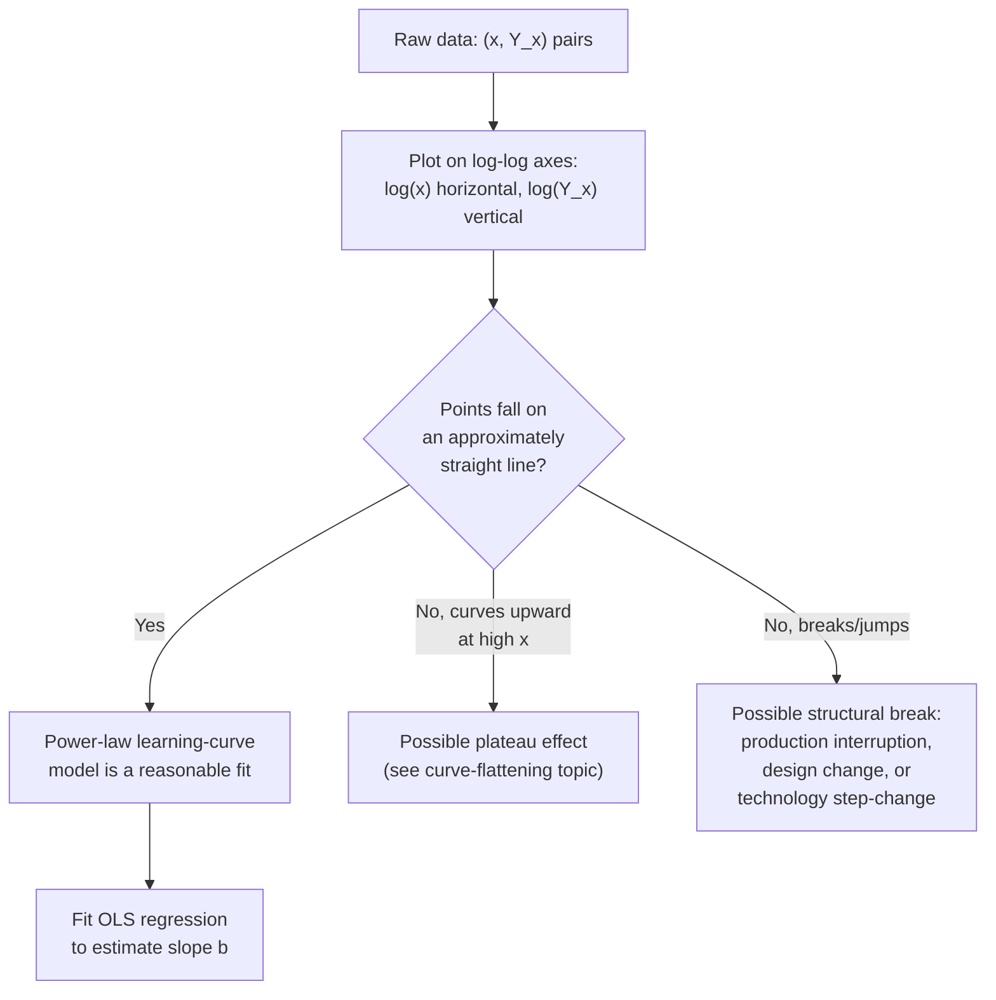

## Log-Linear Formulation and Log-Log Plotting

### Purpose

Both canonical power-law learning-curve models (Wright's unit model and the cumulative average model) share the same functional form, $Y_x = Y_1 \cdot x^{b}$, which is nonlinear in its raw form. Log-linearization transforms this into a form estimable by simple linear regression and visually inspectable as a straight line on log-log axes — a technique that predates computational statistics and remains the standard first-pass diagnostic and estimation method today.

### Deriving the Log-Linear Form

Starting from the power-law model:

$$Y_x = Y_1 \cdot x^{b}$$

Taking the natural logarithm of both sides:

$$\ln(Y_x) = \ln(Y_1 \cdot x^{b}) = \ln(Y_1) + \ln(x^{b}) = \ln(Y_1) + b \cdot \ln(x)$$

This is a linear equation in the transformed variables $\ln(Y_x)$ and $\ln(x)$:

$$\underbrace{\ln(Y_x)}_{\text{dependent var}} = \underbrace{\ln(Y_1)}_{\text{intercept}} + \underbrace{b}_{\text{slope}} \cdot \underbrace{\ln(x)}_{\text{independent var}}$$

**Key Points**

- The slope of this line, in log-log space, *is* the learning index $b$ directly — no further transformation needed once the regression is run
- The intercept, when exponentiated ($e^{\text{intercept}}$), recovers $Y_1$, the first-unit cost/hours
- Base-10 logarithms work identically (the slope is unchanged regardless of log base, since $b$ is a pure exponent, though the intercept's numeric value differs by a constant depending on which base is used)
- This transformation applies identically whether $Y_x$ represents unit-model individual-unit cost or cumulative-average-model running-average cost — the mechanics of the transformation are the same, only the interpretation of $Y_x$ differs

### Log-Log Plotting: The Visual Diagnostic

On log-log paper (or equivalently, plotting $\ln(x)$ against $\ln(Y_x)$ on standard linear axes), a genuine power-law learning-curve relationship appears as a **straight line**. This visual property was historically essential: before computational regression tools were routine, analysts plotted data directly on pre-printed log-log graph paper and visually assessed linearity, then read the slope off a straightedge fit.

**Why a power law becomes straight in log-log space**: any function of the form $y = a \cdot x^{b}$ becomes linear under a log-log transform, since the exponent $b$ becomes a multiplicative slope rather than a power. This is a general mathematical property of power-law relationships, not specific to learning curves — the same technique is used across many domains (e.g., Zipf's law, allometric scaling in biology) wherever a power-law hypothesis is being visually or statistically assessed.

### Worked Example: From Raw Data to Fitted Line

Suppose the following individual-unit labor hours are observed (unit-model data):

| $x$ (unit) | $Y_x$ (hours) | $\ln(x)$ | $\ln(Y_x)$ |
| --- | --- | --- | --- |
| 1 | 1000 | 0.000 | 6.908 |
| 5 | 596 | 1.609 | 6.390 |
| 10 | 479 | 2.303 | 6.171 |
| 50 | 279 | 3.912 | 5.631 |
| 100 | 227 | 4.605 | 5.425 |

Plotting $\ln(x)$ (horizontal) against $\ln(Y_x)$ (vertical), these five points fall very close to a straight line, consistent with an underlying power-law process. Fitting OLS across these points (using the standard slope formula $b = \frac{\sum(\ln x_i - \overline{\ln x})(\ln Y_i - \overline{\ln Y})}{\sum(\ln x_i - \overline{\ln x})^2}$) recovers approximately $b \approx -0.322$, corresponding to a progress ratio $r = 2^{-0.322} \approx 0.80$ — consistent with the 80% progress ratio these illustrative figures were generated from.

### Diagram: Log-Log Plot Appearance

<svg xmlns="http://www.w3.org/2000/svg" viewBox="0 0 800 380">
<text x="400" y="24" text-anchor="middle" font-size="15" font-weight="bold" fill="#1a1a1a">Log-Log Plot: Straight-Line Signature of a Power Law (svg_diagram)</text>
<line x1="80" y1="330" x2="740" y2="330" stroke="#333" stroke-width="2" />
<line x1="80" y1="330" x2="80" y2="50" stroke="#333" stroke-width="2" />
<text x="410" y="360" text-anchor="middle" font-size="12" fill="#1a1a1a">ln(x) — cumulative unit number</text>
<text x="35" y="190" text-anchor="middle" font-size="12" fill="#1a1a1a" transform="rotate(-90 35 190)">ln(Y_x) — labor hours</text>
<line x1="100" y1="90" x2="700" y2="290" stroke="#2563eb" stroke-width="2.5" />
<circle cx="100" cy="90" r="5" fill="#dc2626" />
<circle cx="220" cy="130" r="5" fill="#dc2626" />
<circle cx="300" cy="155" r="5" fill="#dc2626" />
<circle cx="480" cy="220" r="5" fill="#dc2626" />
<circle cx="600" cy="255" r="5" fill="#dc2626" />
<text x="150" y="80" font-size="11" fill="#444">Unit 1</text>
<text x="480" y="205" font-size="11" fill="#444">Unit 50</text>
<text x="600" y="240" font-size="11" fill="#444">Unit 100</text>
<text x="550" y="130" font-size="12" fill="#2563eb" font-weight="bold">Slope = b = log2(r)</text>
</svg>

### Interpreting Deviations from Linearity

The log-log plot's diagnostic value extends beyond confirming a good fit — systematic deviations from a straight line are themselves informative:

- **Curve flattens (bends upward, less steep) at high cumulative volume**: suggests the process is approaching a practical efficiency floor/plateau, where the pure power-law assumption of never-ending proportional improvement breaks down (addressed further under curve-plateau topics)
- **Discrete jump or discontinuity at a specific point**: suggests a structural break — a production interruption causing partial forgetting, a design change effectively resetting the learning process, or a technology/automation step-change altering the cost structure discontinuously (see the technology-source-of-learning topic)
- **Curve steepens unexpectedly**: less commonly discussed in standard literature, but [Inference] could indicate a newly introduced process improvement or training intervention accelerating learning beyond the previously established rate — this interpretation follows from the general logic of the diagnostic rather than being a commonly documented specific pattern in the literature
- **Scattered, non-linear pattern with no discernible trend**: suggests the power-law learning-curve model may not be an appropriate description of the underlying process at all, and other cost drivers (unrelated to cumulative volume) may dominate

### Regression Mechanics: Ordinary Least Squares on Transformed Data

The standard estimation procedure:

1. Collect paired observations $(x_i, Y_i)$ across the production run
2. Transform: compute $u_i = \ln(x_i)$ and $v_i = \ln(Y_i)$ for each observation
3. Run simple linear regression: $v_i = \alpha + \beta u_i + \varepsilon_i$
4. Recover $b = \beta$ (the slope) directly
5. Recover $Y_1 = e^{\alpha}$ (exponentiate the intercept)
6. Recover progress ratio $r = 2^{b}$

**Key Points**

- Standard regression diagnostics apply in the transformed space: $R^2$ indicates goodness of fit of the log-linear relationship, residual plots (of $v_i - \hat{v}_i$ against $u_i$) reveal any systematic curvature the straight-line assumption misses
- Because the regression is fit in *log* space, it minimizes squared errors in log-hours, not in raw hours — this means the fit treats a given proportional error consistently across the volume range, but is a different optimization criterion than minimizing squared errors in raw hours directly, which is a relevant consideration when the specific loss/error metric of interest to the planner is not naturally logarithmic
- Confidence intervals on the slope $b$ translate into confidence intervals on the progress ratio $r$ via $r = 2^{b}$, though this transformation is nonlinear and should be applied to the interval endpoints rather than by simply exponentiating a symmetric interval around the point estimate of $b$ (which would produce an asymmetric interval around $r$)

### Practical Considerations for Real-World Data

- **Data granularity**: individual-unit data is often noisy (a single unit's cost reflects idiosyncratic factors — a particular defect, a particular worker's off day) and is sometimes smoothed via moving averages or batch averaging (e.g., averaging cost across each lot of 10 units) before log-linear fitting, at the cost of some resolution
- **Early-unit sensitivity**: because $\ln(x)$ changes most rapidly at low $x$ (the first few doublings), early-production data points carry substantial leverage in an OLS fit; anomalies in first-article or early-production units can disproportionately influence the fitted slope if not identified and addressed
- **Model choice consistency**: as emphasized under the unit-model and cumulative-average-model topics, the log-linear fitting mechanics are identical for both models — the analyst must ensure the $Y_i$ values being log-transformed and fit consistently represent either individual-unit values or cumulative-average values throughout, not a mixture

[Unverified] The specific degree of leverage exerted by early-unit data points, and the appropriate remedy (e.g., excluding first-article units, weighting schemes), varies by dataset and is a matter of applied judgment in the learning-curve estimation literature rather than a single universally prescribed procedure.

**Next Steps**

- Regression diagnostics and confidence intervals for learning-curve parameter estimation
- Plateau and curve-flattening effects: departures from the pure power-law/log-linear form
- Detecting and modeling structural breaks from production interruptions or design changes
- Batch/lot averaging techniques for noisy unit-level cost data
- Statistical software and computational tools for learning-curve regression fitting