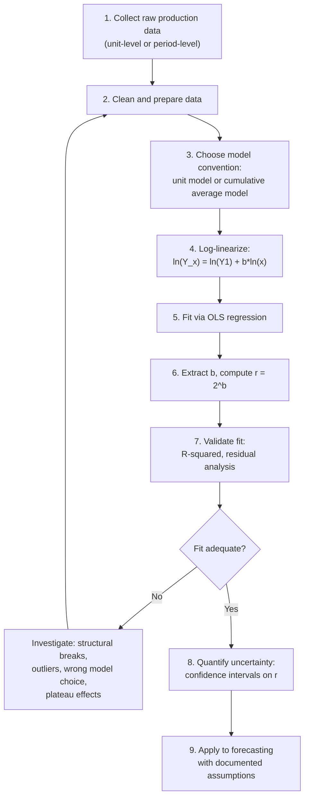

## Estimating Learning Rates from Historical Data

### Overview

Estimating a learning rate (equivalently, a progress ratio) from actual historical production data is the practical bridge between the theoretical power-law models and real capacity-planning decisions. This process involves data preparation, model selection, statistical fitting, and — critically — validation and uncertainty quantification, since a point estimate alone is insufficient for reliable forecasting.

### End-to-End Estimation Workflow

### Step 1–2: Data Collection and Preparation

**Data sources typically available:**

- Time-and-motion study records (direct labor-hour logs per unit or per operation)
- Payroll/timekeeping system extracts allocated to specific production units or batches
- Manufacturing execution system (MES) or ERP production records
- Cost accounting job-cost records, where labor is separately tracked from materials and overhead

**Preparation considerations:**

- **Separate labor from total cost** if the objective is a pure learning-effect (Wright-style) estimate rather than a blended experience-curve estimate (see the learning-effect-vs-experience-effect distinction) — mixing cost categories without intent produces an ambiguous, hard-to-interpret result
- **Identify and flag known structural events** in the data timeline: production interruptions, design changes, tooling upgrades, major workforce turnover events, and shift-pattern changes — these should be marked in the dataset even before fitting, so their effect on the fit can be assessed explicitly rather than silently absorbed into a single "average" progress ratio
- **Decide on unit-level vs. batch/lot-level granularity**: individual-unit data is often noisy; many practitioners average cost within small batches (e.g., lots of 5 or 10 units) to reduce noise, trading off resolution for stability — this decision should be made deliberately and documented, since it affects the granularity of the resulting fit

### Step 3: Model Convention Selection

As established under the unit-model and cumulative-average-model topics, the choice between fitting $Y_x$ (individual unit values) or $\bar{Y}_x$ (cumulative running averages) must be made explicitly and applied consistently — this determines which of the two standard formulas the log-linearization is applied to, and the resulting $r$ is not directly transferable to the other convention without reformulation.

### Step 4–6: Log-Linearization and OLS Fitting

As detailed under the log-linear formulation topic, the estimation reduces to a simple linear regression:

$$\ln(Y_x) = \ln(Y_1) + b \cdot \ln(x)$$

with $b$ recovered as the OLS slope and the progress ratio recovered as $r = 2^{b}$.

**Worked Example**

Suppose the following batch-averaged individual-unit labor-hour data has been collected and cleaned:

| $x$ (cumulative unit) | $Y_x$ (hours) |
| --- | --- |
| 2 | 850 |
| 8 | 590 |
| 32 | 410 |
| 128 | 285 |
| 512 | 198 |

Transforming to log space:

| $\ln(x)$ | $\ln(Y_x)$ |
| --- | --- |
| 0.693 | 6.745 |
| 2.079 | 6.380 |
| 3.466 | 6.016 |
| 4.852 | 5.652 |
| 6.238 | 5.288 |

These five points are evenly spaced in $\ln(x)$ (each step is exactly $\ln(4) \approx 1.386$, since each $x$ value is 4 times the previous), and $\ln(Y_x)$ decreases by a constant $0.364$ at each step — a strong visual and numeric signature of a clean power-law relationship. The slope:

$$b = \frac{-0.364}{1.386} \approx -0.2627$$

$$r = 2^{-0.2627} \approx 0.833$$

This dataset implies an approximately 83.3% progress ratio (16.7% learning rate).

### Step 7: Validating the Fit

**Goodness-of-fit assessment:**

- **$R^2$ in log-space**: indicates how much of the variance in $\ln(Y_x)$ is explained by $\ln(x)$ under the power-law hypothesis; values close to 1 support the power-law assumption over the observed range, though $R^2$ alone does not rule out systematic curvature that a purely linear-fit statistic can miss
- **Residual plots**: plotting residuals ($\ln(Y_x) - \widehat{\ln(Y_x)}$) against $\ln(x)$ should show no discernible pattern; a U-shape or systematic trend in residuals indicates the pure power-law form is a poor match for at least part of the data range (commonly a sign of an emerging plateau at high cumulative volume)
- **Out-of-sample validation**: where sufficient data exists, fitting on an earlier portion of the production run and testing prediction accuracy against later, held-out units provides a more rigorous check than in-sample $R^2$ alone

### Step 8: Quantifying Uncertainty

A single point estimate of $r$ understates the real uncertainty in any forecast built on it, especially given the compounding sensitivity discussed under the progress-ratio topic (small differences in $r$ produce large differences in long-range forecasts).

**Standard approaches:**

- **Confidence interval on the slope $b$** from the OLS regression output, using standard errors under the usual linear regression assumptions (independent, homoscedastic, normally distributed errors in log-space)
- **Transforming the interval to $r$-space**: because $r = 2^b$ is a nonlinear (monotonic) transformation, the correct approach is to transform the *endpoints* of the confidence interval on $b$, not to apply a symmetric percentage band around the point estimate of $r$ itself

**Example**

If the OLS fit yields $\hat{b} = -0.2627$ with a 95% confidence interval of $[-0.31, -0.22]$ (illustrative), transforming each endpoint:

$$r_{lower} = 2^{-0.31} \approx 0.807, \quad r_{upper} = 2^{-0.22} \approx 0.859$$

The resulting 95% confidence interval on the progress ratio is approximately $[0.807, 0.859]$ — a range that should be carried forward into any downstream forecast rather than treating $r \approx 0.833$ as a precise, certain value.

[Inference] The width of this interval, and by extension the reliability of any forecast built on it, depends heavily on the number of data points available and how much of the cumulative-volume range they span — a fit based on only two or three widely-scattered data points, even with a high apparent $R^2$, provides substantially less statistical confidence than a fit based on many observations spanning several doublings, though the specific numeric relationship between sample size and interval width depends on the standard regression formulas rather than being illustrated by the specific numbers used in this example.

### Diagram: Confidence Band Around a Fitted Curve

<svg xmlns="http://www.w3.org/2000/svg" viewBox="0 0 800 340">
<text x="400" y="24" text-anchor="middle" font-size="15" font-weight="bold" fill="#1a1a1a">Fitted Curve with Uncertainty Band (svg_diagram)</text>
<line x1="70" y1="290" x2="740" y2="290" stroke="#333" stroke-width="2" />
<line x1="70" y1="290" x2="70" y2="50" stroke="#333" stroke-width="2" />
<text x="400" y="320" text-anchor="middle" font-size="12" fill="#1a1a1a">Cumulative Units Produced (log scale)</text>
<text x="30" y="180" text-anchor="middle" font-size="12" fill="#1a1a1a" transform="rotate(-90 30 180)">Labor Hours (log scale)</text>
<path d="M 100 80 Q 300 150 500 190 T 720 220" stroke="#93c5fd" stroke-width="18" fill="none" opacity="0.5" />
<path d="M 100 90 Q 300 160 500 205 T 720 235" stroke="#2563eb" stroke-width="2.5" fill="none" />
<circle cx="150" cy="95" r="4" fill="#dc2626" />
<circle cx="280" cy="130" r="4" fill="#dc2626" />
<circle cx="400" cy="160" r="4" fill="#dc2626" />
<circle cx="540" cy="195" r="4" fill="#dc2626" />
<circle cx="670" cy="220" r="4" fill="#dc2626" />
<text x="500" y="270" font-size="11" fill="#2563eb" font-weight="bold">Point estimate with 95% confidence band</text>
</svg>

### Handling Common Data Problems

| Problem | Symptom in Log-Log Plot | Recommended Approach |
| --- | --- | --- |
| Production interruption | Discontinuity/jump at a specific $x$ | Fit separate segments before/after; treat as a structural break, not a single continuous curve |
| Design change mid-run | Level shift or slope change | Fit separately for each design configuration |
| Emerging plateau at high volume | Curve bends less steep than log-linear prediction at high $x$ | Consider a plateau/curve-flattening model extension instead of forcing a pure power law across the full range |
| Noisy individual-unit data | Wide scatter around the fitted line, low $R^2$ | Batch/lot-average the data before fitting; increase sample size if possible |
| Too few data points / narrow volume range | Wide confidence interval on $b$, unreliable extrapolation | Treat estimate as provisional; revisit as more production data accumulates; use industry-analogue benchmarks as a cross-check |
| Mixed unit-model and cumulative-average data | Fit does not correspond cleanly to either model's standard interpretation | Verify data definition matches the chosen model convention before fitting |

### Cross-Checking Against Industry Benchmarks

Where a firm's own historical data is limited (e.g., a genuinely new product with only a handful of units produced so far), a common practical approach is to use published industry-typical progress ratios (see the progress-ratio reference table) as a provisional starting assumption, explicitly flagged as such, to be replaced with an internally-estimated rate as more of the firm's own production data accumulates.

[Unverified] The appropriateness of any specific industry-benchmark progress ratio as a stand-in for a firm's own not-yet-estimable rate depends heavily on how closely the new product/process resembles the benchmark's originating context (task complexity, automation level, workforce stability — see the strengthening-conditions topic); such benchmarks should be treated as a starting hypothesis to be tested against the firm's own emerging data, not as a substitute for eventual internal estimation.

### Documentation Standards for Reported Estimates

A rigorous learning-rate estimate, suitable for use in downstream capacity or cost forecasting, should document:

- The model convention used (unit model vs. cumulative average model)
- The data source, granularity (unit-level vs. batch-averaged), and date range
- The cumulative-volume range spanned by the fitted data (relevant to assessing extrapolation risk)
- The point estimate of $r$ and its confidence interval
- Any known structural events (interruptions, design changes) within the data range and how they were handled
- Goodness-of-fit diagnostics ($R^2$, residual pattern assessment)

**Related Topics**

- Log-linear formulation and log-log plotting (the core fitting mechanics)
- Progress ratio and learning rate percentage (interpretation and forecasting sensitivity)
- Plateau and curve-flattening effects as a departure from the pure power-law fit
- Detecting structural breaks from production interruptions or design changes
- Applying estimated learning rates to workforce and capacity forecasting