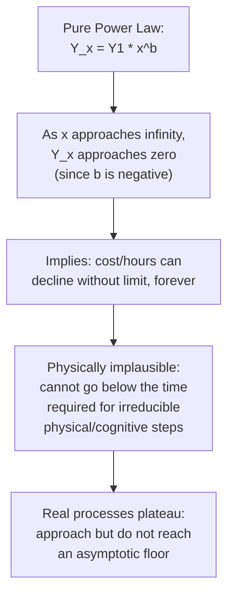

## Plateauing and Limitations of Log-Linear Models

### Overview

The pure power-law formulation ($Y_x = Y_1 \cdot x^{b}$) that underlies both the unit model and the cumulative average model has a mathematically embedded assumption: continuous, never-terminating proportional improvement with every doubling of cumulative volume, at a constant rate, indefinitely. Real production processes consistently deviate from this assumption at high cumulative volumes. This topic addresses why that deviation occurs, how to detect it, and the standard modeling extensions used to accommodate it.

### The Core Mathematical Limitation

**Key Points**

- A pure power law with $b < 0$ mathematically implies $Y_x \to 0$ as $x \to \infty$ — an outcome with no physical grounding, since any real task has some irreducible minimum time (material handling, unavoidable inspection steps, physical motion that cannot be further compressed)
- The plateau phenomenon is not a failure of the learning-curve concept generally, but a known boundary condition of the specific pure power-law functional form used to approximate it over a *finite, empirically relevant* range
- Over the volume ranges typically observed in real production programs, the pure power law often fits well (as established under the log-linear formulation topic) — the divergence from reality becomes apparent primarily at high cumulative volumes, well beyond where most empirical fitting is performed

### Why Plateaus Occur: Underlying Causes

Drawing on the sources-of-learning decomposition (labor, process, technology):

- **Labor-source ceiling**: individual motor-skill and cognitive-task performance has a physiological/cognitive floor; a worker cannot continue to accelerate a fixed physical task indefinitely — there is a point past which further repetition yields negligible additional speed
- **Process-source saturation**: once a workflow has been refined through iterative method study to near its practical optimum given the current tooling and layout, further incremental process refinement yields diminishing returns until a technology-source change (new equipment, redesign) reopens headroom for improvement
- **Technology-source discreteness**: technology-driven improvements arrive as discrete step-changes tied to specific capital investments, not as continuous incremental decline — between investment events, the technology-source contribution to the curve is effectively flat, which can make the *aggregate* curve appear to plateau during periods without new technology investment even if underlying labor/process learning continues at the margin

[Inference] Because these three sources have different maturation rates and ceilings, the actual shape of a real cost curve at high cumulative volume is better understood as the superposition of a labor-learning component that saturates relatively early, a process-improvement component that saturates somewhat later, and a technology component that steps rather than curves — the smooth plateau often observed empirically is the aggregate result of these distinct underlying dynamics, though decomposing an observed aggregate plateau back into its specific component causes generally requires more granular data than typical aggregate cost records provide.

### Detecting a Plateau in Data

As introduced under the log-log plotting topic, a plateau manifests as a specific, recognizable deviation from linearity:

- On a log-log plot, the data points **bend upward relative to the fitted straight line** at high $x$ — the actual observed cost/hours decline less than the pure power law predicts
- Residuals from an OLS fit to the full dataset will show a systematic pattern: small/negative residuals at low $x$, growing increasingly positive at high $x$ (the power law under-predicts the plateaued actual cost)
- A fit restricted to only the *early* portion of the data will generally show a steeper (more negative) $b$ than a fit including the later, plateaued portion — comparing sub-range fits is a practical diagnostic for plateau detection

### Diagram: Power-Law Prediction vs. Actual Plateaued Behavior

<svg xmlns="http://www.w3.org/2000/svg" viewBox="0 0 800 360">
<text x="400" y="24" text-anchor="middle" font-size="15" font-weight="bold" fill="#1a1a1a">Pure Power-Law Prediction vs. Observed Plateau (svg_diagram)</text>
<line x1="70" y1="310" x2="740" y2="310" stroke="#333" stroke-width="2" />
<line x1="70" y1="310" x2="70" y2="50" stroke="#333" stroke-width="2" />
<text x="400" y="340" text-anchor="middle" font-size="12" fill="#1a1a1a">Cumulative Units Produced (log scale)</text>
<text x="30" y="180" text-anchor="middle" font-size="12" fill="#1a1a1a" transform="rotate(-90 30 180)">Labor Hours (log scale)</text>
<path d="M 100 80 Q 300 160 500 220 T 720 280" stroke="#d97706" stroke-width="2.5" stroke-dasharray="7,4" fill="none" />
<text x="560" y="270" font-size="11" fill="#d97706" font-weight="bold">Pure power-law prediction</text>
<path d="M 100 85 Q 300 165 480 215 Q 600 235 720 240" stroke="#2563eb" stroke-width="2.5" fill="none" />
<text x="560" y="225" font-size="11" fill="#2563eb" font-weight="bold">Actual observed (plateauing)</text>
<line x1="70" y1="245" x2="740" y2="245" stroke="#94a3b8" stroke-width="1.5" stroke-dasharray="3,3" />
<text x="120" y="240" font-size="11" fill="#64748b">Asymptotic floor (theoretical minimum)</text>
</svg>

### Standard Modeling Extensions to Address Plateauing

**1. Stanford-B Model (Incorporating "Prior Experience" or "Equivalent Units")**

Adjusts for the possibility that the workforce already had relevant prior experience before "unit 1" of the officially tracked production run (e.g., experience from a prior similar product), by adding an offset $B$ to the cumulative unit count:

$$Y_x = Y_1 \cdot (x + B)^{b}$$

Where $B$ represents an "equivalent number of prior units" of experience already accumulated before the tracked production began. [Unverified] The specific name "Stanford-B model" and its exact attribution are used somewhat inconsistently across secondary sources in the learning-curve literature; treat the underlying mathematical adjustment (an additive offset to the unit count) as the substantive point rather than relying on this specific naming as universally standardized terminology.

**2. Asymptotic/Floor Models**

Explicitly incorporate a non-zero floor value $Y_{\infty}$ that the curve approaches but never crosses:

$$Y_x = Y_{\infty} + (Y_1 - Y_{\infty}) \cdot x^{b}$$

As $x \to \infty$, $Y_x \to Y_{\infty}$ rather than zero — this directly resolves the physical implausibility of the pure power law's asymptotic behavior. $Y_{\infty}$ represents the theoretical minimum achievable cost/hours given the current process and technology configuration (an irreducible floor, not zero).

**Example**

Suppose a task is believed to have an irreducible floor of $Y_{\infty} = 50$ hours (reflecting unavoidable material handling and inspection steps), with $Y_1 = 1000$ hours and an early-curve-fitted $b = -0.35$:

At $x = 1000$:

$$Y_{1000} = 50 + (1000 - 50) \times 1000^{-0.35}$$

$$1000^{-0.35} = e^{-0.35 \times \ln(1000)} = e^{-0.35 \times 6.9078} = e^{-2.4177} \approx 0.0891$$

$$Y_{1000} = 50 + 950 \times 0.0891 = 50 + 84.6 \approx 134.6 \text{ hours}$$

Contrast this with the pure power-law prediction (no floor) at the same $x$:

$$Y_{1000}^{pure} = 1000 \times 1000^{-0.35} \approx 89.1 \text{ hours}$$

The floor-adjusted model predicts meaningfully higher (134.6 vs. 89.1 hours) cost at high cumulative volume, illustrating how materially the two models diverge once $x$ grows large — the pure power law's lack of a floor causes it to systematically under-predict cost/hours at high cumulative volumes relative to a floor-adjusted model with the same early-curve parameters.

**3. S-Curve / Logistic-Type Models**

In some applications, particularly where an initial slow-ramp phase (learning to learn, initial tooling debugging) precedes the main improvement phase, an S-shaped (logistic) curve is used instead of a pure power law, capturing both a slow start and an eventual plateau within a single functional form. [Inference] This approach is more commonly associated with broader technology-adoption and diffusion modeling than with the classical manufacturing learning-curve literature specifically, though the underlying rationale — bounding both the early and late behavior of the curve — parallels the plateau-model motivation discussed here.

### Comparison of Approaches

| Model | Handles Plateau? | Handles Pre-Existing Experience? | Added Complexity |
| --- | --- | --- | --- |
| Pure power law (unit/cum. avg.) | No | No | Low (2 parameters: $Y_1$, $b$) |
| Stanford-B (offset) | Partially (delays but doesn't cap decline) | Yes | Low-moderate (3 parameters: $Y_1$, $b$, $B$) |
| Asymptotic/floor model | Yes (explicit floor) | No (unless combined with offset) | Moderate (3 parameters: $Y_1$, $Y_\infty$, $b$) |
| S-curve/logistic | Yes (both ends bounded) | Sometimes, depending on formulation | Higher (typically 3-4 parameters) |

### Practical Implications for Capacity Planning

- **Extrapolation risk**: forecasts extended far beyond the cumulative-volume range of the fitted data — particularly using a pure power law without a floor — risk substantially understating future labor requirements or cost, since the model has no mechanism to prevent the prediction from falling below what is physically achievable
- **Model selection depends on planning horizon**: for near-term forecasting within or close to the observed data range, a pure power-law fit is often adequate and simpler; for long-range strategic capacity planning spanning many further doublings of volume, an explicit floor or offset model reduces the risk of unrealistic long-run projections
- **Floor value estimation is itself uncertain**: unlike $Y_1$ and $b$, which can be estimated directly from data within the observed range, the floor $Y_\infty$ in an asymptotic model is often not yet observed in the data (by definition, if a genuine floor exists, production hasn't necessarily reached it yet) and must be estimated via engineering judgment (irreducible physical/cognitive task-time analysis) rather than purely statistical extrapolation

[Unverified] There is no universal rule for how far into a pure power-law extrapolation range planners should trust the projection before switching to a floor-adjusted model; the appropriate threshold depends on the specific task, industry, and how many further doublings of cumulative volume the forecast horizon actually spans, and is typically a matter of engineering and planning judgment calibrated to the specific context rather than a fixed general threshold.

### Relationship to Organizational and Individual Learning Dynamics

The plateau phenomenon connects directly to the individual-vs-organizational learning distinction: individual labor-based learning is generally understood to plateau at a physiological/cognitive ceiling relatively early (see the strengthening-conditions and individual-learning topics), while organizational learning — through continued process refinement and periodic technology investment — can in principle continue to push the *aggregate* curve downward well past the point where individual-level learning alone would have already plateaued. An aggregate curve that appears to plateau may therefore reflect the exhaustion of labor-source learning specifically, even while process- or technology-source improvement potential remains latent and could be unlocked through deliberate investment rather than passive continued production.

**Related Topics**

- Log-linear formulation and log-log plotting (the baseline model this topic extends)
- Sources of learning: labor, process, and technology (underlying causes of differential plateau timing)
- Estimating learning rates from historical data (detecting plateaus during fitting)
- Organizational forgetting: production interruptions and their interaction with plateaued curves
- Capital investment timing as a lever to reopen improvement headroom after a technology-source plateau