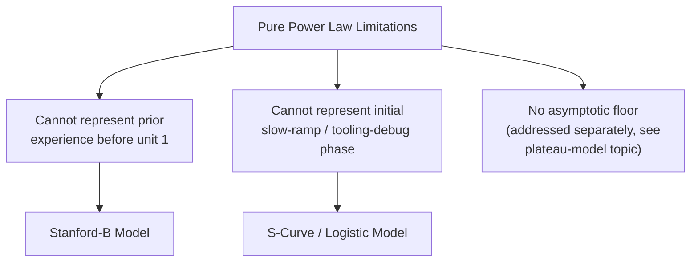
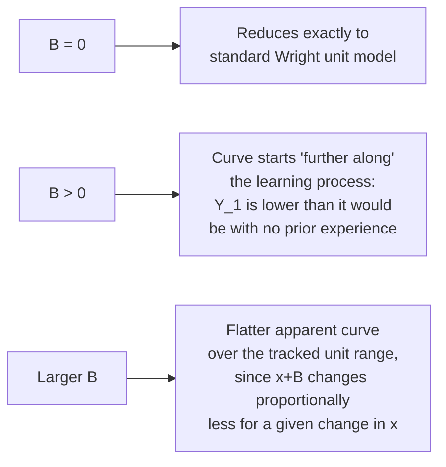

## Alternative Models: Stanford-B and S-Curve Formulations

### Purpose of These Extensions

Both models extend the basic power-law framework (Wright's unit model and the cumulative average model) to address specific documented shortcomings: the pure power law's inability to represent pre-existing prior experience (addressed by Stanford-B) and its inability to represent an initial slow-ramp phase followed by an eventual plateau within one continuous functional form (addressed by S-curve models).

### The Stanford-B Model

**Motivation**

Wright's original unit model assumes "unit 1" represents genuinely the first-ever unit produced with zero prior relevant experience. In practice, this is frequently untrue: a new product may be built by a workforce with substantial experience from a prior, similar product; a new production line may reuse trained personnel from a discontinued line; or engineering carryover from a predecessor design may mean the "first" unit is not really starting from a blank slate.

The Stanford-B model (also referred to in some sources as the "equivalent units" or "prior experience" adjustment) addresses this by adding an offset term to the cumulative unit count:

$$Y_x = Y_1 \cdot (x + B)^{b}$$

Where:

- $B$ = the number of "equivalent prior units" of experience the workforce is assumed to already possess before tracked production begins
- All other terms retain their standard meaning from the unit model

[Unverified] The specific name "Stanford-B" and its precise historical origin are used with some inconsistency across secondary/textbook sources in the learning-curve literature; the underlying mathematical device (an additive offset applied to the unit index) is the well-established substantive content, and should be treated as more reliably documented than the specific naming convention attached to it here.

**Effect of the Offset Parameter**

**Example**

Consider a firm launching a new product variant, where the workforce has substantial experience from a very similar predecessor product. Suppose engineering judgment estimates this prior experience is equivalent to $B = 40$ "phantom" prior units, with $Y_1 = 500$ hours for the true first unit of the new variant, and $b = -0.30$ (progress ratio $r \approx 0.812$).

Predicted hours for unit 10 of the new variant:

$$Y_{10} = 500 \times (10 + 40)^{-0.30} = 500 \times 50^{-0.30}$$

$$50^{-0.30} = e^{-0.30 \times \ln(50)} = e^{-0.30 \times 3.912} = e^{-1.1736} \approx 0.3093$$

$$Y_{10} \approx 500 \times 0.3093 \approx 154.7 \text{ hours}$$

Contrast with the naive (no-offset, $B=0$) unit-model prediction for the same $Y_1$ and $b$:

$$Y_{10}^{naive} = 500 \times 10^{-0.30} = 500 \times 0.5012 \approx 250.6 \text{ hours}$$

The Stanford-B model predicts substantially lower hours for unit 10 (154.7 vs. 250.6) because it correctly accounts for the workforce effectively starting partway along the learning curve rather than from a completely inexperienced baseline — omitting this adjustment in a context where meaningful prior experience genuinely exists would cause a naive unit-model forecast to overstate near-term labor requirements.

**Estimating $B$ in Practice**

Unlike $Y_1$ and $b$, which are typically estimated via regression directly from the tracked production data, $B$ is not directly observable from that same dataset in isolation — it requires either:

- **Engineering/analogy-based judgment**: estimating equivalent prior units based on the similarity between the new task and the predecessor task the workforce has experience with
- **Joint nonlinear estimation**: fitting all three parameters ($Y_1$, $b$, $B$) simultaneously via nonlinear least squares against the tracked data, which requires more data points than the simpler two-parameter model and can produce less stable estimates if the dataset is short or noisy

[Inference] Because $B$ trades off against $Y_1$ and $b$ in the fitting process (multiple combinations of the three parameters can produce similar predicted curves over a limited observed range), nonlinear joint estimation of all three parameters from a short production run is generally less reliable than fixing $B$ from independent engineering judgment and then estimating only $Y_1$ and $b$ from the data — this follows from standard identifiability concerns in nonlinear parameter estimation rather than being a claim specific to any particular dataset.

### The S-Curve (Logistic-Type) Model

**Motivation**

Some production processes exhibit a distinct three-phase pattern that neither the pure power law nor the Stanford-B offset captures well:

1. **Initial slow-ramp phase**: early units are produced slower than a pure power law would predict, often due to tooling debugging, initial quality issues, or a genuine "learning to learn" period before the main improvement mechanism takes hold
2. **Rapid improvement phase**: the classic steep-decline region, resembling standard power-law behavior
3. **Plateau phase**: improvement decelerates and approaches an asymptotic floor, as discussed under the plateau-and-limitations topic

A logistic (S-shaped) function captures both the slow start and the eventual plateau within one continuous functional form, unlike the pure power law (which has neither a genuine slow-start floor-approach on the front end, nor a floor on the back end) or the asymptotic floor model (which addresses the back-end plateau but not a front-end slow-start).

**General Logistic Form**

A standard logistic function, adapted to the learning-curve context (expressing hours as a function of cumulative unit $x$):

$$Y_x = Y_{\infty} + \frac{Y_1 - Y_{\infty}}{1 + e^{-k(x - x_0)}}$$

Where:

- $Y_{\infty}$ = the asymptotic floor value (as in the floor-adjusted model)
- $Y_1$ = the initial value at very low $x$
- $k$ = a steepness parameter controlling how rapidly the transition between phases occurs
- $x_0$ = the inflection point — the cumulative unit number at which the rate of improvement is fastest

[Inference] This logistic formulation is adapted here from the general logistic growth function widely used across many domains (population dynamics, technology diffusion, epidemiology); its specific application to learning-curve modeling is a reasonable extension of well-established curve-fitting practice rather than a formulation with the same depth of dedicated learning-curve-specific literature and historical pedigree as Wright's unit model or the Crawford cumulative-average model.

### Diagram: S-Curve Shape Compared to Pure Power Law

<svg xmlns="http://www.w3.org/2000/svg" viewBox="0 0 800 360">
<text x="400" y="24" text-anchor="middle" font-size="15" font-weight="bold" fill="#1a1a1a">S-Curve vs. Pure Power Law (svg_diagram)</text>
<line x1="70" y1="310" x2="740" y2="310" stroke="#333" stroke-width="2" />
<line x1="70" y1="310" x2="70" y2="50" stroke="#333" stroke-width="2" />
<text x="400" y="340" text-anchor="middle" font-size="12" fill="#1a1a1a">Cumulative Units Produced</text>
<text x="30" y="180" text-anchor="middle" font-size="12" fill="#1a1a1a" transform="rotate(-90 30 180)">Labor Hours</text>
<path d="M 100 90 Q 250 100 320 160 Q 420 250 520 275 Q 620 290 720 295" stroke="#2563eb" stroke-width="2.5" fill="none" />
<text x="130" y="80" font-size="11" fill="#2563eb" font-weight="bold">S-curve: slow start</text>
<text x="480" y="240" font-size="11" fill="#2563eb" font-weight="bold">steep middle</text>
<text x="560" y="300" font-size="11" fill="#2563eb" font-weight="bold">plateau</text>
<path d="M 100 80 Q 300 150 500 220 T 720 270" stroke="#d97706" stroke-width="2.5" stroke-dasharray="7,4" fill="none" />
<text x="500" y="205" font-size="11" fill="#d97706" font-weight="bold">Pure power law (no slow start, no floor)</text>
</svg>

**Identifying an S-Curve Pattern in Data**

- Early-production log-log plot points fall **below** where a power-law fit to the middle/later data would predict (indicating the slow-start phase was worse than the eventual established rate would suggest)
- Later-production points bend upward relative to a power-law fit to the early/middle data (the plateau signature, as discussed in the plateau-and-limitations topic)
- A pure power-law fit across the *entire* dataset including both phases will generally show poor residual patterns at both ends, with the fitted line running through the middle but systematically missing both tails

### Comparison of All Discussed Model Variants

| Model | Handles Prior Experience? | Handles Slow Start? | Handles Plateau? | Parameters |
| --- | --- | --- | --- | --- |
| Pure power law (unit) | No | No | No | 2: $Y_1$, $b$ |
| Pure power law (cum. avg.) | No | No | No | 2: $Y_1$, $b$ |
| Stanford-B | Yes | No | Partially (delays decline, doesn't cap it) | 3: $Y_1$, $b$, $B$ |
| Asymptotic/floor model | No (unless combined) | No | Yes | 3: $Y_1$, $Y_\infty$, $b$ |
| S-curve/logistic | Indirectly (via $x_0$ positioning) | Yes | Yes | 4: $Y_1$, $Y_\infty$, $k$, $x_0$ |

### Practical Trade-offs in Model Selection

- **Data requirements**: each added parameter increases the amount of data needed for a statistically reliable fit; a 4-parameter S-curve fit to a short production run risks overfitting (fitting noise rather than genuine underlying pattern) unless a substantial number of observations spanning most of the intended production range is available
- **Interpretability vs. flexibility trade-off**: the pure power law's two parameters map directly onto the familiar "progress ratio" concept used throughout the field; the S-curve's four parameters, while more flexible, do not reduce to a single, easily-communicated summary statistic in the same way, which can complicate communication with stakeholders accustomed to progress-ratio framing
- **Extrapolation purpose**: when the specific planning need is bounding a very long-range forecast against unrealistic never-ending decline, the simpler floor-adjusted model (from the plateau topic) may suffice without the added complexity of also modeling an initial slow-start phase; the full S-curve is more justified when the slow-start phase itself is a material planning concern (e.g., estimating early-production costs for a new, unfamiliar process)

[Unverified] There is no single universally prescribed decision rule for choosing among these model variants in a given practical situation; the choice generally reflects a judgment balance between the specific planning question being asked, the amount and quality of available historical data, and the complexity the intended audience for the forecast can reasonably interpret — this is a matter of applied practice rather than a settled methodological standard in the field.

**Next Steps**

- Plateauing and limitations of log-linear models (the asymptotic-floor extension, addressed in more depth)
- Nonlinear least squares estimation methods for multi-parameter curve fitting
- Estimating prior-experience offsets (B) from analogous product/process history
- Statistical identifiability concerns in overparameterized learning-curve models
- Applying alternative model forecasts to early-production capacity and cost planning