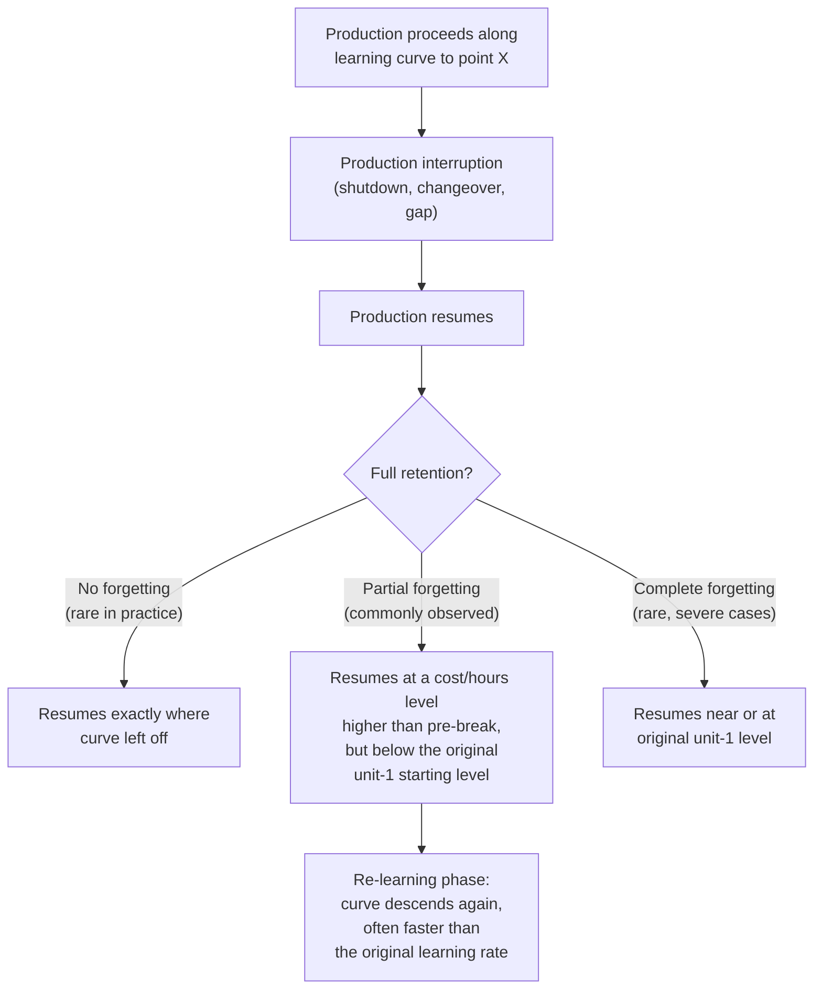

## Forgetting Curves and Learning-Curve Regression

### Overview

Every prior model in this chapter has assumed continuous, uninterrupted production — an assumption Wright's original formulation and its descendants embed implicitly. Real production frequently involves interruptions: tooling changeovers, plant shutdowns, seasonal demand gaps, labor strikes, or product-line pauses. Empirically, resuming production after such a break typically shows costs/hours reverting partway back toward earlier, less-efficient levels — a phenomenon termed **regression** or **forgetting**. This topic addresses how forgetting is characterized, modeled, and incorporated into learning-curve analysis.

### The Forgetting Phenomenon

**Key Points**

- Forgetting is not typically complete — a full reversion to unit-1 performance is uncommon in the literature except in cases of very long interruptions or near-total workforce turnover during the break
- Partial forgetting followed by accelerated **re-learning** is the more commonly documented pattern — the re-learning phase after a break often shows a steeper (faster) apparent learning rate than the original curve, since some retained knowledge (organizational, if not fully individual — see the individual-vs-organizational-learning distinction) accelerates recovery relative to true first-time learning
- The magnitude of forgetting is generally understood to scale with break duration and with the degree of workforce turnover during the break, though the specific quantitative relationship varies considerably by context and is not governed by a single universal formula

### Relationship to the Labor/Process/Technology and Individual/Organizational Distinctions

Forgetting connects directly to two previously covered decompositions:

- **Sources of learning**: labor-source (individual tacit skill) is generally understood to be the most vulnerable to forgetting during a break, since it depends on continued practice; process-source improvements (documented standard work, jigs, fixtures) are comparatively insulated, since they are embedded in artifacts rather than in continuous practice; technology-source improvements (equipment, product design) are essentially immune to forgetting, since they do not depend on ongoing repetition at all
- **Individual vs. organizational learning**: a break's forgetting impact is sharply differentiated by how well the organization had institutionalized its gains prior to the interruption — strong organizational learning (documentation, training systems) is far more resilient to a production break than gains that existed primarily as individual tacit skill, since organizational artifacts don't "forget" the way individual memory and dexterity do

[Inference] This suggests forgetting magnitude is not solely a function of break duration, but also of how much of the pre-break learning had been converted from individual to organizational form before the interruption occurred — a facility with strong process documentation should, in principle, exhibit less severe forgetting than one relying heavily on tenured individual expertise, for a break of the same length. This follows from combining the two decompositions above rather than being an independently established empirical finding specific to forgetting curves.

### Common Mathematical Approaches to Modeling Forgetting

**1. Regression to an Intermediate Starting Point**

The simplest practical approach treats the post-break production as a **new learning curve segment**, starting from an empirically observed (not assumed) post-break cost/hours level, rather than either the pre-break level or the original unit-1 level:

$$Y_x^{post} = Y_1^{post} \cdot x^{b^{post}}$$

Where $x$ is re-indexed starting from 1 at the resumption point, $Y_1^{post}$ is the actual observed cost/hours for the first unit after resumption (empirically higher than the pre-break level, reflecting partial forgetting), and $b^{post}$ may differ from the original pre-break $b$ (commonly steeper, reflecting faster re-learning).

**Example**

Suppose pre-break production had reached unit 100 at 150 hours (following an 80% progress ratio from $Y_1 = 1000$). A six-month plant shutdown occurs, then production resumes. The first post-break unit requires 280 hours — higher than the pre-break 150-hour level, but well below the original 1000-hour unit-1 level, indicating partial forgetting with substantial retained organizational learning.

If subsequent post-break units show a steeper progress ratio of $r^{post} = 0.72$ (faster re-learning than the original 80%), the post-break curve is modeled independently:

$$Y_x^{post} = 280 \times x^{\log_2(0.72)} = 280 \times x^{-0.474}$$

This produces a distinct fitted segment, explicitly separated from the pre-break curve, rather than attempting to force a single continuous power law across the interruption.

**2. Forgetting Percentage / Retention Rate Models**

Some formulations express the break's impact directly as a **retention percentage** — the fraction of pre-break cumulative learning "retained" after the interruption:

$$x_{effective} = R \cdot x_{pre\text{-}break}$$

Where $R$ (between 0 and 1) is the retention rate, and $x_{effective}$ is the "effective" cumulative unit count used to restart the power-law formula post-break (rather than restarting at $x=1$ or continuing at the true pre-break $x$ value uninterrupted). A retention rate of $R=1$ implies no forgetting (production continues exactly as if uninterrupted); $R=0$ implies complete forgetting (effectively restarting at $x=1$).

**Example**

Using the same pre-break scenario (interruption after unit 100), suppose engineering/HR assessment estimates a retention rate of $R = 0.35$ given the break duration and the fact that roughly half the original workforce did not return:

$$x_{effective} = 0.35 \times 100 = 35$$

Post-break production is then modeled as continuing from an effective cumulative volume of 35 (rather than 100, and rather than restarting at 1), using the *original* pre-break progress ratio:

$$Y_{x}^{post} = 1000 \times (35 + x_{new})^{-0.322}$$

where $x_{new}$ counts units produced after resumption. This retention-rate approach is structurally similar to the Stanford-B offset concept (see the alternative-models topic), but applied to represent lost rather than gained prior experience.

[Unverified] Retention-rate models of this kind are described in various forms across the industrial engineering and learning-curve literature, but there is no single universally standardized formula or agreed-upon method for estimating $R$ itself from first principles; in practice $R$ is typically estimated either from historical analogous break events at the same firm, or set via engineering/HR judgment informed by break duration and workforce turnover data, and should be treated as a calibrated assumption rather than a directly measured physical constant.

### Diagram: Pre-Break, Forgetting Jump, and Re-Learning Segment

<svg xmlns="http://www.w3.org/2000/svg" viewBox="0 0 800 360">
<text x="400" y="24" text-anchor="middle" font-size="15" font-weight="bold" fill="#1a1a1a">Production Break and Partial Forgetting Pattern (svg_diagram)</text>
<line x1="70" y1="310" x2="740" y2="310" stroke="#333" stroke-width="2" />
<line x1="70" y1="310" x2="70" y2="50" stroke="#333" stroke-width="2" />
<text x="400" y="340" text-anchor="middle" font-size="12" fill="#1a1a1a">Cumulative Units Produced (chronological)</text>
<text x="30" y="180" text-anchor="middle" font-size="12" fill="#1a1a1a" transform="rotate(-90 30 180)">Labor Hours per Unit</text>
<path d="M 100 80 Q 250 180 380 230" stroke="#2563eb" stroke-width="2.5" fill="none" />
<text x="150" y="100" font-size="11" fill="#2563eb" font-weight="bold">Pre-break curve</text>
<line x1="380" y1="230" x2="380" y2="140" stroke="#dc2626" stroke-width="2" stroke-dasharray="5,3" />
<text x="390" y="140" font-size="11" fill="#dc2626" font-weight="bold">Break / interruption</text>
<text x="390" y="155" font-size="11" fill="#dc2626">(forgetting jump)</text>
<path d="M 380 140 Q 480 190 580 225 T 720 250" stroke="#16a34a" stroke-width="2.5" fill="none" />
<text x="550" y="215" font-size="11" fill="#16a34a" font-weight="bold">Re-learning segment (often steeper)</text>
<line x1="70" y1="80" x2="740" y2="80" stroke="#94a3b8" stroke-width="1" stroke-dasharray="3,3" />
<text x="600" y="75" font-size="10" fill="#64748b">Original unit-1 level (reference)</text>
</svg>

### Empirically Documented Factors Affecting Forgetting Severity

- **Break duration**: longer interruptions are generally associated with more severe forgetting, though the relationship is not necessarily linear — a short break may show minimal forgetting while a break beyond some threshold length shows disproportionately larger reversion
- **Workforce turnover during the break**: if the same individuals return post-break, forgetting is generally less severe than if a substantial share of the experienced workforce has left, consistent with the individual-vs-organizational learning distinction
- **Degree of prior institutionalization**: as discussed above, processes with strong documentation, training systems, and embedded tooling (high organizational-learning maturity) are generally more resilient to a given break length than processes reliant primarily on individual tacit skill
- **Task complexity**: [Inference] more complex, highly manual tasks with substantial tacit-skill components plausibly exhibit more severe forgetting than simple, highly standardized tasks, following the same logic that complex tasks have more individual-skill-dependent content to begin with (see the strengthening-conditions topic) — this is a reasonable extension of the general framework rather than a separately and independently documented empirical finding specific to forgetting.

### Regression Methodology When Forgetting Is Present

When fitting a learning-curve regression to a dataset that spans one or more known production interruptions, the standard log-linear OLS approach (see the log-linear-formulation and estimating-learning-rates topics) must be adapted:

1. **Explicitly segment the data** at each known interruption point rather than fitting a single continuous power law across the full chronological dataset
2. **Fit each segment's own $(Y_1^{segment}, b^{segment})$ independently**, since both the starting level and the rate of decline may differ across segments (as illustrated in the worked example above)
3. **Do not silently pool pre- and post-break data** into a single regression — doing so produces a blended $b$ that does not correctly characterize either the original learning process or the re-learning process, and systematically distorts residuals immediately surrounding the break point
4. **Document the break explicitly** in any reported analysis, including its duration, any known workforce turnover data, and the resulting segment-specific parameter estimates — this transparency is essential for anyone using the fitted parameters downstream, since a forecast built on the post-break segment's steeper re-learning rate should not be extrapolated as if it represented the process's long-run, steady-state learning rate

[Inference] Fitting a single power law across data that spans an unaddressed interruption is a common source of systematic estimation error in applied learning-curve work, since the pooled regression will generally show poor residual behavior right at the break point (an unmodeled discontinuity) even if the overall $R^2$ appears acceptable — this follows directly from the definition of the segmentation problem rather than being a claim about the frequency of this error in actual industry practice.

**Related Topics**

- Individual learning versus organizational learning (differential vulnerability to forgetting)
- Sources of learning: labor, process, and technology (which sources are most break-resistant)
- Estimating learning rates from historical data (handling structural breaks during fitting)
- Conditions that strengthen learning-curve effects (continuity as a strengthening condition)
- Alternative models: Stanford-B and S-curve formulations (structural parallels to retention-rate modeling)