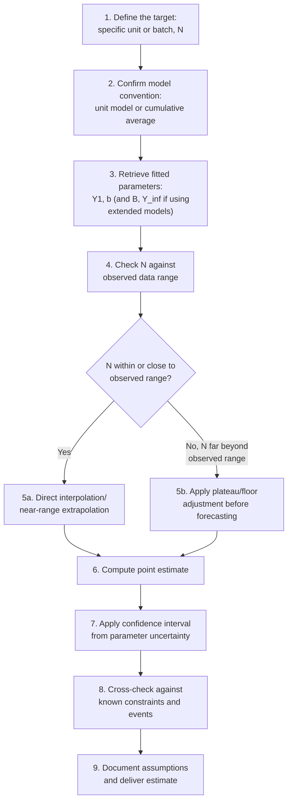

## Estimating Labor-Hours for Future Production Units

### Overview

This topic operationalizes the mathematical models covered previously (Wright's unit model, the cumulative average model, and their extensions) into a concrete workflow for producing a specific, actionable labor-hour estimate for a target future unit or batch. It draws directly on the estimation and validation practices already established, applying them to the practical planning task of answering "how many labor hours should we budget for unit $N$?"

### End-to-End Estimation Workflow

### Step 1–3: Setup

Before computing anything, the planner must have on hand:

- The **target unit or batch number** ($N$) for which an estimate is needed
- The **model convention** in use (unit model vs. cumulative average model — see prior topics), since the formula and interpretation differ
- The **fitted parameters** ($Y_1$, $b$, and any extension parameters like $B$ or $Y_\infty$) from the estimation process covered under "Estimating learning rates from historical data"
- Awareness of any **known structural events** (breaks, design changes) between the data used to fit the model and the target unit $N$

### Step 4–5: Assessing Extrapolation Distance

**Key Points**

- Forecasts for units *within* or *close to* the cumulative-volume range already observed in the fitting data carry the least extrapolation risk, since the fitted power-law parameters were validated against data spanning that range
- Forecasts for units *far beyond* the observed range carry progressively more risk, for two compounding reasons: (1) the sensitivity of power-law forecasts to small parameter errors grows with extrapolation distance (as shown under the progress-ratio topic), and (2) the plateau/floor limitations of the pure power law (see the plateauing topic) become increasingly likely to bias a far-out forecast downward from what will actually be achievable
- A practical rule of thumb used in applied cost estimating: extrapolations within roughly one additional doubling of the observed maximum cumulative volume are considered comparatively reliable; extrapolations spanning multiple additional doublings warrant explicit sensitivity analysis and consideration of a floor-adjusted model

[Unverified] The "one doubling" rule of thumb stated above is a commonly applied heuristic in practical cost-estimating work rather than a formally derived statistical threshold; the appropriate extrapolation distance for any specific estimate depends on the width of the fitted parameters' confidence interval and the specific process's known plateau behavior, and should be assessed case by case rather than by a fixed universal rule.

### Step 6: Computing the Point Estimate

**Direct case — target unit within the unit model's native formula:**

$$Y_N = Y_1 \cdot N^{b}$$

**Worked Example**

A firm has fitted a unit model to its first 150 units of production: $Y_1 = 640$ hours, $b = -0.152$ (a 90% progress ratio, consistent with a moderately complex, partially automated assembly process). The firm needs a labor-hour estimate for unit 400, to support a staffing decision for an upcoming contract expansion.

$$Y_{400} = 640 \times 400^{-0.152}$$

$$400^{-0.152} = e^{-0.152 \times \ln(400)} = e^{-0.152 \times 5.9915} = e^{-0.9107} \approx 0.4023$$

$$Y_{400} \approx 640 \times 0.4023 \approx 257.5 \text{ hours}$$

Since unit 400 represents less than two additional doublings beyond the observed maximum of 150 (150 → 300 → 600 would be two full doublings; 400 sits partway into the second), this falls within the "comparatively reliable" extrapolation range under the rule of thumb above.

**Cumulative average model case — target is a batch rather than a single unit:**

If the planning need is total labor hours for the *next batch* of units (say, units 151 through 200) rather than a single unit, the cumulative average model's closed-form total-cost formula (see the cumulative-average-model topic) is generally more direct:

$$T_N = Y_1 \cdot N^{(b+1)}$$

$$\text{Batch hours (151–200)} = T_{200} - T_{150}$$

Using the same illustrative parameters under the cumulative average convention ($Y_1 = 640$, $b = -0.152$, so $b+1 = 0.848$):

$$T_{200} = 640 \times 200^{0.848} = 640 \times e^{0.848 \times \ln(200)} = 640 \times e^{0.848 \times 5.298} = 640 \times e^{4.493} \approx 640 \times 89.36 \approx 57{,}190 \text{ hours}$$

$$T_{150} = 640 \times 150^{0.848} = 640 \times e^{0.848 \times \ln(150)} = 640 \times e^{0.848 \times 5.011} = 640 \times e^{4.249} \approx 640 \times 70.05 \approx 44{,}832 \text{ hours}$$

$$\text{Batch hours (151–200)} = 57{,}190 - 44{,}832 = 12{,}358 \text{ hours}$$

This 12,358-hour figure directly supports a staffing calculation for the upcoming batch, without needing to sum 50 individual unit-level terms.

[Inference] Note that the parameters used in the unit-model example above ($Y_1=640, b=-0.152$) and this cumulative-average example are being applied illustratively to both conventions using the same numbers purely to demonstrate each formula's mechanics; in an actual estimating engagement, the analyst would fit each model convention separately to appropriately-defined data (individual-unit values for the unit model, running averages for the cumulative average model) rather than assuming one fitted parameter set applies equally well under both conventions, since the two models generally do not share numerically identical parameter values for the same underlying process, as established under the cumulative-average-model topic.

### Step 7: Applying Confidence Intervals to the Estimate

As established under "Estimating learning rates from historical data," a point estimate alone understates real forecasting uncertainty. The confidence interval on $b$ (or equivalently on $r$) should be propagated into the labor-hour forecast:

**Example (continuing the unit-400 forecast)**

Suppose the fitted $b = -0.152$ carries a 95% confidence interval of $[-0.19, -0.11]$ (illustrative). Recomputing $Y_{400}$ at each interval endpoint:

$$Y_{400}^{lower\ b} = 640 \times 400^{-0.19} = 640 \times e^{-0.19 \times 5.9915} = 640 \times e^{-1.1384} \approx 640 \times 0.3204 \approx 205.1 \text{ hours}$$

$$Y_{400}^{upper\ b} = 640 \times 400^{-0.11} = 640 \times e^{-0.11 \times 5.9915} = 640 \times e^{-0.6591} \approx 640 \times 0.5173 \approx 331.1 \text{ hours}$$

The resulting forecast range — approximately 205 to 331 hours, against a central point estimate of 257.5 hours — should be presented to stakeholders as a range rather than a single precise figure, particularly when the estimate will inform a firm commitment (staffing level, contract pricing) rather than a rough planning placeholder.

### Diagram: Forecast Range Widening with Extrapolation Distance

<svg xmlns="http://www.w3.org/2000/svg" viewBox="0 0 800 340">
<text x="400" y="24" text-anchor="middle" font-size="15" font-weight="bold" fill="#1a1a1a">Forecast Uncertainty Widens Beyond the Observed Data Range (svg_diagram)</text>
<line x1="70" y1="290" x2="740" y2="290" stroke="#333" stroke-width="2" />
<line x1="70" y1="290" x2="70" y2="50" stroke="#333" stroke-width="2" />
<text x="400" y="320" text-anchor="middle" font-size="12" fill="#1a1a1a">Cumulative Unit Number</text>
<text x="30" y="180" text-anchor="middle" font-size="12" fill="#1a1a1a" transform="rotate(-90 30 180)">Labor Hours</text>
<line x1="380" y1="50" x2="380" y2="290" stroke="#94a3b8" stroke-width="1.5" stroke-dasharray="4,3" />
<text x="390" y="65" font-size="11" fill="#64748b">End of observed data (unit 150)</text>
<path d="M 100 90 Q 250 160 380 195" stroke="#2563eb" stroke-width="2.5" fill="none" />
<path d="M 100 90 Q 250 160 380 195 Q 500 220 620 245 Q 680 255 730 262" stroke="#2563eb" stroke-width="2.5" stroke-dasharray="6,4" fill="none" />
<path d="M 380 195 Q 500 210 620 225 Q 680 232 730 238" stroke="#93c5fd" stroke-width="14" fill="none" opacity="0.5" />
<text x="550" y="200" font-size="11" fill="#2563eb" font-weight="bold">Point forecast (dashed = extrapolated)</text>
<text x="500" y="255" font-size="11" fill="#3b82f6">Widening confidence band</text>
</svg>

### Step 8: Cross-Checking Against Known Constraints

A computed point estimate or confidence interval should not be delivered without checking it against other known planning facts:

- **Scheduled events between the fitted data and the target unit**: a planned production break (see the forgetting-curves topic), an upcoming design change, or a scheduled automation upgrade (technology-source improvement — see sources-of-learning) between the current cumulative volume and the target unit $N$ will invalidate a naive continuous-curve extrapolation across that event
- **Known workforce plans**: significant planned hiring, layoffs, or a facility relocation between now and the target unit affects the individual-vs-organizational learning composition of the forecast and may warrant an explicit forgetting/retention adjustment (see forgetting-curves topic) rather than a straight extrapolation
- **Plausibility against the theoretical/engineering floor**: if the point estimate approaches or falls below an independently-estimated irreducible minimum task time, this signals the extrapolation may be running into plateau territory (see plateauing topic) and a floor-adjusted or Stanford-B model should be substituted for the pure power law

### Step 9: Documentation Standards for Delivered Estimates

A labor-hour estimate delivered for operational or contractual use should specify:

- The target unit/batch number and the model convention used
- The fitted parameters and their source (which historical dataset, what date range, what cumulative-volume range)
- The point estimate and its confidence interval
- Extrapolation distance relative to the observed data range, and any associated caveat
- Any known future events (breaks, design changes, automation investments) that were or were not accounted for in the estimate, and how

### Common Practical Errors to Avoid

| Error | Consequence |
| --- | --- |
| Mixing unit-model parameters into a cumulative-average formula (or vice versa) | Produces a numerically incorrect estimate that does not correspond to either model's proper interpretation (see cumulative-average-model topic) |
| Extrapolating far beyond observed data with a pure power law and no floor | Systematically under-predicts labor hours at high cumulative volume (see plateauing topic) |
| Presenting only a point estimate for a high-stakes commitment | Understates real forecasting risk; a range better reflects genuine uncertainty (see progress-ratio and estimating-learning-rates topics) |
| Ignoring a known upcoming production break in the estimate | Estimate will be optimistic relative to actual post-break performance (see forgetting-curves topic) |
| Applying an industry-benchmark progress ratio without adjustment when firm-specific data exists | Firm-specific fitted parameters are generally more reliable than generic benchmarks once sufficient internal data has accumulated (see estimating-learning-rates topic) |

**Related Topics**

- Estimating learning rates from historical data (source of the fitted parameters used here)
- Progress ratio and learning rate percentage (forecast sensitivity to parameter precision)
- Plateauing and limitations of log-linear models (when to apply floor adjustments)
- Forgetting curves and learning-curve regression (adjusting for known upcoming interruptions)
- Workforce and staffing plan development from labor-hour forecasts