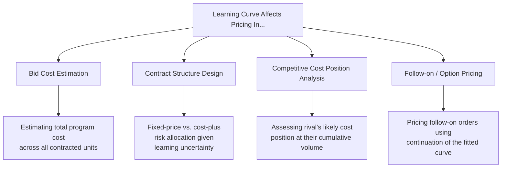

## Learning Curves in Pricing and Competitive Bidding

### Overview

Learning-curve mathematics has a long and specific history of application in competitive bid pricing and contract negotiation, particularly in aerospace, defense, and other high-value, low-volume manufacturing contexts where a producer commits to a multi-unit contract price before production experience has fully materialized. This topic connects the modeling machinery from earlier chapters to the strategic and negotiation-level decisions that depend on it.

### Why Learning Curves Matter for Pricing

**Key Points**

- Because unit cost declines with cumulative volume, a bid price based only on early-unit cost (before any learning has occurred) will overstate the producer's true average cost across a full contract quantity — the cumulative average model's total-cost formula (see the cumulative-average-model topic) is the standard tool for computing a realistic full-contract cost basis
- Because a rival's unit cost also depends on their own cumulative production experience, comparing bid prices without accounting for each competitor's respective position on their own learning curve can produce a misleading picture of relative cost competitiveness
- Learning-curve assumptions embedded in a bid become a source of *risk* the moment the contract is signed — if the actual realized progress ratio is worse (higher $r$, slower learning) than assumed, a fixed-price bid based on an optimistic learning assumption can become unprofitable partway through the contract

### Using the Cumulative Average Model for Total Contract Cost Estimation

As established under the cumulative-average-model topic, this model's defining practical advantage — direct closed-form total cost — is precisely why it has historically been the standard tool in aerospace/defense contract pricing:

$$T_N = Y_1 \cdot N^{(b+1)}$$

**Worked Example**

A firm is preparing a fixed-price bid for a contract to supply $N = 300$ units. Based on a similar prior program, the firm estimates $Y_1 = 800$ hours and a progress ratio $r = 0.82$ ($b = \log_2(0.82) \approx -0.2863$, so $b+1 = 0.7137$).

$$T_{300} = 800 \times 300^{0.7137}$$

$$300^{0.7137} = e^{0.7137 \times \ln(300)} = e^{0.7137 \times 5.7038} = e^{4.0705} \approx 58.55$$

$$T_{300} \approx 800 \times 58.55 \approx 46{,}840 \text{ total labor hours across the contract}$$

Applying a fully-burdened labor rate (illustrative, e.g., $85/hour including overhead) yields an estimated total labor cost basis of approximately $46{,}840 \times 85 \approx \$3{,}981{,}400$ for the labor component of the bid — a figure the firm then uses as the foundation for its pricing, margin, and risk-contingency decisions, alongside materials and other direct/indirect cost categories not addressed by the labor-hours model itself.

### Contract Structure and Risk Allocation

The choice of contract type interacts directly with learning-curve uncertainty:

- **Fixed-price contracts**: the producer bears the full risk if actual learning is slower than assumed in the bid (a higher realized $r$ than bid). Because of the compounding sensitivity of power-law forecasts to the progress-ratio assumption (see the progress-ratio topic), even a modest overestimate of the learning rate at bid time can produce a materially unprofitable contract by its later units
- **Cost-plus contracts**: risk of slower-than-assumed learning shifts substantially to the buyer, since the producer is reimbursed for actual incurred cost rather than bearing the gap between bid assumption and reality
- **Fixed-price with economic price adjustment or learning-curve incentive clauses**: some contract structures explicitly tie a portion of pricing to actual realized progress against a stated learning-curve assumption, sharing risk between producer and buyer rather than allocating it entirely to one party

[Inference] Because the progress-ratio assumption embedded in a fixed-price bid directly determines the producer's realized margin, and because that assumption is fitted from necessarily limited pre-contract data (see the estimating-learning-rates topic), fixed-price bidding on learning-curve-sensitive production is inherently a risk-transfer mechanism whose fairness depends heavily on how defensible the underlying progress-ratio estimate actually is — this follows from combining the estimation-uncertainty and contract-risk concepts covered elsewhere rather than being an independently established finding specific to this topic.

### Diagram: Bid Cost Basis Sensitivity to Progress Ratio Assumption

<svg xmlns="http://www.w3.org/2000/svg" viewBox="0 0 800 340">
<text x="400" y="24" text-anchor="middle" font-size="15" font-weight="bold" fill="#1a1a1a">Total Contract Cost Estimate vs. Assumed Progress Ratio (svg_diagram)</text>
<line x1="80" y1="290" x2="740" y2="290" stroke="#333" stroke-width="2" />
<line x1="80" y1="290" x2="80" y2="50" stroke="#333" stroke-width="2" />
<text x="410" y="320" text-anchor="middle" font-size="12" fill="#1a1a1a">Assumed Progress Ratio (r)</text>
<text x="35" y="180" text-anchor="middle" font-size="12" fill="#1a1a1a" transform="rotate(-90 35 180)">Estimated Total Contract Hours</text>
<path d="M 120 260 Q 300 210 450 150 Q 600 100 700 70" stroke="#2563eb" stroke-width="2.5" fill="none" />
<circle cx="300" cy="200" r="5" fill="#dc2626" />
<text x="310" y="195" font-size="11" fill="#dc2626">78% (optimistic bid)</text>
<circle cx="480" cy="140" r="5" fill="#16a34a" />
<text x="490" y="135" font-size="11" fill="#16a34a">82% (bid assumption)</text>
<circle cx="620" cy="95" r="5" fill="#d97706" />
<text x="500" y="85" font-size="11" fill="#d97706">88% (actual realized — slower learning)</text>
</svg>

If the firm bids using $r=82\%$ but actual production experience follows a slower $r=88\%$ curve, total realized labor hours across the same 300-unit contract will be materially higher than budgeted — the gap between the bid assumption and realized performance directly erodes margin on a fixed-price contract.

### Analyzing a Competitor's Cost Position

Because unit cost is a function of *cumulative* volume rather than calendar time, comparing two competitors' costs requires knowing (or estimating) each firm's respective cumulative production experience, not just their current unit price:

**Example**

Two firms compete for a follow-on contract. Firm A has cumulative production of 500 units at an estimated progress ratio of 85%; Firm B is newer to the product category with cumulative production of only 80 units, but claims a faster learning rate of 78% based on its more automated, less labor-intensive process.

Using the unit model to estimate each firm's *current* marginal unit cost (illustrative $Y_1 = 1000$ hours for both, for comparison purposes only):

Firm A at $x=500$, $b_A = \log_2(0.85) \approx -0.2345$:

$$Y_{500}^A = 1000 \times 500^{-0.2345} \approx 1000 \times 0.2119 \approx 211.9 \text{ hours}$$

Firm B at $x=80$, $b_B = \log_2(0.78) \approx -0.3589$:

$$Y_{80}^B = 1000 \times 80^{-0.3589} \approx 1000 \times 0.2313 \approx 231.3 \text{ hours}$$

At their respective current positions, Firm A's estimated marginal cost (211.9 hours) is somewhat lower than Firm B's (231.3 hours), despite Firm B's faster underlying learning rate — because Firm A's much greater cumulative experience currently outweighs Firm B's steeper curve. Projecting forward, if Firm B reaches Firm A's current cumulative volume (500 units):

$$Y_{500}^B = 1000 \times 500^{-0.3589} \approx 1000 \times 0.1122 \approx 112.2 \text{ hours}$$

This suggests that if Firm B's faster progress ratio assumption holds, it would eventually surpass Firm A's cost position once it accumulates comparable volume — a strategically relevant insight for assessing long-run competitive dynamics, not just current-period pricing.

[Unverified] This comparative analysis depends entirely on the accuracy of each firm's estimated $Y_1$ and progress ratio, both of which are typically not directly observable for a competitor and must instead be inferred from public bid history, industry benchmarks, or general knowledge of each firm's process/automation characteristics — such competitor-facing estimates carry substantially more uncertainty than a firm's estimates of its own internal cost structure, and should be treated as directional/strategic rather than precise.

### Pricing Follow-On and Option Orders

When a contract includes options for additional units beyond an initial base order, the learning-curve model provides a principled basis for pricing those follow-on units — since the option units continue along the same cumulative-volume curve rather than restarting:

$$Y_{x_{option}} = Y_1 \cdot x_{option}^{b}$$

using the cumulative unit number that includes prior base-order production, not a restarted count. Buyers negotiating option pricing have a direct interest in ensuring option unit prices reflect the *continued decline* implied by the learning curve rather than being priced at the same rate as the (higher-cost) initial base-order units — a common point of negotiation tension, since the producer may prefer to price options closer to blended base-order economics while the buyer has an interest in options reflecting the lower marginal cost the producer will actually incur by that point in cumulative production.

### Practical Cautions in Bid-Related Learning-Curve Use

- **Bidding on unproven progress ratios**: for genuinely novel products with no prior internal production history, the progress-ratio assumption embedded in a bid is necessarily based on industry analogy or engineering judgment (see the estimating-learning-rates topic's discussion of benchmark cross-checks) rather than fitted internal data — this carries materially more estimation risk than bidding on an established, previously-produced product line
- **Interaction with production breaks**: a multi-year contract with scheduled production gaps (funding-driven pauses, common in government contracting) should incorporate forgetting-curve considerations (see the forgetting-curves topic) into the total cost estimate, rather than assuming an uninterrupted curve across a schedule that includes known planned breaks
- **Distinguishing labor learning from total experience-curve decline in the cost basis**: a bid's labor-hour estimate should be built from the appropriate learning-effect model (see the learning-effect-vs-experience-effect topic), with materials, overhead, and other cost categories estimated through their own appropriate methods rather than assumed to decline at the same rate as direct labor

**Related Topics**

- The power law cumulative average model (the core total-cost formula used in bid estimation)
- Distinguishing the learning effect from the experience effect (labor-only vs. total-cost pricing basis)
- Estimating learning rates from historical data (basis for a defensible bid assumption)
- Forgetting curves and learning-curve regression (accounting for scheduled contract-period breaks)
- Contract risk allocation structures and learning-curve incentive clauses