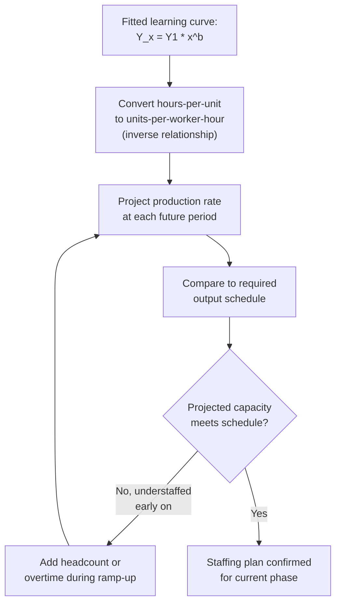

## Workforce Training and Staffing Implications

### Overview

This topic translates learning-curve mathematics into concrete workforce planning decisions: staffing ramp-up schedules, training investment sizing, shift design, and turnover risk management. It draws directly on the labor-source mechanism (see sources-of-learning) and the individual-vs-organizational learning distinction, applying both to practical human-resources and operations planning.

### Staffing Ramp-Up Curve Design

**Key Points**

- Because labor hours per unit decline with cumulative volume, a fixed headcount produces an *increasing* output rate over time as the workforce moves along the learning curve — this means early-production staffing needs are generally higher per unit of output than steady-state staffing needs for the same target output rate
- A staffing plan that uses a flat headcount assumption throughout a ramp-up (rather than accounting for the declining hours-per-unit) will systematically overstate labor requirements for later periods and can lead to costly overstaffing if not adjusted as the learning curve is realized
- Conversely, a staffing plan that assumes mature, late-curve hours-per-unit too early in the ramp-up will understaff the early production period and risk missing output commitments

### Converting the Labor-Hours Curve into a Staffing Schedule

Given a fitted unit model $Y_x = Y_1 \cdot x^{b}$ (hours required for unit $x$), and a target production schedule specifying how many units must be completed in each period, the required labor-hours for a given period is the sum of $Y_x$ across the units planned for that period — which can be computed using the cumulative-average-model's total-hours formula (see that topic) for the relevant unit ranges, exactly as demonstrated under "Estimating labor-hours for future production units."

**Worked Example**

A firm plans to produce a total of 400 units over four quarterly periods, at a planned rate of 100 units per quarter. Using $Y_1 = 500$ hours and $r=0.82$ ($b \approx -0.2863$, cumulative average convention, $b+1 = 0.7137$):

$$T_{100} = 500 \times 100^{0.7137} = 500 \times e^{0.7137 \times 4.6052} = 500 \times e^{3.2864} \approx 500 \times 26.75 \approx 13{,}375 \text{ hours}$$

$$T_{200} = 500 \times 200^{0.7137} = 500 \times e^{0.7137 \times 5.2983} = 500 \times e^{3.7818} \approx 500 \times 43.94 \approx 21{,}970 \text{ hours}$$

$$T_{300} = 500 \times 300^{0.7137} \approx 500 \times 58.55 \approx 29{,}275 \text{ hours (using the prior topic's computation)}$$

$$T_{400} = 500 \times 400^{0.7137} = 500 \times e^{0.7137 \times 5.9915} = 500 \times e^{4.2761} \approx 500 \times 71.94 \approx 35{,}970 \text{ hours}$$

Quarterly labor-hour requirements (each quarter's total minus the prior cumulative total):

| Quarter | Units | Cumulative Hours | Quarterly Hours Required |
| --- | --- | --- | --- |
| Q1 | 1–100 | 13,375 | 13,375 |
| Q2 | 101–200 | 21,970 | 8,595 |
| Q3 | 201–300 | 29,275 | 7,305 |
| Q4 | 301–400 | 35,970 | 6,695 |

Despite constant unit output (100 per quarter throughout), the required labor hours decline substantially from Q1 to Q4 — from 13,375 down to 6,695, roughly a 50% reduction — directly reflecting the learning curve. A staffing plan holding headcount flat across all four quarters at the Q1 level would be materially overstaffed by Q4; conversely, staffing at the Q4 level from the outset would be unable to meet the Q1 output target.

### Diagram: Declining Labor-Hours Requirement at Constant Output Rate

<svg xmlns="http://www.w3.org/2000/svg" viewBox="0 0 800 340">
<text x="400" y="24" text-anchor="middle" font-size="15" font-weight="bold" fill="#1a1a1a">Quarterly Labor-Hours at Constant 100-Unit Output (svg_diagram)</text>
<line x1="80" y1="290" x2="740" y2="290" stroke="#333" stroke-width="2" />
<line x1="80" y1="290" x2="80" y2="50" stroke="#333" stroke-width="2" />
<text x="400" y="320" text-anchor="middle" font-size="12" fill="#1a1a1a">Quarter</text>
<text x="35" y="180" text-anchor="middle" font-size="12" fill="#1a1a1a" transform="rotate(-90 35 180)">Labor Hours Required</text>
<rect x="140" y="70" width="90" height="220" fill="#2563eb" opacity="0.85" />
<text x="185" y="65" text-anchor="middle" font-size="11" fill="#1a1a1a">Q1: 13,375</text>
<rect x="280" y="150" width="90" height="140" fill="#2563eb" opacity="0.7" />
<text x="325" y="145" text-anchor="middle" font-size="11" fill="#1a1a1a">Q2: 8,595</text>
<rect x="420" y="172" width="90" height="118" fill="#2563eb" opacity="0.55" />
<text x="465" y="167" text-anchor="middle" font-size="11" fill="#1a1a1a">Q3: 7,305</text>
<rect x="560" y="182" width="90" height="108" fill="#2563eb" opacity="0.4" />
<text x="605" y="177" text-anchor="middle" font-size="11" fill="#1a1a1a">Q4: 6,695</text>
</svg>

### Training Investment Sizing

Training investment can be understood as a deliberate intervention aimed at accelerating movement along the labor-source learning curve — effectively steepening the curve (lowering $r$) relative to what would occur through unassisted repetition alone (see the conditions-that-strengthen-learning-curve-effects topic).

**Key Points**

- A structured training program aims to compress the time/units required to reach a target proficiency level, which is equivalent to reducing the effective $x$ at which a target $Y_x$ is reached
- Training investment sizing decisions can be informed by comparing the projected labor-hour savings from a steeper assumed post-training curve against the direct cost of the training program itself — though isolating the causal training effect from concurrent unassisted learning requires either controlled comparison (a trained cohort vs. an untrained control cohort) or before/after analysis with appropriate caveats about confounding factors
- Training investment is also the primary mechanism for converting *individual* tacit learning into *organizational* learning more quickly (see the individual-vs-organizational-learning topic) — a formal training curriculum, once developed, allows new hires to reach proficiency faster than the original workforce did through unstructured trial-and-error, since the curriculum itself embodies previously-learned lessons

[Inference] Because training investment's payoff is realized through a steeper curve applied across the remaining production volume, the same compounding-sensitivity logic from the progress-ratio topic implies that training investments are generally more valuable earlier in a long production run (where more remaining volume benefits from the steeper curve) than late in a run near its completion — this follows mathematically from the shape of the power-law formula rather than being a separately established finding specific to training economics.

### Turnover Risk and Staffing Continuity

As established under individual-vs-organizational learning and forgetting-curves, workforce turnover interacts directly with realized learning-curve performance:

- **High planned turnover** (e.g., a facility relying on a largely transient or seasonal workforce) should be reflected in staffing and cost models via a *flatter* assumed progress ratio (higher $r$) than would be assumed for a stable workforce performing the same task, since continuous individual-level learning accumulation is disrupted by frequent replacement
- **Cross-training and succession planning** reduce key-person risk (see individual-vs-organizational learning) by ensuring that critical tacit knowledge is distributed across multiple individuals rather than concentrated in one person whose departure would otherwise cause a significant unplanned reversion
- **Retention incentive programs** during a critical ramp-up period can be economically justified by comparing their cost against the projected labor-hour cost increase that would result from turnover-driven forgetting during that specific period (see the forgetting-curves topic's retention-rate modeling)

**Example**

A facility ramping up a new, highly manual assembly process is evaluating a retention bonus program targeting its first 150 units of production, at an estimated cost of $45,000. Internal analysis (using the forgetting-curve retention-rate approach) estimates that without the program, historical turnover patterns would produce an effective retention rate of $R=0.5$ at the midpoint of the ramp-up, versus $R=0.85$ with the retention program in place — translating into an estimated 1,800 additional labor hours required without the program, at a fully-burdened rate of $60/hour (≈$108,000). Compared against the $45,000 program cost, the retention program is projected to be cost-justified under these illustrative assumptions.

[Unverified] This type of retention-program cost-benefit calculation depends on the reliability of the underlying retention-rate ($R$) estimates, which — as discussed under the forgetting-curves topic — are themselves typically calibrated from historical analogues or judgment rather than derived from a first-principles formula; the specific numeric example above is illustrative of the calculation method rather than a claim about typical real-world program returns.

### Shift Design and Team Continuity

- **Stable team composition** (see conditions-that-strengthen-learning-curve-effects) supports faster realized learning through coordination-based improvement in addition to individual skill accumulation; shift-rotation policies that frequently reshuffle team membership across different task configurations can dilute this benefit
- **Cross-shift knowledge transfer mechanisms** (shift-handoff documentation, shared standard work) help ensure that learning realized on one shift is captured organizationally (see individual-vs-organizational learning) rather than remaining siloed within a single shift's workforce

### Practical Staffing Plan Checklist

| Planning Question | Learning-Curve Concept Applied |
| --- | --- |
| How many workers are needed in period 1 vs. period N? | Declining hours-per-unit under constant output (cumulative average model) |
| Should we invest in a formal training program, and how much? | Training as a curve-steepening intervention; payoff timing sensitivity |
| How should we plan for expected turnover? | Flatter assumed $r$ under high turnover; retention-program cost-benefit via retention-rate modeling |
| Should teams be kept stable across the ramp-up? | Coordination-based learning; conditions that strengthen the curve |
| How do we protect against a planned production gap? | Forgetting-curve segment modeling for the resumption period |
| How do we avoid overstaffing in later periods? | Recomputing labor-hour requirements period-by-period rather than assuming flat headcount |

**Related Topics**

- Estimating labor-hours for future production units (the underlying forecasting mechanics)
- Sources of learning: labor, process, and technology (what training specifically accelerates)
- Individual learning versus organizational learning (training as an institutionalization mechanism)
- Forgetting curves and learning-curve regression (retention-rate cost-benefit modeling)
- Conditions that strengthen learning-curve effects (team stability and continuity factors)