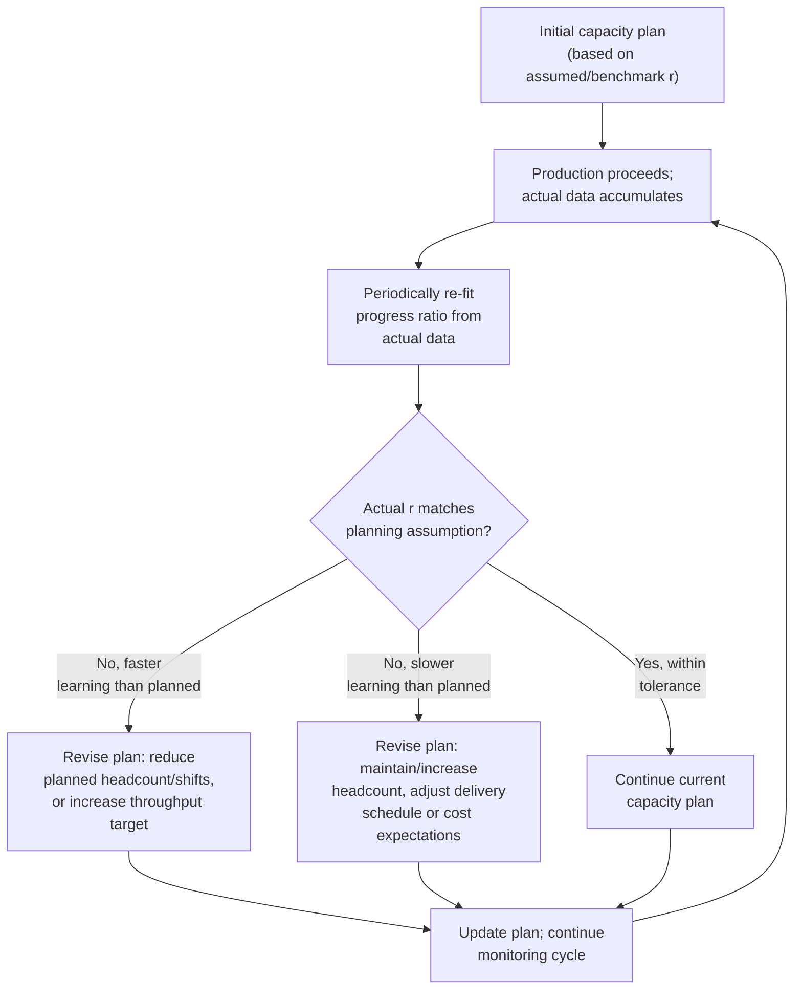

## Adjusting Capacity Plans for Productivity Gains

### Overview

This topic addresses the operational planning discipline of periodically revising capacity plans — facility throughput targets, equipment/line requirements, and headcount plans — as realized learning-curve productivity gains accumulate. Unlike the labor-hours forecasting and staffing topics already covered, the focus here is the *feedback loop*: how a capacity plan should be revisited and updated as actual production data diverges from (or confirms) the original planning assumptions.

### The Capacity Plan Revision Cycle

**Key Points**

- A capacity plan set once at the start of a production program and never revisited will systematically diverge from reality as the actual progress ratio (which is only ever imprecisely known in advance — see estimating-learning-rates) reveals itself through accumulating production data
- The direction of a needed adjustment is symmetric: **faster-than-planned** learning frees up capacity (headcount, equipment-hours) that can be redeployed or reduced, while **slower-than-planned** learning requires either additional capacity, an adjusted delivery schedule, or an acceptance of higher realized cost than originally budgeted
- Because of the compounding sensitivity of power-law forecasts to the progress-ratio assumption (see the progress-ratio topic), even a modest revision to the fitted $r$ partway through a production run can imply a substantial change to the capacity plan for the remaining volume

### Triggers for Capacity Plan Revision

- **Scheduled periodic review**: a standing cadence (e.g., quarterly, or every doubling of cumulative volume) at which the progress ratio is re-estimated from accumulated actual data (see estimating-learning-rates) and compared against the plan's original assumption
- **Material deviation alert**: an ongoing monitoring process that flags when actual per-unit labor hours diverge from the planned trajectory by more than a pre-defined tolerance, triggering an off-cycle review rather than waiting for the next scheduled checkpoint
- **Known structural events**: a completed technology investment (automation upgrade), a significant design change, or a production interruption (see forgetting-curves) are natural trigger points for plan revision, since each of these can shift the underlying progress ratio going forward independent of the routine monitoring cadence

### Worked Example: Mid-Program Plan Revision

A firm's original capacity plan for a 600-unit production program assumed $Y_1 = 900$ hours and $r = 0.85$ (a moderately conservative assumption based on industry benchmarks, per the estimating-learning-rates topic's cross-check guidance, since this was a genuinely new product line with no prior internal data at the time of initial planning).

**Original plan** (cumulative average model, $b = \log_2(0.85) \approx -0.2345$, $b+1 = 0.7655$):

$$T_{600}^{planned} = 900 \times 600^{0.7655}$$

$$600^{0.7655} = e^{0.7655 \times \ln(600)} = e^{0.7655 \times 6.3969} = e^{4.8969} \approx 133.9$$

$$T_{600}^{planned} \approx 900 \times 133.9 \approx 120{,}510 \text{ total labor hours (original plan)}$$

After the first 150 units are actually produced, the firm re-fits the progress ratio from real internal data (per the estimating-learning-rates workflow) and finds the actual realized ratio is $r_{actual} = 0.79$ — notably faster learning than the original conservative benchmark assumption. Using the actual data, $Y_1$ is also re-estimated at 850 hours (slightly lower than originally assumed, reflecting a somewhat better-than-expected start).

**Revised remaining-volume estimate** ($b_{actual} = \log_2(0.79) \approx -0.3401$, $b+1 = 0.6599$):

Total hours through unit 600 under the revised parameters:

$$T_{600}^{revised} = 850 \times 600^{0.6599}$$

$$600^{0.6599} = e^{0.6599 \times 6.3969} = e^{4.2214} \approx 68.16$$

$$T_{600}^{revised} \approx 850 \times 68.16 \approx 57{,}940 \text{ total labor hours (revised plan)}$$

The revised total-program estimate (≈57,940 hours) is dramatically lower than the original plan (≈120,510 hours) — reflecting both the somewhat lower $Y_1$ and, more significantly, the compounding effect of the faster realized progress ratio. This is a marked divergence that would clearly warrant a substantial capacity plan revision: reduced planned headcount for the remaining 450 units, potential reallocation of freed labor capacity to other programs, and a corresponding review of whether the original bid or budget (if this were a priced contract — see the pricing-and-competitive-bidding topic) should be revisited for internal cost-tracking purposes even if the contract price itself is fixed.

### Diagram: Original vs. Revised Capacity Trajectory

<svg xmlns="http://www.w3.org/2000/svg" viewBox="0 0 800 360">
<text x="400" y="24" text-anchor="middle" font-size="15" font-weight="bold" fill="#1a1a1a">Capacity Plan Revision After Mid-Program Data Review (svg_diagram)</text>
<line x1="80" y1="310" x2="740" y2="310" stroke="#333" stroke-width="2" />
<line x1="80" y1="310" x2="80" y2="50" stroke="#333" stroke-width="2" />
<text x="410" y="340" text-anchor="middle" font-size="12" fill="#1a1a1a">Cumulative Units Produced</text>
<text x="35" y="180" text-anchor="middle" font-size="12" fill="#1a1a1a" transform="rotate(-90 35 180)">Cumulative Labor Hours</text>
<line x1="230" y1="50" x2="230" y2="310" stroke="#94a3b8" stroke-width="1.5" stroke-dasharray="4,3" />
<text x="240" y="65" font-size="11" fill="#64748b">Review point (unit 150)</text>
<path d="M 100 280 Q 165 250 230 225" stroke="#333" stroke-width="2.5" fill="none" />
<path d="M 230 225 Q 400 150 550 100 Q 650 70 720 55" stroke="#d97706" stroke-width="2.5" stroke-dasharray="7,4" fill="none" />
<text x="560" y="90" font-size="11" fill="#d97706" font-weight="bold">Original plan trajectory</text>
<path d="M 230 225 Q 400 210 550 195 Q 650 185 720 178" stroke="#16a34a" stroke-width="2.5" fill="none" />
<text x="560" y="205" font-size="11" fill="#16a34a" font-weight="bold">Revised plan (faster realized learning)</text>
</svg>

### Handling the Opposite Case: Slower-Than-Planned Learning

The same revision discipline applies symmetrically when actual data reveals *slower* learning than originally planned:

- **Capacity implications**: additional headcount, overtime, or extended shift schedules may be required to meet the original output/delivery schedule, or the schedule itself must be renegotiated with the customer/stakeholder
- **Cost implications**: if the program was bid or budgeted using the original (optimistic) progress-ratio assumption, a downward revision requires an honest reassessment of program profitability or budget adequacy, ideally flagged to stakeholders promptly rather than after further cost overruns accumulate
- **Root-cause investigation**: slower-than-planned learning may indicate that one or more of the strengthening conditions assumed at planning time (see conditions-that-strengthen-learning-curve-effects) are not actually present — for example, higher-than-expected turnover, insufficient process engineering support, or a production process that turned out to be more mature/less improvable than initially assessed

[Inference] Because a capacity plan's revision in either direction stems from the same underlying re-estimation process (see estimating-learning-rates), the organizational discipline required to identify and act on a favorable deviation (freeing up capacity) is the same discipline required to catch an unfavorable one early — a monitoring process that only triggers review when problems become obvious will also tend to miss opportunities to reallocate freed-up capacity promptly when learning outpaces plan, this being a direct consequence of how the review-trigger process is structured rather than a claim about typical organizational behavior specifically.

### Interaction with Technology-Source Step-Changes

As discussed under sources-of-learning, technology-driven improvements arrive as discrete step-changes tied to specific capital investments, rather than continuously with cumulative volume. Capacity plan revision should treat a completed automation upgrade, tooling investment, or major process redesign as a distinct re-baselining event — the pre-investment progress ratio should not simply be extrapolated across the investment point; instead, a new baseline $Y_1$ and potentially a new progress ratio should be established from data collected after the change takes effect, similU to how a production break requires segmenting the data (see forgetting-curves) rather than fitting a single continuous curve across the discontinuity.

### Governance: Who Reviews and How Often

Practical capacity-plan revision processes typically specify:

- **Review cadence**: tied either to calendar periods (monthly/quarterly) or to production milestones (each doubling of cumulative volume, or every N units)
- **Revision threshold**: a defined tolerance band (e.g., actual progress ratio within ±3 percentage points of plan) below which no formal revision is triggered, versus a deviation beyond that threshold that mandates a documented plan update
- **Escalation path**: who is authorized to approve a capacity plan revision, particularly one with budget, staffing, or customer-schedule implications, versus routine monitoring updates that do not require the same level of approval

[Unverified] Specific governance thresholds and review cadences vary considerably by industry, program size, and organizational maturity; there is no single universally prescribed standard for how frequently or under what deviation threshold a capacity plan should be formally revised, and the appropriate cadence is typically set based on the specific program's scale, risk profile, and the cost of both under- and over-reacting to interim data noise.

### Summary Checklist for Ongoing Capacity Plan Management

| Activity | Frequency/Trigger | Learning-Curve Concept Applied |
| --- | --- | --- |
| Re-fit progress ratio from actual data | Scheduled cadence or volume milestone | Estimating learning rates from historical data |
| Compare actual vs. planned trajectory | Same cadence | Progress ratio and forecast sensitivity |
| Revise remaining-volume capacity/cost estimate | When deviation exceeds tolerance | Applying revised parameters to remaining unit range |
| Re-baseline after technology investment | Upon completion of automation/redesign | Sources of learning (technology-source step-changes) |
| Re-baseline after production break | Upon resumption | Forgetting curves and regression |
| Escalate material deviations to stakeholders | Per governance threshold | Documentation standards for delivered estimates |

**Related Topics**

- Estimating learning rates from historical data (the re-fitting process underlying plan revision)
- Estimating labor-hours for future production units (applying revised parameters going forward)
- Sources of learning: labor, process, and technology (technology-driven re-baselining events)
- Forgetting curves and learning-curve regression (re-baselining after production interruptions)
- Learning curves in pricing and competitive bidding (implications of revised cost estimates on contract economics)