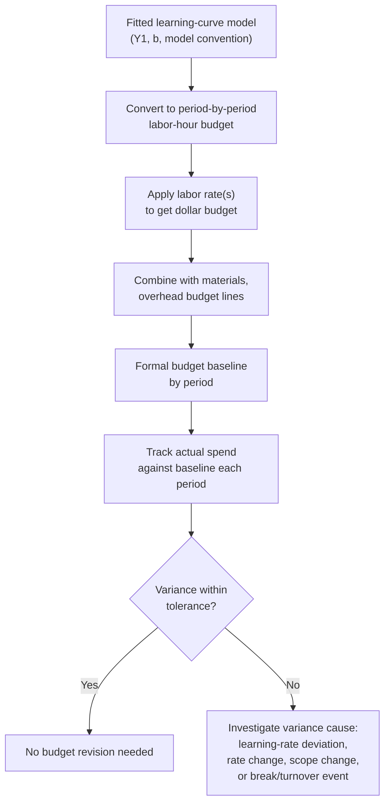

## Learning Curves in Cost Estimation and Budgeting

### Overview

Cost estimation and budgeting is a distinct organizational function from bid pricing or capacity planning, though it draws on the same underlying models. Where bid pricing (see the pricing-and-competitive-bidding topic) focuses on setting a contract price and capacity planning (see the adjusting-capacity-plans topic) focuses on staffing/throughput, budgeting is specifically concerned with translating the learning-curve cost trajectory into a formal, period-by-period budget baseline against which actual spending is tracked and variances are explained.

### From Learning Curve to Budget Line Items

**Key Points**

- A learning-curve-based budget is fundamentally a *declining* labor-cost budget over the production run, in contrast to budgets for steady-state, non-learning-sensitive cost categories (which are typically flat or escalated only for inflation) — this distinction should be made explicit to budget reviewers unfamiliar with learning-curve dynamics, since a declining labor budget can otherwise appear anomalous or be mistakenly "smoothed" by financial staff unfamiliar with its basis
- The period-by-period labor-hour figures used for a budget baseline are computed using the same total-hours-by-period method demonstrated under workforce-training-and-staffing-implications (subtracting cumulative totals at consecutive period boundaries via the cumulative average model's formula)
- Materials and overhead cost lines generally do **not** follow the same learning-curve decline pattern as direct labor unless a separate, appropriately-scoped experience-curve analysis has been performed for those categories specifically (see the learning-effect-vs-experience-effect distinction) — budgeting a flat or independently-escalated materials/overhead line alongside a declining labor line is standard practice, not an inconsistency

### Budget Variance Analysis Specific to Learning-Curve-Based Budgets

A budget built on a learning-curve labor projection introduces a variance-analysis dimension not present in flat-rate budgets: **the actual progress ratio may differ from the budgeted progress ratio**, in addition to the more familiar sources of variance (rate variance, volume variance).

**Standard variance decomposition, extended for learning-curve budgets:**

| Variance Type | Definition | Learning-Curve-Specific Consideration |
| --- | --- | --- |
| Rate variance | Actual labor rate ($/hour) differs from budgeted rate | Independent of the learning curve itself |
| Volume variance | Actual units produced differ from budgeted units | Affects which point on the curve is relevant, but not the curve's shape |
| **Learning-rate variance** | Actual progress ratio differs from budgeted progress ratio | Specific to learning-curve-based budgets; requires re-fitting actual data (see estimating-learning-rates) to isolate |
| Efficiency variance (residual) | Remaining unexplained difference after the above | May reflect a structural break (see forgetting-curves) not captured by a smooth re-fit |

**Worked Example**

A budget for a 12-month production program assumed, for month 6, a cumulative-to-date labor cost of $185,000 based on a budgeted progress ratio of $r=0.83$. Actual month-6 cumulative labor cost is recorded at $203,000, a $18,000 unfavorable variance. Investigation proceeds as follows:

1. **Check for rate variance first**: if the actual fully-burdened labor rate was $62/hour against a budgeted $58/hour, part of the $18,000 gap is attributable to rate variance, calculable independently of the learning curve: $(62-58) \times \text{actual hours}$
2. **Check for volume variance**: if actual cumulative units produced through month 6 differ from the budgeted unit count, some of the remaining gap reflects simply having produced a different quantity than planned, not a learning-rate problem per se
3. **Isolate learning-rate variance**: after adjusting for rate and volume variance, re-fitting the actual hours-per-unit data (per the estimating-learning-rates workflow) and comparing the resulting actual progress ratio against the budgeted 0.83 reveals whether the residual gap reflects genuinely slower-than-budgeted learning

[Inference] This decomposition sequence — rate, then volume, then learning-rate, then residual — mirrors standard variance-analysis practice used broadly in cost accounting for other cost drivers, adapted here to explicitly carve out the learning-curve-specific component rather than allowing it to remain buried inside an undifferentiated "efficiency variance" catch-all, which would otherwise obscure whether a labor cost overrun stems from a genuinely different learning trajectory versus other, unrelated causes.

### Diagram: Budget Baseline with Variance Tracking

<svg xmlns="http://www.w3.org/2000/svg" viewBox="0 0 800 340">
<text x="400" y="24" text-anchor="middle" font-size="15" font-weight="bold" fill="#1a1a1a">Budgeted vs. Actual Cumulative Labor Cost (svg_diagram)</text>
<line x1="80" y1="290" x2="740" y2="290" stroke="#333" stroke-width="2" />
<line x1="80" y1="290" x2="80" y2="50" stroke="#333" stroke-width="2" />
<text x="410" y="320" text-anchor="middle" font-size="12" fill="#1a1a1a">Month</text>
<text x="35" y="180" text-anchor="middle" font-size="12" fill="#1a1a1a" transform="rotate(-90 35 180)">Cumulative Labor Cost ($)</text>
<path d="M 100 275 Q 250 220 400 175 Q 550 140 700 115" stroke="#2563eb" stroke-width="2.5" fill="none" />
<text x="550" y="130" font-size="11" fill="#2563eb" font-weight="bold">Budget baseline (planned r)</text>
<path d="M 100 275 Q 250 215 400 155 Q 550 105 700 75" stroke="#dc2626" stroke-width="2.5" stroke-dasharray="6,4" fill="none" />
<text x="550" y="90" font-size="11" fill="#dc2626" font-weight="bold">Actual spend (slower realized learning)</text>
<line x1="400" y1="175" x2="400" y2="155" stroke="#666" stroke-width="1.5" />
<text x="410" y="168" font-size="10" fill="#444">Month-6 variance</text>
</svg>

### Budget Contingency and Reserve Sizing

Because the progress-ratio assumption embedded in a learning-curve-based budget carries genuine estimation uncertainty (see estimating-learning-rates and the progress-ratio topic's confidence-interval treatment), budget contingency/reserve sizing should reflect that uncertainty rather than assuming the point-estimate progress ratio will be realized exactly.

**Example**

Using the confidence-interval approach established under estimating-labor-hours-for-future-production-units, if a budget baseline is built on a point-estimate progress ratio with a 95% confidence interval spanning [0.80, 0.86] rather than a single fixed 0.83, a budget contingency reserve sized to cover the *upper* end of that interval (0.86, the slower-learning, higher-cost case) provides a more defensible cushion against unfavorable learning-rate variance than a reserve based on generic percentage padding unrelated to the specific parameter uncertainty of the underlying model.

[Unverified] The specific practice of sizing contingency reserves directly from a learning-curve model's confidence interval, as opposed to using a generic percentage-based contingency common in many budgeting frameworks, is a methodologically sound extension of the concepts covered elsewhere in this material, but the degree to which this specific practice is standardized or commonly adopted across industries is not established here and should not be assumed to be universal practice.

### Multi-Year and Multi-Program Budget Rollups

For organizations managing multiple concurrent production programs, each potentially at a different point on its own learning curve, budget rollups require attention to a specific aggregation pitfall:

- **Do not average progress ratios across dissimilar programs** for a combined rollup forecast — each program's $Y_1$, $b$, and cumulative volume position are specific to that program's own task, workforce, and history (see conditions-that-strengthen-learning-curve-effects), and a blended average progress ratio applied uniformly across a portfolio will misstate the true aggregate labor-cost trajectory
- **Aggregate at the total-hours level, not the ratio level**: the correct rollup approach computes each program's own period-by-period labor-hours forecast independently (per its own fitted parameters) and only sums the resulting *dollar or hour totals* across programs — never averages the underlying progress ratios themselves before forecasting

### Budget Cycle Integration Checklist

| Budget Cycle Activity | Learning-Curve Element Involved |
| --- | --- |
| Initial annual/program budget baseline | Fitted or benchmark progress ratio, converted to period-by-period labor-hour and dollar figures |
| Monthly/quarterly actual-vs-budget review | Variance decomposition including learning-rate variance |
| Contingency reserve sizing | Confidence interval on the fitted progress ratio |
| Mid-cycle budget re-forecast | Re-fitting from accumulated actual data (see estimating-learning-rates), analogous to capacity-plan revision |
| Multi-program portfolio rollup | Aggregating total hours/dollars per-program, not averaging progress ratios across programs |

**Related Topics**

- Estimating labor-hours for future production units (the core forecasting mechanics feeding a budget)
- Adjusting capacity plans for productivity gains (the parallel capacity-side revision process)
- Learning curves in pricing and competitive bidding (contract-price basis vs. internal budget basis)
- Estimating learning rates from historical data (source of budget re-forecast inputs)
- Standard cost-accounting variance analysis frameworks (rate, volume, and efficiency variance)