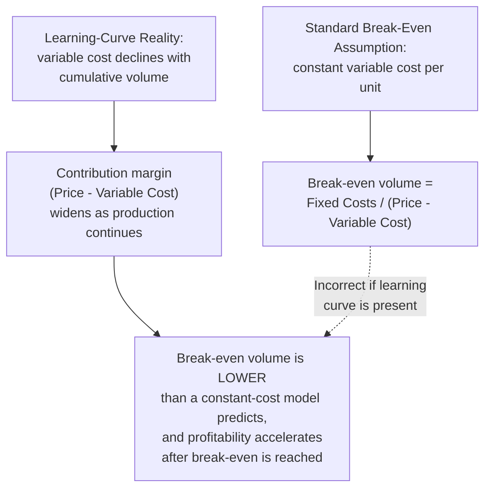

## Learning-Curve Effects on Break-Even Timing

### Overview

Standard break-even analysis assumes a constant per-unit variable cost. When variable cost (specifically, the labor-hour component) declines with cumulative production according to a learning curve, the break-even point — the cumulative volume at which total revenue equals total cost — shifts earlier than a naive constant-cost analysis would predict, and the *dynamics* of profitability across the production run change shape entirely. This topic addresses how to correctly compute break-even timing when a learning curve is present.

### Why Standard Break-Even Analysis Breaks Down

**Key Points**

- Under a constant-variable-cost assumption, contribution margin (price minus variable cost) is fixed, and cumulative profit grows linearly with volume once fixed costs are covered
- Under a learning-curve assumption, variable cost (specifically the labor-hour-driven component) *declines* with cumulative volume, meaning **contribution margin widens** as production continues — each successive unit is more profitable than the last, assuming price remains constant
- This means cumulative profit under a learning-curve model does not grow linearly past break-even — it grows at an *accelerating* rate, since each additional unit contributes progressively more margin than the one before it
- A break-even analysis that uses only the *first-unit* cost (before any learning has occurred) will substantially overstate the break-even volume; a break-even analysis using the correct cumulative-average cost trajectory will show a materially earlier break-even point

### Formal Break-Even Condition with a Learning Curve

Using the cumulative average model's total-cost formula (see the cumulative-average-model topic), total cost through cumulative volume $x$ (labor cost only, for the learning-curve-sensitive component) is:

$$TC(x) = F + \left(Y_1 \cdot x^{b+1}\right) \cdot w$$

Where:

- $F$ = total fixed costs
- $Y_1 \cdot x^{b+1}$ = cumulative labor hours through volume $x$ (cumulative average model)
- $w$ = fully-burdened labor rate ($/hour)
- (materials and other non-learning-sensitive variable costs would be added as an additional linear term, $m \cdot x$, if being modeled explicitly — omitted here for clarity of the core learning-curve effect)

Total revenue through volume $x$, assuming constant unit price $P$:

$$TR(x) = P \cdot x$$

Break-even occurs at the volume $x^*$ where $TR(x^*) = TC(x^*)$:

$$P \cdot x^* = F + \left(Y_1 \cdot (x^*)^{b+1}\right) \cdot w$$

This equation is **not solvable in closed form** for $x^*$ in general (because $x^*$ appears both linearly and raised to a non-integer power $b+1$), and is instead solved numerically — a contrast with the simple algebraic break-even formula used under the constant-cost assumption.

### Worked Example: Numerical Break-Even Comparison

A firm plans to sell a product at $P = \$450$ per unit, with fixed costs $F = \$120{,}000$. Labor is billed at $w = \$65$/hour. The firm's learning curve is estimated at $Y_1 = 30$ hours and $r=0.82$ ($b \approx -0.2863$, cumulative average convention, $b+1 = 0.7137$). For simplicity, materials and other non-learning-sensitive variable costs are assumed already netted into the $450 contribution-relevant price (i.e., this example isolates the labor-learning effect on break-even).

**Naive constant-cost break-even** (using only unit-1 labor cost, $30 \times 65 = \$1,950$ per unit — clearly an overly pessimistic assumption, included here purely for contrast):

$$x^*_{naive} = \frac{120{,}000}{450 - 1950}$$

This produces a negative, meaningless result, since at unit-1 cost, the product is sold at a loss per unit and would never break even under a naive constant-first-unit-cost assumption — illustrating why using first-unit cost for break-even analysis is a clear methodological error when a learning curve is present.

**Learning-curve-adjusted break-even** (solved numerically):

Testing $x = 300$:

$$TC(300) = 120{,}000 + \left(30 \times 300^{0.7137}\right) \times 65$$

$$300^{0.7137} \approx 58.55 \text{ (from the pricing-topic's earlier computation using the same exponent)}$$

$$TC(300) = 120{,}000 + (30 \times 58.55) \times 65 = 120{,}000 + 1756.5 \times 65 = 120{,}000 + 114{,}172.5 = 234{,}172.5$$

$$TR(300) = 450 \times 300 = 135{,}000$$

At $x=300$, total cost ($234,173) still substantially exceeds total revenue ($135,000) — not yet break-even. Testing a higher volume, $x=800$:

$$800^{0.7137} = e^{0.7137 \times \ln(800)} = e^{0.7137 \times 6.6846} = e^{4.7710} \approx 118.0$$

$$TC(800) = 120{,}000 + (30 \times 118.0) \times 65 = 120{,}000 + 3540 \times 65 = 120{,}000 + 230{,}100 = 350{,}100$$

$$TR(800) = 450 \times 800 = 360{,}000$$

At $x=800$, total revenue ($360,000) now exceeds total cost ($350,100) — break-even has occurred somewhere between 300 and 800 units. Narrowing further (illustrative interpolation, not shown in full step-by-step numeric-solver detail here) locates the break-even point at approximately $x^* \approx 770$–$780$ units.

[Inference] The specific narrowing/bisection procedure used to pin down the exact break-even volume between the two bracketing test points shown above follows standard numerical root-finding practice (bisection or similar iterative methods) for an equation with no closed-form solution; the approximate 770–780 range given here reflects that numerical process applied to this specific illustrative example rather than a generally quotable result.

### Diagram: Cumulative Revenue vs. Cumulative Cost with a Learning Curve

<svg xmlns="http://www.w3.org/2000/svg" viewBox="0 0 800 360">
<text x="400" y="24" text-anchor="middle" font-size="15" font-weight="bold" fill="#1a1a1a">Break-Even Under a Declining-Cost (Learning-Curve) Model (svg_diagram)</text>
<line x1="80" y1="310" x2="740" y2="310" stroke="#333" stroke-width="2" />
<line x1="80" y1="310" x2="80" y2="50" stroke="#333" stroke-width="2" />
<text x="410" y="340" text-anchor="middle" font-size="12" fill="#1a1a1a">Cumulative Units Produced</text>
<text x="35" y="180" text-anchor="middle" font-size="12" fill="#1a1a1a" transform="rotate(-90 35 180)">Cumulative Dollars</text>
<line x1="100" y1="290" x2="700" y2="90" stroke="#2563eb" stroke-width="2.5" />
<text x="600" y="105" font-size="11" fill="#2563eb" font-weight="bold">Cumulative Revenue (linear)</text>
<path d="M 100 130 Q 300 175 480 210 Q 600 230 700 245" stroke="#dc2626" stroke-width="2.5" fill="none" />
<text x="500" y="245" font-size="11" fill="#dc2626" font-weight="bold">Cumulative Cost (decelerating, concave)</text>
<circle cx="565" cy="185" r="6" fill="#16a34a" />
<text x="575" y="180" font-size="11" fill="#16a34a" font-weight="bold">Break-even point (x*)</text>
</svg>

The concave shape of the cumulative-cost curve (a direct consequence of the declining marginal labor cost per unit) is what causes the two curves to converge and cross earlier, and at a shallower crossing angle, than the straight-line cumulative-cost curve implied by a constant-unit-cost assumption. Past the crossing point, the growing gap between the two curves — cumulative revenue's straight line pulling further ahead of cumulative cost's flattening curve — visually represents the accelerating profitability discussed above.

### Sensitivity of Break-Even Timing to the Progress Ratio

Because break-even timing depends on the same power-law parameters whose forecasting sensitivity was established under the progress-ratio topic, break-even volume estimates are similarly sensitive to progress-ratio precision:

| Progress Ratio Assumption | Approximate Break-Even Volume (illustrative, same example parameters) |
| --- | --- |
| 78% (faster learning) | Earlier break-even — lower $x^*$ |
| 82% (base case above) | ≈770–780 units |
| 86% (slower learning) | Later break-even — higher $x^*$ |

[Unverified] The specific break-even volumes corresponding to the 78% and 86% alternative progress ratios in this table are not computed in full numeric detail here; the qualitative direction (faster learning → earlier break-even, slower learning → later break-even) follows directly from the mathematical structure of the model, but precise alternative-scenario figures would require the same numerical solving procedure applied under each alternative parameter set.

### Practical Implications

- **New product/program viability analysis**: a naive break-even calculation using early-production (high) unit costs can make a genuinely viable learning-curve-sensitive product appear unprofitable, potentially leading to an incorrect go/no-go decision if the learning-curve effect is not properly incorporated
- **Pricing strategy interaction**: because contribution margin widens with cumulative volume under a learning curve, firms sometimes deliberately price *below* early-unit cost (a loss-leader-like strategy specific to learning-curve-sensitive products) with the explicit expectation of reaching profitability as cumulative volume grows — this strategy's validity depends entirely on the reliability of the underlying progress-ratio assumption (see the pricing-and-competitive-bidding topic's discussion of bid risk)
- **Break-even monitoring as a capacity-plan trigger**: tracking actual cumulative cost against the projected break-even trajectory functions as a specific application of the broader capacity-plan-revision monitoring process (see adjusting-capacity-plans-for-productivity-gains) — a break-even point that is arriving later than projected is a direct signal of slower-than-planned realized learning

### Common Pitfalls

- **Using first-unit or early-average cost for break-even analysis**: as the naive example above demonstrates, this can make an otherwise viable learning-curve product appear non-viable or produce a meaningless (negative) break-even calculation
- **Assuming linear cumulative cost growth**: applying the standard algebraic break-even formula ($F / (\text{Price} - \text{Variable Cost})$) directly, using any single fixed variable-cost figure, ignores the concave shape of the true cumulative-cost curve and will misstate break-even timing in either direction depending on which point on the curve that fixed figure happens to represent
- **Ignoring materials/overhead cost dynamics**: this topic's worked example isolates the labor-learning effect for clarity; a complete break-even analysis should separately account for whether materials and overhead costs follow their own (potentially different) decline pattern, per the learning-effect-vs-experience-effect distinction, rather than assuming they behave identically to the labor-hour curve

**Related Topics**

- The power law cumulative average model (the total-cost formula underlying this analysis)
- Learning curves in pricing and competitive bidding (pricing strategy interacting with break-even dynamics)
- Adjusting capacity plans for productivity gains (break-even monitoring as a plan-revision trigger)
- Distinguishing the learning effect from the experience effect (scope of cost categories included in break-even)
- Numerical methods for solving non-closed-form break-even equations