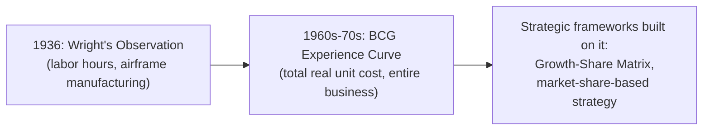
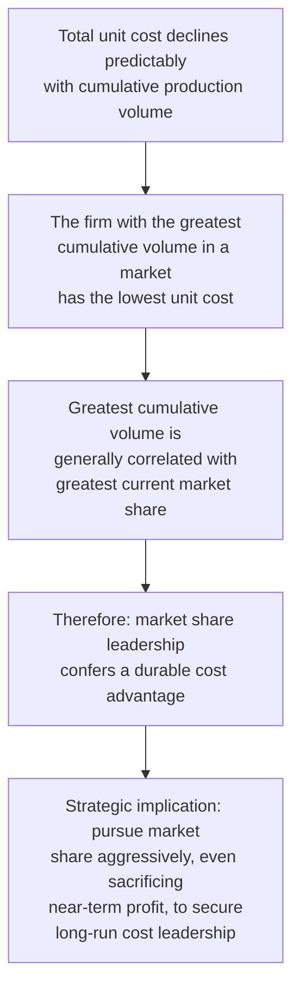

## The Boston Consulting Group Experience Curve Concept

### Historical Origin

The Boston Consulting Group (BCG), under the leadership of founder Bruce Henderson, developed and popularized the **experience curve** concept during the 1960s and 1970s, building on but substantially broadening Wright's original 1936 labor-hours observation (see "Wright's observation and early formulations"). BCG's contribution was primarily strategic rather than purely mathematical: applying the power-law cost-decline pattern to *total* unit cost across an entire business, and using it as the foundation for a framework of competitive strategy and corporate portfolio management.

**Key Points**

- BCG's central empirical claim, extending Wright's narrower observation: **total real (inflation-adjusted) unit cost** — not just direct labor — declines by a consistent percentage each time cumulative production doubles, across essentially any competitive business
- This broadened scope explicitly includes labor, materials, overhead, marketing, distribution, and capital costs — anything contributing to the total cost of delivering a unit of value to the market — as distinct from Wright's original labor-hours-only formulation (see the learning-effect-vs-experience-effect distinction for the formal contrast)
- BCG used the experience curve as the empirical foundation for strategic conclusions about market share, pricing, and competitive positioning, rather than as a purely operational/cost-accounting tool

### The Core Strategic Argument

BCG's strategic logic proceeds from the experience-curve cost pattern to a conclusion about the value of market share:

[Inference] This chain of reasoning — from the experience curve's cost mathematics to a market-share-pursuit strategic prescription — represents BCG's most influential and most widely cited strategic conclusion from the experience-curve concept; it is presented here as BCG's own argument and strategic framework rather than as an empirically settled, universally applicable truth, since the argument's validity in any specific case depends on assumptions (discussed further below) that do not hold uniformly across all industries.

### Mathematical Form (Same Power Law, Broader Cost Base)

The experience curve retains the identical power-law functional form used throughout this material:

$$C_x = C_1 \cdot x^{b}$$

Where $C_x$ is **total real unit cost** at cumulative volume $x$ (in contrast to $Y_x$, used elsewhere in this material to denote labor hours specifically), and $b = \log_2(r)$ as before. All of the fitting, log-linearization, and forecasting mechanics established under the log-linear-formulation and estimating-learning-rates topics apply identically — the mathematics is unchanged; only the interpretation and scope of the cost variable differs.

**Historically cited typical experience-curve decline rates**: BCG's early published studies across a range of industries commonly cited experience-curve progress ratios in the vicinity of 70-80% (i.e., 20-30% total cost decline per cumulative-volume doubling), broadly steeper (faster-declining) than the classic 80% labor-hours-only benchmark frequently associated with Wright's narrower original observation.

[Unverified] These historically cited ranges are commonly repeated in strategy and business-history literature describing BCG's original studies; specific numeric progress ratios for any individual industry or company should be verified against the original BCG publications or a specific empirical study rather than assumed to apply generally, since experience-curve steepness — as established under the conditions-that-strengthen-learning-curve-effects topic — varies considerably by industry structure, capital intensity, and competitive dynamics.

### The Growth-Share Matrix Connection

BCG's experience curve concept is closely associated with, and provided part of the theoretical justification for, BCG's separately developed **Growth-Share Matrix**, a portfolio-planning tool that classifies business units by market growth rate and relative market share.

| Growth-Share Quadrant | Market Share | Market Growth | Experience-Curve Rationale |
| --- | --- | --- | --- |
| "Stars" | High | High | Leading share implies lower cost position; growth market justifies continued investment to defend that position |
| "Cash Cows" | High | Low | Leading share and low growth mean the accumulated cost advantage generates cash with reduced need for further investment |
| "Question Marks" | Low | High | Lagging share implies a cost disadvantage relative to the leader; strategic choice is to invest aggressively for share (per the experience-curve logic) or divest |
| "Dogs" | Low | Low | Lagging share with low growth offers little prospect of ever overtaking the cost-leadership position through experience accumulation |

[Inference] The Growth-Share Matrix is a distinct BCG strategic framework in its own right, but its underlying logic for why market share matters strategically draws directly on the experience-curve argument that greater cumulative volume produces a durable cost advantage — this connection is presented here as the documented rationale linking the two frameworks, rather than treating the matrix itself as a topic requiring independent full derivation here.

### Diagram: The Strategic Experience Curve

<svg xmlns="http://www.w3.org/2000/svg" viewBox="0 0 800 340">
<text x="400" y="24" text-anchor="middle" font-size="15" font-weight="bold" fill="#1a1a1a">Experience Curve: Cost Position by Cumulative Market Volume (svg_diagram)</text>
<line x1="80" y1="290" x2="740" y2="290" stroke="#333" stroke-width="2" />
<line x1="80" y1="290" x2="80" y2="50" stroke="#333" stroke-width="2" />
<text x="410" y="320" text-anchor="middle" font-size="12" fill="#1a1a1a">Cumulative Industry Volume (log scale)</text>
<text x="35" y="180" text-anchor="middle" font-size="12" fill="#1a1a1a" transform="rotate(-90 35 180)">Total Real Unit Cost (log scale)</text>
<path d="M 100 80 Q 300 160 500 210 T 730 250" stroke="#333" stroke-width="2.5" fill="none" />
<circle cx="620" cy="230" r="7" fill="#2563eb" />
<text x="500" y="215" font-size="11" fill="#2563eb" font-weight="bold">Market leader (highest cumulative volume)</text>
<circle cx="380" cy="175" r="7" fill="#d97706" />
<text x="390" y="170" font-size="11" fill="#d97706" font-weight="bold">Follower (lower cumulative volume, higher cost position)</text>
</svg>

### Distinguishing the Experience Curve from the Underlying Learning Effect

As established in detail under "Distinguishing the learning effect from the experience effect," the experience curve is a broader, blended construct than pure labor-hour learning. Its cost decline is attributable to multiple concurrent mechanisms:

- Labor-source learning (Wright's original mechanism)
- Process-source improvements (workflow, tooling, quality)
- Technology-source improvements (automation, product redesign, yield gains)
- Economies of scale (fixed-cost spreading, not itself a "learning" mechanism but often bundled into experience-curve discussions)
- Input/supplier cost improvements achieved through purchasing leverage at higher volumes

BCG's original framing did not always sharply distinguish these component mechanisms from one another — the strategic argument treated the *aggregate* cost decline as the relevant variable for competitive positioning, regardless of which specific underlying source drove it in any given case.

### Critiques and Limitations of the Strategic Argument

- **Not all cost decline reflects genuine "experience"**: a portion of experience-curve decline in some industries reflects ordinary economies of scale (spreading fixed costs over more units) rather than genuine learning-by-doing — economies of scale are a *static* efficiency gain tied to current output rate, conceptually distinct from a *dynamic* gain tied to cumulative historical volume, even though both can appear similar in aggregate cost data
- **Market share does not guarantee experience-curve position dominance in all industries**: the strategic argument's strength depends on how much of total cost is genuinely volume/experience-sensitive versus determined by other factors (input costs, technology accessible to all competitors regardless of scale, regulatory costs) — in industries where experience-curve effects are weak, pursuing market share for cost-leadership reasons specifically may not be strategically justified
- **Price wars and margin sacrifice risk**: the "invest in share now for cost leadership later" prescription, if pursued based on an overly optimistic progress-ratio assumption (see the pricing-and-competitive-bidding topic's discussion of bid risk, applied here at a strategic rather than contract level), can lead to sustained margin sacrifice that does not pay off if the assumed experience-curve decline does not materialize as steeply as assumed
- **New entrants and technology disruption**: a leader's accumulated experience-curve cost advantage can be undermined by a new entrant employing fundamentally different (often newer) technology that achieves a lower cost structure without needing to replicate the incumbent's cumulative volume — this is a recognized limitation discussed in strategy literature critiquing overreliance on the experience-curve framework as a sole basis for competitive strategy

[Inference] These critiques are widely discussed in business strategy literature examining the experience-curve concept's applicability and limits; they are presented here as documented critiques of the framework's strategic use rather than as a claim that the underlying mathematical cost-decline pattern itself is invalid — the mathematics of a power-law cost decline with cumulative volume is separable from the strategic conclusion that market-share pursuit is therefore always the correct strategy, and the critiques target primarily the latter.

### Practical Legacy

Despite the critiques above, the experience curve concept remains influential in strategic management education and corporate strategy practice, particularly:

- As a diagnostic tool for understanding *why* a market leader may hold a durable cost advantage, prompting analysis of which underlying sources (see sources-of-learning) actually drive that advantage in a specific industry
- As a caution against pricing or investment decisions that ignore the compounding cost implications of cumulative volume position, even where the specific numeric BCG-style progress ratios from historical studies are not directly applicable
- As the historical bridge connecting Wright's narrow operational observation to the broader field of strategic cost management, informing how firms think about cost position as a function of accumulated experience rather than only current-period efficiency

**Related Topics**

- Distinguishing the learning effect from the experience effect (formal scope comparison)
- Wright's observation and early formulations (the narrower predecessor concept)
- Sources of learning: labor, process, and technology (decomposing what actually drives experience-curve decline)
- Learning curves in pricing and competitive bidding (contract-level analog to the strategic market-share argument)
- Critiques of experience-curve-based strategy and the role of technological disruption