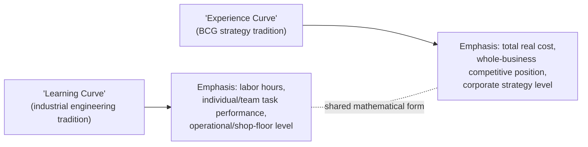

## Distinguishing the Experience Curve from the Learning Curve

### Terminological Origins

**Key Points**

- **"Learning curve"** as a term traces most directly to Wright's 1936 labor-hours observation and the broader industrial-engineering tradition of studying individual/team task-repetition effects (see "Wright's observation and early formulations")
- **"Experience curve"** is the specific term BCG adopted and popularized in the 1960s-70s for its broadened, total-cost, strategy-oriented version of the same underlying power-law pattern (see "The Boston Consulting Group experience curve concept")
- In casual and even much professional usage, the two terms are frequently used as if interchangeable; this session has already established the substantive distinction in detail under "Distinguishing the learning effect from the experience effect" — this topic addresses the terminological history and the strategic-context implications of maintaining the distinction, rather than repeating that prior scope comparison

### Why the Terminological Distinction Matters in a Strategic-Cost-Management Context

Within this chapter's specific focus — strategic cost management — the practical stakes of conflating the two terms are somewhat different from the operational stakes discussed earlier in this material (under the learning-effect-vs-experience-effect topic, which focused on staffing/training implications). Here, the relevant risks are:

- **Strategic decisions require the total-cost (experience curve) framing**: a market-share investment decision, a competitive cost-position assessment, or a Growth-Share-Matrix-style portfolio judgment (see the BCG topic) needs to be grounded in total real unit cost — using a narrower labor-only learning-curve figure for this purpose would materially understate a competitor's or one's own true cost trajectory if non-labor cost categories (technology, scale, materials) are contributing substantially to the actual decline
- **Operational decisions require the labor-specific (learning curve) framing**: a workforce training investment or staffing ramp-up decision (see workforce-training-and-staffing-implications) needs the narrower labor-hours curve specifically, since that is the component training investment actually acts upon — using a blended experience-curve figure for this purpose would misattribute cost decline driven by capital investment or scale to a lever (labor training) that does not actually control it
- **Published or cited progress ratios must specify which curve they refer to**: a "70% curve" claim, without specifying whether it refers to total real cost (experience curve, BCG tradition) or labor hours specifically (learning curve, Wright tradition), is not interpretable without that context — and, as the strategic-cost-management chapter's use cases show, applying a figure intended for one purpose to a decision requiring the other risks a substantively wrong conclusion, not merely an imprecise one

### A Strategic-Context Comparison Table

| Consideration | Learning Curve (Wright tradition) | Experience Curve (BCG tradition) |
| --- | --- | --- |
| Primary audience/use | Industrial engineers, operations managers, workforce planners | Corporate strategists, portfolio planners, competitive analysts |
| Typical decision supported | Training investment, staffing ramp-up, individual task-level cost forecasting | Market-share strategy, pricing strategy, competitive cost-position assessment |
| Cost scope | Direct labor hours only | Total real unit cost (labor + materials + overhead + capital + distribution) |
| Typical historical progress ratio range cited | ~80-90% (see the progress-ratio topic's reference table) | ~70-80% (broader cost base, more mechanisms compounding — see BCG topic) |
| Level of analysis | Task, workstation, individual production line | Whole business unit, product line, competitive market |
| Risk of misapplication | Understating training's operational payoff if a broader curve's steeper rate is mistakenly assumed to apply to labor alone | Understating a competitor's true cost position if only labor-hours data is available and mistaken for the full picture |

### Historical Note: Wright's Concept Predates and Underlies BCG's

It bears restating explicitly, given this chapter's strategic framing: Wright's 1936 labor-hours observation is chronologically and conceptually **prior** to BCG's experience curve — BCG's contribution was to generalize and re-scope an already-established empirical pattern for strategic rather than purely operational purposes, not to discover the underlying power-law phenomenon independently. This is why the two share an identical mathematical form (see the log-linear-formulation topic) — BCG did not need to develop new curve-fitting mathematics, only to argue that the same functional pattern applied to a broader cost base and had strategic rather than merely operational significance.

### Diagram: Same Mathematical Skeleton, Different Scope and Audience

<svg xmlns="http://www.w3.org/2000/svg" viewBox="0 0 800 320">
<text x="400" y="24" text-anchor="middle" font-size="15" font-weight="bold" fill="#1a1a1a">Shared Mathematics, Divergent Strategic vs. Operational Application (svg_diagram)</text>
<rect x="80" y="60" width="280" height="200" rx="8" fill="#dbeafe" stroke="#2563eb" stroke-width="2" />
<text x="220" y="90" text-anchor="middle" font-size="13" font-weight="bold" fill="#1e3a8a">Learning Curve</text>
<text x="220" y="115" text-anchor="middle" font-size="11" fill="#1e3a8a">Y_x = Y1 * x^b</text>
<text x="220" y="140" text-anchor="middle" font-size="11" fill="#1e3a8a">(labor hours)</text>
<text x="220" y="170" text-anchor="middle" font-size="11" fill="#1e3a8a">Used for:</text>
<text x="220" y="190" text-anchor="middle" font-size="11" fill="#1e3a8a">Training investment,</text>
<text x="220" y="207" text-anchor="middle" font-size="11" fill="#1e3a8a">staffing plans,</text>
<text x="220" y="224" text-anchor="middle" font-size="11" fill="#1e3a8a">unit-level cost forecasts</text>
<rect x="440" y="60" width="280" height="200" rx="8" fill="#dcfce7" stroke="#16a34a" stroke-width="2" />
<text x="580" y="90" text-anchor="middle" font-size="13" font-weight="bold" fill="#14532d">Experience Curve</text>
<text x="580" y="115" text-anchor="middle" font-size="11" fill="#14532d">C_x = C1 * x^b</text>
<text x="580" y="140" text-anchor="middle" font-size="11" fill="#14532d">(total real unit cost)</text>
<text x="580" y="170" text-anchor="middle" font-size="11" fill="#14532d">Used for:</text>
<text x="580" y="190" text-anchor="middle" font-size="11" fill="#14532d">Market-share strategy,</text>
<text x="580" y="207" text-anchor="middle" font-size="11" fill="#14532d">competitive positioning,</text>
<text x="580" y="224" text-anchor="middle" font-size="11" fill="#14532d">portfolio planning</text>
<text x="400" y="285" text-anchor="middle" font-size="11" fill="#666">Same power-law skeleton — same log-linear fitting, same progress-ratio interpretation</text>
</svg>

### Practical Guidance for This Chapter's Strategic Context

When engaging in strategic cost management specifically:

- **Always state explicitly which curve a cited progress ratio refers to** before using it in a strategic argument (market share investment case, competitive benchmarking, portfolio classification) — an unlabeled "learning rate" figure sourced from operational/HR contexts may be the narrower labor-only figure, unsuitable for a total-cost strategic argument without adjustment
- **When benchmarking a competitor's cost position** (as introduced under the pricing-and-competitive-bidding topic's competitor-analysis example), recognize that publicly available or inferred data is far more likely to approximate an experience-curve (blended, total-cost) figure than a pure labor-hours learning-curve figure, since external observers rarely have access to a competitor's internal labor-hour records specifically
- **When justifying an internal training or workforce investment using a strategic narrative** ("our experience curve says we should invest in volume"), verify that the *labor-specific* component of that broader experience-curve decline is actually large enough to justify a labor-focused intervention — a business with a steep experience curve driven predominantly by scale and technology effects (see sources-of-learning) may see little return from labor-training investment specifically, despite an impressive-looking aggregate curve

[Inference] This practical guidance follows directly from combining the definitional distinction (established under the learning-effect-vs-experience-effect topic) with the specific strategic use cases this chapter addresses; it represents an application of already-established concepts to the strategic-cost-management context rather than an independently new empirical claim.

**Related Topics**

- Distinguishing the learning effect from the experience effect (the foundational scope comparison, operational framing)
- The Boston Consulting Group experience curve concept (origin of the strategic "experience curve" terminology)
- Wright's observation and early formulations (origin of the narrower "learning curve" terminology)
- Sources of learning: labor, process, and technology (decomposing which mechanisms justify which type of investment)
- Learning curves in pricing and competitive bidding (contract-level application of curve-type distinctions)