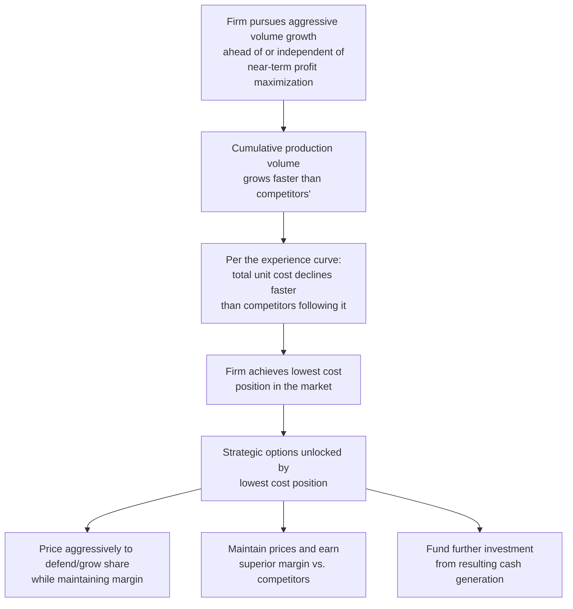

## Cost Leadership Strategy Built on Experience Effects

### Overview

Cost leadership is one of the classic generic competitive strategies (alongside differentiation and focus, in the framework popularized by Michael Porter), and the experience curve concept (see "The Boston Consulting Group experience curve concept") provides one of the principal theoretical mechanisms by which a firm can pursue and sustain a cost-leadership position. This topic addresses how experience-curve mathematics translates into a deliberate cost-leadership strategy, the operational and financial commitments such a strategy requires, and the conditions under which it succeeds or fails.

### The Cost Leadership Logic, Built on the Experience Curve

**Key Points**

- Cost leadership built on experience effects is fundamentally a **race for cumulative volume**, not merely current-period output — a firm can have lower current-period output than a rival yet still hold a stronger cost position if its *cumulative* historical volume is greater (see the competitor cost-position analysis under "Learning curves in pricing and competitive bidding")
- The strategy typically requires **deliberate early-stage investment or margin sacrifice** to build cumulative volume ahead of the cost advantage materializing — pricing aggressively (even below current cost) to capture volume, on the expectation that the experience curve will bring cost down to profitable levels as cumulative volume accumulates (directly connecting to the break-even-timing dynamics discussed earlier in this material)
- Success is not guaranteed by the mathematics alone — it depends on whether the specific industry's cost structure is genuinely experience-sensitive to the degree assumed (see the strengthening-conditions and sources-of-learning topics), and on competitors' responses

### Strategic Preconditions for a Viable Experience-Based Cost Leadership Strategy

Not every industry or competitive situation supports this strategy equally well. Drawing on the conditions-that-strengthen-learning-curve-effects topic, a cost-leadership strategy built on experience effects is more likely to succeed where:

- **The experience curve is genuinely steep** (low progress ratio) — a shallow experience curve offers little cost-position payoff even for a large cumulative-volume lead, undermining the strategy's core rationale
- **Cost, not differentiation, is the primary basis of competition** in the target market — an experience-based cost-leadership strategy is poorly suited to markets where customers primarily value differentiated features, brand, or service quality over price
- **Barriers exist to competitors closing the cumulative-volume gap quickly** — if a rival can rapidly catch up in cumulative volume (through acquisition, licensing, or aggressive parallel investment), the leader's experience-curve advantage erodes faster than the strategy's economics assumed
- **The firm has access to capital or willingness to sustain margin sacrifice** during the volume-building phase, since the strategy's payoff is back-loaded relative to its upfront investment/sacrifice (directly connecting to the break-even-timing topic's demonstration that cumulative cost decline, and therefore payoff, compounds only gradually before accelerating)

[Inference] These preconditions follow from combining the experience-curve mathematics with the general strategic logic BCG originally articulated; a firm evaluating whether to pursue this specific strategy would reasonably need to assess each precondition explicitly for its own industry situation rather than assuming the strategy is universally applicable, consistent with the critiques of the BCG framework already noted under the prior topic on the BCG concept.

### Financial Mechanics: Quantifying the Volume-Building Investment

The cost-leadership investment can be quantified as the cumulative margin sacrifice incurred during the period when price is set below current unit cost, in pursuit of the future cost position the experience curve is expected to deliver.

**Worked Example**

A firm enters a market pricing at $P=\$120$/unit, while its current unit cost — following an experience curve with $C_1 = \$400$ and $r=0.75$ (a steep, strategically significant experience curve, consistent with BCG's historically cited faster-declining benchmarks) — starts well above that price and is expected to fall below it as cumulative volume grows.

Using $b = \log_2(0.75) \approx -0.415$:

At $x=50$:

$$C_{50} = 400 \times 50^{-0.415} = 400 \times e^{-0.415 \times \ln(50)} = 400 \times e^{-0.415 \times 3.912} = 400 \times e^{-1.6235} \approx 400 \times 0.1973 \approx 78.9$$

At $x=10$ (much earlier in the ramp-up):

$$C_{10} = 400 \times 10^{-0.415} = 400 \times e^{-0.415 \times 2.3026} = 400 \times e^{-0.9556} \approx 400 \times 0.3847 \approx 153.9$$

At $x=10$, unit cost ($153.9) is well above the $120 price — a loss of $33.90 per unit at that point in the ramp-up. By $x=50$, unit cost ($78.9) has fallen below the $120 price — a gain of $41.10 per unit. The **cumulative margin sacrifice** incurred while unit cost remained above price (roughly the first ~20-25 units, by interpolation, where $C_x$ crosses $120) represents the deliberate strategic investment the firm makes in pursuit of the eventual cost-leadership position — directly analogous to the break-even-timing dynamics established earlier, but framed here at the strategic market-entry level rather than the single-program budgeting level.

### Diagram: Margin Sacrifice Then Reward Under a Cost-Leadership Ramp

<svg xmlns="http://www.w3.org/2000/svg" viewBox="0 0 800 340">
<text x="400" y="24" text-anchor="middle" font-size="15" font-weight="bold" fill="#1a1a1a">Cost Leadership Investment Phase and Payoff Phase (svg_diagram)</text>
<line x1="80" y1="290" x2="740" y2="290" stroke="#333" stroke-width="2" />
<line x1="80" y1="290" x2="80" y2="50" stroke="#333" stroke-width="2" />
<text x="410" y="320" text-anchor="middle" font-size="12" fill="#1a1a1a">Cumulative Units Produced (log scale)</text>
<text x="35" y="180" text-anchor="middle" font-size="12" fill="#1a1a1a" transform="rotate(-90 35 180)">Dollars per Unit</text>
<line x1="80" y1="200" x2="740" y2="200" stroke="#2563eb" stroke-width="2.5" />
<text x="650" y="190" font-size="11" fill="#2563eb" font-weight="bold">Price (held constant): $120</text>
<path d="M 100 60 Q 220 130 340 180 Q 450 205 550 225 Q 650 240 720 250" stroke="#dc2626" stroke-width="2.5" fill="none" />
<text x="180" y="90" font-size="11" fill="#dc2626" font-weight="bold">Unit cost curve</text>
<rect x="100" y="60" width="240" height="140" fill="#fecaca" opacity="0.4" />
<text x="140" y="80" font-size="10" fill="#991b1b" font-weight="bold">Margin sacrifice zone</text>
<rect x="340" y="200" width="380" height="90" fill="#bbf7d0" opacity="0.4" />
<text x="500" y="270" font-size="10" fill="#14532d" font-weight="bold">Margin reward zone</text>
</svg>

### Defending a Cost-Leadership Position Once Achieved

Once a firm achieves a cost-leadership position through accumulated experience, sustaining that advantage requires:

- **Continued volume growth**: since cumulative volume, not a one-time achievement, is the ongoing basis of the advantage — a competitor that eventually accumulates comparable cumulative volume (even starting later, if it grows faster) can close the cost gap, as illustrated under the competitor cost-position example in the pricing-and-bidding topic
- **Vigilance against technology disruption**: as noted under the BCG-concept topic's critiques, a new entrant using fundamentally different technology can bypass the incumbent's accumulated-volume advantage entirely, achieving a competitive cost structure without replicating the incumbent's cumulative production history — this is a recognized strategic vulnerability of experience-based cost leadership specifically
- **Protecting the underlying sources of the advantage**: per the sources-of-learning decomposition, if the cost-leadership position is substantially attributable to process- or technology-source advantages (proprietary tooling, patented process improvements) rather than purely labor-source learning, these are generally more defensible against imitation than labor-source learning alone, which competitors can in principle replicate simply by accumulating their own production experience over time

### Interaction with Pricing Strategy

Cost-leadership strategy built on experience effects has two principal pricing postures once the cost advantage is realized:

| Pricing Posture | Description | Strategic Rationale |
| --- | --- | --- |
| **Price to match competitors, capture margin** | Maintain market price near competitors' levels despite a lower cost base | Maximizes near-term profitability from the cost advantage; risks inviting competitors to also pursue volume aggressively if the margin gap becomes visible |
| **Price aggressively below competitors, defend/extend share** | Use the cost advantage to sustain lower prices than higher-cost competitors can profitably match | Reinforces the cumulative-volume lead (consistent with the original BCG strategic logic), potentially driving weaker competitors out or discouraging new entry, at the cost of near-term margin capture |

[Unverified] The choice between these two pricing postures is a strategic decision that depends on competitive dynamics, industry maturity, and the firm's broader objectives (profit maximization vs. share/position defense); neither posture is universally superior, and the appropriate choice is a matter of strategic judgment specific to the competitive context rather than one dictated by the experience-curve mathematics alone.

### Risks Specific to This Strategy

- **Overestimating the achievable progress ratio**: as with bid pricing (see the pricing-and-competitive-bidding topic), a cost-leadership strategy built on an overly optimistic assumed experience-curve decline rate risks sustained margin sacrifice that never fully pays off if the actual realized cost decline is shallower than assumed
- **Commoditization risk undermining the cost-leadership premise**: if the entire industry converges toward similar low-cost positions as multiple competitors independently accumulate volume, the strategic value of being the single lowest-cost producer diminishes even if the firm's own absolute cost position continues to improve
- **Capital intensity mismatch**: a firm without sufficient access to capital or sustained willingness to bear margin sacrifice during the investment phase may be unable to execute this strategy even where the underlying industry economics would otherwise support it, regardless of how favorable the experience-curve mathematics appear on paper

**Related Topics**

- The Boston Consulting Group experience curve concept (the theoretical foundation for this strategy)
- Learning-curve effects on break-even timing (the mechanics of the investment-then-payoff dynamic, at program level)
- Learning curves in pricing and competitive bidding (competitor cost-position analysis techniques)
- Distinguishing the experience curve from the learning curve (which cost base underlies this strategy)
- Sources of learning: labor, process, and technology (defensibility of the underlying cost advantage against imitation)